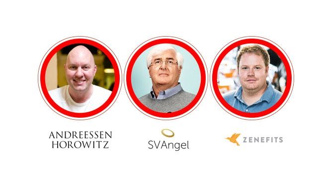

# YC 创业第九课，投资是极端的游戏

YC与斯坦福联手开设的创业课程「怎样创立一家创业公司」第九课。本次 Sam 邀请到了 Google 天使轮投资人 Ron Conway，网景创始人、Facebook 董事会成员 Marc Andreessen，还有 Zenefits 联合创始人 Parker Conrad 一起从投资人和创业者的角度聊聊关于投资那些事儿。

本文由 [How to Start a Startup Lecture 9](http://startupclass.samaltman.com/courses/lec09/) 听译整理而成。

**Sam Altman****：我想问问** **Ron** **和** **Marc****，是否投资一家公司，你们主要看什么？**

Ron Conway：我从 94 年开始做投资，大概投资过 700 家公司，约见过的创业人员估计能达到上千人，每家公司吸引人的地方都不尽相同，所以决定我们投资与否的因素有很多。一定要说的话，那就是我在见到创业者时第一个闪过的念头会是，「他是个出色的领导者吗？」，「他对自己的产品足够迷恋吗？」在我看来，一个产品是否出自创始人自身的需求很重要；再接下来，我会评估对方的沟通能力，因为创始人每天避免不了和员工、资方等各种各样的人沟通，他需要引领整个团队；其次在交流中，我希望创业者可以精炼地概括出产品的核心所在，让投资方对产品能够有个快速的定位；最后，我希望创业者没有拖延症，创业有许多需要当机立断的时刻，产品和公司每天都处于变动和进步之中，没有执行力就没有一切。

Marc Andreessen：我们对各种类型、各个周期的企业都有投资，这个问题可以根据行业和周期讲得非常细致。若要笼统地来说，我认为有两点。一是，你一定要成为行业里的佼佼者。投资是一个很极端的游戏，在每年 4000 家寻求投资的企业当中，大概只有 200 家能获得第一梯队的风投，这其中又只有 15 家最后能创造出上亿美金的收入。风投公司 95% 的收入就由这些企业贡献。所以，所投资的企业要么就回报丰厚，要么就颗粒无收。我们只想找那前 15 位，前 200 位佼佼者。

另外，在优势鲜明和没有短板之间，我们更乐意选择前者。投资界有评判优秀企业的清单，例如创始人如何、创意如何、产品如何、初始用户如何，等等等等。可那些看似都满足这些条件的企业，最后都表现平平。究其原因，就是因为他们没有自己独特的优势，无法把自己与其他公司区分开来。反之，有些公司虽然既有过人的长处，也有重大的弱点，但我们愿意容忍弱点、承担风险，因为这些公司往往是最后的大赢家。

**Sam Altman****：****Parker****，可以跟我们谈谈你天使轮的融资经历吗？如果再来一次，对哪些事情你会有不同的做法？**

Parker Conrad：Zenefits 的融资过程还算顺利，我想讲讲在此之前我创建过的一个公司。当时，我和合伙人找遍了硅谷所有的风投公司，都收不到一个肯定的回答。毫不夸张，一共约有 60 家，他们全都拒绝了我们。我们一直在反思是不是计划书写得不好，企业的故事还能怎样讲得更精彩一些。直到有一天，因为没有提供某个详细的数据，一位投资人对我们说「你们又不是 Twitter，光靠嘴皮子是无法打动我们的，要把所有材料都准备好呈现在我们面前才对」。跟这位投资人想让我去做的恰恰相反，这句话让我开始思考「怎样才能变得像 Twitter 一样」。

那两年的融资受挫经历让我很受伤，也让我知道不能把期望都寄托在风投身上。如今我对 Zenefits 很自豪的一点就是它有自己的商业模式，有足够的现金流自给自足，不依赖于风投。

然后我才发现，这就是风投喜欢的公司。与创业的其他流程相比较，我并不擅长融资。但我知道一旦产品找的自己的立足点，「变得像 Twitter 一样」，那其他事情就会水到渠成。

Marc Andreessen：我认为 Parker 讲的这一点非常重要，就像喜剧演员 Steve Martin 说的，成功的关键就是「优秀到让人无法忽视」。做到这一点其实比融资难多了。融资是我认为创业中最简单的一个环节。除此之外，你还需要招聘工程师，获得用户增长，得到广告收入，这些都比融资困难百倍，融资成功不是什么公司成功的里程碑，它只是给了你去进行更艰难的挑战的机会。

**Sam Altman****：在你们与创业者接触的经验当中，你们觉得有哪些行为是他们需要改善的？**

Marc Andreessen：我认为创业者们没有处理好金钱和风险的关系，无论是筹钱还是花钱。Andy Rachleff 曾告诉我一个有关风险的洋葱理论。它具体是这样的：一个刚创建的团队面临着一系列的风险，团队能否组成，创始人们能否一起共事；产品能否顺利完成；还有技术难题，可能你需要设备性能的突破才能完成产品；发布会也可能会出岔；还有市场接受度，销售等等一系列风险。一个公司的逐步发展，就是一层层地剥除这些风险。为了组建团队，创造产品，获得初步的关注需要进行天使轮融资；为了产品迭代，组建工程师团队，获得初始用户需要进行 A 轮融资。依此类推，去除风险就是达成一个里程，公司凭此获得发展，这也是你需要不断融资的理由。

所以如果你要进行 B 轮融资，对我们团队来说，对付我们最好的办法就是告诉我们在天使轮的时候你面临了哪些风险，达成了哪些成就，A 轮的时候面临了什么，达成了什么。现在到 B 轮了，我面临着哪些问题，我会怎么去解决他们，在我进行 C 轮融资之前我的产品会处在什么阶段。讲完后，再拿出之前融资的数据，告诉我们你过去融到了多少钱，有多少花在了去除风险上。这是一套非常系统性的分析方法。

Ron Conway：我认为创始人常做错的一点是，没有把重要的内容以书面形式确认下来。VC 很容易忘记与你的交谈的细节，所以当你们面对面达成某一共识之后，要再写封邮件确认重要信息。

**Sam Altman****：我想询问更多细节和流程上的问题，如果在座的学生需要融资，他们可以直接给你们发邮件吗？还是需要有人引荐？你们在做出一个决定之前需要多少会议商讨？什么时候是创始人可以开口问你们要钱的好时机？**

Ron Conway：我来谈谈天使轮。现在的公司，天使轮大约能融到一两百万美金。所以如果我们只投了 25 万，说明同时还有 5，6 个投资人也参与了这个项目。在 SV Angel，我们大约会在 30 个公司中挑选一个投资，每周一个，由一个专门的小组来做这件事情。你可以发给我们一份简短精炼的执行概要，如果大家觉得不错，就在小组内部投票决定是否进行电话约谈。通过投票，就会有该领域内有经验的人士给你们团队致电。如果电话上谈得不错，就能进一步面谈，到达这一步获得投资的机会就很高了。面谈也进行顺利的话就会进行最后的背景调查，包括市场前景、公司背景等等。

Marc Andreessen：对于 A 轮投资来说，我们会衡量该公司天使轮的融资如何。就像 Ron 说的差不多，我们一年能收到 2000 多个来自相识的天使投资的推荐，所以要想获得 A 轮，先做好天使轮，或者加入像 YC 这样的孵化器。

**Sam Altman****：你们认为创业者在天使轮、****A** **轮融资时可以出售的股权的上限是多少？**

Parker Conrad：据我所知，行业内天使轮会出售 10% 到 15%，A 轮会出售 20% 到 30%。大部分投资人看重股权比例高过收购价格，所以他们有时候会说，「我不能接受占有股份低于 20%，但是我可以支付更多的钱」。

Ron Conway：我认同 Park 的说法。但创始人也不可以售出过多的股份，否则会让自己和团队都失去动力。

Marc Andreessen：对我们来说经常是想投资都无法投资，因为其他投资人已经占据了过高的比重。曾经有一家尚年轻的公司在我们想加入时已经出售了 80% 的股份，我们对这样的股权结构对员工和创始人的影响也很担忧。

**Sam Altman****：****Ron, Marc****，你们能谈谈投资过最成功的一家公司吗？**

Ron Conway：对我来说，当然是 99 年对 Google 的投资。我们基金内部有个规定，就是每个投资人都要谈谈自己遇见的有趣公司。当时你们 Stanford 工程学院的教授 David Cheriton 也在其中。在一次派对上我询问他 Stanford 有没有什么有趣的项目，他告诉我有个叫 backrub 的项目，是通过网页排名和关联做搜索引擎。这在现在听来很理所当然，但在 98 年，他们还只是一个简单的算法。我想要投资他们，但他们因为产品还没有完成所以拒不见面。连续五个月，我每个月都会给他们致电，终于他们提出要求说，如果我能让红杉也加入投资，他们就同意我的注资（因为红杉是 Yahoo 的投资方）。

Marc Andreessen：我要说的是 Airbnb。在他们首轮融资的时候我们实际上是错过了，因为这些「你住在我的房子里」，「我住在你的房子里」的主意看起来太不靠谱了。可实际上市场和用户证明了我们的判断是错误的。所以我们在 Airbnb 的扩张期，2011 年，才以 10 亿美元的价格加入其中。我相信这个公司还有很大的成长空间，其中很重要的一点是，他们的创始人并没有随着公司规模的扩大就自我膨胀，反而更加谦卑、成熟，对事物的判断也越来越精准。这让我们对他们非常有信心。

**提问环节**

**Q****：资金密集型公司应该怎么融资？**

A：Marc Andreessen：把我刚才说的洋葱理论贯彻得更加彻底。准确分析每一次行动希望达到哪些目的，可能会有哪些风险，要怎么执行以达成这个目标。不要急于融一大笔钱，因为资金密集，所以一旦出错代价也很大。只寻求自己需要的资金数量。另外，如果你的项目需要大量的资金投入，并且需要长期的部署和发展，那团队的优秀程度和执行力将起到关键作用，在寻求投资时一定要证明这一点。

**Q****：不该和某个投资人合作的标志是什么？**

A：Ron Conway：要看你的潜在投资人是否有相关领域的专业知识，在业界人脉如何，能否有助于公司发展，或者利于 A 轮融资。

Marc Andreessen：这个问题提得很好。如果你对创业这个想法是认真的话，那你与投资人相处的时光会比美国人的平均婚姻时间还长。所以毫不夸张地说，要像选配偶一样地挑选投资人。通常如果公司发展顺利，那所有投资人都没什么差别。可即便是像 Facebook 这样的公司，也会跌跌撞撞、历尽艰险。在一些紧张的深夜会议上，你的投资人还能否跟你站在同一战线上，抱着同样的期望共同努力，互相理解，共度难关？挑选今后和自己同舟共济的适合的人，比当下支票金额的大小重要太多了。

Ron Conway：的确如此，在 SV Angel，我们不仅看项目，更看创业者，一旦我们选定一个创业者，那他的项目我们都会投资。把这比作婚姻一点都不为过。

**Q****：是什么限制了你们投资公司的数量？时间，金钱，还是没有足够多的好公司？**

A：Marc Andreessen：这个问题我们在公司内部经常讨论。我们稀缺的其实是机会成本。我们公司内部有个不成文的规定就是不会投资两个对立的项目。例如如果我们投了 MySpace，那就不会再投 Facebook。所以每次投资都意味着我们在某一领域的立场。这个立场是很难选择的，因为真正优秀的公司可能在我们投资之时还没有成立。另外稀缺的，就是人才资源，一个合伙人马力全开也只能参与 10 到 12 个项目。一旦大家都全负荷工作，就无法再加入新项目。

**Q****：如果一个团队没有产品，你们会投资吗？**

A：Ron Conway：这种情况我们会根据团队的表现来决定。就像我之前说的，我们投资的是靠谱的创业者。

Marc Andreessen：如果发生这种情况那通常就是我们已经跟创始人有过合作的经验，或者创始人本身已经很有名气。