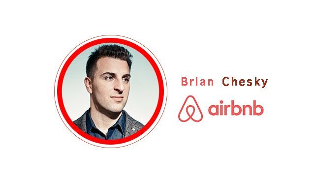

# YC 创业第十课：企业文化决定命运

YC与斯坦福联手开设的创业课程「怎样创立一家创业公司」第十课。本次由红杉资本合伙人 Alfred Lin 对话 Airbnb 创始人Brian Chesky，谈谈企业文化在创业中的重要性。

本文由 [How to Start a Startup Lecture 10](http://startupclass.samaltman.com/courses/lec10/) 听译整理而成。

Alfred Lin：我先做个暖场，笼统地与大家聊聊企业文化，稍后 Brian 会讲讲 Airbnb 是怎么建立起自己公司文化的。

在之前的创业课程中，你们已经知道了如何评价一个创业想法，然后找到自己的合伙人，开发出产品，让用户爱上它，并向大众推广，接下来要做些什么呢？这中间漏提的一点，就是打造企业文化。

什么是企业文化？我认为企业文化就是团队中每一个人每天落实在实践中的价值观。企业文化之所以重要，是因为它是企业做决策时的首要原则；抱有同样价值观的团队更容易建立起信任；团队成员们平日做决策也有所依据；公司选择人才时也有了标准。

建立价值体系，明确企业文化要从创始人做起。创始人要问问自己，自身最重要的价值观是什么？其中哪些对企业最重要？你喜欢和什么类型的人一起工作，他们的价值观是什么？相反的，你不喜欢怎样的人具有怎样的品行？这些问题的答案就可以组成企业的价值观。

Zappos 当年询问了所有员工他们最重视的价值观是什么，大家一共列出了 37 点，我们精减到了 10 点。做这件事我们花了一年时间，因为这十点并不是泛泛而谈「诚实」，「服务」，「团队合作」，我们将它们具体化了。例如关于「团队合作」，所有人都达成共识：团队里有许多比自己更有经验更智慧的人，当大家产生分歧时不要纠结个人的对错，要把为公司找到最合适的解决方案做为目标。Patrick Lencioni 曾提出过一个金字塔模型来讨论他认为一个团队土崩瓦解的原因，其中最底层的是团队成员之间的信任。在不缺乏信任的基础上，团队成员才可能就事论事展开讨论，才会对团队产生归属感。再接下来才是责任感和成就感。

公司在招聘人员时做技术测试是很常见的事情，但是大家都不重视做公司文化、价值观吻合度的测试。我认为这是不可取的。你或许可以得到最优秀的工程师，但是如果他们不认同企业的使命，就不会全心全意付出。在 Zappos，上至工程师下至接线员在入职前都要接受为期 2 周的客服培训（为客户提供超出预期的服务是我们的核心价值观）。培训结束后，如果员工觉得这个公司并不适合他们，Zappos 会为之支付 2000 美金以支持离职。

最后我想说，打造企业文化就像健身，大家都想去实践，但总不能持之以恒。如果你真的开始考虑企业文化，那么从面试过程到绩效评估，都要确保使文化成为一种日常的习惯，这样才能走的更远。

**Alfred Lin****：****Brian** **你能谈论一下你开始明白文化对** **Airbnb** **至关重要并建立一个企业的过程么？**

Brian Chesky：我简要说一下 Airbnb 开创的故事，它开始并不是我们想要创办的企业。当时我开车去旧金山找我大学的朋友 Joe Gebbia，那周末国际设计会议在旧金山召开，所有的酒店都售完了我们才决定将房子变成简易的旅馆。

早期有三个合伙人 Joe，Nate 和我，我想我们成功的一个原因就是我真的很幸运能够找到两个我很钦佩，也很优秀的人一起开办企业。这就是我想说的第一件事，建立一个优秀的团队。2008 年我们就开始一起工作，我们就像一个大家庭，凝聚成一个整体。

现在人们更多的谈论是在怎样构建产品以及如何使产品适应市场，但是如果不能构建一个良好的企业，不管最初的产品理念有多好，都不会持久，我们意识到我们要打造一个长久的企业。为了做到这些，我们开始关注一些企业的共同之处，能够经营长久的企业，例如 Amazon，Nike，Apple 都有一个明确的使命，明晰的价值意识，他们都在以一种非常独特的方式做事。乔布斯的核心价值观就是他相信有热情的人可以改变这个世界，产品可更迭但价值观永不变。至此我们开始意识到我们需要有目标，需要设计企业文化。

**Alfred Lin****：你招聘到第一个员工花了多久的时间？**

Brian Chesky：我们的第一个员工是我们的第一个工程师，我们花了 4-5 个月的时间。我大概看了上千的人，然后面试了好几百人。

Alfred Lin：你什么时候雇佣的他？

Brian Chesky：我们在 2009 年 1 月开始准备，花费了 6-7 个月的时间，有人问为什么要花费这么久的时间招聘第一位工程师，我认为将第一位工程师带进企业就像是将一个 DNA 芯片带入企业，如果成功了，就会有更多像他这样的人加入企业，并且认同企业的价值观。

Alfred Lin：这些价值观是什么呢？

Brian Chesky：第一个我们希望员工来到企业是因为认同企业的目标。很多人只当 Airbnb 是一种预订房间的渠道，可我们自己定位的目标是给旅行者在世界各地提供归属感。大家也都知道我们在面试时曾经有个很疯狂的问题，就是「如果你只剩一年的生命，你会加入 Airbnb 吗？」

第二，我们希望团队成员能不言弃，有斗志。Marc Andreessen 在上节课有提到过，初期没人看好 Airbnb，投资者都拒绝对这样一家企业投资。公司一度只能靠信用卡运作下去。2008 年的秋天，我们为民主党和共和党全国大会提供住宿，开始的情况很糟糕的，所以除了提供住宿，我们同时推出了奥巴马麦片和麦凯恩麦片，通过卖谷物早餐我们赚到了 4 万美元。我讲这个是因为我希望我们的团队能够永远充满斗志，能承受住低谷的打击。

**Alfred Lin****：拥有鲜明的公司文化是否有助于做出重要的、艰难的决定？**

Brian Chesky：关于企业文化有三个问题。第一个问题是没有人告诉我们关于文化的任何事情，有很多关于打造优良产品、成长和适应性的文章，但却没有关于文化的。第二个问题是文化很难衡量，难以衡量的东西常常会大打折扣。第三个问题也是最大的一个问题是文化在短时间内不能得到收益。

所以你要清楚的知道什么对你是独一无二，要确保招聘和解雇都要基于这个价值观。如果你是一个工程师，那么核心价值观的面试官一定不是工程师，因为我们不想他们有偏心。我们可能会拒绝一些很优秀的人，因为他们不认同企业文化，更不会长久的呆在企业里。

一个具体的事例是：有一家企业叫做 Samwer brothers，他们基本上通过山寨其他互联网企业，再将企业出售盈利。11 年年中，Airbnb 还只拓展了美国市场，但他们在 30 天内就复制了我们的产品，并招了 400 个人。当时公司内部在讨论要不要收购这个公司，因为它会阻碍我们全球化的进程。最后我们的决定是不收购，一个主要的原因，就是那家企业挣快钱的基因与我们文化不合。

**Alfred Lin****：在** **Zappos** **有一种观点是文化和品牌是一个问题的两个方面。****Airbnb** **拥有很棒的文化和品牌，你能谈论一下品牌的问题么？**

Brian Chesky：文化是企业内部的原则和信条，是员工要长期遵守的。品牌是每个人都认同的企业外部的承诺。品牌是人们认识了解你和你的企业的途径，通常由企业的品牌宣传人员决定的，如果企业的文化比较弱，那么招聘充满热情的员工也能够打造出一个顾客也很钟爱的企业，这就是拥有强势品牌的企业，Zappos 就是一个强势品牌。所以我认为品牌也是极其重要的，它是联系企业和顾客之间的桥梁。如果企业拥有强文化，那么品牌也会获得成功。

很多谈论到品牌的人说品牌是他们所售卖的东西，那么对于苹果公司，他们的品牌就是一台台高性能的电脑。可乔布斯在 1997 年谈到，不要谈性能，要谈价值观。他们相信有热情的人可以改变这个世界，他们打造了「不同凡响」这样的口号，这就是他们所信仰的，如果你买了苹果的产品，你同样是支持这样的文化的。

**Alfred Lin****：如何向外界传达企业的文化和核心价值观？**

Brian Chesky：早期我们向外界传达的是 Airbnb 是一种可以代替酒店的更加便宜的选择，我们的标语就是放弃酒店，通过 Airbnb 来省钱。时间一长我们发现这个定位限制太大。随后我们发现，在旅行中你会感觉孤单，异乡的一切能消除平时你在生活中感受到的成功的假象。所以我们想让旅行者找到归属感。

前两天有人问我 CEO 的工作是什么？一个 CEO 要做的工作有很多，但是最重要的是描述清晰的愿景，为此必须要制定战略，招聘适合企业文化的员工，如果能做到这三件事情，企业就有很大希望能够成功。如果企业有正确的愿景，良好的战略，优秀的员工，你要做的就是反复的描述愿景，不管是在招聘、与投资者的谈判、筹集资金、公关采访任何方面，要不断加强这个价值观，就会发生改变，每一次都会有所进步。

**学生：如何确保房东的价值观与企业相同？**

Brian Chesky：初期房东的确都与我们价值观相同，但后期就有很多人是为了赚钱才出租自己的房屋。早期我们并没有意识到这个问题，但现在我们通过评级来解决，优秀的房东可以获得徽章和一些特权。时不时也会召集房东大会，重申我们的价值观。

**学生：****Airbnb** **在** **Github** **上开源了** **web** **服务自动化管理工具** **SmartStack****，你觉得这也对打造公司文化起到积极作用了吗？**

Brian Chesky：我们做这件事主要有两个原因。第一就是，我们觉得 Airbnb 应对对手竞争的壁垒不在于技术，而是带给用户的体验；第二是，公司本身有一种开放的氛围，我们认同开源社区的价值观，也觉得我们需要做出些回报。