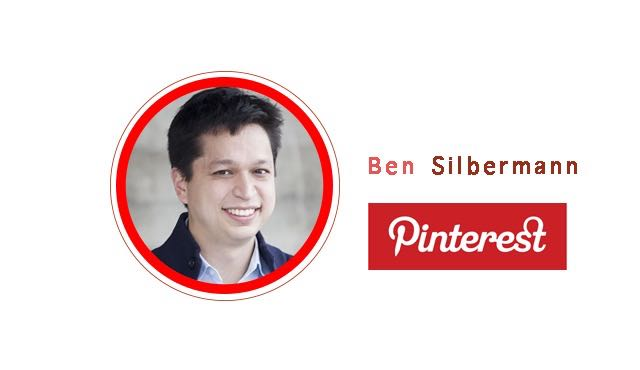

# YC 创业第11课：企业文化需培育

YC与斯坦福联手开设的创业课程「怎样创立一家创业公司」第11课。本次由 Pinterest 创始人 Ben Silbermann 与 Stripe 两位创始人接着上讲继续聊聊如何建立企业文化以及如何组建团队。

本文由 [How to Start a Startup Lecture 11](http://startupclass.samaltman.com/courses/lec11/) 听译整理而成。

**Sam Altman****：我想从一个很宽泛的问题开始，各位觉得在发展过程中最重要的企业文化是什么？**

Ben Silbermann：我觉得企业文化可以从几个方面来看，第一，我们招聘什么样的员工，这些员工有着怎样的价值观；第二，我们每天都在做什么，为什么要做这些事情；第三，团队之间在互相交流什么；第四，发生什么事情对团队来说是值得庆祝的。

John Collison：Stripe 比其他公司更重视透明度，因为我们认为对公司大局有宏观了解有助于团队成员之间的高效协作。

Patrick Collison：随着公司的壮大，创始人不可能再经手处理每一个问题。当实际参与程度越来越低的时候，企业文化就是解决之道，因为它会成为团队成员做事的标准。例如在雇人的时候，决定最初的十个人是非常重要的，因为每个人都会带来另外十个人，要考虑到你想要他们带来的 100 个人是什么样的。

**Sam Altman****：「找到最初那十个正确的人」是我们演讲者在这里经常涉及的话题，你们在找这十个人的时候有什么标准？**

Ben Silbermann：有人说公司文化是像建筑一样去搭建的，我觉得形成一种公司文化更像是培育花园。播种、浇灌、除草，花园才会长势喜人。我们在招初期员工的时候，会招与自己性格相似的人—工作勤勉，恪守信用，不傲慢自大。这些初期员工大多有创造力、好奇心，兴趣广泛。例如我们一位爱好魔术的工程师，不仅开发了一款魔法棒 APP，还自己拍摄了产品视频。我们希望团队成员能有创造伟大产品的野心。

John Collison：我们早期的团队成员都是通过朋友，或者朋友的朋友这种人际网络获得的。因为初期招聘实在太困难了。公司没有名气，没有产品，没有好的薪水和办公环境，不仅求职者自身会犹豫，他身边的朋友通常也会极力劝阻。我们愿意找那些在自己领域刚起步，但显然非常具有天赋的人。例如我们的第一位设计师，加入时才 18 岁，还在瑞典上高中，但我们能看出他的才华。

Patrick Collison：我们希望初期员工是个真诚的人，能够与人相处，也值得信任；他要有能完整地把一件事情做好的行动力。比起做过很多不同的事，我更欣赏能潜心钻研一类问题的人；最后他要在乎细节的完美，例如我们公司内部 API 接口一旦有错误所有人都会收到邮件和电话，对外的邮件不可以有语法和拼写错误等等。

Ben Silbermann：我想再补充一点，任何场合都可能成为招聘初期员工的契机。一次线下科技活动拉，某次烤肉聚餐上的闲聊拉之类之类的。要主动去寻找那些优秀的人，尤其是当你的公司还默默无名的时候。

Patrick Collison：如果创业的方向过于小众，也可能会造成招聘上的困难。

**Sam Altman****：你们具体会做些什么来判断候选人的确具备你们所需要的这些品质？**

Ben Silbermann：其实没有完全准确的判断，只有真正共事后才知道双方到底合不合适。如果发现有不合适，首先要通过交流看能否改进；互相无法磨合的，创始人就要果断放弃。不过这里还有一个问题，就是有的领域创始人本身有所涉猎，自己心里有评判标准，而有的领域，比如财务、市场等等，创始人无所判断对面的候选人是否有足够的实力。面对这种情况我会去寻求现实中在该领域有所成就的朋友的帮助，询问他们从事该行业的人所应具有的品质，如何面试，有什么寻找人才的渠道，有没有推荐的人选等等。招聘是个很花费自己心力，也很花费别人心力的事情，所以一定要慎重对待。

至于具体的招聘流程，Pinterest 有一套问题，我们会根据每次招聘不断更新改进。另外要告诉面试者他们进来后面对的是怎样的工作。有才干的人喜欢具有挑战性的工作。我听说 Paypal 曾经告诉应聘者，「Mastercard 跟我们杠上了，你所做的工作可能会变成非法行为，但是一旦成功我们将重新定义支付」；iPhone 项目招募人员时，许多人甚至不知道自己要去做什么，但 Apple 会告诉他们，「你们可能会三年见不到自己的家人，但你孩子的孩子会永远记得你创造出的产品」。我觉得这也不失为一个不错的筛选方法。

John Collison：我们当时是花了一个周末的时间，试着和 Stripe 现任的工程师一起工作，从旁观察他编代码，了解他的工作方式；公司拓展方面，我们也是和相关人员一起分析了 Stripe 现有的项目，再展望了一下未来可能的发展。

Ben Silbermann：还有一个面试时的小技巧。我们不会去验证应聘者简历的真实程度，但我们在面试的时候会问他类似这样的问题「你跟 Jonathan 是朋友吧，我们在私底下关系也不错，你觉得如果让他来评价你的话他会怎么说？」。这种问题能加强应聘者的社会意识，给出的答案会更加可靠。

John Collison：寻求第三者的意见的确很有用。但是一般人在评价他人是都会想尽可能地显得友善，所以你在询问第三者意见时要问得具体一些，例如「你觉得他是你曾共事的人中间最优秀的那 1% 吗？」，或者「John 说他很擅长这些事情，你觉得他在这些领域表现如何，有什么具体的例子吗？」

**Sam Altman****：你们会做些什么让新加入的成员适应公司的文化，让他们在陌生的环境高效而愉快地工作？**

Ben Silbermann：当我们还是一个小团队，在一个很小的办公环境中工作时，这些问题其实是不需要考虑的，人跟人之间很自然地就会建立起关系。我们唯一需要做的，就是时不时地提醒新员工公司未来的发展计划，不要让他一直被一些琐碎的任务缠绕。

公司有了一定的发展后，这个流程就渐渐正式起来。我们会追踪新人入职的每一个时间节点，从他们面试起到他们入职 30 天后，他们是否已与同事熟络，是否了解公司的架构，是否知道自己的上级是谁，公司现阶段主要的目标是什么等等。培训流程为期一周，我们希望新员工在此之后能对自己未来在公司的发展有个打算。如果新员工无法很好地适应，首先这个团队暂时不会再增加新人，其次我们的培训流程也需要改进。总之，要从个人层面上了解他们的期望、工作方式，例如是否喜欢在安静的环境工作，是爱早起干活还是深夜赶工等等等等。

John Collison：有的公司喜欢循序渐进，逐渐引导员工，我们是比较直接的类型，会让新员工尽快接受他们之后要面对的工作。还有就是快速地对其所做的工作做出反馈。

**Sam Altman****：随着公司的壮大，你们招聘新人和管理团队的方法有什么不同吗？**

Ben Silbermann：改变的地方有很多。其中有一点是，我们希望在公司的大框架下，内部的小团队还能保持自主和灵活。这有点像一家公司架构下有许多的创业团队。这说起来容易做起来难，因为这需要小团队自身有控制力，他们要知道怎么获取自己所需的资源，能辨别什么是团队最重要的指标。我们就是通过这种方式管理一个较大的团队。要是不能把大团队拆分成小单位，那管理的难度就会呈几何式上升。对 Pinterest 来说，我们希望每个团队里都能有个强势的设计师，或者强势的工程师来领导。这虽然很难做到，但合乎我们的公司文化，即让不同领域的人互相碰撞，合力做同一件事。

至于招聘，我觉得我很幸运，在招聘大约第 14 号员工时，找到一个非常有经验的人事经理。她在创业公司和像 Apple 这样的大公司都工作过，知道寻找人才的渠道，也知道怎么辨别既有专业能力，又能适应我们公司文化的人。

Patrick Collison：公司初期会比较考虑眼前的事情，比如一个月后我们要做什么；壮大后布局也会更加宏大，会开始考虑一年后，四年后公司需要做的事情。招聘也一样，初期因为用人的需求强烈，所以不适宜招个潜力股慢慢培养，更需要能马上上手的专业人士。

**学生：你们初期招聘的人有最后成为管理层的吗？**

Ben Silbermann：有的有，有的没有。在创业公司工作的一个好处就是能获得在普通公司不会有的机会，例如让你带领一个团队，或者负责一个项目。我们有很多程序员，工程师出身的员工，表示自己愿意尝试带领一个团队。有的人就此发展，有的人也借此机会发现自己并不喜欢管理层的工作。对于后者，我们同样有适合他的位置，让他就以程序员，工程师的身份继续发展。

**学生：你们对产品的设想从创业到现在有发生改变吗？**

Ben Silbermann：我们起初只是因为自己喜欢收集东西，觉得其他人也会有这个需求才设计了 Pinterest。我们没想到它会发展成为去看他人的收藏，变成了一个探索信息的新方式。当然现在基于已有的条目，我们开始倾注大量资源提升推荐、搜索、订阅的质量（产品挑选和分类由人工完成）。

**学生：你们会根据自己的用户类型招人吗？**

Ben Silbermann：会。通常来说，我们只招产品的活跃用户。但我们不要求这个人永远对产品满意，他可能会在某个节点抛弃使用产品。这种人我们很欢迎，因为我们可以根据他的反馈改善产品。