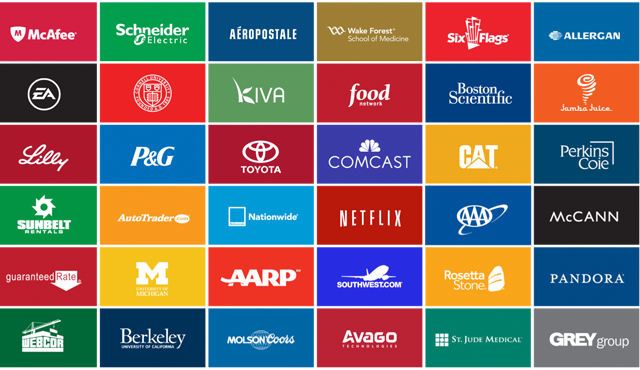

# YC 创业第12课：来开发企业级产品吧

YC与斯坦福联手开设的创业课程「怎样创立一家创业公司」第12课。本次由企业级文件共享产品 Box 的创始人 Aaron Levie 打开我们新世界的大门，不要再盯着消费级产品了，何不打造一款企业级应用呢？

本文由 [How to Start a Startup Lecture 12](http://startupclass.samaltman.com/courses/lec12/) 听译整理而成。

大家好，我是 Box 的创始人，Aaron Levie。在座的同学应该很少有人想过要开发一款企业级的应用，我今天的任务就是让你们开始重新考虑这个选择。

**首先讲讲** **Box** **的历史。**

Box 现在有将近 24 万个公司使用，用户数达到 2700 万，其中包括许多世界五百强企业。

我们是怎么走到这一步的？公司是 05 年创立，我们一开始也并非定位为企业应用。10 年前互联网还是一片贫瘠，没有 Facebook，更加没有 Snapchat，连共享文件都是件麻烦事。我当时有一份兼职工作，每天处理数据的方式就是打印，复制，然后分类归放；南加大的课堂上同学们一起做项目，每个人只有 50MB 的存储空间，基本上一个文件就塞满了，系统每隔 6 个月还会自动清除所有文件。就是在这种情况下我们有了创建 Box 的想法–创建一种更加易于分享文件的方式。

紧接着，随着摩尔定律，存储和计算的成本急剧下降，生活中和工作上人们都能享受到更加快捷的网络，用户开始有了在多个设备上共享文件的需求。这里我想提醒大家，一个行业底层技术的发展能带来很大的革新。我们很幸运人们有在云端存储的需求，同时技术也提供了可行性。于是我们快速地推出了第一版 Box，也很快收到了一位天使合伙人的投资。Box 当时是免费注册，并且注册即可获得 1G 的空间，这在 06 年是个不小的数字。我们希望借此能获得高速成长。

接下来我们面临着是走消费级产品路线还是走企业级产品路线的抉择。当时我们的产品处于对普通人而言有许多无用的功能，对企业来说兼容性和功能又不够强大这样一个尴尬的境地。消费级产品主要有两条盈利的途径，一是向用户收费，二是向广告商收费。移动端应用下载收费的市场每年大约有 350 亿美金，广告市场则有 1350 亿，这个数字已经非常惊人，但全球企业级产品的市场比这更惊人，能达到 1 万亿美金。在消费端，我们需要想尽办法让用户为产品付费，同时还要应对 Google 等大公司免费推出类似产品抢占市场。可在企业端，客户在乎的不是成本，而是产品是否能提高他们的生产效率，为他们解决既存问题，带来更高的收益。做企业级产品当然也有弊端，其中有一点就是，它的周期非常长。不仅仅是开发产品的周期长（企业级产品的复杂度和企业对产品性能的要求都比普通消费级产品高），销售周期，服务周期都非常长。有时光是把产品卖给企业，就要花去好几年的时间，接下来确保产品在企业内部正常运作又要花去好几年时间。同时，我们无法自己接触客户，必需雇佣一大批销售人员来贩卖产品。这点听起来非常「不互联网」。上述这些原因都让我们对开发企业级产品十分犹豫。最终我们还是选择做企业级产品，并努力克服这些弊端，让复杂的企业产品也非常易用，替代低效老套的销售方式。

这就是我们走上企业级产品的历程。

过去五年科技发展，企业的组成方式、使用的软件都发生了巨大的变化。其中最显著的莫过于云端化。我们无需将软件安装到每一个公司的数据中心，客户只需连接上我们的服务器，实时调用他所需要的功能即可。这相当于很多重复的工作不需要做了，科技的应用成本更低了。不再只有大公司才有财力和人力使用企业级软件，所以现在 Box 上有通用这样超过 30 万员工的大公司，也有只有两个人的初创企业。这显然能拓宽市场，并且更易于国际化。

另一个显著的变化，就是移动设备的普及。从前一个公司所要面对的「科技问题」只有公司内部的网络问题，但是现在他们能够直接面对自己的顾客了。例如你在运输行业工作，那 Uber 等公司就是你不能忽略的竞争对手，他们会颠覆整个行业你必须保持关注。每一个垂直行业里都有 Uber 这样的公司存在。所以既存的大公司们就需要新兴的互联网产品帮助他们应对这样大的转变。例如在零售行业，既存公司通常销售渠道单一，不符合移动互联网时代人们可以在移动端随时随地进行购物的特征，他们需要对此进行转变；在医疗行业，有越来越多的人追求防患于未然，在疾病到来之前就做出预防，保持每日的健康。于是医务人员需要展开远程医疗，让医疗不再局限于医院。医生之间也需要交流的平台，以做出更好的决策；媒体行业现在的发行流程还是线性的，先在影院上映，三个月后再上到 iTunes 之类的网络发行平台。昨天我刚  见过某媒体公司的从业人员，他们正在寻求从 30 亿网民中找到自己潜在受众的方法。这显然需要大数据的支持。所有这些都暗藏了创造企业级产品的机会，新科技能让每一个行业都更加敏捷、高效和安全，忽视新科技的企业只会在未来的竞争中丧失竞争力。

**说了这么多，那开发一个企业级应用到底要从何处着手开始呢？**

首先你要看到新科技能带来怎样的新格局，在什么领域这些科技能带来最大的不同。在我们的例子里，就是我们看到网络存储变得更加廉价，网络速度变得更加迅速，但我们分享文件的方式却还是十分复杂、笨重，这个领域通过新科技大可改进。

其次，切入点要小。找到既存产品没有覆盖到的需求面，以此为切入点，逐步扩张。zenpayroll 是个很好的例子。他们电子化了工资支付过程，让管理人员更方便管理和发放工资，也让职员更易于查看和分析自己的工资组成。他们就是以此为切入点，积累用户，拓展出更多的功能。

还有，要去做那些既存的大公司不愿意去做的事情。大公司会有很多战略上的顾虑，比如他们希望新产品跟他们其他产品是能够整合到一起的，或者某项服务他们因为要顾及到公司的商业模式，不可能以低廉的价格提供。这就是创业公司的机会了。

最后，要关注行业里的先锋公司，以他们的需求作为发展参考。这里的例子是 skycatch，他们做的是企业级的无人机服务。这乍听之下让人怀疑是否真有市场，可实际上无人机在建造行业，农业都有很大需求，这些公司需要无人机采集数据，建立环境模型。

最后我想再次呼吁大家加入到开发企业级产品的大军中来，现在绝对是一个绝佳的创业时代。谢谢各位。