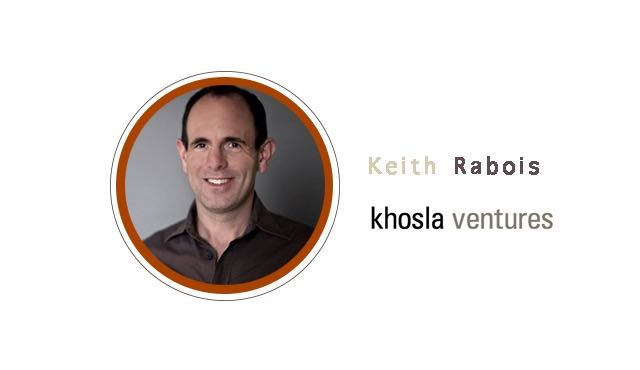

# YC 创业第14课：像个编辑一样去管理

YC 与斯坦福联手开设的创业课程「怎样创立一家创业公司」第 14 课。本期主讲人为 Keith Rabois ，Paypal 前副总裁，Paypal Mafia 成员之一，参与投资 LinkedIn、Slide、Square 等科技公司，并担任多家公司高管职位。他认为管理者的工作，与杂志社的「编辑」其实大同小异。

本文由 [How to Start a Startup Lecture 14](http://startupclass.samaltman.com/courses/lec14/) 听译整理而成。

在之前的课程中你们已经学过关于打造一款产品的方方面面，作为创业者，下一个需要面对的难题就是如何管理公司。

管理公司比开发产品困难多了，代码是有逻辑的，人类却常常失去理智。在生活中，老师也好，同事也好，父母也好，你肯定遇到过这种不理智的人。创建一家公司可怕的地方就在于，你要和这些不理智的人一起每天相处 12 个小时。所谓管理公司，也就是看你能不能处理好与这群人的关系。

创建公司就跟造引擎差不多，图纸上画得再精细，现实中还是会  乱成一团。我们的最终目标就是造出一个「傻瓜公司」，公司可以自主运转，即便是傻瓜都可以做上管理层。曾有人开玩笑说，就算 Ebay 员工被火星人抓走了，用户也要过半年才能反应过来，因为企业还是能够自行运转。虽然是个笑话，但这就是我们要追寻的目标。

身为管理者到底要做什么? 用 Andy Grove 的话来说就是，要最大化你所负责团队的产出，同时要最大化身边共同协作团队的产出。这句话的重点有二，其一，不要关心过程，要关心结果，永远以最终成绩为评价标准；其二，有的管理层以牺牲其他团队产出为代价，换取自己团队的高产出，这种做法是不可取的。

**我认为管理者的工作跟编辑非常相似。**想像编辑的工作是什么样的？作者写好文章，编辑掏出一支笔开始删减。管理者要做的，就是这种删减工作，从大量的琐事当中精炼出一两句话，让团队成员清楚自己在做什么事，让大家每天不经大脑思考就可以把这些任务挂在嘴边，并且可以毫无困难地复述给身边的亲朋好友听。越简练，办事效率越高。不要觉得自己所在的行业太复杂，不可能用一两句话就概括出来。微博我们只能发 140 个字，Apple 作为一个历史性的公司，同样用一句「Think Different」概括出了自己的设计理念，没有什么不可以。要强迫自己简化每一个动机，每一个产品的诉求，每次市场活动的目标。掏出你的红笔，像个编辑一样大胆地删减。

**编辑的另一项责任，是消除歧义，不断提问。**例如在会议中，有人提出一个模棱两可的主意，管理者有责任进一步追问其细节，并要求举出事例以帮助全体团队成员理解；一些细节问题也可以提出，例如「这项工作我们一周要实行几天?」;还有一些核心问题，例如「这件事我们的核心竞争力是什么？」

**编辑还有一项工作，是整合资源**，派遣记者到世界各地，整合出读者想要阅读的内容。其实大多数时候，不是编辑指派记者，而是记者自己会申请前往中东、前往硅谷等等热点新闻地区进行跟踪报道。在公司里，你的团队成员应该也有这种自我驱动，有自己策划题案的能力。

**编辑要为整本杂志的风格一致负责。**随手打开《经济学人》，你会觉得他每篇文章都像是出自同一个人之手，这就是编辑的作用。比较理想的情况是，公司的网站、公关文章、包装、实体产品，甚至招聘信息都能保持一致的风格。这真的很难做到。实际上，即便是 Apple 这样的公司，他们内部的招聘工具也「很不 Apple」，这在圈内是有名的。

管理公司还跟从事编辑相似的一点是，**编辑自己是不写文章的，真正产出内容的是那些记者和作家。**在公司里，管理者也不应该是个什么事都亲力亲为的人。这就涉及到派遣工作。虽然工作本身不是由 CEO 完成，但 CEO 起到督导作用，应该为所有情况负责，尤其是出状况的时候。派遣工作不意味着彻底放权，太关注细枝末节或者太放任自流都是管理者的失职。想要平衡好这两者首先要确认，负责这项工作的职员有没有做过类似的工作。如果之前表现良好，那可以放心地放权；反之如果在这个领域是新手，就要时刻关注项目进度，给予指导。之前有猎头想要了解我的做事风格，结果从我的下属身上获得了两种非常极端的反馈，其实就是因为我针对不同员工、不同任务，采取的管理风格并不一样。除此以外还可以根据这项任务对公司的影响大小来判断是否放权。例如在某件不痛不痒的事情上，你虽然会和员工采取不同的做事方法，但这件事影响对大局没什么影响，那么放权也无妨。相反的，如果这个项目事关重大，你又十分确定自己的主张是正确的，那只能尽力向员工解释你的想法，让他们按照你的设想去实施。

**创业者也需要「编辑」自己的团队。**团队中的人可以分为两种，一种是炮桶，一种是弹药。有的管理者觉得团队一旦加入了新人就能加速前进，他们想得太美了，事实才不是这样。即便是一些非常优秀的人才，他们有时也只是为人所用的「弹药」，而公司只有通过有限的「炮桶」才能发射「弹药」解决问题。公司起步时通常只有一个「炮桶」，等增加到两个「炮桶」时工作量才开始成倍增加。「炮桶」很难找，而且不同的公司文化，不同的技能需求，都会导致每家公司对「炮桶」的要求不尽相同。但相同的一点是，「炮桶」型人才能够调动起身边的人资、物资，把一个想法从雏形执行到落地。

要辨别出一个人是否能成为「炮桶」有两个方法。第一，你不断增强他任务的复杂度，直到找到他无力应付的临界点。有些你平时不曾注意或看轻了的人，可能会在这种方法的测试下展现出极强的能力。第二，观察哪个员工的办公桌旁边经常围着寻求他帮助的人，尤其是与他所属团队不相关的人。

关于用人方面还有一个常有的困惑是，什么时候该给某人升职，什么时候该将某人调离原职。这个问题要和公司的成长曲线联系起来看，只要员工的成长速度能跟得上公司的成长速度，那就没有必要将他们调离原职。

有了「炮桶」和「弹药」，那么我们的目标在哪里呢？我从 Peter Thiel 身上学到的一点就是：专注。他曾要求 Paypal 中每一个员工只专注做一件事情。所有人都反对他，因为这很违反常理，每个人都会希望自己能多做点事情。我们甚至觉得只让人做一件事实在是太看不起人了。但 Peter 非常固执，他严格执行这个要求，不跟我们谈论除了那个特定任务以外的任何事情。他之所以要这么做，是因为人们总是倾向于先去完成自己有能力完成的任务，而对公司影响更大的任务往往也因为太艰巨遭到拖延。Peter 不希望这些任务被拖延，他希望有人能不断逼迫自己直至找出这些重要问题的最优解。

我建议创业者提炼出公司最看重的指标，例如活跃用户数，激活数等等，这些指标能代表公司对成功的定义，并且要易于公司中每一个人的理解。将这些指标展示在白板上以提醒员工，当他们获得决策的权利时，应考量到哪些因素。

关于公司的透明度问题，在 Square 我们主要会记录每一次会议内容，发送给公司的所有人，让大家对公司最新的决策都有所了解，不要有被排除在外的感觉。另外我们所有会议室都是玻璃墙，这会给人莫名带来一种掌控感，不再对墙后到底在讨论什么产生好奇。

在设定指标时还有一个注意事项，就是要考虑到一个指标背后连带影响的指标。例如你想要降低欺诈率，风险团队就会视每一个用户为潜在的欺诈者，向用户索取更多证明不是欺诈者的材料。这么做欺诈率虽然能降低，但是用户满意度估计也会降到谷底。

49ers 曾是橄榄球界一只近乎垫底的队伍，Bill Wash 执教后 10 年，他们成为了 NFL 的顶级队伍，赢得过三次超级碗冠军。Bill Wash 曾在他的书里说，如果你每一个细节都照顾到了，剩下的一切自然而然就会发生。他执行这个理念到怎样的程度呢？球队的行政人员光是如何接电话都有三页注意事项。这种即便不为人所知的细节都要求完美的哲学才是创建公司所需要的精神。奉行这个哲学最典型的人物莫过于乔布斯，他连只有工程师自己能看到的内部电路板都要求美观整洁。对普通公司而言，一个易于改变又效果显著的细节就是公司餐。员工们一旦不喜欢他们的午餐，休息时闲聊的话题就难免会从头脑风暴转移到窃窃私语。

Q：你认为工资也要透明化吗？

A：其实乔布斯在 Next 时工资就是透明化的，在一些需要团队协作的体育项目上我们也能看到每个人的收入都是公开的，工资透明化对于团队协作似乎确有增进作用。我只能说我并不是那么赞成将每个人的薪资保密。

Q：除了食物，员工还关心哪些细节？

A：比如电脑。总体的思路就是，哪些方面能让员工更加高效地工作，创造出更多价值，就去改善哪些方面的条件。

Q：创业公司的资源总是稀缺的，如何优化这些资源？

A：当然要根据事情的重要程度来分配资源。我比较在意个人能有一个封闭的办公空间，因为每个人都有自己独特的工作方式，如果大家共用办公空间总会觉得有点拘束。工作环境所反应出来的公司文化，对应聘者的决定也会产生微妙的影响。

Q：你觉得做什么事情能让一个新任管理者获得人们的赞赏？

A：在 Paypal 我们不相信一个只懂管理的管理者，所有管理层都是因为在自己领域有杰出的表现才得到晋升。我们的工程总监、产品总监、设计总监都是在这个领域最优秀的人，管理技能可以后期再学习。毕竟管理能力也不能纸上谈兵，需要实践经验才能不断进步。例如我所知道的新晋管理者通常做不好时间管理，这可以通过记录自己每天做每件事所花费的时间，不断分析改进，也可以找个比自己经验丰富的人带领自己。不找只会做管理的人当管理者还有一个好处，就是很鼓舞士气。底下的员工知道自己上属在这个领域经验颇丰，他们可以学到很多东西，就会干劲十足。所以我觉得想要成为一个好的管理者，首先要在自己的行业有所建树，再来考虑怎么带领团队一起做出点成绩。

Q：可以举例说明怎么保持公司所有文件风格一致吗？

A：关注一些比较容易忽略的地方。第一个是招聘页面。第二是客户服务，客户服务应该被当作产品一样受重视。另外管理者本身通常会带有先前工作过的公司的痕迹，例如从 Google 来的工程师和从 Apple 来的设计师，他们的做事方法肯定大不相同，你要让他们在彼此的风格中间找到一个适合的链接点，或者让他们按照一套全新的风格做事。

Sam Altman：你和员工约谈的周期大概是多久？

A：一周一次是公认比较好的周期。具体要谈些什么由员工自己决定，管理者在事先可以要求员工发送重点内容到邮箱，这样在交谈的时候管理者不至于因为没有准备而漫无边际。当然如果一个员工长期都能优秀地完成自己的本职工作，你对他的信任度很高，完全可以延长这个汇报的周期。但最好还是不要超过一个月。

Q：我听说招聘是需要长期进行的事情，怎么平衡招聘和公司里的其他事务？

A：看公司当前的重点到底是什么，根据这个来分配时间。如果招聘在某段时期内是主要任务，那分配 25% 的时间给它已经足够。所以记录自己每天的时间分配是我非常推崇的。我曾让管理者们列出他们近期的 To-do List，按照重要程度排列，再对照他们每天的时间分配，这两者之间通常有很大的出入。

Q：又要专心做最主要的两三件事情，又要完善细节，这两件事情要怎么平衡？

A：如果公司文化有播种下一颗良好的种子的话，细节的完善应该是每个员工每天的工作中必须做到的一件事情，不需要管理者额外花出时间来关注。