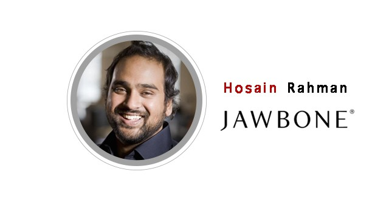
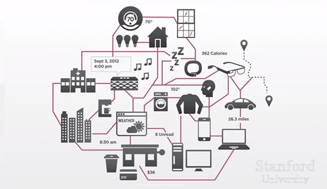
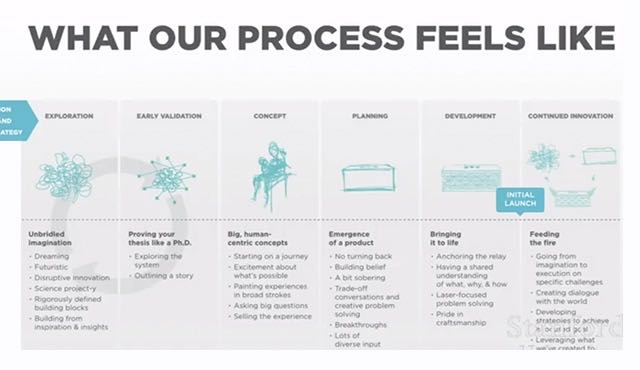

# YC创业第17课：Jawbone 不是硬件公司

YC 与斯坦福联手开设的创业课程「怎样创立一家创业公司」第 17 课。本期主讲人为 Jawbone 创始人 Hosain Rahman。本节课他将描述打造一款硬件产品的各个阶段，并表示 Jawbone 是集硬件、软件、数据为一体的公司，他们的核心关注点，是一整个生态系统带给用户的体验。

本文由 [How to Start a Startup Lecture 17](http://startupclass.samaltman.com/courses/lec17/) 听译整理而成。

我和 Sam 是老朋友了，今天他邀请我来讲讲 Jawbone 的发展历程，很高兴与大家分享。

智能设备的数字在急剧上升，你的冰箱、车载电脑、游戏机都能联网，但这些零零散散的设备各有各的应用，自己有自己的一套做事方法，互相之前并不能协作。人类夹杂在其中，反而手忙脚乱，逐渐丧失主动权。我们认为这是个科技与美学交汇的时代，科技存在的意义，是帮助人类更好地生活。所以一个能让各种智能设备显得更加有条理的装置很有存在的必要，例如手环。它与手机等其他便携设备所不同的是你会 24 小时佩戴在身上。手机可能在充电，也有可能被忘在了大衣口袋，手环不会。它可以全天候不离身，一刻不停地检测你的心跳和呼吸。正因为贴身，手环又比其他设备多了一层「语境」信息。例如你很热，温度调节器只能获取到「热」这个表面信息，手环却知道你为什么感到热，或许是因为剧烈运动，或许是因为身体不舒服，然后据此做出适当反馈。同样的，车载电脑很难自主判断出你在驾驶时是否感到疲惫，手环能做到，它甚至能推测你当天的心情是舒畅还是暴躁。这就是我们的首要观点，可穿戴式设备会成为未来互联网一个小小的中枢，对内检测用户的需求，对外协助用户管理其他的智能设备。这个认识是我们打造产品的起点。

这样一个产品对我们硬件、软件、数据处理能力都有很高的要求。从硬件的角度讲，它必须足够优秀，人们才会愿意将之随身佩戴。软件方面，我们希望它带给用户的体验能像 Instagram 和 WhatsApp 一样友好。手环从用户处获得的数据，我们也要善加利用，才能给出有意义的反馈。将硬件、软件、数据放在三个同等重要的位置上，这件事情是前人所未做过的，也是我们公司与其他企业所不同的地方。首先协调软件开发进度和硬件研发进度就是个难题。我们都知道，开发软件时我们讲究快速迭代，只要产品「最小可行」就可以先投入使用，再根据反馈进行更改。但硬件的制造过程就与此大相径庭了。硬件的迭代周期很长，没有软件这么灵活，设计一个工厂治具都会花去 4 个月的时间，不可轻率进行改动。这就需要软件开发团队谨慎对待产品，在确定一个方案之前反复进行演练。并且要有整体观，硬件、软件、数据不可拆分成三个独立的部分各自为政，要把他们视为完整的系统去分析、衡量。

下面我们谈谈打造一款硬件产品的各个阶段。

Exploration，探索

一个产品的诞生，首先需要天马行空的想像。结合自己对世界的理解，对品牌的定位，大胆尽情地设想。我们公司内部会有 demo Fridays 和 Hackathons，所谓 demo Fridays，就是例行会有展示自己想法，演示 demo 的机会。产品处于探索阶段时主要由研发部门负责，CTO 是最终拍板的决策者，但产品和工程团队也会参与其中。如果 CTO 认为这个项目已经到能够找到天使投资人的级别了，那就是时候进入下一阶段。

Early Validation，初步验证

接下来，项目需要经历一个类似博士论文般的论证过程。这个环节仍然由研发部门负责，他们要结合实际的经验和数据，告诉其他人，这个项目在做什么，有什么意义，为什么这个项目能够成功。负责工业设计的团队也要加入其中，分析这样一个产品所需的投入、成本，以及工业上生产的可能性（是否要等待电池技术的革新，技术上有没有瓶颈等等）。经历了这一环节，项目才会带来真实感，你会感受到，自己真的开始做一个产品了。

Concept，理念

再接下来，职责要转换到产品体验团队。产品体验涉及从硬件设计到软件设计再到音效设计等等用户所能接触到的方方面面。团队里不仅有工业设计师，交互设计师，还会有写手，他们负责预设用户的使用场景，给团队提供具体的情境。有了这些预想的使用场景，所有团队所做的工作就会被串联起来，结合成一个完整的产品。当我们把产品构想一点一点付诸实践的时候，很容易会有一些新想法，一些突发的灵感。此时就要回归到上一阶段的论证过程，保证产品最重要的性能，力求解决的首要问题，不会受到影响。在这一环节我们还需要考虑到，产品将来的发展路线。问问自己，现在正在做的事情，是不是为将来更大的布局打下了基础。

Planning，计划

随后，接力棒来到了产品管理团队手中。他们会制定出切实的商业计划，比如什么时候上线，什么时候开始零售，软件的更新周期是多久等等等等。此时我们会发现现实中的许多阻碍，有一些不得不妥协的地方。这就需要我们要结合现实，哪些可行，哪些不可行，找到理想状态和现实可行性之间的平衡点。在这个节点我们也要回头看一下，我们希望产品能带给用户的体验是否都已实现。

Development，生产

产品最终投入生产。即便到了这个阶段，我们还是能继续完善产品，例如 Jambox 开启时的音效，我们和许多音效师合作，花了几个月的时间，才找到最终满意的效果。细节的完善能带来出乎意料的使用体验，我看到每一个打开 Jambox 的人，听到音效后都会开怀一笑。橡胶部分的生产厂商，我们也是众里寻他千百度，最终才找到一家质量和色彩都达到我们标准的地方。不仅仅是硬件，软件中的细节也一样，界面上模块的呈现方式、过场动画、与用户之间的交互都是经过精心的考量。

WHYS，为什么

论证阶段我们想向人家证明的问题（项目在做什么，有什么意义，为什么能够成功），在整个流程中，也要时不时地问问自己，是否完成了最初的设想。这些提问的答案就是产品的核心框架，它们可以帮助我们不至走偏。这些问题归结起来，其实就一句话，「产品解决了用户什么痛点？」这个痛点可以是硬件上，可以是软件上，也可以是平台上的。有些需求连用户自身都尚未意识到，可一旦被解决，用户就再也离不开它。

Jambox 就是个典型的例子。2010 年秋天 Jambox 开售，当时用户调研显示大众对无线播放器的需求还是零，可到三年后，这一数据攀升至 78%。如果我上街，逮着人就问「你愿意花 199 美金购买手机音频播放器吗」，那反馈绝对都是不愿意。可当 Jambox 放在眼前，他们却又做出相反的选择。这就是我们改变了这个产业。

Sam：为什么你们能快市场一步？

Hosain Rahman：市场调研有很多种不同的做法，像通常那种单刀直入的提问，「你会为这个产品付钱吗？」，「你需要这个功能嘛？」等等，是一种方法，但我们觉得这种方法获得的答案并不准确。我们会问，「你和朋友待在一块儿时，有多少时间是在听音乐？」，「你怎么和朋友分享音乐，是通过耳机还是手机音乐播放器？」，「你分享音乐的频率是多久？」。我们所询问的，都是用户的行为方式，生活方式。例如如果是 iPod，我们就会问，「你想不想要随身携带上千首歌曲？」，不会问「你想不想要一个可携带式音乐播放器？」。

我们当时会产生做这样一款产品的想法，是因为我们认为多媒体内容已经从 iPad,iPod, 笔记本转移到手机上了。音频产业同样需要变革，它要变得同样便携，可以在旅行中使用，可以放在家中任一角落，也可以带到不同的车上使用，并且保持高品质。这就是这一品类产品存在的必要。我们做这件事，也是对未来的一个铺垫。从大环境来看，现在是「物联网」时代，无线音箱可以让我们在用户的家中占有一席之地，我们后续能够提供的软件、服务都能以此为基础展开。所以，我们做出这个选择，它必然是既满足用户的需求，又符合未来趋势，为公司下一步发展做出铺垫的。只有这样，我们才能不断跟进，做出更加有趣的产品。

我们力求让用户的体验呈现一种连续性，无线音箱只是基础，往后还会有更多发展。有了这样一种整体大局观，也有助于我们对产品的性能做出取舍，有些功能在这代产品上被舍弃，但在下一代产品中预留了它的位置，到时用户能更好地接受。

我想再次强调，我们不认为自己是硬件公司或者软件公司，我们所追寻的是一套完整的体验。这种体验中包括硬件设备，包括云端服务，也包括一个音效，一个按键。这种体验在整个系统中要怎么分配，哪里需要整合，哪里需要创新，都会经过考量。