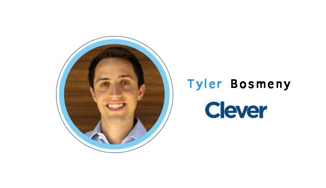
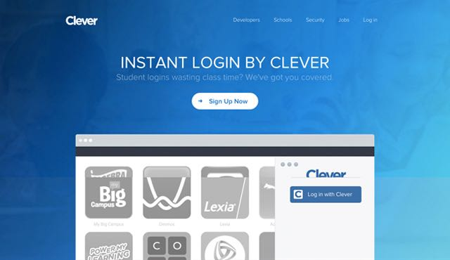
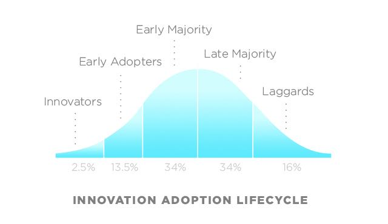
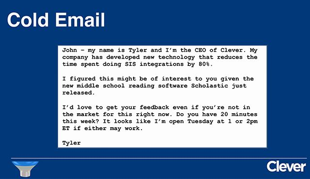
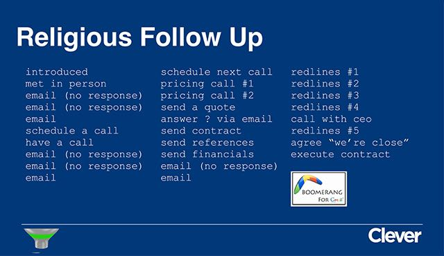

# YC 创业第19课：销售如漏斗

YC 与斯坦福联手开设的创业课程「怎样创立一家创业公司」第 19 课。这一课，分为两个部分完成，本篇为上半部，主讲人 Clever CEO Tyler Bosmeny 总结了自己在销售路上摸索出的经验，告诉大家销售犹如漏斗，是一个不断筛选出目标用户的过程。

本文由 [How to Start a Startup Lecture 19](http://startupclass.samaltman.com/courses/lec19/) 上半部分听译整理而成。

Tyler：大家好，我是 [Clever](http://tech2ipo.com/56202) 的 CEO Tyler Bosmeny，先简单介绍一下 Clever

这是一款面向学校的产品，它能将学校的资源分享至标准应用程序界面，使开发者利用这些数据开发最适合学生和老师使用的在线应用。我们公司才成立刚刚两年，但已经有五分之一的美国大学在使用我们的产品。销售恰恰是取得如此辉煌业绩的关键点，这次我想跟大家分享一些经验和心得。

在很多外人，甚至是一些创业者看来，「销售」是个神秘的过程。好像我们张口闭口蹦出的都是「广告狂人」般的金句，魅力值爆表；好像创始人只需要致力于打磨明星产品，剩下来的一切交给「神秘的」销售团队就好了。好，赶紧醒一醒，对于创业团队来说，没有 Don Draper，没有传说中的「销售团队」，创始人本人就是销售人员。不要说自己没有经验，不要说不知道该从何开始，创始人对产品的热情和对行业的了解就是最大的优势。我本人是数学统计专业出身，本以为自己会在金融机构就职，但是在 Clever，就是由我完全承担起销售的责任。

我在销售之路上首先学到的知识就是，销售犹如漏斗，它是一个不断筛选出目标用户的过程。

**销售漏斗第一层，找到那些愿意接你电话的人。**

Everett Rogers 提出过技术采用生命周期理论（Technology Adoption Lifecycle），他指出，勇于尝试一款名不见经传的新产品的公司，只占整个市场的 2.5%。有人会感叹这个比例之低，但是在我看来，这个人数的上限，让销售变成了一场与数字竞争的游戏——只有 2.5% 的人会接起电话，考虑使用你的产品。你现在应该能意识到，有多么庞大数量的电话等着你去拨通。刚到 YC 的前两个月，我接触过的公司超过 400 家。

找到这些人有两个途径：一，是通过熟人；二，是通过会议现场。第一点不用细说，第二点，我所说的会议不是 CES、E3 这种，而是说如果一群 CIO 要到某个小城的某家酒店开会，你要先想办法获得他们的出席名单、联系方式，在会议开始前就给每个人发邮件，再跟进到现场，抓住每一个推介自己的机会。Clever 早期的销售工作几乎就是在重复做这件事情，我们的初始用户大部分都是靠这个方法接触到。

跟陌生人发邮件，邮件不需要写得又臭又长，其要点在于简洁明了、直击要害。下面是我的范文，基本上只介绍了「我是谁」，「我们在干嘛」，「希望能和你进一步交谈」。

l

**销售漏斗第二层，电话交流。**

如果今天的演讲我只能讲一句话，那我会告诉你们「克制住自己讲话的欲望！」我知道大家都对自己的产品感到自豪，就像那些喋喋不休想告诉别人自己孩子有多棒的邻家大妈一样，这是身为一个创造者的本能，但却不是一个顶尖销售会去做的事情。我曾经见识过一个出色的销售跟他的客户对话，其中 70% 的时间他都是在询问和倾听客户的需求。他会问「为什么你愿意接受我们的联络？」，「（关于我们产品能解决的用户痛点）你现在是怎么对付的？」，「你觉得这个问题有理想的解决方案吗？」不知道大家有没有用过 Uberconference，他们会在你通话结束后自动发送一封邮件，统计出这次通话中你和对方分别讲了多久的话，我觉得这个功能很棒。

**销售漏斗第三层，跟进。**

下面这张图记录了我与一位客户的交流进程。

这基本就是一个见面-邮件-没回应-邮件-没回应-邮件-电话-邮件-没回应-邮件-邮件-电话-电话-回复的悲惨故事。但是，你敢信吗，他一开始表现得那么矜持，最后居然和我们达成合作了。我见过许多创始人，一两次邮件没有回应，觉得对方对自己不敢兴趣，轻而易举地就放弃了。而上图显示的客户，实际上已经是一个非常理想的案例了，更多时候过程是更加地曲折。所以你必须要有愚公移山的精神。

当然，我这样穷追不舍这个客户，是因为他没有表现出明确的态度。如果有一千个人都是这样不置可否，那会耗去大量的时间。你要学会快速地让客户表明自己的立场，如果他很确定自己不需要这样的产品，这反而能让你省出更多的时间来和那些立场摇摆不定的客户周旋。

**销售漏斗最后一层，合约协商。**

当你已经与许多人进行过交谈，你不断跟进，到了将要出成果的那一步时，事情其实就简单了许多，只需要双方律师反复协商合约。感谢 YC 对创业行为的支持，他们现在公开了成熟的协议模板以供大家参考。

在这一阶段也有几个典型的错误行为。

*   首先，在签协议的问题上，有些创始人会盯住无关痛痒的细节不放，把创业初期宝贵的时间浪费在咬文嚼字上，这时你应该尽快完成协议，以便让公司前进到下一阶段。  
*   其次，要是有客户提出「如果增加某某功能我们就签协议」的要求，请慎思。实际上，你满足了他们这个要求之后，还会有数不清的需求被摆上台面。回答客户这种要求有两种方法，一是「你把协议签了再说」，额外要求的功能，我们会在协议里保证去实现，这么做是为了防止跳票。二是「好，那我看看其他用户是不是也有这种需求」，当这些需求真的贴合用户，有更多的用户提出这个需求时，才有必要去实现它。  
*   最后有一个最容易犯的错误是，「免费试用」。「免费试用」这个要求看起来很合理，但是创业公司需要用户，需要承诺，需要收入，这些都不是「免费试用」能带来的，你以为自己获得了一个用户，可实际上等到试用期结束，你又得重新走一遍销售流程。遇到这种情况，我通常会告诉客户「我们不提供免费试用，我们的产品是收取年费的，但在您使用的前 30 或 60 天，遇到任何问题都可以选择退出。」  

现在我们已经走到漏斗的底部了，终于完成了一单销售。但是这里有一个问题，一个企业创立初期采用的工作方法，通常是笨方法，它适合在小范围死磕，但不适合在大范围推广。Christoph Janz 写过一篇文章，认为有的产品是大象级别的，虽然卖出去的数量少，但是单价高；有的产品是兔子级别的，单价低，但是卖出去的数量更多；依此类推，还有老鼠级别，苍蝇级别。创始人要在运作的过程中渐渐看清产品的定位，一个明明是兔子级别的产品，却需要你动不动就飞到另一个城市，做 8 个 demo 演示，要花三个月时间协商合约，那是不可行的。这意味着你要更改自己的销售模式，或者更改自己的产品价格。

今天就讲这么多，在公司发展的起步阶段，希望我的这些经验能够为大家提供帮助。我是一路摸索着过来的，相信大家也可以。渡过了起步阶段，世面上会有更多的相关书籍帮助大家继续前进。