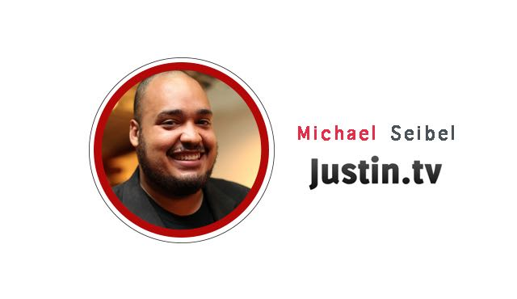

# Michael Seibel：YC 创业第19课之，与投资人的两分钟

YC 与斯坦福联手开设的创业课程「怎样创立一家创业公司」第 19 课。这一课分为两个部分完成，在上半段中，主讲人 Clever CEO Tyler Bosmeny 总结了自己在销售路上摸索出的经验。本篇为下半段，YC 的三位合伙人 Michael Seibel，Dalton Caldwel，Qasar Younis 为大家模拟了一场与投资人的交谈过程。

本文由 [How to Start a Startup Lecture 19](http://startupclass.samaltman.com/courses/lec19/) 下半部分听译整理而成。

Sam：接下来我们聊一聊如何拉投资，Michael 先教大家如何来进行交流，之后 Qasar 会扮演投资人的角色，为大家展示会谈的场景。

Michael：我是 YC 的合作伙伴，我创立过两家公司，有一家是 Justin.tv，它被卖给了亚马逊，另外一家是 Socialcam，我将它出售给欧特克。我想讲一下如何拉投资，这是作为公司创始人要做的很基本的一件事，但很多人为之头疼。

**与投资人交谈不需要长篇大论，言多必失，「半分钟介绍****+****两分钟宣传」足矣。**

半分钟的介绍很简单，这里面有三个要点。

*   首先你要表明你的公司是做什么的，一定要简单直接的表达出来，要像白居易做诗一样，力求「老妪能解」，不要给听众带来理解上的困惑。  
*   其次是表明市场规模，你需要明确的告诉投资者，而不是含糊的略过。  
*   最后是表明公司的前进力，你需要告诉投资人你的产品是何时发布的，产品的完善速度是多么惊人，收益前景是多么乐观。如果产品还未发布，你要告诉投资人你们的开发速度有多快，让他们确信用不了多久你的产品就能大放光彩。这半分钟的介绍非常重要，借此可以令投资人对你有初步的了解。  

**接下来是两分钟的宣传，这时你就要努力去赢取他人的信心了。这里我重点讲四件事。**

*   首先是独特的视野。投资人通常会追问这一点。这是你展示才智的时刻，你可以告诉投资人那些市场上的大玩家所未注意到的事情，表明你为何有机会在这个市场中脱颖而出。简单的表达出要点即可，如果你的想法确实是与众不同的，那对方一定会有茅塞顿开的感受。  
*   其次是如何来赚钱，在这个问题上你必须有话直说，不要担心想法被质疑。脸谱和谷歌都是靠广告来赚钱的，如果你寄望于靠广告来盈利，这也并不是什么愚蠢的想法。把想法表达出来，不要逃避这个问题，不要支支吾吾含糊其辞东拉西扯，公司都是要盈利的。即便盈利方式最终没有实现，投资人也不会把你大卸八块，最少你要确定好盈利模式而不是像无头苍蝇一样撞墙作死。  
*   接下来就是团队了。如果你的团队有过非常成功的经历，那就要展示给投资人，比如：我们创立了 Paypal，我们创立了亚马逊，诸如此类。如果没有，那就要实打实的介绍团队的构成，比如创始人一共有几位，技术人员和非技术人员的比例是怎样的，通常两到四位创始人以及半数以上的技术人员会更令人认可。投资人希望你的团队成员是在做全职，而且在共事之前有很长时间的了解，投资人希望你的团队是团结高效的。  
*   最后是需要多少钱，这时你要确认对话是否进展到了这一步。你要明白你需要多少钱，如果你没有搞清楚这一点，投资人会认为你准备不足。在这个环节，你要学会用术语来表达，如果现在还不会，那可以求助于谷歌，学起来也挺快的。  

**什么时间点去找投资人比较合适呢？**

投资人一般会看你公司的发展速度。所以尽可能在公司快速发展时去筹资。你也许会认为自己是伸手要钱的一方，因此投资人是非常强势的。事实上你要扭转这一形势，当你的公司迅速发展时，你就成为了强势的一方，这时投资人会抢着把钱送到你手里。你还需要努力宣传自己的公司，通过媒体或朋友，这时投资人才会注意到你。其次你要做两手准备，如果不能筹到大量资金，你还是要想办法让自己的公司继续发展壮大，百分之九十五的公司都是用很少的钱来推动产品面世的。千万不要人穷志短铤而走险，让投资人拥有绝对的话语权。你可以努力推进自己的产品，用惊人的速度和效率来征服投资人，这样你还是会成为强势的一方的。

怎么安排和投资人的会议？

你需要得到其他企业家或是你之前投资人的引荐，这些引荐者的声誉是至关重要的。许多人认为拉投资会是一个漫长的过程，实际上它更像是一个短跑冲刺，绝非冗长的马拉松。最好是把会议一股脑安排到同一周里，这样做听起来挺难，但我有一个小技巧分享给大家。你可以发邮件给投资人，说最近两周你们有许多工作要做，建议在两周后安排会议。这样你有了充分的时间去准备，同时投资人可以在事务如山的日程表上作出合适的安排。还有一个小建议，团队中需要有人来全职处理筹资的事情，因为这是极其耗费精力的。

Dalton：大家好，我是 Dalton Caldwell，我是 YC 的合作伙伴之一。今天我来给大家展示一下真正的筹资会谈场景。我曾为数家公司总共筹到了超过 8500 万美元的投资，这期间我经历了形形色色的投资会议，因此我会尽我所能还原真实的投资会议场景。大家可以在这个过程中进行学习。

Dalton：首先，先来一次反面教材。Qasar，你能跟我讲讲你在做什么吗？

Qasar：我们在建立一个交流平台，商家和消费者可以直接通过这个平台进行沟通，这样能省掉不少麻烦。

Dalton：能更详细些吗？

Qasar：比如说 Whatsapp 和 Snapchat，这些工具是服务于用户的。我们想为商家提供交流工具，这样就能够使消费者直接和商家沟通了，这就是我们的目标。

Dalton：谁会使用这个产品？这个产品能做什么？

Qasar：这是为消费者和商家沟通而存在的，一个能够让消费者传递信息的通讯工具。

Dalton：  消费者为什么要用你的产品？

Qasar：因为他们想给商家传达信息。

Dalton：你能跟我讲讲市场机遇吗？公司的规模有多大呢？

Qasar：通讯市场显然有着很大的机遇，Whatsapp 卖出了 190 亿美元的好价格，Snapchat 发展的非常迅速，我们认为市场机遇是非常大的。（听众哄然大笑）

Dalton：你跟我讲讲你们现在的发展阶段吗，有人在用了吗？

Qasar：我可不想一上来就透露出所有细节。我们有大量的用户，在旧金山地区我们有数千名用户，数百家商家已经在使用我们的产品。

Dalton：能跟我讲讲这些商家吗？

Qasar：我不想透露太多细节，我们还在早期阶段，我们希望能够保留一些隐私。

Dalton：好吧，那能讲讲都从用户那里获得了什么启发吗？

Qasar：用户给这些商家发送信息，我们觉得这很棒。这些商家也会回复给用户，这一切不是那么容易就发生的。

Dalton：能跟我讲讲你们的商业模式吗？

Qasar：我们想对商家按月收取费用，我们还没想明白要怎样实现，我们现在正在免费为商家提供服务……

Dalton：你觉得商家肯花费多少？

Qasar：  一万到一万五美金每月吧……

Dalton：能跟我讲讲你的团队吗？

Qasar：我们有五名创始人，目前我是唯一全职的，我们正在筹资，这样我们其余员工也就可以转为全职了。

Dalton：这些创始人中有程序员吗？

Qasar：我们有一名生物学博士，他在编程上有那么一手。我是个 Python 开发者，有着丰富的开发经验。

Dalton：很高兴认识你，我们保持联系吧。

Qasar：好的。

（第一场模拟对话结束）

Dalton：这显然是场糟糕的对话。我们来讲一讲对话中犯的错误。  首先，你要确保投资人明白你在做什么。许多创始人在会议中会表现的很紧张，因此他们没表达清楚他们的产品是干什么用的。  此外你要明白自己产品的数据，不要含糊其辞，如果你不想让投资人知道你的数据，那就不要安排会议，因为你还没有准备好。在市场规模方面，请给出可信的数据分析，而不是举一些成功案例来黄粱美梦。你需要有自己独特的见解，说服对方，让对方发现你的优势

Dalton：好吧，让我们再来一遍。Qasar，你能跟我讲讲你的公司是干什么的吗？

Qasar：好的，我们在做一款通讯产品，人们可以通过地点来进行交流。当你步入商场后，你可以给商场经理发送消息，比如告诉他们走廊里有呕吐物，或者询问哪里能买到想要的东西，等等。

Dalton：这是手机软件吗？

Qasar：是的，在用户那里，是基于安卓系统和 IOS 系统的 App。

Dalton：哪种信息是用户最常发送的呢？

Qasar：最初我们想做一款基于位置反馈的产品，但是后来发现一大半的信息与位置反馈无关。有人会询问商家是否招人，这很奇怪，因为明明可以直接去和商家交流的。后来我们意识到，他们用信息的方式交流更简单有效，因为这很容易阅读。

Dalton：这很像一个意见箱，可以跟商家提供建议。

Qasar：最初我们也是这样想的。后来发现大部分信息是这样的「什么时候营业？」「什么时候关门？」「还可以预定今晚的位置吗？」

Dalton：能讲讲你们现在合作的商家吗？

Qasar：在旧金山地区我们已经与三百五十家商户取得合作，我们三个创始人自己去进行销售。我们都是技术出身，但有着零售背景，因此知道如何去跟这些商家推销。我们最初想为星巴克和沃尔玛这样的大企业提供产品，但发现能力还不足以实现。因此我们选择了 S&B’s 这类的商家，这样消费者能够使用起来。

Dalton：你们的销售策略是怎样的呢？能否介绍下你们的团队？

Qasar：我们发现靠卖给 S&B’s 这样的商家来盈利是非常艰难的，用 LPA 减去 CPA 的算法去计算，这样是无法取得成功的。有两种解决方案，一种是回到最初星巴克和沃尔玛这类的大客户，一种是与本质上面对消费者的大公司合作，如谷歌和脸谱等。

Dalton：你跟他们交流过了吗，他们会考虑合作吗？

Qasar：我们已经和他们聊过了，我们希望每次有人搜索商家时，都能够有消息按钮展现出来。我们想让消费者养成给商家反馈信息的习惯，这样我们就成了消费者和商家之间的沟通平台。假如谷歌和脸谱等不和我们合作的话，我们会考虑把产品当作反馈工具卖给那些大商家。

Dalton：能聊一聊你们的团队吗？

Qasar：我们有三个人，全是做技术的，都有着零售业的背景。我和迈克尔曾经成立过公司，我们的创业曾经失败过。我们一起工作，产品都是由自己开发，销售方面也是亲力亲为。我们已经和你们公司聊过几次了，我们现在正在募资，其中一大半已经完成，剩下的也正在会谈中。我们觉得你们公司可以给我们提供大量的零售经验，这时我们非常感兴趣的。

Dalton：是的，我对合作非常感兴趣。我还需要和一些人再讨论下这个事情，但我觉得前景是非常美妙的。

Qasar：没错，我们很期待和你们取得进一步的交流。这周五我们会完成募资，所以请尽快来考虑这件事情，在周五之前我们都可以取得合作。在周五完成募资前，我会再打电话给你的。不管怎样，我们非常希望能与你们取得合作。

Dalton：好的，谢谢。

（第二次模拟会议结束）

Dalton：最后我想告诉大家，获得资金不等于取得了成功，很多人不明白这一点。许多聪明人能够申请到好学校，能够获得好工作，他们认为获得资金是另一件能够打上完成标示的任务。但是经营一家公司是一件更复杂的事情。