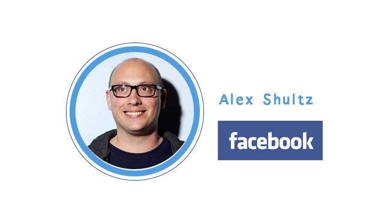
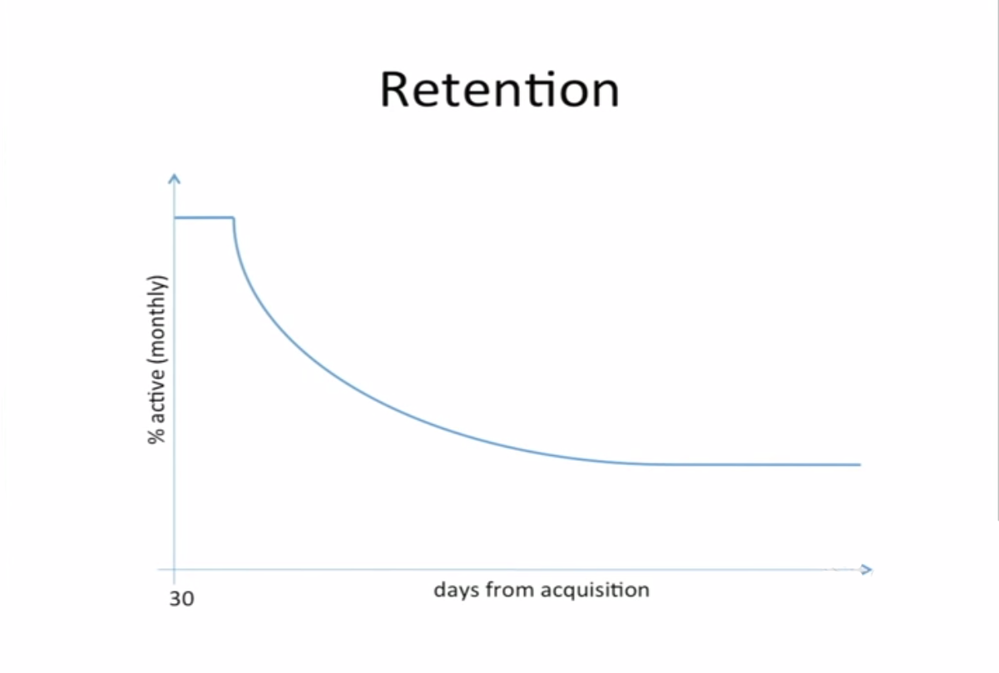

# YC创业第六课：没有留存率不要谈推广

YC与斯坦福联手开设的创业课程「怎样创立一家创业公司」第六课，由 Facebook 负责用户增长的 VP，Alex Schultz，谈谈他理解的「黑客式增长」。

本文由 [How to Start a Startup Lecture 6](http://startupclass.samaltman.com/courses/lec06/) 听译整理而成。

**引入**

我在大学学习的是物理专业。物理是一门适用范围很广的学科，许多知识在其他领域也可套用。在剑桥大学的学费我就是通过做线上推广赚来的。那还是 90 年代的时候，我创建了一个纸飞机网站，也算是在那个领域成为了一个「垄断型」网站。那时候的搜索引擎还是 AltaVista，在一个白色背景的网页上胡乱写上点关键字，SEO 就算做好了。在页面上提到「飞机」这个单词超过 20 次，在 Alta Vista 上的排名就能靠前了。

等到了大学，我又做了一个鸡尾酒网站。这个时候已经开始需要做针对 Google 的 SEO 了。要关心网页排名，还有网址被引用的次数。彼时若是在雅虎上能找到你的网站，那基本上就能进入 Google 的排名前列。不过同样也有很多隐藏文字阿链接阿等作弊的小手段可以使用。等到 Google 推出 Adwords，我的推广行为才开始变得有模有样，也就是你们现在称之为「增长黑客」的早期形态，真正从一个物理学家堕落成了营销人员（笑）。

**什么对产品发展最重要？**

Alex：在上了这么多课之后，你们自己脑海里大概对什么因素会影响产品的发展有想法吗？

学生：产品是否优秀

Alex：对，一个优秀的产品能带来什么？

学生：用户

Alex：没错，你们希望用户能做些什么？

学生：继续使用产品，并且向他人推荐。

大家都讲到点上了，「继续使用产品」就是我们常说的留存率（retention），这是产品发展最重要的指标。一个普通的留存率曲线看起来是这样的

横轴是时间，竖轴是月活跃用户百分比。Facebook 的推广团队很给力主要是产品太好用了，基本上只要用户上来就会持续使用。普通公司通常随着时间的推移，月活用户的百分比会不断下降，最后趋近于一个和横轴平行的直线。这说明产品是可行的，你已经抓住了一部分目标用户。还有更多公司，即便是经过市场包装美化、病毒营销等等获得短期的增长，最后月活百分比还是会止不住地下降，最后甚至与横轴相交。不要跟我说产品初期人数太少没法做用户留存率分析，我加入 Facebook 的时候这个产品才诞生 3 天，产品发布 90 天后我们就通过分析用户留存率预测到一个广告商一年能给我们带来的价值，最后准确率达到 97%。只要有一万个用户，你就能分析出产品用户留存率曲线的大致走向。如果曲线最后没有趋于平缓，那就不要谈什么病毒营销、推广策略，首先调整好自己的产品，确保拥有一定的市场再进行下一步行动。产品不够好，使用再精妙的营销战术也无力回天。在我接触创业公司的经验中，一个公司最严重的问题就是自以为自己的产品足够好了。我们要用事实的数据说话。

**说到这里有同学会好奇，留存率达到多少才算是优秀的初创公司？**

首先，那些已经成功的互联网公司的留存率曲线，我们完全可以根据公开的数据绘制出大致的走向。例如，全球除去中国大约有 20 亿网民，Facebook 大约有 13 亿活跃用户，两个数字相除就能知道个大概；WhatsApp 有 6 亿活跃用户，全球智能手机的用户又有多少呢？这些数据都可以自行获取计算。

其次，不同类型的公司对留存率的要求也不尽相同。对电商来说 20%-30% 已足够优秀，但对社交网站来说，第一批用户的留存率不达到 80% 是不会成气候的。所以看看与你处在相同行业的竞争对手吧，看看你与这个行业里顶尖的公司还有多少差距。

**用户留存率达标后，网站会需要扩张，此时可以引入推广团队了。**

实际上我并不赞成另设一个推广团队，我觉得整个公司由 CEO 领导推广效果最好。公司需要 CEO 决断，把发展的关注点放在什么数据上，就像北极星一样给内部人员以发展方向的指引。关于这点，Mark Zukerberg 是个绝佳的例子。在 Facebook 刚起步的那段时间，各个网站都喜欢将注册用户数当作网站发展好坏的衡量标准。是 Mark 提出要将月活跃用户作为内部发展指标，这个指标才成为 Facebook 员工做所有事情的衡量标准；WhatsApp 则是拿信息的发送数量作为衡量标准，以此确保自己是用户的主要通讯工具。试想一个用户每天登录却只发送一条信息的通讯工具，它是没有任何影响力的；eBay 则是把关注重点放在商品交易总额上，而不是收入。

在我的经验中，需要管理的人员超过 100 个我就会失去控制。每个人都会有自己的一套想法，如果 CEO 不把大家共同的前进方向一再强调的话，很容易就乱了阵脚。

04 年我在 eBay 的时候，我们还有加盟机制，也就是会支付费用给为我们带来流量的渠道商。起初我们是根据注册用户数付费，后来我们改成以激活的用户数付费（即购买或拍卖过一件商品）。这个规则一更改，当天就少了 20% 的注册用户，但是激活用户数只下降了 5%。激活用户数在注册用户中的比例增加，整体数字大幅上升。这个指标关注点的不同给产品也带来了不同。关注激活用户数，产品就会在用户搜索、浏览产品后再要求游客用户注册，不至于破坏购物体验。

**这就带出来下一个话题，一个产品让人怦然心动的那一刻。**

大家觉得注册了 Facebook 后，这个产品让你怦然心动的时刻是什么时候？

学生：看到朋友的动态时

没错就是看到朋友的动态这么简单。需要的就是这种当人们看到时能恍然大悟「原来这个网站是这么玩的！」的时刻。在社交领域人跟人之间的连结是最重要的。所以无论是 Twitter，LinkdedIn 还是 WhatsApp，都会在你注册后的第一时间推荐你可能想要关注的用户，或者引导你导入联系人。在 eBay 上找到一直搜寻的限量物品能给人带来怦然心动的感觉；在 Airbnb 上找到心仪的房子踏进房门的那一刻也能给人带来怦然心动的感觉。你要找到属于自己产品的心动时刻。

做推广还有一个常见的错误，就是从自己的需求出发做优化和推广。什么意思呢？举个例子，在我接触过的众多公司中，每次聊到有关发送给用户的邮件通知、弹出通知的话题时，大家都会说「我觉得我们推送通知太频繁了，这一点需要优化」。可实际上，核心用户并不会因为你推送过多就离开你。就算他们真的受不了网站不断的推送，只要用一下邮箱的过滤器不就可以解决了吗？在优化产品时，我们的确要从核心用户的角度出发考虑他们的需求，但做推广时，我们要从边缘用户的角度出发。为什么他们不再上 Facebook 了？是朋友之间的连接太少了吗？怎样才能帮助他们找到自己的圈子？

**推广技巧**

作为一个物理学学生我曾经认为市场推广没什么了不起的，只要产品做得足够好自然会有用户上门。相信在座很多理工科学生抱有跟我当年同样的想法。但我现在不那么想了。Pinterest 的 CEO Ben Silbermann 曾经在采访中说过，Pinterest 的成长首先要归功于市场推广，而非产品，你们可以在课后看看这篇文章。

**1.****国际化**

Facebook 从一所大学推广到全美高校，再从高校推广到中学，再走出学校推广到个人，这个时候已经积累到 5 千万用户了。当时我们很怀疑是否能达到一亿用户。这在现在听来可笑，不过在当时还没有产品能突破一亿用户的关卡。也就是在这个时候，Chamath 组建了推广团队。我们首先做的是想尽办法让用户与自己的朋友在短时间内连结上，体验到使用 Facebook 的怦然心动的感觉，接下来就是使 Facebook 国际化。我们内部一直都承认，Facebook 国际化做得太晚了。当 Facebook 还只把眼光专注在美国本地市场时，在很多国家已经崛起了山寨产品，他们的源代码里甚至还有 Facebook 的 CSS 文件。虽然那个时候压力很大，但是我们还是冷静下来没有急于求成。当时除了英语，世界上使用最广泛的四种语言是意大利语、法语、德语、西班牙语。我们希望我们的产品能够适应未来的发展，所以没有只针对这四种语言优化，而是成立了社区翻译平台，由用户来产生翻译内容。现今 Facebook 支持的 104 个语言中，有 70 个是由翻译社区完成的。再回过头来看，当年广泛使用的意大利语已经掉出了排行榜，德语和法语也正在式微，海地使用 Facebook 的人数却翻了四番。要预测世界的走势是很困难，我们只是通过做出一个能灵活调整的产品来应对。

**2.****病毒式营销**

一个产品的传播性可以从三个维度来分析：覆盖面，转换率，宣传频率。我们可以试着用这种方法来分析几个产品。

第一个是 Hotmail。大家知道，之前个人邮箱都是要和网络服务商绑定的，但 Hotmail 却做到了无论你在什么地方都可以登录邮箱。他们也不像其他公司那样在招贴上大肆广告，而是在用户发送的邮件底下加上一行小字「发自 Hotmail，点此获得你的免费邮箱」当作宣传。这种宣传方法的覆盖面是很窄的，因为用户每次只给一个人发邮件，但他的宣传频率和转化率都非常高。前者是因为朋友之间往来邮件较多，后者是因为产品本身给人带来便捷。综合三个因素，Hotmail 实现了疯狂地增长。

第二个是 Paypal 的例子。Paypal 是通过 eBay 来做推广的，比如你跟卖家说希望能通过 Paypal 付款，卖家基本上没有理由会拒绝。所以他们虽然覆盖面和宣传频率都不高，但是我没有见过比他们转化率更高的产品了。

如果我们细化一个产品被用户推广出去的过程，会是这样的：

用户注册后有一定比例的人会导入联系人，他们会给其中一部分联系人发送邀请信息，被邀请人中又有一部分人会点开链接，点开链接的人中间又有一部分人会注册。这样就形成了一个循环。通过叠加每一个环节的比例，可以得出一个与传播程度相关的系数 K。假设已注册用户给 100 个朋友发送了推荐，10% 点击了链接，50% 注册了，10% 到 20% 注册后导入了联系人，那这个系数就是 0.5-1。

再强调一遍，我所说的这一切都是建立在已经有足够的用户留存率的基础上。如果产品留不住用户，那再多推广都是徒劳无功。

**3.SEO**

做 SEO 有三件事最重要。

首先是关键字。你要调查用户习惯用什么关键字搜索跟你网站相关的内容，有多少人在使用这个关键字，有多少其他对手网站也在使用这个关键字。

接下来是链接。在权威站点上有网站链接能提升 Google 排名，另外站点本身每一个页面的路径设置也要做得便于 Google 收录。07 年的时候，Facebook 上那些公开的个人主页没有给我们导入过流量，就是因为我们把页面藏得太深了，以致 Google 的算法以为这些页面并不重要。重新创建目录优化后，通过 SEO 导入的流量翻了 100 倍。

最后，当然就是 html 文件中 header 的设置等等，这个具体的操作方法你们可以自行在网络上寻找。

**4.Email****，****SMS**

我认为邮件在 25 岁以下的人群中已经不起作用了。另外 Email，SMS 都要考虑送达率的问题。如果你经常发送垃圾邮件，或者跟人家共用服务器，共用的人经常发出垃圾邮件，那你发的邮件就会被丢入垃圾文件夹。SMS 和推送通知也是同样的，发送垃圾信息一旦被用户屏蔽，就很难再回头了。在信息送达的基础上，我们才可以继续谈有多少人打开了邮件，多少人点击了链接。可现在有太多人做的推广，在我看来只是垃圾邮件。就说那些通过邮件发送的网站简讯吧，明显一个新注册用户和老用户希望看到的东西肯定是不同的。一个用户刚注册 Facebook 时，如果他看到有人赞了他发布的内容，那一刻很有可能成为他的心动时刻。可对于我这样的老用户来说，通过邮件提醒我有人赞了我的内容就变得有点烦人。

我们的时间差不多了，我想用我最喜欢的一句巴顿将军的话来结束今天的课程。

「一个今天就实施的不错计划，要好过明天才实施的完美计划。」

我知道这有点滥俗，但我相信，如果你真的能比对手多做一次实验，获得更多数据，对产品成长有更大的渴望，想尽办法获得每一个用户，疯狂地工作，快速执行决策，那你就能比其他人成长得更快，没有什么特殊的技巧。