# 1: 家庭阶段

来源：[https://zhuanlan.zhihu.com/p/20317371](https://zhuanlan.zhihu.com/p/20317371)

> **版权声明**
> 
> 本文首发自微信公共帐号：donglaoshi-123；
> 
> 作者：董飞
> 
> 无需授权即可转载，但请自觉保留以上版权声明。

**CS183C**

2015 年 9 月，斯坦福创业课程CS183C 开课了，这次是 Linkedin 创始人 Reid Hoffman 主讲，课程内容是《Technology-Enabled Blitzscaling》，之前CS183第一期课程主讲是 Peter Thiel，课程内容出版《From Zero To One》, 2014年与硅谷著名加速器 Y-Combinator 合作，课程内容是《[How To Start A Startup](http://link.zhihu.com/?target=http%3A//startupclass.samaltman.com/)》。下面就是我做的一些课程笔记。

**主讲人Reid Hoffman**

> Reid Hoffman，[LinkedIn](http://link.zhihu.com/?target=http%3A//baike.baidu.com/view/1291207.htm)联合创始人，曾经担任过[PayPal](http://link.zhihu.com/?target=http%3A//baike.baidu.com/view/244409.htm)高级副总裁。是硅谷最有名的[天使投资者](http://link.zhihu.com/?target=http%3A//baike.baidu.com/view/863615.htm)之一，曾经投资过60多家创业公司，包括Facebook和 Digg，投资人，参与投资公司：Flickr、Mozilla、Ning、Technorati、Kiva
> 
> Allen Blue，LinkedIn联合创始人及产品管理副总裁
> 
> John Lily, Greylock合伙人，前Mozilla CEO，创办Reactivity被Cisco收购

**[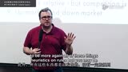  CS183C Blitzscaling 突击成长 第一课 http://v.qq.com/page/e/o/6/e01705j0so6.html](http://link.zhihu.com/?target=http%3A//v.qq.com/page/e/o/6/e01705j0so6.html)** 

**初衷**

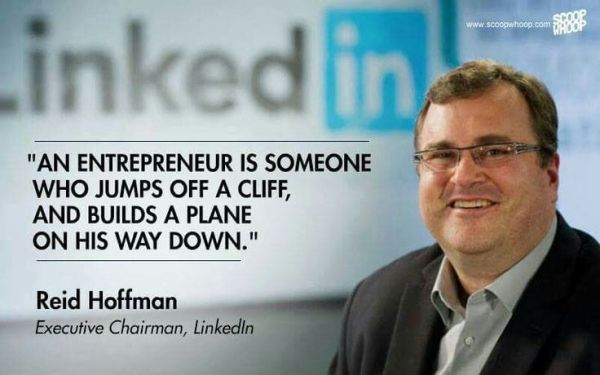

Silicon Valley is great because it has a unique ability to create startups.

硅谷在全球创新，技术和新产业产生扮演领导角色，这里有无数企业家，风险投资，科技大学，已有的技术公司，它能产生这些公司的秘诀是从 startups 到 scaleups。 最重要的是scaling up at speed。中国和硅谷都很多公司都做到了。当你能迅速扩张，能快速抓住市场，扩大收入和公司规模去面对全球化竞争，我们叫它：blitz-scaling。

建立一个改变世界的公司不是简单做一个牛X的app和找天使融资。它需要创业家去搭建宏大用户基础和业务模式，并且飞速去做到。就像 Mark Zuckerberg 在不到6年时间内把Facebook从车库到世界上最大的互联网服务。

这次在斯坦福的课程是Technology-enabled Blitzscaling，抓住了所有在快速扩张中需要的努力。这是关于创始人如何把伟大的产品扩张到伟大公司的历程。课程结束后也会写一本书就是“Blitzscaling”.

每次课程会覆盖一个从 "household" to "village" to "nation," and points in between. 请到的大咖包括 Sam Altman（后面介绍）, Elizabeth Holmes (目前最争议的估值$9B 生物科技公司Theranos创始人）, [Jeff Weiner](http://link.zhihu.com/?target=https%3A//www.linkedin.com/in/jeffweiner08)等。

**开篇**

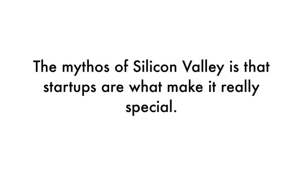

硅谷则是创业的沃土，有一种你不用担心失败，对失败恐惧的文化。当你尝试做某事但以失败告终时，你无须受到惩罚，可以再试一次，这里聚集充满理想的创始人。

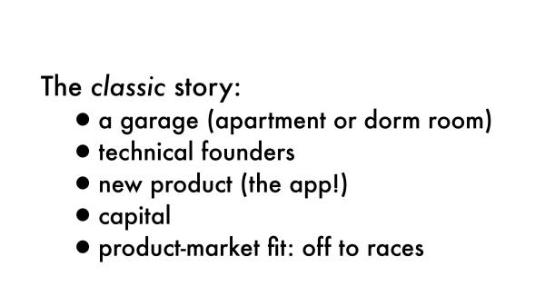

硅谷经典模式:

*   在车库里有个想法
*   团队有技术创始人
*   做一个新的产品
*   为新产品融资
*   产品得到市场认可

上面说的也是部分正确。像创始团队，初始产品的正确，融资等都很重要，但似乎缺失了一些做成持久性公司的重点部分。

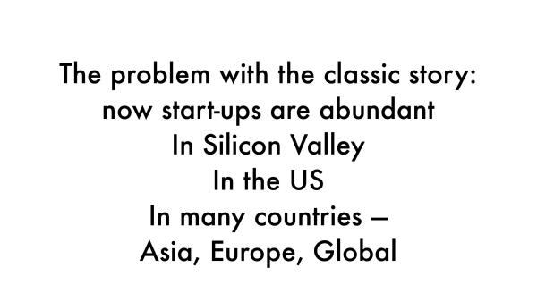

其实现在创业公司这么多，在世界任何地方都有很多人懂技术，比如推广app，病毒营销，也有VC，可以组建团队，那为啥非要在硅谷做呢？

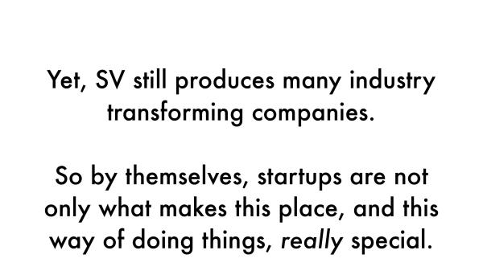

> “The secret to Silicon Valley is not startups, but scale-ups,” Hoffman said. “We want to teach entrepreneurs how to scale.”

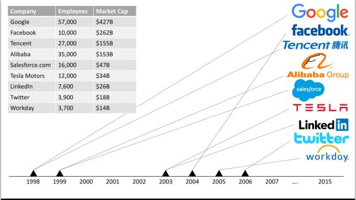

在超过100亿美金估值的科技公司中，只有2家不在硅谷 (Alibaba and Tencent 上榜).

如果看一下 top 10% 独角兽 (大于10亿美金估值)有50% 在硅谷。在看 top 60% of all unicorn companies — 47% 在湾区.

最萌的unicorn

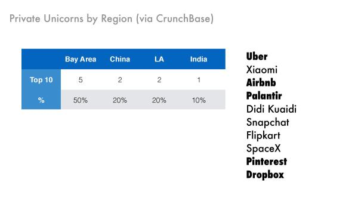

crunchbase是查看公司估值的网站，John强调这些都是paper value。加粗的都是在硅谷

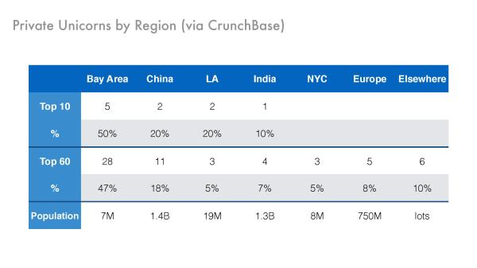

在硅谷也就700万人口，为什么能创建这么多瞩目公司 ?

**课程目标**

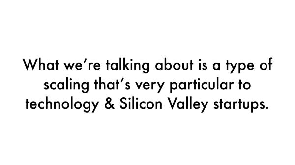

不可能有一本教科书教你一步步怎么做大公司，但有一些已经成功人士的策略可以学习。

**Network重要性**

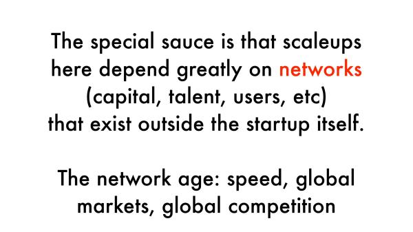

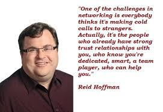

如果你思考为什么硅谷效率如此之高，最重要就是各种**network**。不同的网络互相交织发挥非常大的作用，并且创造这些网络就和放大器一样，放大你所作出的努力。在飞速发展的时代，越来越多具有全球影响和划时代意义的公司都刚好诞生在硅谷。就是因为处于一个网络时代，你更容易在全世界范围内以非常快的方式认识更多的人。有人说纽约不也是新兴网络吗，但硅谷领先了60年，这边有成熟投资人，战略指导到产品经理，技术研发到市场销售。后面会看到很多图，一开始都是很平的发展，但到了某一点开始加速，形成很大规模。

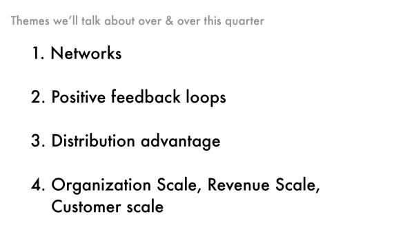

如果你跟企业家进行过探讨，他们尝试让组织规模尽量与客户规模，收入规模保持一致，因为这样可保持适应能力和持续发展的能力。

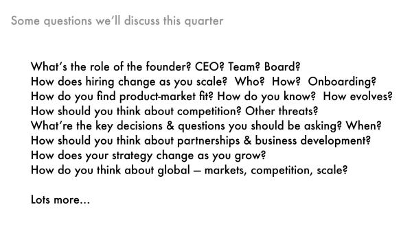

**一大堆问题**

•创始人的角色是什么？CEO的角色是什么？董事会功能是什么？
雇用一个管理团队的最好方法是什么？
中层管理人员在组织中的应有作用？
适合市场的产品？
维持和破坏性创新中的作用？
你应该如何应对竞争？
适当的融资策略是什么？
如何做出资金分配的决策？

应该如何思考市场营销和品牌？
如何随着企业发展做不同的销售模式？
您应该如何处理聘用和企业文化？
什么是公司的主要威胁？
关键决策和问题？
你何时以及如何应该担心全球化？
如何获得最大的合作伙伴关系和业务发展？
如何随着时间推动技术和战略变化？

比如说招聘，Workday的首席执行官Aneel，和他的共同创始人David，后者是PeopleSoft的创始人。曾对每个员工进行面试直至公司规模达到500人。因为他们认为，保持这种传统文化很重要，并且直到你全部招募到首批500人，他们都会以一种传统文化进行面试。但是即使是在第500人，也会发生变化，因为他们无法这样坚持到10,000人。

**另一个老生常谈的是你如何面对竞争？**

通常，当创业人在寻找风险投资时，他们会说，“我担心来自谷歌、来自微软的压力”。他们从来不会将一个创业公司考虑竞争对手，其实真正竞争对手应该是其他的创业公司。所有大公司都会有3-5个事情作为他们的真正目标。除非你刚好说“实际上，我想要做的是进行搜索公司创业，”那应该担心来自谷歌的竞争压力。但如果谷歌拥有其200个产品之一，而你刚好在某个层面上与其存在竞争关系，这其实并不是很相关的事情。但随着公司规模形成，开始争夺一群客户和收入，那竞争则倾向于来自更大的公司。最后趋势是你不仅仅与创业公司，还要与你同级的其他公司竞争，在某种程度上，你还与行业领导者竞争，因为他们存在一定的影响力。而这些竞争对手可能更多关注你这一块。

**组织规模和结构**

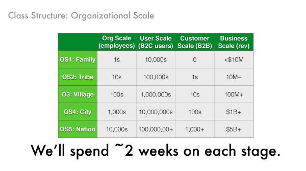

这个比喻是不同阶段公司规模，对应“家庭、部落、村庄、城市”，规模不同导致公司发生深远变化，但也有例外，当在Instagram投资时他们甚至没有13个人，但是他们的用户差不多达到1个亿。总有东西打破了常规。

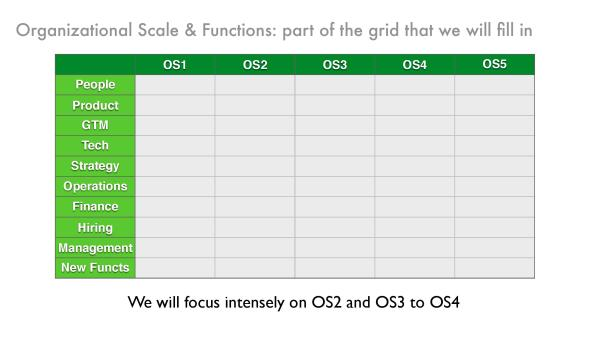

> There is no one size fits all approach but rather the goal of the class is to provide you with a chessboard of how to think about moving from one level of scale to the next level of scale — and also when to scale in the first place.

在你考虑公司的各个方面时会发生什么情况，人是非常关键，从这里开始着手。

此外你做一个单线程产品，或多线程产品？通常，作为一个创业公司做单线程产品，那什么时候发展到多线程？怎么做决定？

你怎么知道什么是正确的时机？如何进入市场？进入市场是否这么容易？有没有一个计划？例如，面向企业、面向消费者计划？

某些企业非常注重现场销售，某些企业基本通过电话进行，某些公司例如Slack，则是一个全新的模式。

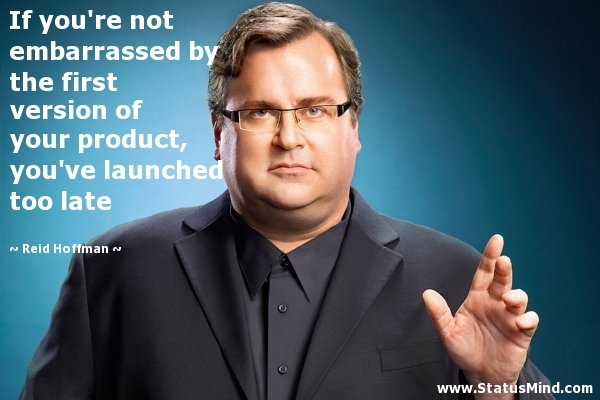

如果你的产品发布没有让你感到窘迫，你的产品发布已经太迟了。速度的重要性以及时间的重要性，以及你进入市场的时机。我们希望打造超级稳健的技术，并且从一开始应用该技术，是我们的OS1策略。但在消费者可能会认为，你可能开发速度太慢，无法快速进入市场。

你如何建立一个产品，然后在发展过程中如何不断重建，这成为了你技术策略的一部分。但是如果你在这个阶段全程这样做，你又死定了。有些模式让你在这个阶段获得成功，将无法在那个阶段获得成功。如何打造一个平台？该平台实际上形成一个开发stack，让每个人的生产效率都得到提高？我们如何利用各种工具来正确实施？

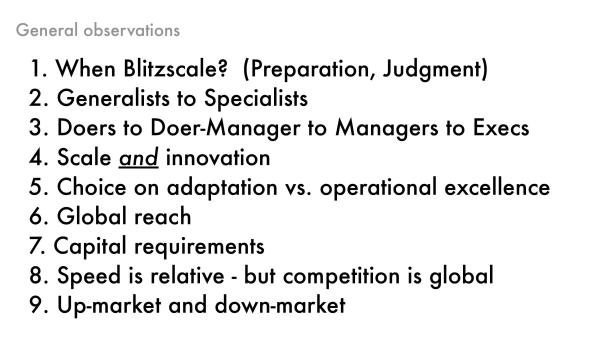

**Blizscale关键点**

1.  When do you Blitzscale? What speed you should be operating at is a judgement call you need to make. 如果你决定现在启动加速引擎，而你的商业模式还没做好准备，其实就是你错过一个机会的方式，那就挂了。不是说不要去做，而是你需要有竞争力的方式去做，作出的准备，判断和快速规模化的实施都非常重要。
2.  从通才到专才。一开始的5人是需要快速学习去做任何事情，规模大了就需要专才在特定领域去高效运作.
3.  三种人在不同的阶段，做事的，管理者，决策者。
4.  创新的延续，不仅仅在创业初期要创新，而是持续创新，比如新产品线，如何高效存数据，新的架构。
5.  保持适应 vs. 精细运营 — 跑得快意味着在运营上的折衷。当时Paypal 每天 2–5% 用户和交易增长—积累了每周2万封邮件。就很多顾客抱怨，然后他们在两个月内就从0到200个客服才支持了他们的业务增长。
6.  全球延伸— LinkedIn 从12个国家开始— 只有真正有需求才去加入新的国家。
7.  资本驱动 —要么有不错收入去投入要么去融资，如何增长并保持烧钱频率，每个交易亏了多少vs如何花钱去赢得市场。

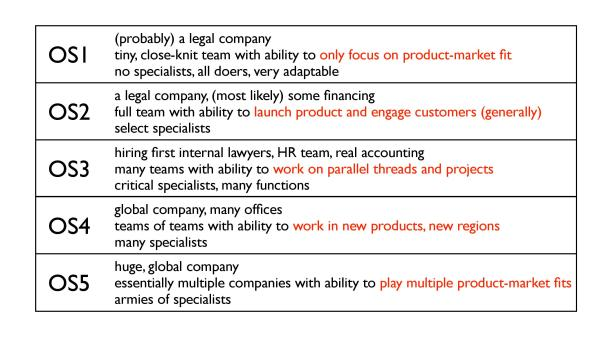

**LinkedIn Example**

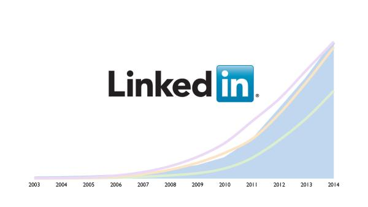

每个经历这些阶段的公司，都已经经历过许多不同的路径。其中一些，我们甚至无法找到类似的对象，也许不同与LinkedIn，但你可能在Workday或其他公司找到对应的。我们分享在LinkedIn经过的各个阶段的故事。

在公司初期，我们在阶段1花了两年时间在探索产品形态，但最后花了12年多，才发展到我们现在4亿用户。但对于Instagram，WhatsApp等公司成长更快。

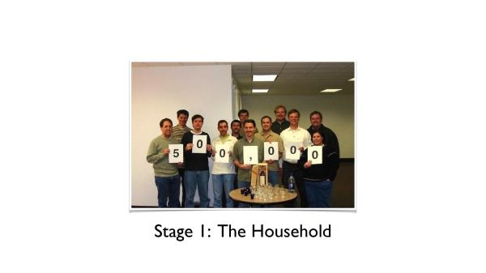

就是从这个照片开始，当我们在用户增长上达到了一个主要节点时，我们就拍照留念。在2002年，2003年，我们讨论一个理念，如果你能够建立一个职业网络，在其中建立各种信誉良好关系，对各种专业人士提供职业帮助。并且设想，当我们拥有一定数量的用户时，人们就会开始使用它来进行搜索。当时雇佣的都是之前的同事，轻量化来管理日常行政。我们每天的所有时间全部努力都是在解决一个问题：对于用户来说，哪些东西是有价值的？

我们在2003年5月发布上线，我们马上就了解到，“产品-市场”匹配实际上对于我们来说意味着什么。上线后招聘人员会立即爱上它，然而，为了达到那个阶段我们需要建立一个临界用户数量，这就是我们第一个阶段所发现的主要内容：关于如何发现这个match。

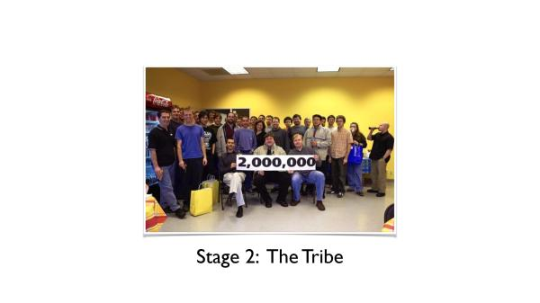

我们必须扩大团队的规模，因为我们已经认识到产品-市场匹配的真正内容。并且，现在我们需要建立最低规模的运营团队，以确保我们能够达到这种匹配。其实是3名共同创始人，在这个阶段，我们从12名员工，扩展到大约30或40名才能够支持正常运营。

我们还加入了一系列新的功能包括客服，增加了销售，也为了完善市场功能。还有，我们增加了最低限度的GNA（日常行政管理职能），以便能够处理诸如支付薪水，管理员工福利等问题，这些都是运营的所必须最基本部门。

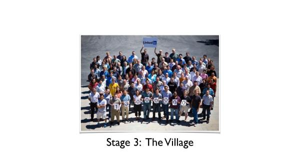

在这个时候，我们拥有1300万用户，我们到了“村庄”这个阶段。到了这个阶段，我们同时做两件事情。我们希望能够利用当前的匹配，做好招聘业务，但是，我们还需要开拓其他的匹配，比如我们与招聘人员匹配非常好，这仅代表大约用户的半数。其实对于每个专业人员来说，获得了一个价值定位。

2007年，我们将组织拆分，我们增加了很多额外的管理职能。我们的研发机构拆分，从1个研发机构扩展到5个。每个研发机构都支持不同的东西，它们或者支持现有业务的发展，或者探索新的项目。这就是我们尝试平衡卓越运营绩效和适应能力的方式，我们确保有5个组，其中1个专注于发展，1个专注于收入，而其他3个专注于价值方面的内容。

是否存在其他“产品-市场匹配”？在120名员工的时候，我们引进了一名首席执行官，Dan Nye他来自Intuit集团，他带来海量的知识建立企业和销售业务，让一个销售部真正运作起来。

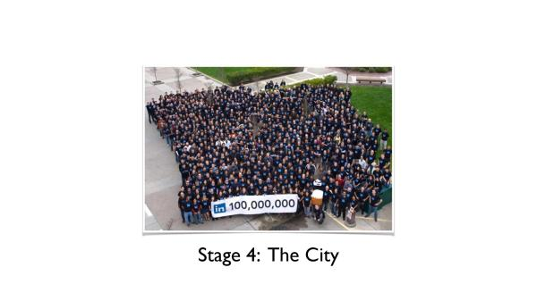

“城市”阶段，在2009年，我们基本开始了快速规模化。要记住规模化是我们的主要瓶颈，如果我们没有强大的网络是不可能驱动这些发展。我们必须引进所有这些人才，在这5条产品线中继续作出努力。但在那个阶段，客户使用我们产品的方式和期望又发生了改变。这时有招聘人员产品，有销售产品，市场营销方案产品，种类繁多。所有这些事情的标准都已经必须提高，我们不得不招人管理这些关系，不得不雇佣销售人员开辟新天地。我们大多数顾客群都来自海外，就开始寻求美国以外区域的发展，引进新的首席执行官担任此任务。

这也是Jeff Weiner，他会在后半程与我们从阶段4进阶到阶段5。Jeff加入我们做的第一件事，就是让我们准备好进行快速规模化。我们未曾做过但很重要的事情是定义我们的公司文化和战略，因为之前规模太小并不需要那样做。当你发展成为大公司时，有不同的管理部门以及行政需求，他规定了所有这些东西，这仍然是现在运营一家公司的方式。目前拥有8,500名员工。在2009年至2014年期间，员工数量基本上每年翻一番。

如果有人曾在创业公司工作很长一段时间，你就知道当使用某个代码库长达6年之久它会变得一团糟。我们面临巨大的技术变革，确保我们拥有过硬的技术平台，因此必须改变我们的技术战略。我们主要需要思考如何发展规模，灵活性、以及开发人员生产力，并仍然需要驱动力加速前进。我们必须改变我们的融资策略，在思考如何能够将需要的所有资金，筹集到一起以便能够并购。这时我们不仅要努力争取新一轮的种子期融资而且还要在2011年进行首次IPO，保证我们做好准备向着目标进行必要的并购。

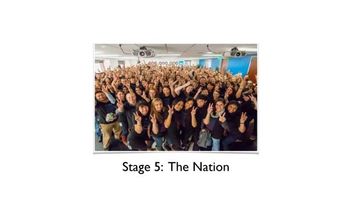

我们达到了3亿用户的节点，这就是我们看到的最大改变。办公室和员工分布在27个国家，在美国境外工作的员工数和境内人数基本相当，目前LinkedIn有8,500名员工，超过20亿美元的收入，在中国有独立运作的公司领英等。

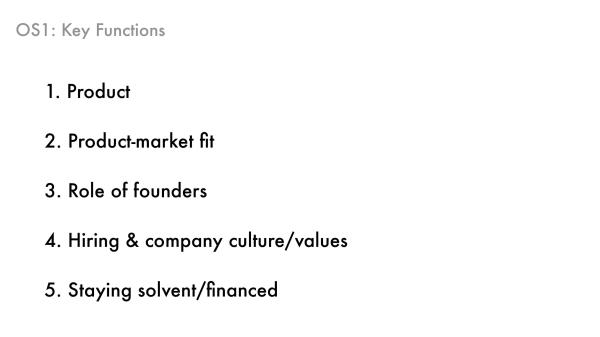

“家庭”阶段是小团队搭建产品并找到市场的适合点。

*   产品足够好？
*   有人在乎这个产品吗？
*   你能招这个人吗？如何说服他们放弃fb，airbnb加入你？

*   你怎么付工资还能保证限流？

当你发展在不同的规模时，并非你解决了哪些问题，而是你没有解决哪些问题。在创业的路上即使是你拥有上千人的规模时依然会有很多救火问题。就像是你回家的时候却后院起火了，但是你需要知道哪种火灾下，你可以回家，哪些你不能。然后把它分类，知道哪些问题需要处理，而哪些可以忽略。Reid很擅长忽视一些不重要的问题，这是优秀企业家的素质。

建立一个公司需要经历很多问题，你不能预先解决问题。例如在“家庭”阶段，你的数据不会成为你成功的关键，让大家关注你的产品比metrics更重要，但进入到“村庄”或到“部落”阶段，则数据很可能会成为一个关键。

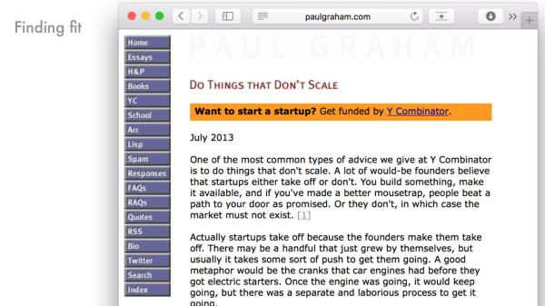

Paul Graham，Y孵化器的创始人，写过《做一些非规模化的事情》，讲到一些朴实做法

*   跟用户沟通面聊
*   打电话

*   为他们下载app
*   告诉他们怎么signup和使用
*   跟100个用户这么做

在过去几年发生了很多变化，你处于一个更好的环境能够处理这个问题。你现在都能够获得现成的产品或服务比如用AWS云服务就部署了app，但那些你必须特别专注的事情，依然非常困难。

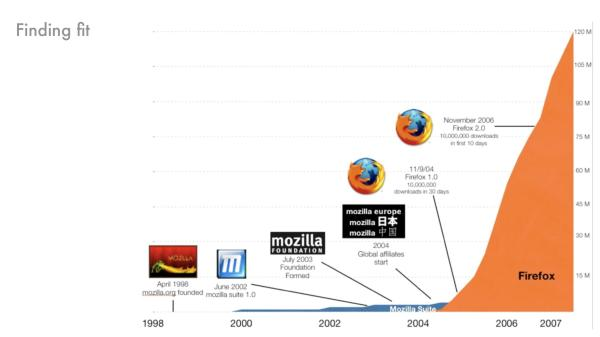

这是Mozilla和我的故事，在左侧时候大家都在四处徘徊，尝试去做他们认为重要的事情，然后开始获得一点吸引力，有些用户关注了，你开始弄明白一些道理，在正确的时候打造好一款快速网络浏览器，并且在接下来3-4年，我们发展到大约4亿用户，不管怎么样，我们会看到类似这样的图表，一开始很慢很慢，然后突然加速。

这就是组织部分的不确定性，市场现状的迷雾。你要决定什么时候用力踩油门。如果在任何错误的时间踩了油门，那是不会起作用的。你可能花了资金，但是那样不会产生什么效果。所以踩下油门则是一个非常难受的事情，并且问题是当你开始快速规模化发展时，所有时间分配都是艰难的，你无法把任何事情做得很好，你所能做的，就是尝试控制好方向和保持平衡。

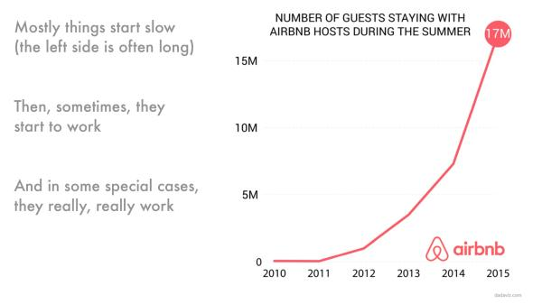

我这里拿Airbnb的图表做比方，在图表的左侧花费了很长的时间，在2010年之前的部分都是平的，同样他们正在积累资本跟动力创建一个社区。到2011年，条件开始成熟，其效益开始变得非常好。

讲一个Airbnb的早期故事

他们在纽约市挨家挨户上门，注册用户名，他们从Craigslist表上获得信息和人们取得联系，然后上门并劝说“你应该到Airbnb上发布。”然后创始人来到人们家里说，“你为什么应该关注我网站的原因”。他们也开始意识到，信任和交易的质量在很大程度上取决与看到的照片喜不喜欢。因此，他会请摄影师去到用户家里拍照。

当你在创业时，你并非在写代码，可能在购买市场营销服务，在面试或雇佣员工。你处于“家庭”阶段时，每周工作100小时甚至120小时。你该如何选择安排好时间，都是为了达到最初的临界数量。你要去了解实际客户是怎么样的，并且去感受他们关心什么东西。然后为你的客户建立模型，在各方面提供帮助，做一些非规模化的东西。可能你以后不会去做Craig在Craigslist的时候的客服工作，但这在开始阶段非常关键。

**提问环节**

- 这些闪电规模化策略在软件行业之外，是否依然同样适用？

第一，这与速度差异相关，你是比你的竞争对手发展得更快吗？快速规模化的关键在于市场现状中的竞争状况下你如何区分速度差异。

第二，软件影响着其他行业比如软件和医药，比如软件和遗传学，其中的软件是差异化的关键部分，它刺激了那个行业中的整个竞争节奏。比如大家对特斯拉那么感兴趣，很大程度并非因为它是一辆电动车，而因为它配备了大量软件，这才是其备受关注的原因。

第三，总有一些与众不同的东西，例如硬件或者医药，必须确保更低的错误率，你能不能以较低的错误率比竞争对手发展得更快一点？而在软件领域经常看到，你可以接受较高的错误率。别人会拿一些即使没有直接竞争的对手来比较，将你的发展基线与他们进行对比，但关键是，你的产品是否卖的足够好？你是否雇佣了足够好的员工？

- 如何对未来和公司下一步发展做判断？

在每种特定情况下，都会有很多判断，这不是纯粹科学理论。

当你无法给出一个路线图的原因是因为作为一个创始人，一名高管，你的工作内容是你去执行各种判断。我们在硅谷这里的所拥有的一个优势就是一个学习的网络。因此，你应该经常去做的一件事，就是和你周围所有经验丰富的人进行交流，并不仅仅是有过此类经验的人，还包括其他经验丰富的人。因为如果这可以让你更容易更好的决定。例如，发展速度应该多快？资本应该有多少？我们是否应该提前还是延后雇佣人员？

- 怎么看待竞争对手？

实际上不要太过于关注你的竞争对手。聪明的创始人、聪明的高管，聪明的投资者所做的事情是说你是否会拥有市场机会？你是否发展得足够快去抓住机会？你是否建立了一个坚固持久的基础？关于竞争的关键问题是，如果在你前面别人获得了市场机会，那你很显然无法获得该机会。

当你接触到非正面的竞争对手时，你应该思考的问题是：你如何建立某种东西其会随着时间慢慢积累，而不是能以非常快的速度达到那个阶段，并且发展得很强大。

LinkedIn的故事中有一个例子，在发展的早期，根本就没有怎么关注竞争。其原因是，我们当时所关注的事情是让我们彻底完全赢得市场的事情，因此，如果我们能够在一个地方聚集最大数量的专业人员，竞争其实就不那么重要了。我们当时就着眼于这些东西，让我们不会分心继续发展，最后获得成功。人们所寻找的是，你是否在建立某些基础，而这些基础将为你提供必要的资本帮助你彻底占领市场。LinkedIn早期的对手中，绝大多数公司已经消失了，他们当时都在专注于推销他们的公司。

**下一期嘉宾**

> Sam Altman 是大名鼎鼎的[Y Combinator](http://link.zhihu.com/?target=http%3A//www.36kr.com/p/96364.html) 的当家，他曾是 YC 录用的首批创业者之一，他经营着自己的超高人气的[博客](http://link.zhihu.com/?target=http%3A//blog.samaltman.com/)，他是 Stanford 计算机系的辍学生，他是被 Green Dot 以 4300 万美元收购的位置服务商 Loopt 的创始人，他是天使投资人，还要命的是，他才30 岁。

[http://36kr.com/p/210546.html](http://link.zhihu.com/?target=http%3A//36kr.com/p/210546.html)

最后的阅读材料

1.  [Do things that don’t scale](http://link.zhihu.com/?target=http%3A//paulgraham.com/ds.html)
2.  [Startup Advice, Briefly](http://link.zhihu.com/?target=http%3A//blog.samaltman.com/startup-advice-briefly)
3.  [Why Silicon Valley Works](http://link.zhihu.com/?target=http%3A//blog.samaltman.com/why-silicon-valley-works)

**本专栏为我的个人专栏，所有观点均为个人观点。如欲转载，请注明出处。如果文章有任何错误或是遗漏，欢迎指正。此外，本文部分图片与内容来自Grey Lock Partners与LinkedIn公开发表的博客与幻灯片，所有参考链接如下**。

[里德·霍夫曼_百度百科](http://link.zhihu.com/?target=http%3A//baike.baidu.com/view/10624259.htm)

[LinkedIn联合创始人Allen Blue：初创产品，买用户不如试试Growth Hacking](http://link.zhihu.com/?target=http%3A//chuansong.me/n/1717994)

[LinkedIn's Series B Pitch to Greylock: Pitch Advice for Entrepreneurs](http://link.zhihu.com/?target=http%3A//reidhoffman.org/linkedin-pitch-to-greylock/)

[https://www.linkedin.com/pulse/cs183c-technology-enabled-blitzscaling-visible-secret-reid-hoffman](http://link.zhihu.com/?target=https%3A//www.linkedin.com/pulse/cs183c-technology-enabled-blitzscaling-visible-secret-reid-hoffman)

[http://www.slideshare.net/greylockpartners/stanford-cs183c-blitzscaling-lecture-1](http://link.zhihu.com/?target=http%3A//www.slideshare.net/greylockpartners/stanford-cs183c-blitzscaling-lecture-1)

[Class 1 Notes Essay](http://link.zhihu.com/?target=https%3A//medium.com/notes-essays-cs183c-technology-enabled-blitzscalin/reid-hoffman-john-lilly-and-allen-blue-s-cs183c-technology-enabled-blitzscaling-class-1-notes-a93b119a51b9)