# 12: Nextdoor

来源：[https://zhuanlan.zhihu.com/p/20359962](https://zhuanlan.zhihu.com/p/20359962)

本次课程主要Nirav分享了自己创业的心路历程，讲解了如何在Nextdoor创业中实现了技术驱动的闪电式扩张。Nextdoor是一个邻居的社交网络独角兽。

主讲人Nirav Tolia

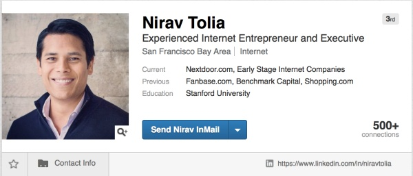

Nirav Tolia : 斯坦福大学英语专业，雅虎早期前70名员工之一(1996年)，在雅虎股票一路飙升的过程中选择离开，相继创办了[http://Epinions.com](https://link.zhihu.com/?target=http%3A//Epinions.com) , RoundZero, [http://Fanbase.com](https://link.zhihu.com/?target=http%3A//Fanbase.com) 和 [http://Nextdoor.com](https://link.zhihu.com/?target=http%3A//Nextdoor.com)

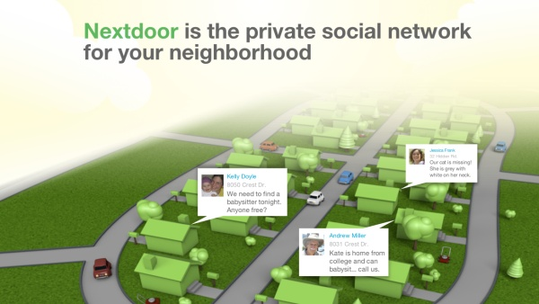

在Cruchbase上，Nextdoor被记录着于2015年3月日完成了1.1亿美金的D轮融资

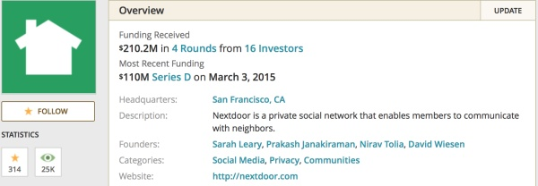

_Q: Nextdoor是怎么开始的？_

A: 我正在运行的公司叫Nextdoor，一个邻里的社交网络，是我们一个事业上的一个转型(Pivot)。我之前做的公司是Fanbase，一家体育公司。大约2年之后我们感觉那个愿景可能没法实现，至少不是通过我们的产品。我们的第一冲动就是把钱还给投资者，我们已经精疲力尽。从精神上，我们完全被打败了。

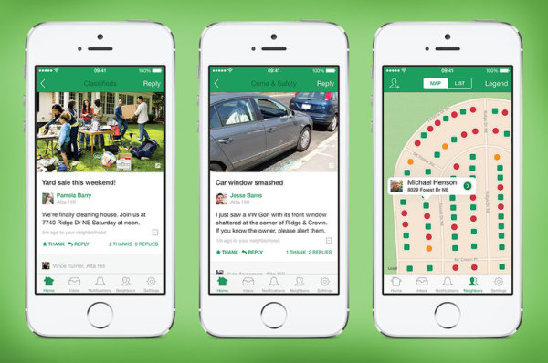

我很幸运地获得了Benchmark Capital，还有比尔·格利(Bill Gurley)的资助。从1999年起我就与比尔合作，在这一点上我曾与比尔合作了近十年。我们在2008年创立Fanbase，这是我们第二次合作，所以我有很高的支持度。**你正在把生命的110%投入到事业中。当不运转时，首先你说这只是创业的辛劳，这只是本来要付出的。但后来当你意识到你的一些核心假设是错误时，就有遭报应的日子。**

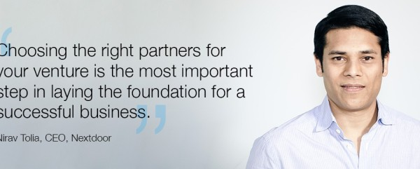

我打电话给比尔，我们见一下，我想你知道事情进展不顺利，我们在旧金山进行早餐会面。他给我带来了一首诗，那首诗是拉迪亚德·吉卜林（Rudyard Kipling）写的“如果”，**这实质上是一首成为一个男人，或者成为一个成年人的诗。他给我这首诗的暗示是，你真的愿意在这里退出，或者是你更加努力，给这加把劲？所以从根本上说，他挑战了我的男子汉气概。这是风险投资家让一个企业家回到既艰苦又累人的工作环境的一种有效的方式。**

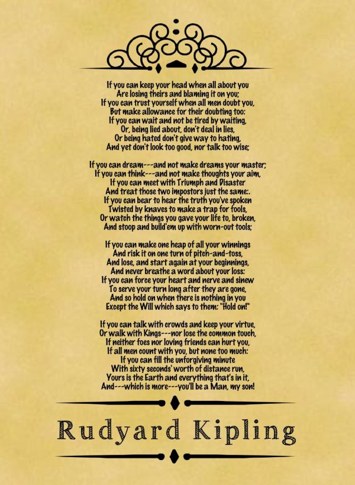

在2010年夏天，我们尝试了各种不同的想法，最终，Nextdoor从中诞生。那是在五年前，这是非常谦虚的开始。这是一个以另一个想法的失败为特征的开始。我们感到非常幸运，我们的产品今天由50％以上美国的社区使用，我们已经募集了200万美元的资金，我们一年前的上一轮融资，估值超过十亿美元，所以它没有以正统的方式启动，它开始并不顺利，但我们现在已经走上正轨了。

_Q：我记得我第一次见到你是在1998-1999年，那是你正在运行RoundZero,那是怎样的一段经历？_

A：我没有野心从事技术工作。我的父母都是医生，我总是以为我会像我的父母一样成为一个医生。我之所以花了我的整个职业生涯从事和运行消费类互联网公司的原因，很大程度是因为斯坦福大学。

我很幸运地成为雅虎的一个早期员工，我是那里的70名员工之一。那是令人难以置信的经历，我不知道我在做什么，我没有培训。但在早期阶段，看着雅虎和其他公司的成功，我开始想，也许我可以成为一个企业家，硅谷在催化创业，甚至回到那时，它在催化创业。

当然现在，每一天都在发生。

我的一个同事和我，我们都对成立公司感兴趣。我们通过网络认识想在硅谷开公司的人，我们只是4或者5个朋友一起吃了顿饭就开始了，谈论创业思想和经验，彼此热烈地交换意见。

在雅虎几年后，看到员工数量从70人增长到超过3000人，的确体验了一生的历程。加上运行Round Zero我感觉，是时候了。即使在1999年，雅虎绝对是茁壮成长的，股票也在其最高点之一，很多人认为那时我离开是个笨蛋。

后来，我们创立了这个叫Epinions的公司。这是Naval的主意，其实不是我的主意，这是一个非常棒的，绝妙的主意。首先，在亚马逊出现之前，有一种老出版物，你们可能都不知道，叫作客户报告，那是大多数人在他们购买产品前获得其数据的地方。然后，亚马逊出现了，说，你知道什么，倾听实际客户的意见才是好的。因此，Naval 有了这个绝妙的主意，就是建立一种市场或者平台，对产品有专业知识的或有产品体验的人，可以在那里写关于他们喜爱和讨厌的产品的评论，寻找信息的购物者可以去这个平台，并获得他们需要的信息以做出更好的购物决定。

最初，它是互联网泡沫的幸存者，相对来说，它创立得很快。实际上，我们在《纽约时报》杂志上发表一篇名为《[InstantCompany](https://link.zhihu.com/?target=http%3A//www.nytimes.com/1999/07/11/magazine/instant-company.html%3Fpagewanted%3Dall)》得文章，是关于Epinions在开始阶段如何快速地扩张。因此，甚至在这个术语出来之前，我们就进行了闪电式的扩张。它可能扩张得有点太快了，在某个时间，我们有超过100个员工，接着，互联网繁荣和萧条发生，我们也跟着失败了。我们不得不把公司缩小到20 人以下，因此它繁荣过，萧条过。然后，一点一点地，通过几年时间里非常非常辛苦的工作，它发展得相对成功。最终与一家总部在纽约的公司DealTime合并，整个公司重新命名品牌为Shopping.com，在2004年上市，然后2005年由Ebay超过6亿现金收购。

我将说几样关于我们看到的速度和现象的东西，两个东西。第一是，有几乎是隔夜成功的公司，举个例子，Instagram。Instagram，几乎即时获得很好的认同，几乎马上成为应用程序商店里的顶级应用程序。

但是另一个东西是速度，快速上升意味着快速下降。那种流行性，它们衰落的速度与它们上升的速度一样快。具体的说，是Facebook上的游戏。它们很快变成流行或者热门，但是很快消费者热情就又退散了。

学生Q：如果有另一个萧条周期，你认为需要缩小他们的公司的过程中，创始人最有可能搞砸的事情是什么？

A:我不知道会不会有另一次萧条周期，但我的确非常相信循环。我认为，**我们这次犯的最大的错误可能是，我们再一次把想法的绝妙程度 与 市场的真实价值相混淆。**我觉得很多被风投投资的生意，实质上是现金流企业。它们不是糟糕的企业，但它们不是很好的风险投资的企业。尤其当实际市场是一个1亿美元的市场，但我以1亿美元的估价募集资金，而我需要达到10亿，你开始做很多不自然的事情。

除非这里有一个网络效应（Network Effect , 是一个当一个用户使用某种产品或服务，可以给总体带来价值的效应。比如电话，Facebook，Twitter），否则借助资本来获得用户，其实是一件错误的事。

一般地，创始人和CEO们要思考的是运营公司有正确的道路，那种方式在一个繁荣周期或一个萧条周期中不会改变得那么多。你在萧条中所做的很多事情也是在繁荣期中要做的很好的事情，我认为这是公司能在萧条中生存的原因，这是他们学到的东西。

_Q：讲一讲Nextdoor_

A：我先讲一讲产品。当我们有很好的社交网络来连接朋友/同事的时候，并没有一个很好的社交网络来连接邻居。朋友是Facebook,我感兴趣的人是Twitter，同事是LinkedIn。

因为你的社区其实是斯坦福大学，所以，Facebook是一个完美的应用程序，或类似的，Instagram，Snapchat，在校园中使用的任何类似的东西。但一旦你离开斯坦福，你搬到新的地方，你不会认识你周围的人。

当我们在2010年创立公司时，我们真的被这个统计震惊了，28%的美国人叫不出一个邻居的姓名。这跟我和约翰从小在得克萨斯长大的环境很不一样，我们不一定与我们的邻居是最好的朋友，但我们当然认识他们，我们也依赖他们。

当我思考我的两个年幼的儿子，两个都是3岁以下，我不想他们在这样一个世界里长大，就是他们有联系的大多数朋友都是虚拟地。在Facebook，或通过Twitter联系的，他们从来没见过的人。我想他们感觉他们在社区中有根，所以，那是公司的前提，这是一个相当明显的前提，但完全未经过验证，因为人们已经失去与邻居们的联系。

现在我们已经是5年之后了，我们有超过8万社区使用Nextdoor，大约为50%。我们认为，在美国有165,000个社区，那些社区的中等规模是大约700户。我们在美国主要的40座城市有超过90%的社区在使用Nextdoor。

有趣的是，它还不是隔夜成功。它是一条很长的，艰难的路，但它开始变得更有成效，更成功。

但基本的概念是当我们创立该公司时，我们当时在做Fanbase。我们当时的雄心是是否可以创建自下而上的社区，创建ESPN的竞争对手，我们没有实现。

但当我们创立Nextdoor时，我们对我们的长期愿景的野心可能比现在小得多，因为我们才刚摆脱失败。我们非常关注的是我们能不能只让Nextdoor在很小的一个社区里面运行。

在2013年-2015期间，我们实现了指数级别的增长。因此，从指标的角度看，这是闪电式扩张。

**这就是约翰最喜欢的名言：Do things that don’t scale at the beginning, and if you get the things right, you can achieve great things.**

我们在2013年，美国市场仅仅有176个社区加入了Nextdoor。我们花了整整一年的时间，获得了176个社区。我的联合创始人和我，我们与大多数创立每一个这些社区的人交谈。在Nextdoor上创立一个社区，你必须输入你的地址，你必须划出社区的界限，你必须给社区命名，然后，在一段时期里，14到21天，你必须让9个邻居加入，所有人都验证过他们的地址。因此，创立一个社区不是一件简单的事。如果你想想，28%的美国人不认识一个邻居，我们寻找认识至少9个其他邻居的邻居。那就是我们如何创建该临界规模。这要花我们一整年的时间来获得176个社区，我们知道在国家中有165,000社区，我们要花多少年来渗透？它要花费我们一辈子的时间，对不对。但我们关注不同的东西，我们关注质量，这对于我们来说，是非常非常重要的。

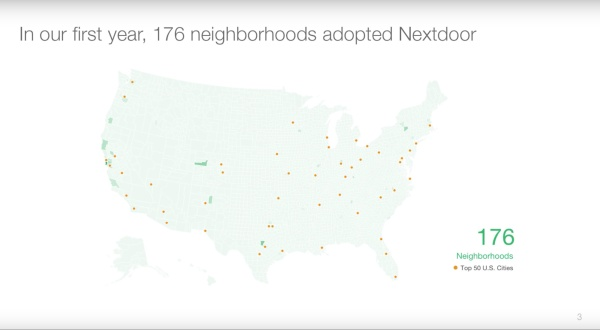

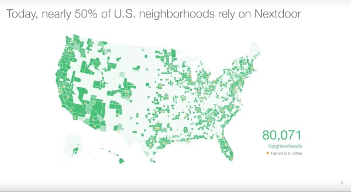

我们在这里有一个很有趣的分支，就是我们是不是想像Twitter一样，你把任意地址放进去然后你就可以看到任意社区的谈话。另外一种就是像Facebook，你必须是大学的一部分。比如我必须要用斯坦福校友的邮箱，去注册[http://Standford.facebook.com](https://link.zhihu.com/?target=http%3A//Standford.facebook.com)。我们后来决定-每一个社区会有独立的边界和名字。

当你第一次与某人在party见面，你会说什么？你可能会说你认识谁，那是Facebook的方式。然后你说你是做什么行业的，那是LinkedIn的方式。但是当你是大学的大一新生时，你会问别人”你来自哪里”我们认为这种身份的认同感是很重要的。

这是我们所做的最艰难的决定，一个是，社区界限没有客观的百科全书。我们需要创建一个Wikipedia类型的系统，然而，我们会让社区创建一系列的界限，这是很困难的。第二，我们将私下进行对话，除非你在社区里生活，每个加入Nextdoor的人都必须验证他们生活的地方。非常有悖常理，人们谈到减少用户使用产品的阻碍，我们增加阻碍。

_学生Q：你是如何找到这些如此融入到他们的社区的人的？_

A：我们从询问我们所有的朋友开始，我们一开始做的是不会规模化的事。我们问是否可以发送你的驾照给我。或者，我们是否可以获得业主协会的花名册，逐一检查。所有这些东西都是我们完全手动做的，我们卷起袖子干，那是很繁琐的工作，绝对不会是可扩展的，我们知道。我们只是在噪音中寻找信号，然后系统地用技术来让事情自动化。

早期的时候，我的联合创始人Sarah会打电话给已经开始的这些社区，这些社区只有5个人，她会打电话给那个人，让他邀请更多的人。

我们一开始寻找信号，然后开始考虑规模化的事情。

我们今天还在做相同的事情，我们把员工分到不同的产品团队里面。我们有设计师，产品经理，5/6个工程师，1个分析师，让他们尝试模拟Nextdoor在早期的样子，做一些不会规模化的东西。举个例子，最近我们在Nextdoor启动一个功能，就是按需寻找保姆。当我们试用这个时，这个我们已经在帕洛阿尔托和几个其他社区中试用，我们让团队成员走遍帕洛阿尔托，试着找到保姆来注册该服务。很明显，这不是我们长期这样做的方式，我们可以测试需求的程度，需求和供应相比配。

我们从中学到的一个经验就是Nextdoor不是一个硅谷现象，是可以被拓展到美国其他地方的。

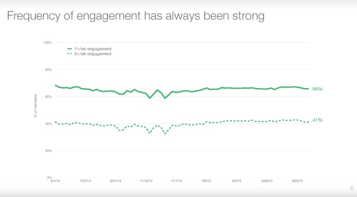

我们吸引用户程度一直很高：41%的会员每隔一个星期至少使用Nextdoor 3次以上。直到用户真的被吸引到我们的产品之前，我们都没有考虑规模化我们的服务。这就是谷歌所谓的牙刷测试(Toothbrush test) - 你能不能生产出一种产品让消费者每天都需要使用？

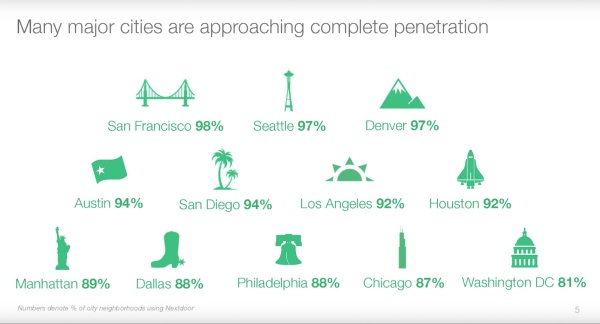

_学生Q：倒回去一点，你怎么知道这176个社区是能够代表美国所有社区的？_

A：我们努力试图得到地理多样性，社会经济多样性的横截面，我们想要农村和城市和郊区，我们想要老年人和年轻人。相当有趣的是，使用案例的确具有社区之间的差异。

在一些社区中，人们寻找保姆。在旧金山的Marina，很多人从斯坦福大学毕业后去的地方，没人寻找保姆，但他们的确想要知道在星期五晚上发生了什么。在佛罗里达州的老年人社区，有想做桥牌夜晚活动和单人棋牌戏夜晚活动的邻居,以及类似的东西，那么对话就不同，但参与的质量和与我周围的人联系的基本人性需求，是难以置信的一致。

另外我们从一个失败的企业脱离，对于我们自己持怀疑态度。我们第一个社区在Menlo Park，任何东西在门洛帕克都能运作，因此那时我们去了Portola Valley，好吧，看来Portola Valley也行。因此我们说，让我们逼迫我们自己走出加州，因此我们去了西雅图。然后在西雅图运作起来了，我们说，好吧，可能这仍然是技术的事情。最终，我们在那首个175个社区中走向纽约Hamilton，这是不同于我们所生活过的社区的一个社区。在Hamilton有人会问，我丢失了我的牛，我的牛正在社区周围游荡，如果你们看见了我的牛，是否有邻居可以告诉我。

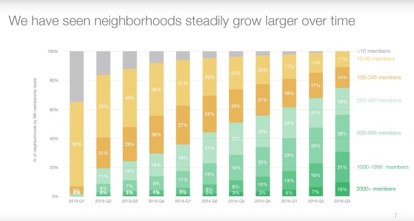

我认为，**有时失败可能是非常非常有力的激励工具，几乎总是。我们有这种内心的恐惧，这是不是真的凑效了，是不是真的凑效了？**第一个夏天，我说如果我们达到100个社区，我们把一辆点心车带到公司，给每个人发点心，我们会称之为点心100。我们的工程师像我疯了一样看着我，我们绝不会在90天内得到100个社区，那是疯狂的！

**我们每天都在努力，每一天，我们得到一些积极的数据点，并且我们将一直前行，我们为这样的事实感到鼓舞。”千里之行，始于足下“，我们想要每天被世界上每个社区里的邻居使用。**

John: 你讲的这个故事，它提醒了我，我非常非常喜爱的东西在硅谷的任何人都曾经说过，**这是Andy Grove 的名言“像你是正确一样战斗，并像你错误的那样倾听。”（Fight like you’re right, listen like you’re wrong.）他的意思是他想要每个人都得出正确的强烈的产品观，他想要他们持续到寻找数据来弄清楚。**

像种一颗树，头几年你种一棵树，你什么都看不到。但是如果你去Muir树林，你看到一些难以置信的树，那些树已经存在很长时间。

我们看见的很多企业是跑步机企业。**每天早上你醒来，你会在跑步机上跑步。你累积的那些公里数，你旅行的那些距离，你没有得到它明天的任何积分。那只是有一天，你做你所能做的一切，然后下一天，你已再次赚得全部。随着时间的推移累计价值的非常好的网络企业，它不是一个跑步机企业。你走的每一步都是为整体增加递增的价值。**

学生Q:那么，一旦人们在平台上建立了联系，你如何把他们留住?

A: 我们已经相当幸运。当你有一个这样的平台，所有用户的一般水平是40%的用户每隔几天使用该平台。在核心参与中有如此有力的东西，能够理解你的社区中发生的事情，并且确实没有替代。我们的产品非常粗糙，不是非常精致的产品，原因是，我们其实不是一个产品公司，我们是一个社区公司，因此我们侧重的东西，我们创建的东西，我们一直念念不忘的东西，是社区，并且社区是我们有8万个社区的原因。服务于那些社区的产品，有很多积极方面，非常多积极方面。所有我们必须要做的是看看拥有最大渗透率的社区，以看到比41%高得多的比率。关键是让所有社区像最佳的社区一样。

学生Q：你们最大的增长瓶颈是什么，你如何弄清楚它们是什么？

A：我们有一个核心的增长瓶颈，同时也是我们的机会。因为美国人不认识他们的邻居，他们没有邀请他们的邻居的机制。因为如果他们的确认识他们的邻居，那么Nextdoor就没有理由存在。

如果思考一下Snapchat，以及Snapchat的增长，我们也思考Instagram的增长，社交图(Social Graph)是Facebook没有垄断的东西。我们所有有手机的人都在我们的手机上携带我们自己的社交图，其实对于Facebook不是独有的。因此，当一个新的服务开始时，如果它是依赖于你的朋友的服务，你通常可以点击一个按钮，砰，整个东西就定下来了。

对于我们挨个社区进行并让整体居住，没有简单的途径。我们必须找到认识两个邻居的邻居，并且那两个邻居认识两个邻居，因此我们就是有计划有步骤地按那种方式增长。我们通过在早期作出我们的对话是私密的决策，加速或增强我们的增长问题，因此那意味着没有SEO，没有社会分享，因此Nextdoor的病毒传播和可发现性，这两样东西都被严重阻碍。我们实际上在两个案例中做了相反的事情。

那么，我们如何与那些东西斗争？我们做了一些相当独特的事情。在邀请方面，我们有许多会员，我们增长的主要方式是，邻居邀请他们的邻居参加到服务中，但是如果他们不认识他们的邻居，他们不知道他们的电子邮件地址，他们如何做？我们付给他们报酬，让他们看他们邻居的地图，点击他们想邀请的房子，然后我们将代表他们发出明信片。

我们今年将发送价值数百万美元的明信片，我认为一天大约20至25000张明信片之间。

Q：不同社区附近的邻居，或者有人住在社区的交界怎么办？

A：如果我住在旧金山，你住在Palo Alto，没有理由让我邀请你到Nextdoor， 因为我们绝不会交流。但可能如果我们可以以某种方式把Palo Alto，与Menlo Park联系在一起，因为有一些对话，在Palo Alto的邻居和在Menlo Park的邻居可能想拥有分类广告，我们让你与其他社区的大约1万个最接近的家庭交流。那些可能是邻近的社区，就在你的边界上，或者他们可能不是就在你的边界上，但离你非常近。

举个例子，如果你丢失了一条狗，你想告诉你的邻居，你丢失了一条狗，你的狗不知道，它现在正离开你的社区，因此，没别的人将能够找到他，因为他将去那边的下一个社区。我们有很多人说，如果我可以与更广泛的人群交流，该服务的实用性会更好。

在Nextdoor上第一个使用案例是，一个保姆，或者一个画家，或者一个承包商，一个医生，牙医，等等，那是我们一天1100万或1200万万条信息的26%。在你获得邻居的第一个回复之前，那些通常有大约15-20分钟。在24小时的时间里，你通常将获得5.5 个回复。那相当令人难以置信，如果你想想这个问题，有一个平台，你可以向你的邻居要一个服务提供商，并在半个小时内，你会得到一个答案，在接下来23个半小时里，你会再得到4个。那是相当强大的，但我么需要增加可以回应提问的人员的密度，那是邻近社区所作的事情。

学生Q：你怎么看待收入的？

A：在早期，在我们创立公司时，我非常依赖里德提供意见，因为他已经创建了这样的东西，或者我们渴望得到的东西，以跟随那个步伐，他说，我考虑的一个方法是，你创建用户规模，你创建使用规模，然后你创建收入规模。每个问题，增长，参与，货币化，每个问题都很困难。**解决它们的唯一方法是，把它们分成连续的步骤。**

**你要做的第一件事是你找出一个理由，让人们简单地加入。一旦你想通了这一点，你就可以进入在人们加入后留在服务上并使用它的理由，一旦你想通了这一点，那么你就可以转到货币化。**

这实际上是Twitter和Facebook都遵循的道路，我觉得这两家公司开始真正赚钱之前，很可能是花了四到六年，而这也正是我们今天所在的位置。对我们来说，2016年是一个非常重要的一年，是我们货币化的一年。

_学生Q：你能从CraigList中学到什么？_

A：**我认为交易市场通常是由产品流动性驱动的，而不是产品体验。(Marketplaces are driven by liquidity, not the product experience)**

当上千个公司都试图把CraigList干掉，为什么Craigslist还存在。从肤浅的角度来看，它并没有移动应用程序非常适合Craigslist，它本质上不是为移动领域，你可以在出色的产品看到的所有这些东西而创建的。我认为，最终，你去卖家所在的地方购买东西，并且你去买家所在的地方卖东西，Craigslist仍然紧紧抓住几个类别，如房地产和私人广告和其他仍然是最佳的交易市场的领域。

但我们对此有一个稍微不同的看法，因为Craigslist是一个这样的市场，你可以匿名去那里，你可以匿名买卖。那不是Nextdoor运作的方式。Nextdoor，你要确认您的地址，你必须输入你的真实名字。

我想，对于那些追随Craigslist其他初创公司，它不是关于创建漂亮的UI，它是关于让这些用户改变消费习惯，这是非常，非常困难的事情。

JL：交易市场都是关于交易是否清算。如果你把一些东西挂牌出售，你要确保它出售，没有人有像Craigslist的产品流动性，击败他们是困难的。

_学生Q：你在2012，2013，2014的年度目标是什么？_

**A：在任何特定时间，你在一个公司中有五项目标。增长，参与，货币化，基础设施，人。你要搞清楚，在任何既定时间点，这五个目标各部分的规模是什么。**

这可能会变得很快，你可能从几乎不需要在基础设施投资，到需要花很多钱在基础设施方面。在公司成立初期，想想2010- 2011年，我们没有做年度计划，这只是没有任何意义。我们每周实质上让初创企业思考，什么是我们这个星期试图完成的。我们居然把出奇的少的资源投入到参与，因为在第一个实例中，2011年，我们花了大量的时间，176社区，我们不是集中在增长，我们的重点是参与。第二年，2012年，更多的是增长。

2013都是关于我们的增长，我们已经长期没有对货币化投入任何百分比的资源，现在我们将要到达那里。2014年，我们需要实际投资该服务，因为它开始落泊。

在这些五件事情，什么需要增加力度，什么需要降低力度。事业本身变得更大，因为你募集更多的钱，你雇佣更多的人，你有更多的资源，假设事情进展顺利，但最终，这是我相信我们可以控制的5个按钮。

2016年，我们当然要去相当多的增加货币化的力度，在2016年的增长对我们来说是关于国际扩张，所以我们不一定增速回落，但我们引导它朝着不同的市场扩张，至少我们至今还是在美国。有趣的是，在我们有的50或60名工程师中，在任何时候30％专门用于基础设施建设，就是我们所说的核心工程。

现在我们正处在一个点，我刚刚聘请了一位人力资源的很出色的CEO，我们再次要增加我们对人投资的力度，她告诉我的一个的事情是，我们做这个2016年的规划，这是可以的，但更大的规划是什么？2017年结束时我们在哪里？2018年结束时我们在哪里？而干了这么久，我想，我可以勉强跟踪下一季度会发生什么。我不敢去想明年。但后来我开始意识到在我们这个阶段去思考2017年，是如此重要的原因。甚至除此之外，如果我们不设置大目标再倒推，我们可能不会选择在2016年做的正确的事情。随着时间的推移会发生什么情况，你有更多的人参与进来，这就是那种显而易见的，我们努力创造真正的行动的自下而上的规划。

学生Q：你从Bill Campbell身上学到了什么？

注：Bill Campbell - 硅谷教练，辅导过 Jeff Bezos

，Steve Jobs和Eric Schmidt，现任Intuit董事长，曾任哥伦比亚大学橄榄球队教练，苹果市场部副总裁。

A: 我很幸运在我的团队里有一个叫Bill Campbell的人，是我的CEO教练，而且他可能是最不可思议的导师，顾问，教练，管理人员，在硅谷的这类专家。事实上，当他执教我，他还执教Steve Jobs和谷歌的Eric Schmidt以及Jeff Bezos，他会来拜访我。我会开玩笑说，轮到屌丝团队了，对不对？因为他是与真正的CEO在一起，现在他得和我一起讨论。对于我来说，他就像一个商业父亲。我从他身上学到的无数好的东西已经在使用，但是所有我已经做了的不好的事情，他没有因为任何那些事情而责怪我。

他们有一组核心价值，第一个就是关于人。

所以，我从比尔学到的第一个，也可能是最重要的事情，是这都是关于人。

我们正在建设的这些东西，这些公司，这些产品，这些商家，这一切都归结到人才。让有才华的人在一个房间里，并确保他们一致，让团队合作。然后指着山，大家一起拿下这座山。那是他特别擅长的，他在他自己的公司里做到了，而他帮助许多令人难以置信的公司做同样的事情。

JL: 他没有上过很多学，他是一个在幕后的人，但他可能是最好的导师，世界上最好的导师之一。他真正的特别之处，是他能给你具体情境的指导，但他也认识到你是和Eric Schmidt是不一样的人，跟Steve不一样的人，我认为他教导，他看到了你的天才，他提出意见，并围绕你是谁进行展开。

他有三个不可思议的和独特的技能。

第一，他本身就是一个令人难以置信的领导者。他的直觉是令人难以置信的，他是人们想跟随的人。他总是告诉我，你的职衔不让你成为一个领导者，你的人让你成为领导者。作为一个领导者是关于成为人们会追随的人，他是人们会追随的人。所以，你要来吸收尽可能多的人才。

第二个技能是，他作为CEO的实战经验。他不是大学的教授，他不是一个管理咨询师，那种只帮助几个人但是自己从来没做过决定。他做过很多决定，卷起袖子做过很多事情，而且干得非常的好。他知道并同情你作为一个CEO，或者一个管理团队成员必须做的一切。

第三个技能是，他看到了整个行业的历史。想想他帮助的公司，苹果，谷歌，亚马逊。我不认为有任何人像他一样，不可能。

_学生Q:你们送的明信片的转化率是多少？_

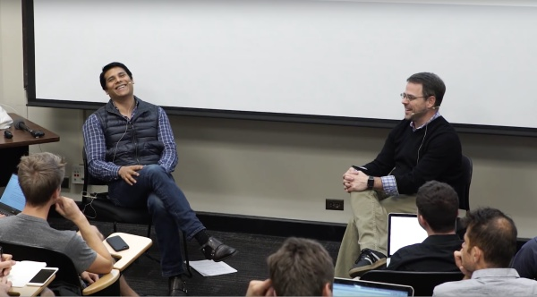

A: （笑）让我们回到增长。他们不会让我透露数字，但我要说的是，它并不如我们希望它是那么高，但特别是在2015年，我们已经能够显著增加转化率，然后让我们送出更多的明信片，因为我们在关注每行动成本(Cost per acquision) 和转换率的相互关系。所以，有关明信片，我们是非常具有战略意义。关于我们是战略性的方面，我给你两个向量。

第一个是，我们不给每个社区相同数量的明信片，如果一个社区拥有2000个会员，该社区作为一个整体得到很少明信片，因为它并不需要它们。但是，如果一个社区是试图达到10，我们可以给那些早期的创立社区的人100张明信片。事实上，前进到2016年，我认为我们的大多数明信片将去有少于50个会员的社区。我们知道，所有的数据表明，超过50人的社区，它们会自己增长。

第二个向量，有趣的是，我们现在已经建立奖励制度。其中你作为一个个人得到的明信片，是由你在过去发送过的明信片的接受数量驱动的。如果我们给你10张明信片，并且你把它们送出去，你的邻居中有五个意见参加，你会得到更多。但是，如果我们给你10张明信片，并且你把它们送出去，你的邻居没有一个加入，你可能不会得到任何更多的明信片。这样做是按月的，看数据，它实际上非常有趣的，因为该月的第一天，在发出的明信片里我们有这个巨大的尖峰，因为实质上有人，他们非常希望它们的Nextdoor社区得到渗透，他们正在等待，直到午夜的钟声在每月的第一天敲响，然后他们将所有的明信片发出。

Q: 针对预货币化服务，你如何找出什么是合理的每行动成本？（How do you figure out what’s reasonable Cost per acquision for pre-mometazation service ?）

A: 你必须有一些假设，你能这些人身上挣多少钱。在另一方面，我只是假设说这些明信片，CPA最终成为了一块钱，因此是一块钱让我们用明信片来获取成员。在合理的时间里，我们应该能够在生成每个会员身上获得一块钱，我们已经重新获得了流失会员，并且我们重新获得了任何其他的东西。我想对我们来说，这是思考价值获取的结合，但它也是一个价值创造的结合，这是，为什么值得我们去拥有已经启动了的8万个社区，我们会为之付出多少代价？我们以若干不同的方式思考这个问题，但因为，作为一个管理团队，我们许多人让人们下岗，我们都格外注意我们的资金，格外注意，我们必须这样。

我会告诉你在一般情况下，作为一个CEO，我能接受用于测试假设的支出。如果失败了，没有问题，因为你不必重新做。其中，我很警惕在我陷入长期过度开支的地方花钱，没有任何终点。当你雇人时，你给这个人工作，如果工作完成了你希望那个人尽可能长时间地与公司的合作。但是如果你决定做一个测试，我们给一些小组两次明信片，我们看到发生了什么，我们测量转换率，我们下个月不必这样做。

增加你的负担的结构性的东西是很危险的。非常危险。长期租赁，办公空间。办公室租赁是可怕的，它们是可怕的。事实上，在今天，我已经签的过去三年租约，已经转租，它们值更多一点钱但它们不是长期的，而我不知道如何预测公司的规模及其在三年时间需要的办公面积。我不能，因为如果事情进展顺利，我们应该大很多，我愿意支付更多面积。不要把自己锁进12年的承诺，在美国旧金山，现在，业主都在寻找12年的承诺。而他们找到了，他们找到了，数学很好的人在使用它，他们说，好了，有这样一个需要办公空间的巨大的需求，即使我在三年内在这样的空间之外发展，我会找别人从我转租的。有两个问题，一个是，如果他们收缩，并且他们自己本身不需要空间。第二，如果整个市场收缩，该需求会萎缩。房东方面是聪明的，因为他们想锁定在今天发生的所有的好东西，但这对初创公司非常危险，非常，非常危险。

学生Q：你是否对客户分布有一些惊喜？

A：我的团队成员回来找我说，”我们的客户都是35岁至55岁之间，已婚，有孩子。” 我会说，不，不，不，不！我不想创建一个太狭窄的产品。

最终，我们意识到的是，Facebook的第一亿用户的年龄带是什么？好像是17到21岁。今天的年龄区间是什么，我知道我的72岁或73岁的老妈妈每天都在用Facebook。

因此，你选择一个初始的市场，并且你过度服务于这一市场。对于我们来说，是拥有自己的房子的人，所以你必须是一个年纪大一点的人，因为你已经产生了一些要做到这件事的资本。有孩子的人，他们关心安全，他们关心学校，类似的东西，他们都住在郊区。因为这是你能买得起房子，和送你的孩子上学的地方。这就是我们看到的早期真实的渗透。现在，我们今天在40个顶级城市中有超过90％的社区，也不是无缘无故。我们在佛罗里达州老年人的社区，进行难以置信的渗透，我们在大多数城市区域，如旧金山波特雷罗山，进行难以置信的渗透，在那里，你有一个更年轻的社区。

我们的核心价值主张，就是和你的邻居说话，或交流以及以一个信任的方式与你的邻居联系，这不是一个年龄驱动的价值主张。一开始，对于某些人更重要。但事实证明，对于生活在社区中的人都很重要。

几个月前，我们在公司会上说了这个，国家中100％的社区在未来某个时间应该会使用Nextdoor，不应该只是有已婚人士的社区。

_学生Q：你们怎么思考货币化？_

A: 我觉得在这里有有趣的经验和教训，特别是对具有间接模式的消费者互联网公司，你不会让你的会员付款。Uber和亚马逊，他们要你付款。这是一个直接的交易，你知道你要进入的是什么，谷歌和Facebook,他们是免费的服务，他们正在通过你货币化。

让我们来谈谈这两个作为一种说明我们思考这个问题的方式的方式。对于谷歌来说，广告，在许多情况下，是产品的一部分，如果你查询一些商业的东西，你可以把广告看作内容，我认为他们甚至做了各种测试分析，表明他们应某些查询删除广告时，信任下降，因为它是有用的。

现在，让我们想想Facebook，顺便说一句，它是主宰，他们做得非常好，我极大地赞赏他们各方面的工作。不过，我从来没有点击Facebook上的广告。我从来没想过我自己，我要去Facebook我希望我看到我喜欢的广告。他们说，我们有这样惊人的规模，而他们这样做，一天十亿并发用户，我们可以只放几个广告在那里，我们可以驱动他们所说的需求的产生，而谷歌一直专注于需求的满足。

当你去谷歌和你输入“数码相机”，那是因为你想购买一台数码相机，而且他们会帮你完成。当你去给Facebook，他们告诉你最新的照相机的图像，并且有100个你的朋友喜欢它，你实际上可能说，酷，我要去买这台相机。但是，这是需求生成与需求满足的不同。

这也是我们考虑Nextdoor的方式。我给你一些例子，我们的使用案例的26％都是围绕查找服务提供商，这是需求满足。邻居们，有没有人知道一个出色的承包商？那么，我们应该能，以一种非常直接的方式，对此货币化，我们计划这样。在另一方面，房地产代理商吵着要进入Nextdoor，因为他们要么想告诉你你的房子值多少钱，那么你可以卖了它，要么告诉你，在你周围还有另一个房子这个房子更大，更好，你可能要购买。

但是，他们要抓住不一定考虑购买或者出售他们的房子的人，在那种情况下，对于我们来说，它可能是需求生成，因此我们在考虑两者，但我认为重要的是，Nextdoor上进行的超过一半的对话是我们称为交易性的对话。没有状态更新和照片共享。它不象你从夏威夷回来和你说，哎邻居，看看我刚做的这些冲浪。更多情况，是你说，嘿，我正在考虑我的孩子去哪上学，你们有没有反馈？如果它是一所民办学校，这是一个非常大型高经济价值的决定。

对我们来说，好消息是，有关于清理涂鸦，以及有关大家一起进行烧烤的对话，是不容易获利，但在谷歌的情况下，只有30％的查询是他们创造资本的，我们可能会以相同的方式看待Nextdoor。这50％这是事务性的，我们不仅要驱动需求满足，就是非常直接的，我们还想审慎地思考需求生成。

_学生Q：你们如何对邻居的行为进行控制？_

A：最近那里已经有很多讨论，有关我们如何使这些谈话越民间越好。因为我们确实需要核实，我们也筛选出所有的性罪犯，因为他们需要注册他们居住的地方。如果你是一名性犯罪者，你不能加入Nextdoor。这里面的核心是你可以在第二天见到你的邻居。

我们必须记住，文明和建设性的对话是这些社区变得更好的方式。这实际上，因为我们思考2016年，会是我们的大热点之一，因为在我们让这些大量地渗透社区之前，那里有成千上万个邻居在沟通，几乎都是实用性的问答。

整理：[陈格雷](http://www.zhihu.com/people/chen-ge-lei-79)

**参考资料：**

[William V. "Bill" Campbell Wikipedia](https://link.zhihu.com/?target=https%3A//en.wikipedia.org/wiki/William_Campbell_%28business_executive%29)

[Silicon Valley's Secret CEO Whisperer](https://link.zhihu.com/?target=http%3A//www.usatoday.com/story/tech/2013/12/24/executive-coach-bill-campbell/4189333/)

[CS183C Session 12: Nirav Tolia, Nextdoor](https://link.zhihu.com/?target=https%3A//medium.com/cs183c-blitzscaling-class-collection/cs183c-session-12-nirav-tolia-nextdoor-befe631037c1%23.6clm2h2ti)