# 14: Theranos

来源：[https://zhuanlan.zhihu.com/p/20359936](https://zhuanlan.zhihu.com/p/20359936)

> _版权声明_
> 
> _本文首发自微信公共帐号：donglaoshi-123；_
> 
> _作者：__董飞_
> 
> _无需授权即可转载，但请自觉保留以上版权声明。_

伊丽莎白·福尔摩斯（Elizabeth Holmes）三十一岁，是硅谷估值高达90亿美金创业公司Theranos的创始人和CEO。公司的名字由“therapy”（疗法）和“diagnosis”（诊断）两个词组成。她平常穿着黑色西服和黑色的棉圆领毛衣，这也让人联想到到乔布斯。她从中国抗击SARS中得到灵感，于十九岁从斯坦福退学创办Theranos。目前已经研发出发现数十种疾病的血液检测方法， 需要的从手指采集一到两滴血液，而价格是传统检测的1/10。

## _颠覆血液检测的方式_

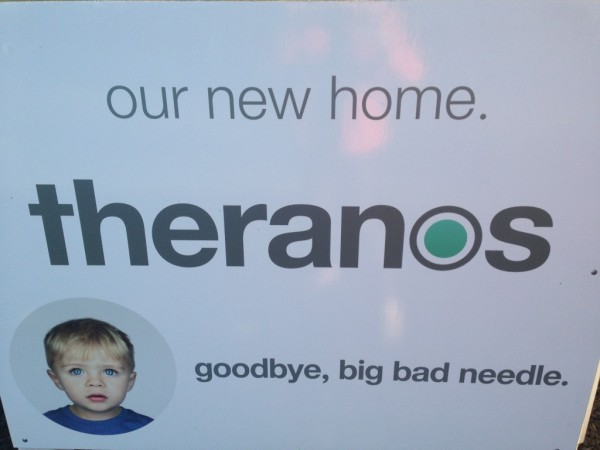

福尔摩斯认为血液检测不应该是痛苦的，反而这应该是一种“美好的”体验。因此，Theranos目标就是扫除实现“美好血液检测”过程中的一切障碍。可以通过血液检测诊断出糖尿病和其他常见疾病，并更早的对患者进行治疗。要想实现这个目标，血液检测工作就要更简化、更便于病人完成。她坚信公司可以实现五个方面的突破：**摆脱静脉抽血方式采集血液、利用几滴血液完成诊断、自动化检测流程以减少人为失误、更快地进行检测并获得结果、降低血液检测费用。**

目前，Theranos已经从包括甲骨文公司创始人拉里·埃里森等多名风险投资人处筹集了超过4亿美元的资金。福尔摩斯坚信随着健康意识增加，人们会越来越多前往药店要求检测怀孕、高胆固醇和其他常见疾病。现在750亿美元的检测市场完全可以成长到2000亿美元的规模。她也被《福布斯》杂志评为为世界上最年轻的白手起家的女富豪，45亿的身价。

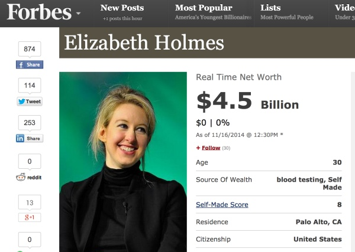

## _学界质疑和舆论指责_

学界之前集中在Theranos是它到没有公布过任何自己产品和同类产品的比较性实验结果。而伊丽莎白很少面对媒体，说到自己公司的技术都表示这是“商业机密”而避而不谈，沉默只是为了保护自己的知识产权。

华尔街日报10月15号的一篇文章就直接把这个疑虑变成了指责。文章中表示，Theranos的前员工反应，公司现在只有15项测试是通过少数体液在自己开发的Edison机器上测试，其他190项测试都是用传统方式在进行，FDA对Theranos有过匿名检查，认为他们使用的存放血液的迷你管没有被批准过。

Theranos很快回应，认为舆论证据不准确，伊丽莎白也在通过媒体回击，表示长久以来人们一直在议论他们的技术，也诋毁他们通过避免给潜在竞争对手透露技术信息的方式赚钱。下面就是对伊丽莎白在斯坦福课程CS183C深入采访。

－－－－－－－－ 采访分割线 －－－－－－

> _Theranos 是做什么?_

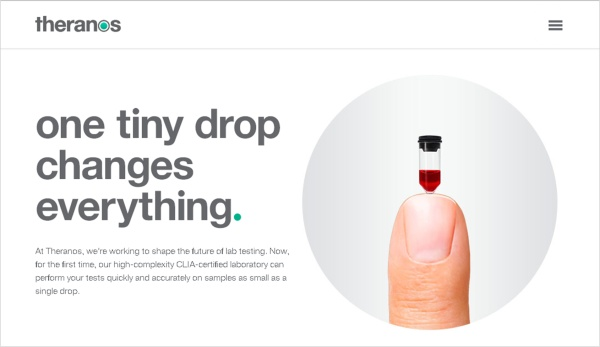

Elizabeth Holmes：Theranos为早期预防提供一种接触健康信息的方式。我们很长时间去思考传统上没法接触到的个人健康信息。我们大概花了10年去搭建后端技术，使得低成本高质量检测成为可能。我们又通过连锁店合作(Walgreen)让所有人都能做血液检测。我们也一直致力于把检测体验做的更好，改变了用户跟这些检测的交互方式。

## _找到自己真正热爱的就全力全职去做！_

> _你是从斯坦福的地下室里开始做Theranos，早期你是怎么集中精力的？_

Elizabeth Holmes：人们需要有了生病的症状之后才能通过检测了解自己的健康信息。创立Theranos的目的就是为了改变这种局面，重新定义诊断的范例。我自己经历过因为可预防的疾病而失去亲人。我想去改变它。当我在斯坦福做研究时，就想寻找一个产品能改变现状。你不用等待医生就能每个季度做个检查，就像你看信用卡一样去查看你生物医疗数据，往往大家理解前者而不是后者。

> _当时在斯坦福是怎么开始的？_

Elizabeth Holmes：我在斯坦福读化学工程。我做的研究就是针对非常少量的液体，通过传感去检查液体中的东西。我一直对科技和医疗感兴趣。我看了现在是怎么做检测就意识到不对。我在新加坡做SARS实验，我们使用的仪器（做葡萄糖微序列分析）去理解人得病机理，但这个系统从1960年就没比变过。我想别的方法去重新设计系统，就开始着迷了。**在大一时候就开始想，大二就发了专利。斯坦福对休学非常宽容，我在大二时候我决定离开去尝试全职。我做这个决定是因为训练，学习，这一切都是为了我想从事的。既然我找到了，我就应该全职去做。**

> _你说到你对父母说“与其省吃俭用送我上大学，不如拿去开公司吧”，你是怎么说服父母的？_

Elizabeth Holmes：**我经常问自己这个问题－我们这一生想要什么？对我自己来说任何事情都没这么有意义，有没有这样一个产品能帮助人不要那么早说再见，因为他们还没足够时间去做他们生命中最重要的。去斯坦福读书也是为了获得技能去解决那个问题上，我觉得我已经能做了，就没什么可讨论的**。我父母也非常支持我的决定。

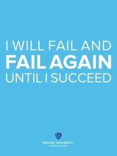

> _从一开始你就有热情，你对没有那么强烈热情的人有什么建议？_

Elizabeth Holmes：**你需要花很多时间弄清楚你自己真正热爱的。你需要反复实验直到解决。比如有的艺术家着迷于特别的雕塑和绘画，因为他们热爱。当你发现你要做的跟金钱无关，你要怎么做？这可能很难，你需要热爱才能维持住。我也问我自己，如果我被炒了，不是CEO，或者失败了，我该做什么？我的答案是我将做同样的事情因为这是我真正想做的。我要做它无数次直到成功为止！**(I will fail and fail again until I succeed)

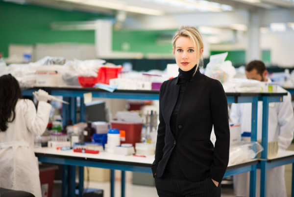

## _从产品定制到规模扩张_

> _早期Theranos跟现在大大不同，你怎么制定产品战略的？_

Elizabeth Holmes：愿景始终一样的。我开始的专利正是我们目前的技术要素。我知道我们要做的比医疗检测范围更广，但这是很复杂问题也有监管领域。还有当你开发了去测量一种（葡萄糖测试）产品，这不意味同样方法能适用另一个检测。我们认为这是非常长远使命，可以从我们的产品和服务开始去实现使命，因为这是一个子集能产生收入，再扩张技术直到我们提供完全的服务。

> _我们很多时间在探讨从很小规模到找到产品的市场定位，然后才开始扩张。Theranos是怎么扩张的？_

Elizabeth Holmes：我们现在有1000人，我开始是为了药厂作为他们新药的实验室。为了更快更好去测量药物试验。我们花了1.5年去搭建模型让消费者和医师能做到，开始从亚利桑那。现在准备复制到加州和宾州。

> _当你有10年计划也需要资金时候，你怎么想产品市场定位，有没有足够机会去__小规模做__市场实验？_

Elizabeth Holmes：我们知道我们的愿景。一开始为某个药厂去测量特别的东西。它使用更少血液也更廉价，这样我们能更快把数据给药厂，帮助他们迅速理解药品的安全性。我们从那开始到多个实验，最后就发展到我们想要建立的。

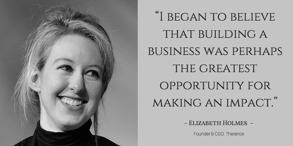

## _强大使命来招聘_

> _你是怎么离开斯坦福去开公司的？你怎么去找到对的人和团队？_

Elizabeth Holmes：**Martin Luther King说，在信仰下迈第一步，你看不到所有的楼梯，就迈第一步开始。**所有事情从婴儿开始，你不会开始就招了100人，融资5000w的，对我而言，第一个就是我要搭建什么？产品是什么，系统是什么，开始设计是什么。第一部分就是很技术范的。下一步是“有人跟我一起吗”我有机会找到我读斯坦福PhD时候的老师和学长。下一步“我们能靠近医学实验领域吗？”开始想着融资。在医疗领域的公司都是资本敏感的商业集团，我们需要人懂那些。**所以你要明确为什么做这个公司，什么是你的使命？如果这个很难你还会不会奋斗？如果摔倒或者坏事发生还会继续吗？你要被考验，确认这是你热爱的事业。**

> _说到为使命招聘，你有什么具体例子？_

Elizabeth Holmes：不管你管理有多好，你还是会招聘时候犯错因为你看到一个新候选人没多久就要进入家庭。你需要做判断，去理解新来的员工为什么加入Theranos。为什么是我们？不是别人？什么让你做决定？如果他们最终答案不是我们的使命，还是劝他们去其他公司吧。我们需要战士，我们公司很多人因为可预防的疾病而失去亲人或者家里患有自闭症的需要每天验血，他们知道这意味什么。这样你工作的意义截然不同。

> _你弟弟也为你工作，你怎么平衡私人和职场关系？_

Elizabeth Holmes：我弟弟2003年进来，当时帮助搭建第一个网站。他回Duke之后去DC上班。当他有了经验开发了自己技能，我们说服他回来加入我们。当你有亲近的家庭和朋友，这些人会更努力工作，但还是商业第一。这些人还是要跟别人一样4倍的努力。

(Theranos其中之一挑战就是后勤问题。Elizabeth弟弟Christian担任产品经理主管，表示：“你不得不扩展后勤能力。如果失败了，我们就完了。”另一个挑战则是竞争问题。随着微型化逐渐成为行业标准，很多公司在研发不需要针头就能完成的各类检测手段，比如依靠激光、血氧定量法、生物传感器和MRI等医学成像技术。)

## _技术壁垒和颠覆领域_

> _Theranos技术有什么不同？你怎么把血液检测的成本大幅降低？_

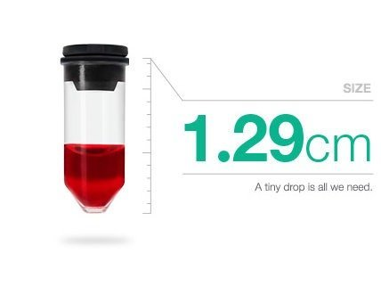

Elizabeth Holmes：我们主要是重新设计了整个验血系统。我们改变了设备，消费品，软件，化学，硬件，如何产生样本，使用自动化最后打包在一起去降低成本。

> _为什么验血？有很多医疗健康的颠覆方式，你怎么看别的？_

Elizabeth Holmes：验血非常重要因为其中的数据。传统针刺方法可能位置不对让你不舒服。你也不知道多少付费合适。40-60%的人是医生让他们去做血液检测，如果你因为家族遗传疾病想去检测，保险不能支付。我们就想去做的是在你生病前获取信息的方式。

> _一种颠覆医疗健康是检测，还有什么尝试颠覆的？_

Elizabeth Holmes：我们最酷的是重新思考治疗，在癌症概念中，你设计了一种定位免疫系统去战胜癌症的治疗。这跟你用传统化疗方式完全不同，那种就跟吃了毒药还希望能伤你越狠。而激活你自己免疫系统是改变游戏规则，癌症的突变是有希望的。

## _如何让千人公司保持交流_

> _最近有关于Theranos的媒体负面报道，你怎么让员工增长到1000人，还能保持交流？_

Elizabeth Holmes：我最感动就是员工对这些新闻如何反应的。在这种威胁时候，团队有动力去证明说法荒谬，而我们团结起来做出产品不会变的。我们有开放空间，每天3餐，每周五都在一起谈论。我们听取员工建议，回答问题，保持交流畅通。我们知道当我们做出影响力时候，外面就会有人威胁我们。

> _你有了很大规模1000人，这到了城市的规模，在这个阶段你的流程工具有什么推荐？_

Elizabeth Holmes：我们也是扁平组织，我们做出的事情就是因为有正确的人。招聘能人，赋予权力，一起成长都是公司文化。我们文化是让人做难事，不怕行业巨头挑战。

> _你说到一些最好的人，你是怎么发现人才并且从外面挖人？_

Elizabeth Holmes：当你很快扩张的时候，公司里主要进来都是新人，这样也可以轻松去维护文化。但你想请外部高管就需要在进入家门之前了解清楚。

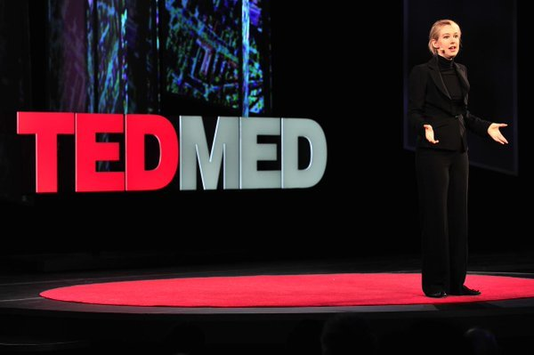

(在TEDMED大会上，她指出造成医疗保健支出主要原因之一的糖尿病可以通过改善生活方式被治愈。“今天，美国仍有800万人患有亚糖尿病。而且，他们中90%的人毫不知情。”她认为这些人之所以不了解自己的病情，要么是因为不看医生，要么是因为逃避血液检测。她表示Theranos能将血液检测变得简单无痛，因此人们会在看医生之前先自己做血检。)

## _在大众前曝光_

> _你让Theranos在大众面前同步，这不常见。这是很好但对个人比较难，你喜欢这样曝光吗？_

Elizabeth Holmes：Theranos 在2003年成立。第一次我们媒体曝光是2013年，我们隐形发展了10年。**我们曝光原因是我们工作改变了医疗制度－让早期检测成为现实。在农村如果你不能支付好的医疗，他们不知道有权力获取健康信息和如何用它。我们的使命就是****无论贫富，不管居住何方，我要让每个人都可以在需要的时候获取自己需要的健康信息。**我们甚至想去改变州法律和联邦法。**如果现在人们在杂志封面去诋毁你，这也没关系。我们关系的是每一天，有没有更多人通过Theranos获知他们的医疗信息**，而以前是没有办法做到的？在亚利桑那州，我们集中检测，获取小样本，技术上也有突破。直到两周前亚利桑那州的报道变成国家新闻。**媒体对我们来说就是跟人民沟通的通道。**

## _选择董事会_

> _一种让公司扩张的工具时董事会而Theranos有不寻常的，你的策略和如何让董事会帮助的？_

Elizabeth Holmes：我很荣幸跟最顶尖聪明人学习。政策对于我们使命而言也是非常重要工具。**我们董事会理解改变政策和战略，而竞争对手想去干掉你。**随着我们成长，我们也改进了好几次董事会结构。医疗是非常复杂的领地，我想60年没变总是有原因的，不是说仅仅做个检测，而是如何改变这个系统。

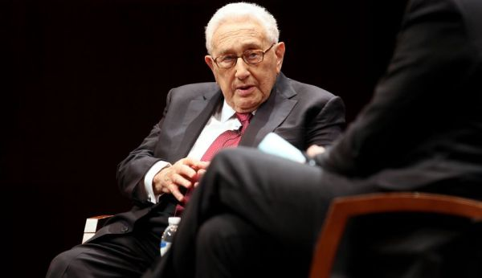

Theranos董事会中有着各种杰出的前任政府官员，其中亨利·基辛格，他表示：“福尔摩斯有一种优雅的品质，看起来好像十九岁一般。她好像青春永驻，不会衰老。不过，她的美丽还是比不上智慧。有时候我们叫她乔布斯第二，但我认为这个比喻不恰当。她拥有乔布斯不具备的社交意识：乔布斯是个天才，福尔摩斯则拥有一颗大心脏。”

> _另一个建立公司时你要选择什么投资人。比如Larry Ellison是Theranos大股东，你是如何选的？_

Elizabeth Holmes：投资人可以帮助也可以毁坏公司。你要看长远，你需要投资人理解并去搭建长远的生意。

## _监管战略_

> _亚利桑那州允许你们帮助重定法律，你能谈Theranos的监管战略吗？_

Elizabeth Holmes：由于医疗在监管领域的特殊性，利益重大，决定也是长期的，这都要求我们搭建非常不同的公司结构。即使FDA批准我们做的也需要几年时间。政府为了有效性安全性，从不同形式介入，也包括法案－我们可以帮助起草，最后也让每个人从医疗健康中获益。我们坚信改变医疗制度的唯一办法是赋予人们掌握医疗系统的权利，除非他太笨自己不能处理。比如我可以出门买武器，但我不能去自己做医疗检验，因为这当成太危险了。我很不赞同这个，我们从亚利桑那开始的第一个法案是让人民花自己钱在医疗检验上，并可以参与他们自己的医疗信息。这真改变了很多，因为当他看到价格，市场开始起作用，人们希望更低的价格提供更高质量选项，而现在价格不透明。因为这个领域不想改变，就导致没多少新公司在医疗科技领域革新。

> _全球扩张你怎么做，尤其每个国家监管都不同？_

Elizabeth Holmes：各地确实完全不同，就是要找人明确如何操作。我们从一个城市到另一城市，我们成功依赖于各地运营人员。

> _你对技术的特别地方如何保密－商业秘密还是专利，背后的策略是？_

Elizabeth Holmes：我们非常激进也重视做专利保护。问题是我们对我们血液检测有信心吗？答案是医师和我们服务的人们。在医疗检测中，Theranos是一个城市，也是一个社区。我们知道因为做的不同可能颠覆，为了体现技术公正，我们需要在大众监督下。我们想到的唯一办法是第一个让FDA去把我们所有实验做审查－没有那个实验室做过。我们想如果FDA出调查报告，将支持我们的观点。我们的曝光度就很高，数据为自己说话。

> _你的使命是让价值能被获取到，这怎么影响到你员工和合作商？_

Elizabeth Holmes：我认为使命的清晰体现在你最后想做的东西和如何去做。我学到最强大的是把你的价值变成你抉择的框架。

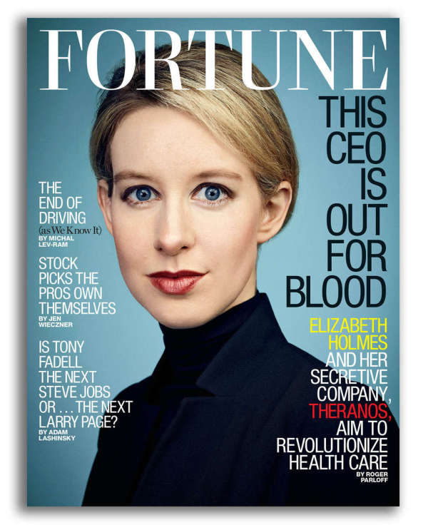

## _中国经历_

> _之前你在中国还做过生意？_

Elizabeth Holmes：早年我发现中国大学不像美国大学可以接触到编译器，我就去做过销售C++编译器到中国大学的生意。

> _你从中国开始第一份事业，怎么影响到你的世界观？_

Elizabeth Holmes：我在北大学中文。我热爱那个地方，那边学生的密度和热情。是一个刺激的环境驱动大家追求卓越。我搬过很多地方，不会在一个特别的社区停留或者把自己属于哪个组，可以通过你的创造和号召力来体现自己。我大多是自己去一个陌生地方也塑造了性格。

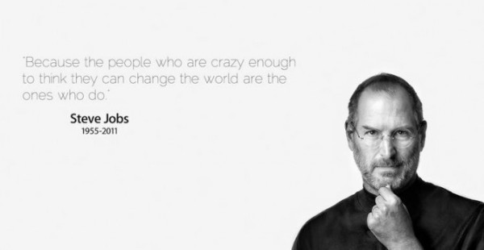

## _如何保持这种创新解决问题的能力_

Elizabeth Holmes：我们想解决与之前不同的问题。人们认为检测或者手指小把戏而已，我们的确不是，我们是做现实中早期检测。我们所做的是搭建系统，产品，创造可以获取健康信息的交互方式。

> _为啥在硅谷做，生物科技也许其他地方准备的更好？_

Elizabeth Holmes：有种偏见说在硅谷的人很厉害，我也希望能不同。我们热爱的是多元化人才可以攻克难关。**新的技术发展会导致Theranos失败，我们时刻准备自我颠覆，这是我们运作的一个核心原则。硅谷是颠覆性技术最好的代表，它既能改变世界，也能使得企业落伍。**

> _你怎么看大药店？_

Elizabeth Holmes：他们很长时间是为我们搭建架构中服务顾客。他们也帮助我们做创新和颠覆。

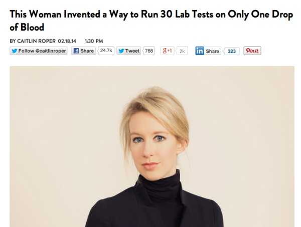

## _做人和做事_

> _你认为谁是最相信你的，你是怎么说服的？_

Elizabeth Holmes：大概我父母，其实最后还是自己。你做了决定说你准备做这个，你当然要相信它并去拼搏。

> _个人怎么分配时间的？_

Elizabeth Holmes：我的主要职责是解决最难的最关键路径的问题。我个人兴趣时在产品和内外交流。但我也会花在别的重要事上。比如我们在亚利桑那州通过法案，我就需在那7*24待命。

> _在会议上你花多少时间，在你不开会时候做啥？_

Elizabeth Holmes：我平常在会议上分配少量时间，但非正式会议是不少，是解决实时问题。我们的文化之一就是实时沟通，其他的时间放在执行和解决问题上。

> _当时你那么小（19岁），怎么在早期做事的？_

Elizabeth Holmes：我没有集中或关注年龄。同样适用工程界的女性，你不需要注意，行动才重要，你最后做了什么，创造了什么。认真工作，保持你头低下，最后所有杂质都吹走了。我在公司的前7年都不允许租车的。

> _有什么对19岁的自己说的？_

Elizabeth Holmes：**要更拼命一些，这是我慢慢学到的，而我在斯坦福不像这样。我训练自己做我想要的。很多疑虑是在质疑自己是否成功，但我相信你只要能想到就能做到！**

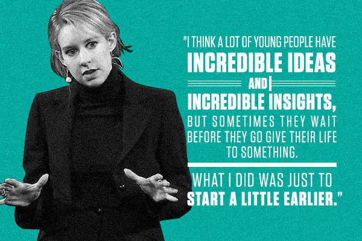

**参考资料**

[Scaling Theranos with Elizabeth Holmes](http://link.zhihu.com/?target=https%3A//medium.com/notes-essays-cs183c-technology-enabled-blitzscalin/scaling-theranos-with-elizabeth-holmes-class-14-notes-of-stanford-university-s-cs183c-f2029b7c21a0%23.5ctjpsd8v)

[http://www.wsj.com/articles/theranos-has-struggled-with-blood-tests-1444881901](http://link.zhihu.com/?target=http%3A//www.wsj.com/articles/theranos-has-struggled-with-blood-tests-1444881901)

[极客故事：迷人的年轻富翁与神一般的血检颠覆者Theranos](http://link.zhihu.com/?target=http%3A//www.geekheal.com/theranos/)