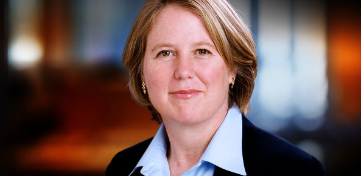

# 15: VMware

来源：[https://zhuanlan.zhihu.com/p/20393134](https://zhuanlan.zhihu.com/p/20393134)

> _版权声明_
> 
> _本文首发自微信公共帐号：donglaoshi-123；_
> 
> _作者：董飞_
> 
> _无需授权即可转载，但请自觉保留以上版权声明。_
> 
> Diane Greene是如今云计算虚拟化行业巨头之一VMware的联合创始人，她带领VMware于2007年成功上市，却在2008年离开了公司。格林为包括Nicira和Cloudera在内的诸多初创企业提供咨询与天使投资，前者于今年7月被VMware以12.6亿美元的价格收购，后者也已经成长为首屈一指的云计算服务商。如今的格林又坐上了谷歌董事会的席位。近日谷歌任命格林为云计算业务负责人。

采访人Greylock合伙人Jerry

## _VMware早期故事_

VMware是我第三个公司了。我们发明了虚拟化这个主意，跟一些研究生工作发了论文，很多大公司里专家看了感觉很好，之后我们申请专利并认为应该去做市场。我们跟学生讨论要不要开公司，最后他们加入我们。同时我怀上第二个孩子。我原来计划是从外面请来CEO。根据我以前创业经验，**我写下我们的使命，愿景，核心价值和每个早期团队签字让大家保持在同一页。**

## _虚拟化是什么_

虚拟化是软件的一层位于硬件和软件之间－是硬件的模拟。这让你可以去运行多个虚拟机在一台机器上，你可以在任意机器上运行任何系统－比如OSX和Windows在一台机器上，DOS和windos 95在一台机器，Linux和微软一起。说到服务，虚拟化解决了主机没有充分利用的扩展问题，能在一台机器上运行多个虚拟机，最大化每台机器利用率。VMware的愿景是搭建全套服务器产品。我们挑战是没有那个客户要卸掉他们的操作系统，并把我们的超级监管放到他们服务器上。怎么去测试这些概念？那时Linux起来了，我们做了工具让开发者在Linux去运行微软的东西。下一步我们在桌面Linux上运行任何系统。所有人认为我们很聪明，刚好Linux开始成熟而我们运气也不错。

## _在扩张中保持文化_

Diane 认为在开始招聘很难。一开始VMware的idea没有定义好，让别人加入就很难，每次招人都不简单。当VMware扩张时候，一个月招了100人，其实当你规模变大就容易招聘，但你不要降低标准。更大时，第一个人才对手就是Google，而Diane还是Google董事。其实Larry Sergey为什么让我加入Google董事会，是因为他们失去人才去VMware，这是之前很少发生的事情。Diane对候选人的劝说是如果你想7*24小时工作，你就去Google，如果你有一些兴趣，在家庭或者在工作外做你想要的，你就来VMware。VMware不会像Google工作那么长，员工上下班都是正常时间。

当你有相当多的优秀人，如果带来不合适的，他们自己就选择离开。我们仔细观察如果发现不合适就帮助他离开。一般还是从外面去寻找人才。但我们不去找VP或很资深的管理，我们去找出色的个人。比如Jason很聪明，斯坦福毕业，他进来是独立贡献者individual contributor，在我们的职业服务团队，他做的非常好就让他运作整个部门。他把专业服务组从3人到450人，收入也到1.5亿美金。本来我们只想把这个部门做到收支均衡的，但Jason还是把它变成收入可观的部门。

## 交流的进步

开始我很害羞，对演讲不自信。我就每周给全公司讲话，当我们慢慢变大，跟越来越多的人说，通过演讲战胜了恐惧。当我们变大后就给大家发Email。我们周一高管会议－把组里面事情写下来，特别是其他组应该知道的。我让每一个高管在周日9点前写好，我把这些放一起，写上我的批注，强调重点，然后再把它给其他组发。这个报告可以给其他人分享，最后每个组都有类似的周报。这让大家知道其他组的情况。

在创业时，公司有不同人，比如经常受到设计师挑战，我之前没跟设计师打过交道，需要去尊重他们，我希望能做他们而不是求他们。我们也做同样的汇报结构让其他人知道每个人情况。这所谓说同意的话，在同一页上。当我们有新人加入－我就向他们发送报告他们就知道进展了。而新的交流工具Slack也让事情更容易。

## _与Linux的战略关系_

Diane Greene：我们从第一天就开始做Linux和Windows的产品。我们桌面生意很成功，有1亿的收入。一开始我们想把工具免费因为Linux用户认为所有东西就应该免费开源的。

Michael Dell在CNN上说他投资很多基于Linux公司，因为他想跟微软在这里领域较量－但最后在所有投资中都输了。从一开始我们就是现金流正的，当我们开始发布服务器产品却没有人买。我们做的下一步就是把已有的桌面产品取代，取名叫服务器产品（GSX server），把它放在我们一个发布列表中重新发布。

## 保持中立

Diane Greene：VMware尝试任何渠道，但重点是硬件商。我们就跟瑞士一样，很少看到这种－某些公司放弃排它权利，优先价等。但VMware不知道人们用的硬件平台，就需要我们跑所有的平台，基于这个一切都要能做到。**我们第一优先是顾客，然后合作伙伴，最后我们自己。我们使用这种优先级来做决定。我告诉所有的合作商：一视同仁。**我保证不会去让其他账号注册（比如VMware销售在HP和Dell，他们不会分享跨公司的信息）。如果合作商开发了在VMware之上的东西，我们也会保护知识产权。如果VMware开发了新东西，会跟所有的合作商分享。我们很清楚写下所有的规矩。如果VMware有人违背了这些，他们就直接走人。我们合作商也争吵但最后还是喜欢这种安排，还是因为信任。

## _销售驱动_

Diane Greene：销售是新的领地。当我们开始招聘销售－我不知道好的销售是什么样子的。我们招了很多不同的销售然后看每个人的结果。早期比较难的是不知道是他们销售不好还是产品不对。我个人就走出去学习销售，跟每一个销售VP谈。最后学习下来就是我们现在在斯坦福教的销售模型。VMware是技术产品很难去部署，销售团队有：

*   销售，在电话中谈我们的生意

*   销售工程师，去理解VMware如何在特别硬件上运行

*   直接销售去完成deal

**这三种人组成销售团队－我们会给每个团队设置一个目标去实现。有一点每个销售成员不需要做到同样的数字**，一般直接销售会比销售工程师拿更高比例。薪酬是看团队协作而不是个人表现。第二是，销售是通过代理商－他们需要跟直接销售有同样的提成－即使VMware不会通过这种赚多少。聪明的销售，而不是直接销售，去教育所有的渠道商。最好的销售是能够平衡各方利益也赚到百万。我们是通过这种leverage跟合作商一起共赢。

## _培养创新文化_

**1\. 最优秀的人能自我驱动。我们期望一些能自己设置很高标准，也期望最好的工程师。**

**2 我们有发布排期还给了一些额外时间。我们哲学是给人们额外时间去摆弄这个产品－我们从不满时刻发布。**

**3\. 我们有 建议话题，任何员工可以提议如何改进VMware并向全公司展示。最好的人可以拿奖并去实现这个提议。**我们要清楚的是你如果给大家看一些新进展，你不会有麻烦，而我们会喜欢并嘉奖。

我们相信VMware可以在所有硬件上运行，也是中立的平台。VMware单机也有用，个人开发者可以尝试然后考病毒传播到公司。我们希望通过代理商购买我们产品而不是直接对方领导层拍板。这些购买人员可以从卖方折扣并提成，也是利益的互享。

## _容器和Docker的革命_

在开始VMware还没有做容器。没人信虚拟化，所以我们不要那么颠覆去做。现在企业都意识到虚拟化的价值，就可以做轻量级的容器。

## _低调作风_

低调的好处是你可以设置步伐节奏。你准备好的时候才去做，直到产品好的时候再去发布，也容易产生信任。VMware让大家在上面运行复杂系统的产品，必须值得信赖。这样也少一些压力更从容去运作。如果工程师说我们需要改什么－我们有足够时间去做。这也是我个人喜欢的方式。

## _升级团队的信号_

例子，一个销售说我们能做1000w收入，如果我们到2000w就很走运。这就是应该去升级，我知道可以比2000w更多。而一个市场人员把我们关于合作商的保密信息想卖给公司，我们开除了他。

在VMware我是没有销售经验的，我不知道好的销售VP什么样的，我们就定期轮换和升级直到我们找到好的为止。在新创业公司，设计有同样问题。我自己需要去读设计的书，去咖啡屋搭讪。我问我朋友所知道的伟大的设计师并去学习直到我们找到设计负责人。

## _最后建议_

Diane Greene：在学校时候我经常问－大家有多少人想去开公司？几乎所有人都举手。问题是，如果所有人都去开公司－没有人可以招了。做点事情很好，但我在开公司之前就想作为企业家。我开公司主要原因是那时没有多少很好的大技术公司可以去工作。我建议是，**如果你有注意并想去做些东西－寻找对你最好的环境去做。也许是开你自己的公司，或者在已有公司去做。重要的是你要搭建什么和你跟谁一起做。**

## 参考资料

[Scaling VMware with Diane Greene](http://link.zhihu.com/?target=https%3A//medium.com/notes-essays-cs183c-technology-enabled-blitzscalin/scaling-vmware-with-diane-greene-class-15-notes-of-stanford-university-s-cs183c-73134ca73f7b%23.eldff3uje)