# 16: Netflix

来源：[https://zhuanlan.zhihu.com/p/20359944](https://zhuanlan.zhihu.com/p/20359944)

> _版权声明_
> 
> _本文首发自微信公共帐号：donglaoshi-123；_
> 
> _作者：董飞_
> 
> _无需授权即可转载，但请自觉保留以上版权声明。_

Netflix是一家美国在线影片租赁商，拥有一千万订户，他们可以通过邮箱接收或者在线方式观看10万部DVD。截至2013年，Netflix付费订户超过300万人。现在，Netflix也开始进军影视制作业，利用超过100亿次的用户观看纪录大数据来分析观众喜好，去年热播的《纸牌屋》就是它们的作品。

这家成功且另类的公司在2009年释出了一份100多页的PPT，讲述Netflix的企业文化精髓。这份PPT在网上被查阅超过了600万次，甚至被Facebook公司的COO桑德伯格称为“硅谷最重要的文件”。下面就来自于Netflix创始人，CEO Reed Hastings在CS183C的采访整理。

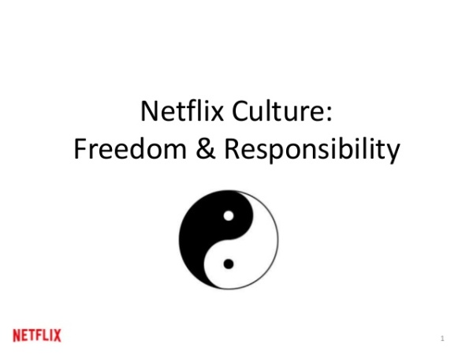

_**Netflix文化起源**_

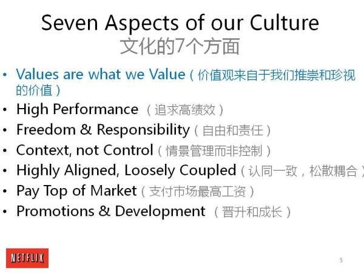

8年前，Reed对新员工加入流程很烦，就准备了100页PPT，引起业界哗然。他本来是想让面试人读一下，又想既然面试的可以看，索性公开了。往往写下来的东西总是被争论。其实在5年前，公司每个人都参与了贡献，这是理想生活的方式。从1997年成立到2002年上市，Netflix目标就是希望不破产。在2000年，融资易如反掌，到2001年，Netflix裁员1/3（从120到80人），只有盈利部门才能生存。**Netflix看的比成功更重的是价值，跟聪明人用一种高效方式工作。**裁员之后，生产力更高，**Reed决定要不每年裁人1/3。通过这种来强调人才的密度。经理决定要不要留下员工，如果不想留住，就给员工丰厚的补偿金**。当Netflix上市有150人，人们担心Netflix上市了，事情会一团糟，没人愿意承担风险。**Netflix哲学是给员工自由。如果你想最少的规矩去实施，用情景管理而不是流程控制。**

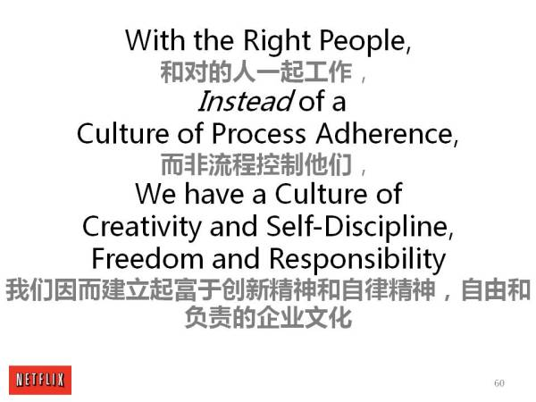

**命令和控制**

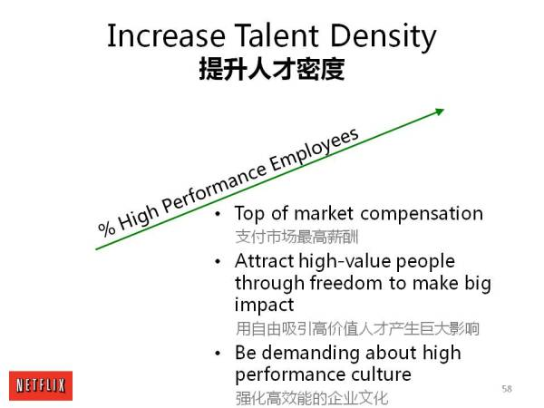

Netflix的结构是经理分享很多相关信息，但下面人有权做决策。有些事情甚至Reed都不知道。像Yahoo CEO Marissa据说她每个简历都看，这很敬业但占太多时间。**Reed不看简历也不阻挠招聘，他认为本来就不指望招完美的人。**面试是6-8轮考试，而工作3-6月后会知道更多。可以先尝试，如果不行，就给补偿金在继续招人。Netflix不把公司当成婚姻一锤子买卖。

**文化的理解**

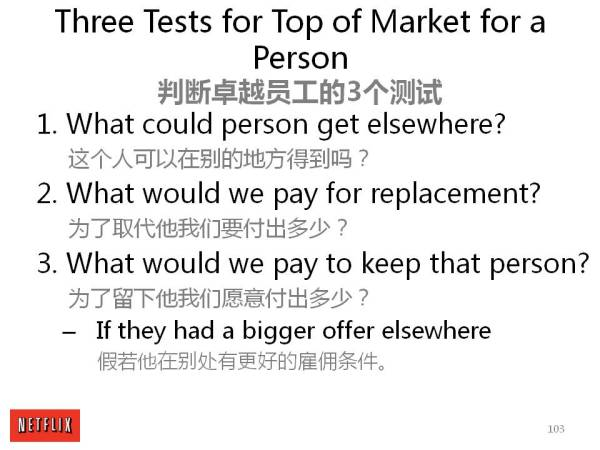

**只要你定义文化清晰，就会吸引那些喜欢你这种文化的。**人们可以按不同去做，也不用理解彼此，不要搞政治。即使好莱坞工作室充满政治斗争，也是内部一致的。文化说白了是你和你核心团队想要做到的。

招聘不是个清单，很多人喜欢说我喜欢你们文化。你问他不同意什么并为什么？如果他不知道，就不是一个理性思考的人。Netflix**是****寻找对问题保持好奇的人，而不是言听计从。**

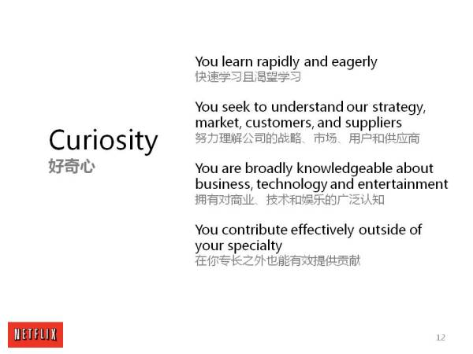

_Reed_始终认为使命的重要，Netflix是有感情的卖人们所想的产品，但不是必须品。它不像Facebook立志开放的连接世界，如果把使命定成通过他们热爱的电影来连接人们，这就很奇怪也难以坚持。

**早期聚焦**

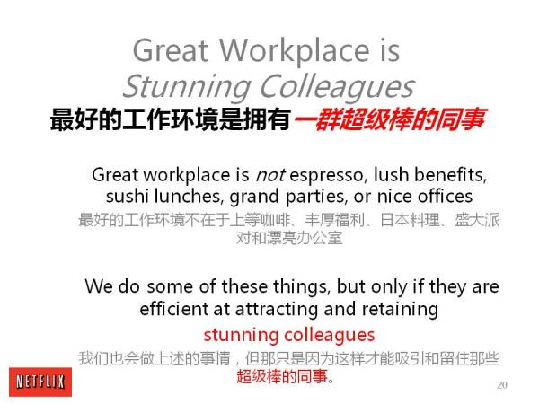

在2003，04年Netflix发展不错，但竞争对手Blockbuster是Netflix的20倍大。如何聪明去反击？他们把同样的DVD疯狂打折半价，Netflix就失去了份额。2005年，Netflix启动朋友社区做社交网络，还利用Yahoo的板块广告增加收入，把二手DVD卖给顾客，并增加红色信封装着节日购买的电影DVD。在2007年最后还是Netflix赢了。**所以当受到攻击时，应该通过加强核心而不是扩大伤口来反击。****如果当时把完美程度从98%提高到99%，可能更早去打败了Blockbuster。**

Netflix 在1997年第一次融资，当时认为5年内变成流媒体，在2002年，Netflix没有，然后就想2007年，将成Netflix一半的业务。到了2007年还是没有。但Reed做同样预测，到了2012年，流媒体终于占60%的业务。

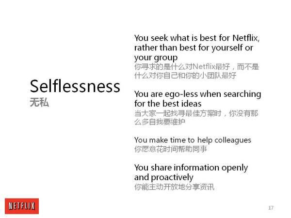

**当有个主意老是在左右你，哪怕贫穷，你还是想把它实现，这就是企业家的初心。**我第一个公司才20人，从亲戚朋友拿到2w融资。就那点钱开始做产品，找到初期的引力，再拿VC的钱。后来在Netflix，在前几轮就自己的钱来支撑，这样不会稀释股份和考虑VC的回报。回头看，我希望能更多负债更少股，并且开始对成功预测往往是错的。

**招聘与解聘**

Reed让Netflix团队为公司做正确的事。他第一家公司就没做过经理。他不想开人－因为觉得非常残忍，就像撕破脸。之后用了3年才知道**公司需要我去做正确事情，这不是自私，而是保护公司。**当这么想‘为了公司好’，就心安理得了。其实员工收入一部分就是解约费。最少是4个月。如果招这个人认为2周后是一个错误，依然是4个月的薪水。Netflix也从来没有得到诉讼。补偿金就是让经理去做对的事情，因为这样开人很容易。一开始这样做也心疼真金白银，但很值得。**因为不会花费更多了，你不赔解约费，后面还是花三个月把人请走。我们相信人们的判断，有些公司想去使用数据和统计。使用数据是可以来选股票，但不是你的伴侣。**

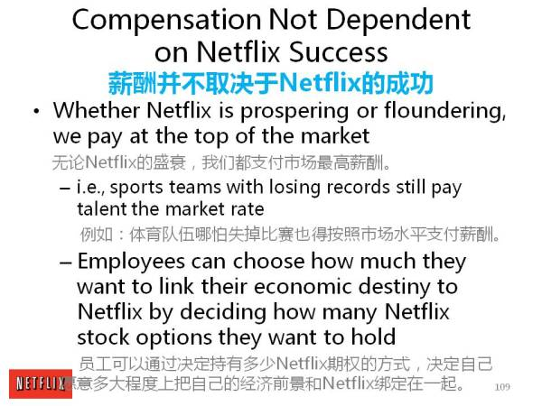

需求是发明之母。每个人可以从别人的内容开始，一定规模后去找到他们的内容。2005年Netflix尝试DVD，当时只有500w订阅用户。当时意识到大家在电视节目上花太多时间，就买来很酷电影，这比买电影成本高10倍，大概1亿美金，1/4的内容预算，而通过Netflix用户能选择好的节目。然后有了团队工作室，Netflix提供的条件很诱人，我们支持所有的节目运作人员和工程师。其实大家不需要15小时在办公室，也许你在骑车时候想到更好的灵感。

**其实把公司比作家庭的更好说法是职业球队，Netflix支付很高薪水，也渴望赢球，如果你比赛弄砸不会开除的。但你需要每年为团队而战斗。**

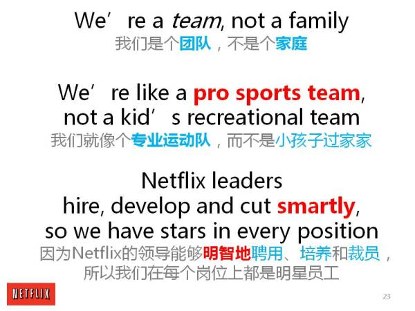

_**CEO职责**_

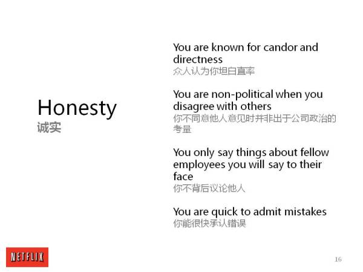

Reed 提到公司不同阶段也不同职责，在开始几年，你要做所有事，客户，投资人等，你需要用人才和勤奋来弥补。当你有50-100人，你可以把管理风格做的战略化。Netflix花10%收入到市场上，做到更大时候放在愿景，集中精神，鼓励和文化。但你不能做太过分，否则你自己累垮还让大家都很累。Reed第一个公司当时33岁，有50人，白天做CEO，晚上做程序员，忙得澡都不洗，最后有人说你还是去洗澡吧，当你代码有bug，需要花无穷时间去修。他觉得自己是劳模，不能休假一天。**其实应该花更多时间与其他企业家探讨和放下。**但当时不能理解怎么把自己做好，甚至离开工作时候还想着公司的事。

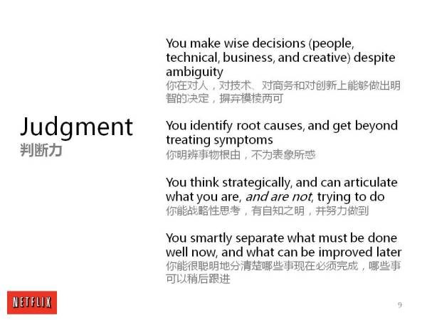

你不可能知道所有的事情。**每18个月做个练习，如果你是CEO，在Netflix如何做？这是我收集不同意见方式。**

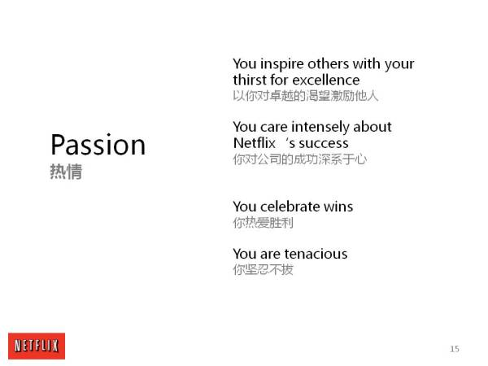

Reed 提到作为CEO很勉强，之前搞砸很多事情甚至问董事会是不是要引进CEO。从Netflix开始，才15人，跟运行之前700人公司比，还是容易不少，就像生二胎，没那么吓人。从长远看，灵活性是必不可少的，人们不是善于适应气候，但还是最后统治星球。

**_董事会选择_**

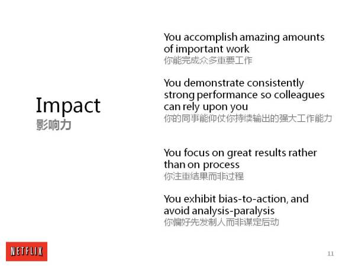

**当你面试VC时，要选择人而不是钱。融洽关系和信任都是很重要的。有些CEO对董事会不诚实就是毒药。**你应该把所有事情放在桌面上，如果好的董事会，不会因为现实窘境吓到的。董事会就是像安全网，在初期董事会知道的比你多，因为可以类比其他的公司。

_**市场扩张**_

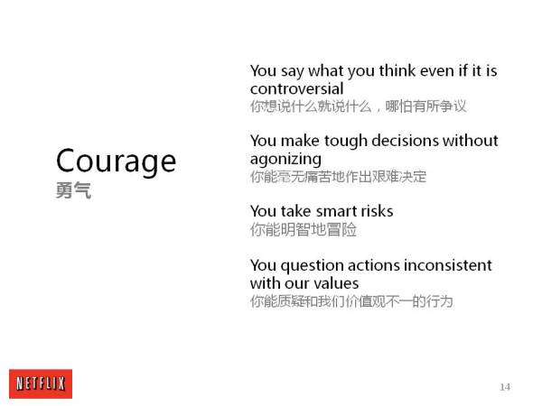

有些公司像Netflix，但像Linkedin Facebook因为网络效应一样扩张的还是挺少的**，扩张力量强可以成为市场绝对的王者，你可以为之做任何疯狂事情，比如增长300％去得到最大化机会。**

如果有网络效应你会有先机优势，像德国的ebay，日本的雅虎，不过在1999年Amazon还是把CDNow干掉，虽然CDNow启动早些。也要承认历史因素，像底特律就是汽车中心，曼哈顿就是金融服务中心。创业公司怎么起来并不重要，企业家比20年前在硅谷更容易，但如果你有小小的想法，还可以去奥斯丁这种，那边你不需要跟巨头做人才和资源残酷竞争。

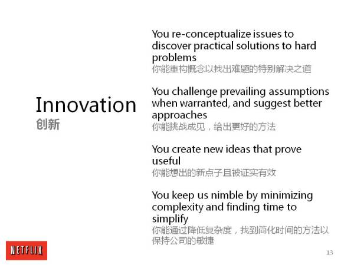

**参考资料**

[重磅 | 硅谷最重要的文档：132页Netflix企业文化PPT](http://link.zhihu.com/?target=http%3A//www.100toutiao.com/index.php%3Fm%3DIndex%26a%3Dshow%26cat%3D4%26id%3D18164)

[CS183C Session 16: Reed Hastings](http://link.zhihu.com/?target=https%3A//medium.com/cs183c-blitzscaling-class-collection/cs183c-session-16-reed-hastings-4e1058d2439f%23.fcarfml3w)