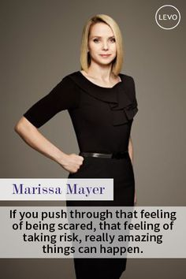
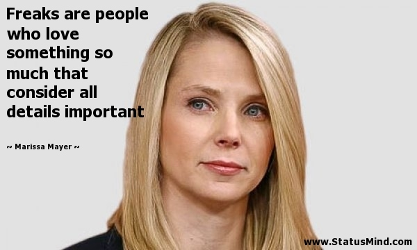
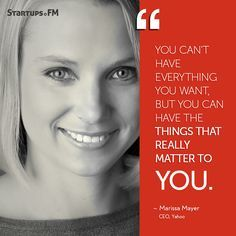

# 17: Yahoo

来源：[https://zhuanlan.zhihu.com/p/20359943](https://zhuanlan.zhihu.com/p/20359943)

> 现任Yahoo CEO，前Google 搜索产品和用户体验的副总裁 Marissa Mayer是前20位Google元老之一，第一位女工程师。人们熟悉的Google界面就出自她之手，她还 将Google推广至100多种语言，定义了Gmail News等。
> 
> _版权声明_
> 
> _本文首发自微信公共帐号：donglaoshi-123；_
> 
> _作者：董飞_
> 
> _无需授权即可转载，但请自觉保留以上版权声明。_

## _幸福斯坦福时光_

Marissa 在斯坦福大学学信号系统专业。当时去斯坦福时想去读生物化学博士，但发现每个人都是上同样的课，就想做一些更独特的。斯坦福计算机和心理专业很强，最后选择交叉学科信号系统。在申请材料中就有人工智能的项目，怎么做可以工作的大脑。

## _Google起步_

进Google前，Marissa利用暑假去做一个程序它能知道你和别人看的网站，通过协同过滤去找到相关性网站。后来Eric问我的暑假研究项目就介绍我去跟Larry，Sergey谈，因为他们在使用链接结构去解决相似问题。这时候Google刚成立一周，后来有人发信问Marissa考虑到Google工作吗。她有挑剔公司的拖延症，但还是答应去面试。而面试那一天，所有人都不在，而去KPCB谈融资了。当时红杉和KPCB总共投了2500w美金。

## _从工程师到产品管理_

Marissa 刚进去时候是做人工智能方向的工程师。比如相关站点匹配查询的广告。那时候很难找UI的人。他们希望寻找很强的系统工程师还能同时开发UI。几个月的寻找后，Marissa老板让她自己去做，每周一天时间放在UI的改进上。她就跟团队理解新功能，需要怎么做，看起来是什么，数据告诉我们什么，最后写出代码变成一个产品。做了2，3年，Google去其他技术公司招“产品管理”，还是Marissa来负责，她很适应这种改变，因为她在做工程师时已经开始做了。

## _流程改变和谨慎招聘_

Eric Schmidt告诉她**在不同的阶段（1，10，100，1000）每个流程都会被破坏，你需要在不同的规模下改变流程。**比如招聘，代码部署等方面都在变。当Eric加入时候有200人，原本计划是到年底增长到400人。Eric说没办法在保持质量和文化前提下同时翻倍。他决定到年底只招50人，起名叫“Larry Sergey美元计划”，Eric表面上为了省钱，招一个人需要最后得到Larry和Sergey的同意。这让我们**在早期扩张要深思熟虑，去分配好优先级。高速成长很好但要小心招聘。**

## _助理产品经理（APM）_

2002年，Jonathan作为产品副总裁加入（产品管理部门成立8个月）。我们一起招聘产品经理，我们形成共识PM也需要很懂技术。4个月我们费力才招了2人，而工程部门一周就招8人。作为公司，你应该同时把产品和技术同步扩大。我们发现8个工程师／1个产品经理到12个工程师／1个产品经理是不错比例，但还是跟不上。同时两个产品经理去支持别的组，Marissa下面没有初级产品经理，这时候她没抱怨，还是跟Jonathan打赌可以招到更好的PM。她打赢的方法是成立APM项目：招不错的信号系统／计算机的学生，做一个轮训项目，建设强大社区，教会产品管理流程。Google直接从大学招，他们不熟悉想做的领域。就让他们尝试不同的产品管理－企业产品，广告产品，合作产品，用户产品。2年内他们可以在公司内部尝试不同的职位，最后选择他们想做的。

**Marissa看中很强技术背景，但更重要是怎么应用技术－不只是知道怎么写代码。**我们考察的问题是“在6个月内你见到的最酷的事情并怎么放到市场中”。Marissa承认招些领导岗位都是没有实际经验的年轻人，需要虚心听取。**虚心是为了赢取工程师团队的尊重。**因为工程师可能比APM大15岁，你不能走进办公室就去领导这个会－正确做法是：让我记笔记，让我来为你安排，让我找到你需要的机器资源－**所有的努力做好流程工作。我们的APM需要卷起袖子做这些流程，倾听工程师需求，帮助团队更好组织。另外你不能凭借以往经验****做决定，你需通过数据来驱动。去赢取工程师方式是我读取了所有日志，看到用户做x再做y，我们可以变的更简单。**

## _CEO职能是去保障公司团队运行_ 

Marissa在Google的13年幸运遇到很棒导师。有件事一直提醒她，她加入Yahoo正是骚乱的时候，在61个月内第7个CEO。她从Eric学到的是高管先要冷静思考不要盲目去做细节事情而纠缠。CEO不去编程，不做产品也不设计。**CEO职能不是说去设置方向，而去保障公司团队运行，为他们扫除障碍。应该听取大家意见并帮助清扫路径让团队更高效。**在她上任第二天，Yahoo员工问“什么时候展示Yahoo的伟大愿景”，因为之前每个CEO上台几天总是开大会去展示他们对公司宏伟规划。Marissa告诉他不会去做这种，而是去餐厅听取底层员工意见，学习那些可以，那些不行的方法。她想到明年有个战略大会，但现在需要帮助，要从现有团队去构建这个战略。这让组织更舒服去认可新CEO。

## _投票解决问题_

很多人渴望带来他们的认知也分享他们的idea。一天在餐厅谈话中，某人说来了5年有很多想法，但之前上面没有人听他的，现在是时候开始吗？她让他全力向前开始。她就想想他为什么没有被赋权做事，什么阻挠他？就定义一个制度PB&J（流程，官僚和垃圾）。让员工告诉我们什么阻碍了，然后大家投票看这是不是个问题。最后采集了1000个事情需要解决，当然我们不能处理所有的。

如果有超过50个投票的事情，我们就去解决。也有些大的问题：产品发布流程－很难把代码提交到生产线，现有流程混乱不清。在PB&J实施的第一年后，我们改变了1000件事情。我发现人们工作更有活力，**让大家去汇报问题，在投票系统中提升优先级，最终解决问题。**

## _文化就是公司的DNA_

从Brett（之前最早APM后来是Facebook CTO）了解到在Google和Facebook区别。他说两个公司都有很强的文化。当你在Google，即使你不穿任何标志衣服，你还是知道你来自Google。同样是Facebook。**这就是DNA，基因决定你的行为也很难注射新基因。文化就是公司的DNA。**当Marissa来Yahoo，没想要把Yahoo变成其他什么。她是想做最好版本的Yahoo，让Yahoo的品质绽放。通过PB&J，关闭那些不行的方式，建立很多优秀的品质和习惯。

## _发布日历_ 

在Yahoo很多组缺少资源。我们组织了技术评委，由12个高级工程师和架构师，能帮助告诉他们如何做持续集成，快速部署，回归测试，最后如何让发布更平滑。在加入前就没有太多流程，她尝试搭建最佳实践。

还有人们不知道内部发布预期，就开发了发布日历，帮助其他部门制定规矩－PR，法务，支持，市场。这让公司每个人知道我们正要发布的。

## _管理团队如何工作_

喜欢Eric在google的操作方式：

*   周一是高层会议－上周工作，这周要做什么，跨部门团队如何工作

*   周二周三－深入具体产品发布和运营

*   周四One-on-ones
*   周五全体大会－让公司每个人可以发问，理解我们思考过程。

每个季度大会，我们分享所有的指标。在我加入前，一年就四次高管见面会，现在变成每周。深入新产品并了解影响公司的事件，我们建立透明制度，揭开管理和决定的内幕。当有董事会时候，去分享所有PPT，我们会尽量展示决定发生的过程。

## _收购策略_

可以分成3组：**人才收购，功能收购，战略收购。**

人才收购－带来非常棒人才。这些人可以团队合作并且跑的很快。Yahoo主要放在移动端，之前只有一个30人的移动团队，而Yahoo总共14000人，她觉得应该是500，就收购很多团队去帮助Yahoo重新设计APP和实施移动战略。

功能收购：Yahoo有20年历史，很多代码10年之久，原始作者都离开了，有些收购Xobni为了这种。它在联系人管理方面很出色，可以解析你的email，知道变更做动态更新，保持所有东西同步。Yahoo买了这个技术去取代通讯录，更简单方便管理。

战略收购－带领到新的方向。Yahoo在这个领域做了不少：Tumlr发布社交，Brightroll新的广告模式，Flurry做移动分析和变现。主要战略还是移动，视频，原生广告和社交。战略收购能帮助我们在这些领域中领先。

## _CEO如何投资自己_

Marissa在工作之外，喜欢跟3岁儿子玩，滑雪，旅行。外面的人认为Google就是奇迹般的成功，但每人都是每周工作100-130小时。人们牺牲其他的活动在周末工作。我注意到Google做的最好的人总是保持某个习惯。我称之为韵律，只有这样才让你心情平稳。有些人周二晚上跟朋友吃好吃的，如果错过一周都很难受；有些人是三个孩子的妈妈希望每晚去打电话问候。不管在Google发生什么，这些人总是想做这些事。

她自己的旋律也在变化，20岁的时候热爱旅行，当时每个月需要去一个新的地方，如果取消了行程就觉得很恼火。现在是家庭时光，随着时间很多关心的事情也变了，你不会被固定住。

## _听众提问_

> _Question: 你不允许在家工作，这是文化改变吗？_

Marissa Mayer: 我其实没有反对在家工作，事实上我兄弟就在家工作。我做改变时基于听取Yahoo员工意见。很多人说我喜欢所有我们所做的改变，但团队中有一个人没来办公室，导致我们花很多时间去找他。这种事情让团队效率下降。在我加入之前，人们想在家或远程工作很容易，就说外面雨下的大，我不想来公司，然后给组里发信就不来了。我们豁免这种例外，但我们传递是在现在Yahoo阶段，我们经历这么多变化，在家工作不是一个好主意。

> _Question : 招人关系到文化，这种如何区别，自己开公司可以选择每个人，还是从已有公司有些人在那？_

Marissa Mayer: 整体招聘流程改了很多。在我加入前，经理有权招他想要的。也没有正式表现评估－奖金就是凭感觉发。这样经理就招了他们朋友再给他们提拔。表现是我们的驱动力，如果公司表现不好，我们应该重新衡量员工的表现。于是我们设置了目标，表现系统，招聘和评估流程。我们不想去改变经理招聘的资格但我们希望招到优秀员工－管理可以去调整，为什么要去招这个人。公司也是生长和改变的有机体，有人来和走－这样你也改变了文化。现在Yahoo是10700人，6000人是比我后来的。50%的人是新的走过新招聘流程。

> _Question: 在小公司和大公司工作有什么优劣？_

Marissa Mayer: 我妈妈告诉我这个道理，**热爱人生每个阶段**－当我们是婴儿，孩子，少年，大学生，成年人。**每个阶段都有乐趣，都要充满热情。**对职业来说，我热爱20的人的Google，热爱100人的时候，热爱1000人的时候，热爱我作为独立贡献者，热爱管理单个产品团队，热爱管理多个团队。我认为尝试小，大的，不同的职能，不同的团队很重要。去体验多样性去理解你喜欢和热爱的东西。

> _Question: 你是怎么知道做的是正确的决定？什么东西能帮助吗？_

Marissa Mayer: 1999年我找工作时候硅谷很疯狂。Google是我第14个offer，我很难选择，我可以去创业公司，教书，管理咨询等。由于我之前做了很多最好决定（去斯坦福，转到信号系统，在SRI工作，在UBS研究院工作），我尝试理解这些选择之后共性。我总结出来：**去找最聪明的人工作－聪明人总是挑战你，让你换个方式思考，让你去调整决定，帮你成功）。还有做现在还没有准备好的，推动我向前到现在。当你去做还没准备好的，你可以挖掘你自己更多潜力，我也惊讶我之前都没发现的优势。**

**参考资料**

[Marissa_百度百科](http://link.zhihu.com/?target=http%3A//baike.baidu.com/link%3Furl%3DaAdBcJBS26Fu_6nsYqieSpqLCP19PyZa-s-YESoi_Ua8TOCJcVUCfMCH5Tx-0PJ_1K8yDUhLg-cZ0vua1JCfc_)

[Scaling Google and Yahoo with Marissa Mayer](http://link.zhihu.com/?target=https%3A//medium.com/notes-essays-cs183c-technology-enabled-blitzscalin/scaling-google-and-yahoo-with-marissa-mayer-class-17-notes-of-stanford-university-s-cs183c-c788ef1d4ddc%23.ks3qysoqf)