# 18: Airbnb

来源：[https://zhuanlan.zhihu.com/p/20358889](https://zhuanlan.zhihu.com/p/20358889)

> _版权声明_
> 
> _本文首发自微信公共帐号：donglaoshi-123；_
> 
> _作者：董飞_
> 
> _无需授权即可转载，但请自觉保留以上版权声明。_
> 
> 这节课个人觉得很精彩，提前整理出来，供大家学习参考。Brian说到Airbnb的屌丝逆袭的成长故事，用平凡人的语言描述真实场景，提到初期窘迫，设计思想，用户体验，企业文化，政府关系，巴黎恐怖袭击，学习建议。

这次采访Reid Hoffman 和 Brian Chesky Airbnb的创始人和CEO

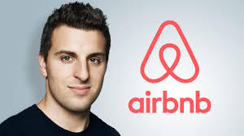

## 设计，点亮了创业者的灵魂

很多人认为Airbnb是个最烂的但还能成功的主意。在Airbnb之前我就跟很多技术宅男创业不同，因为我去罗德岛设计学院学习工业设计。

长大后，我从没想过当企业家，事实上我从未听过谁当企业家。我离创业最近的就知道我老家Bob of Bob 比萨店。我父母都是社会工作者，当我告诉他们我去的艺术学校，他们认为我肯定回老家。我父母总说如果我得到一份工作，那肯定是卖医疗保险的。

去了罗德艺术学院对我影响很大。我之前被教导就是如何向前看，做一些常规的事。要是越界做事会请去教导主任办公室喝茶。但在这个学校，他们告诉你**因为你是设计师，你可以改变事情，**正是这种核心思想在我的概念里产生了巨大的影响，所以我才有意愿、有勇气走出去，去改变任何我想要改变的东西。

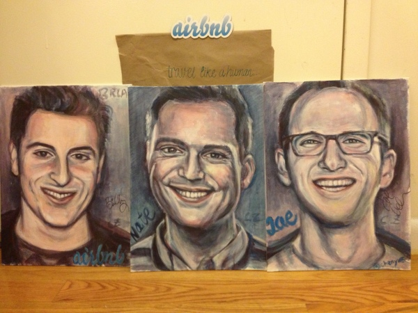

（Brian, Nate, Joe -- Airbnb联合创始人画像 by 苹果姐姐）

毕业后，我得到一份工作。我的一个好朋友Joe（上图右）苦口婆心劝我放下工作去旧金山创业。世界这么大，我们想去看看。我们不知道做啥，但就是想去做点什么。我告诉室友我准备走了，他们都认为我疯了。

## 空气床垫和早餐？多么古怪的想法！

那时我就1000刀的银行存款，当我2007年到旧金山市，得知租房要1200刀，没钱付房租就已经破产了。同时，当时有个国际设计大会，而周边的酒店早就抢光了。我们就想这些设计师来开会总要找地方住－我们又没钱－如果我们创造一个“床＋早餐”就是为了设计大会的。但问题是我们压根没有床－只有3个充气床。这就是我们命名为“空气床＋早餐”，我们第一个网站就是airbedandbreakfast.com. 我们最后就用这个方式出租给了3人并且认为是个很酷很有趣的方法去赚钱。当这三个人跟我们住的时候，**我意识到友情－以前要多年才能产生现在因为住在你家就可以几天做到。**

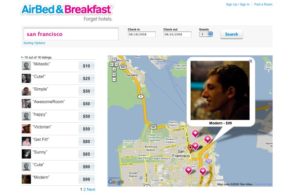

（初期网站）

一般你在现实生活中不会这么快了解一个人，建立牢固感情得很长时间。有个宾客后来还邀请我去参加他的婚礼，因为那次旅行改变了他的人生历程。

在这次经历之后，Joe 把 Nathan Blecharczyk 引荐进来，这是他的一个过去的室友。然后我们决定开办一家公司。核心想法是这样的： 如果你能在租别人家的一间房的时候，正如你订酒店一样方便，那岂不是很好？在世界的任何一个角落都能随时落脚休息！

我们并没有认为这种“空气床＋早餐”能做大。事实上我们做了另一个产品－寻找室友的工具。我们在上面花了4个月，后来发现[http://roommates.com](http://link.zhihu.com/?target=http%3A//roommates.com)是什么鬼？它已经做了这个服务，我的内心是奔溃的，白白浪费了多少时间。

当我圣诞节回家时候，我父母围观我干啥－我不想说我没工作，我说现在我是一名创业者了！ 也就在这个时候，我忽然意识到「失业者」和「创业者」之间其实只有一线之隔。我就告诉他们“空气床＋早餐”，当更深入思考这个idea之后，我决定回头去做这件事。我们为了SXSW 2008大会准备了air bed。而在整个SXSW中我们有两个顾客，我就是其中之一。

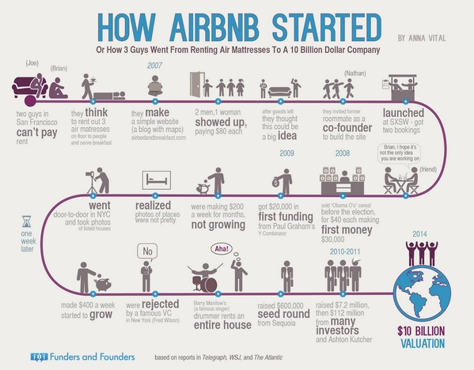

_（Airbnb的成长历程）_

## 无人问津，频遭冷遇的 Airbnb

_Reid Hoffman: 我到现在才知道你还做了室友搜索产品，在我1997年作的第一个公司socialnete中，也有类似功能。_

Brian Chesky:搞笑的是我们当时不认为“空气床＋早餐”能做大。我们认为这仅仅可以来付房租直到我们想到其他可以做大的。我学到的是，**伟大的Idea一开始听起来很傻。**我总是听说如果你的主意有任何好的，你去分享都没问题，因为大家都忽视了。**很多idea来自于你解决你自己的问题，不是改变人生的那种，但可能最后变成改变人生。**

_Reid Hoffman: 你能分享早期上线后，你怎保持前进的？_

Brian Chesky: **其实我们上线很多次的，如果你上线也没人关注，你可以再上一次。我们当时就经历好几次。**

第一次是设计会议上，就3个人用了“空气床＋早餐”，我们上了第二次没人注意，然后我们在SXSW大会上了第三次。这次没有任何支付系统，你必须睡在气垫床上，我们要求房主提供空气床，你还不能躺在真实床上。当时我们遇到一个在伦敦的顾客有这样需求，但他不是为了参会，为什么我们必须为会议提供呢？还有人需要订一个真实的床－为什么一定要是空气床？我们最终把这两个约束取消。

另一个我们不一样看待的是支付－我们希望顾客能够直接预订和通过我们付款给房东。我们可能是第一个这么做的。我们看看ebay和Etsy，他们都做的比我们早，但他们都是需要通过Paypal来付费。

尝试自己做支付这个疯狂想法吓到我们。让大家直接向他人支付并建立人人之间的信用系统，这太脑残了，但我们必须要做。在2008年夏天，我们完成了Airbnb的第一个版本，让你去订其他人的家－也在3次点击内。我们从乔爷爷创造ipod获取灵感－－设计一首歌的操作只有三次点击。我们设计Airbnb的三次点击去得到付费的预订。我们网站的主页，搜索，评价和支付－－大多数核心功能现在还是。这次产品发布后，我们被引荐了15个天使投资－我们希望融15万美金作为150万的估值。结果太坑爹了，七个投资人从来没答复，8个答了，其中四个说，不符合他们的主题，一个说不喜欢这个市场，还有三个留下来。

（Airbnb创始人自曝：当年我们是如何被投资人拒绝的，参考附录）

其中一个Mike Maples，我们上线后很自信，决定不需要准备PPT，就给他看网站。但我们图样图森破了，那天上了Techcrunch就把整个网站搞挂了。真是人艰不拆，在路演中又没幻灯片，网站又挂了，等了一个小时非常尴尬，最后投资人就说呵呵了。**这是我学到的无论什么情况总要准备个****幻灯片****以防万一。**

## 鸡和蛋的问题，到底谁先谁后？

我们创建公司的时候把信用卡放在手边，当时Joe和我总共有3w的信用额度。我们希望渺茫，「鸡和蛋谁更先」的问题。房东觉得有租客才愿意把自己的房间贡献出来，租客觉得有房东肯愿意贡献房间我才愿意租他们的。我们必须双管齐下，在房源的供应和需求两个战线上双开花才可以。同时，我们还面临着更加棘手的问题。因为 Airbnb 的本质就是方便人们在世界各地下脚，这也决定了我们不可能专注于一座城市来开展业务，人们的流动性非常之大，我们必须覆盖到人们经常起飞降落的各大城市才可以。

我们希望通过一些重大事件，比如 Democratic National Committee （DNC），在2008年，有8万人需要来，而在丹佛总共才27000个房间，我们认为这是个巨大机会。我们联系了CNN，NYT，告诉他们Airbnb做的事，他们回答“绝对不可能，人们不愿意睡在别人的床上”，我们联系当地报纸他们也忽略我们。我们对他们宣传绝望了，就开始找本地的小博客。我们做的思路，人们可以Google DNC，就看到一个关于我们的故事，本地的报纸报道博客怎么说的，国家报纸报道当地报纸怎么说的。我们喜大普奔在DNC重要有了80个预订。但DNC之后我们就没生意了，我们才进入一年，负债累累，每个投资人都说不，我们上线了3次，有报道，却很迷茫。当时真是感觉不会在爱了。

**在一个绝望的深夜，我们想如果空气床不行的话，或许我们可以卖早餐。**我们在想出总统选举主题的麦片，说服生产商去为我们做麦片。因为我们没钱付他们，他说可以根据销售来提成。我们打包了1000个麦片，编上号，以40刀一盒去卖，最后我们卖了价值30000刀的麦片，这也成为我们的一个宣传语“**成为一个麦片创业家**”。

2008年11月我们就濒临破产了，就是没办法成功或者少了些天赋。有人建议我们去YCombinator，我说“但我们已经上线了啊”，他们回答“你们都奄奄一息了，申请YC也是救命稻草啊”。 然后就遇到Paul Graham，他觉得这个主意太差了，他说“哪个蛋疼会睡空气床吗，他们脑子进水了吗？”我告诉他麦片的故事，他告诉我们**“如果你们能说服人去买麦片，你们可以说服人们去租空气床**”。**他告诉我们你们是创业公司的打不死的小强（cockroaches），你们为了生存可以做一切。**

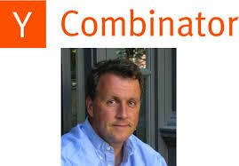

_Reid Hoffman: 但YC并没有让你们数字改变，什么改变了你们公司命运？_

B: YC有两件事情帮助了很多

1- **YC为我们建立一种为Airbnb全力以赴共存亡的方式，之前我们总是有其他事情要做，生活是创业的敌人。PG总是说创业公司不会突然死亡，**它们只会慢性死亡，一点一点的丧失生机。当我们住在一起，我们期望8点起床，12点睡觉，当中都是工作，没有其他的！我们做了整整四个月，我们全身心放在Airbnb上。

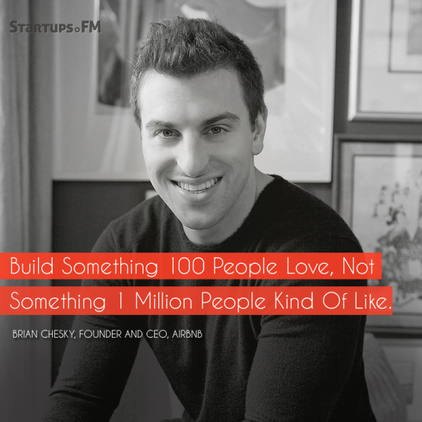

2 － PG给我们路线很多指导。**最重要建议就是有100人爱我们 好过 100w人喜欢我们。** 硅谷有个风气，当你做app你总是期望病毒增长去达到百万级用户。这是最不切实际的想法，而相对来说， 让 100 个人真心喜欢你的产品才是真实可靠的评判标准。我们**没有办法让100万人在airbnb上，但我们可以做到100人热爱我们。**这就是保罗 格莱厄姆曾经说过的 「潜下心来做一件件看似微不足道的小事来撬动增长的齿轮」。让100人爱上你也很难的－让人去喜欢你很容易。在YC，我们从山景城到纽约，我们去见每一个房主。我们住在每一个房主家并写上第一个评论。我们还帮他们拍照片因为那时候iphone没出来，很难将照片传到电脑中。我们问房东“如果我们有个按钮，你点了一个摄影师就上门来拍照片？”房主都爱这个主意，于是我从朋友那借了照相机。房东们看到我拿着相机出现，都惊呆了，没想到创始人亲自来当摄影师！如果有一个人因为你的种种小事被感动，进而爱上你，那么他的这种爱是可以散播开来的，这也是「增长」的真谛所在。

在YC的最后，PG告诉我们要尽快盈利，因为2009年红杉资本发布一个好日子不多（cash is king)的演讲，**警告经济危机对风险投资市场的影响。PG 警告我们说在DEMO day也许就没有投资人，你能想象吗？我和我的小伙伴都惊呆了。。****我们需要延迟融资或者对盈利要有计划。**尽管如此，我们还是足够的运气从红杉拿到60w美金的融资。

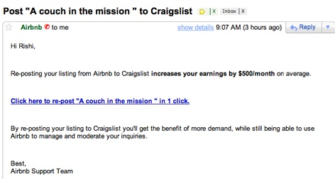

_Reid Hoffman: 当你们在纽约做的不错时候，怎么转移到其他城市的？_

（邮件营销，Craigslist集成工具）

B:每个人总喜欢说有网络效应，当我们房主是纽约的，但顾客来自全世界，这跟其他的市场不同，比如UBER就是供需来自同一个城市。我们房东虽然都是纽约人，但是客户却已经遍布全天下了。早期我们目标在一些事件中：DNC，总统就任，音乐节，世界杯，奥运会。**事件和PR是我们早期宣传的动力。**我们也做了一次点击就发布的 Craigslist集成，房东可以发布他们的列表到craigslist可以方便扩散。**我们使用Google广告但我们主要靠口头传播和PR。我们没有做很多合作伙伴商。作为创业公司，合作伙伴可能因为太多条文而不成。我们发现在媒体上主意越荒谬，故事越有传播性。当我们去新的城市，我们花时间在教育新房主，我们定期组织聚会去催生市场。**在旧金山，见创始人没什么稀奇，但在小城市，大多数人从没见过他们使用的产品的创始人，这是非常新鲜的。我去很多城市旅行，我们的房主非常兴奋的见我们并告诉他们的朋友。我们跟踪了一些数据发现当他们见了我们活人，活跃度更高。总之**就是搭建一个社区。**

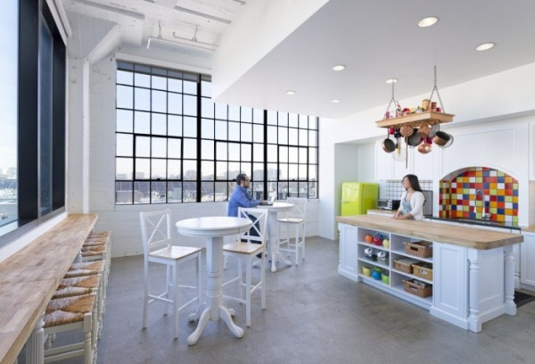

## 要让客户爱上你，必须建立超越 5 星之上的 7 星标准！

_Reid Hoffman: 这是个很好的启动故事，那Airbnb有什么独特的地方呢？举例子，Aibnb注重设计，有7星的设计理论？_

B: 顾客目前的评分体系是5分。但5分的话你就是非常难才到4分。到达5分仅仅是足够好，**我们希望打造一个产品你是如此热爱还告诉别人**。旅行有这个潜力去改变你的人生－我遇到旅行中的人确实改变我。在Airbnb，有顾客联系公司并要求6星加入到评分体系。下面是我们想到的超越5分的有钱任性方案：

_5分服务_－ 你离开机场，去airbnb，你的房主在家等你开门。比这差一点，比如房东迟到了（4星），最差1星就是永不出现。

_6星服务_－上面所有＋你的房东去机场接你。

_7星服务_－上面所有＋豪华轿车在机场等你，里面早就准备好你最爱的薯片和椰汁。

_8星服务_－当你到达机场，有个盛大游行迎接你的到来。

_9星服务_－当你跨下飞机悬梯，有5000个尖叫粉丝举着你的牌子恭候你的到来。我们称之 甲壳虫之来访逼格。

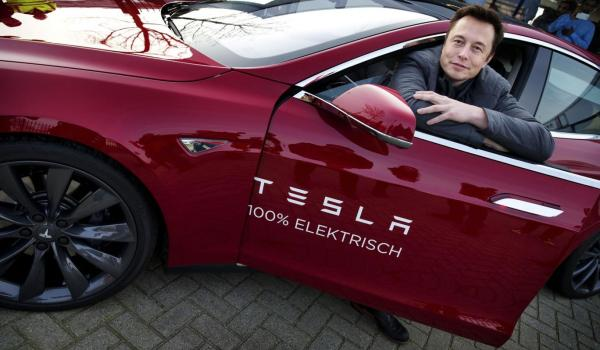

_10星服务_ － 我可以往上到30星，10星意味着当你到来时，一辆印着你名字的特斯拉等候你。而司机是Elon Musk（上图），Elon哥带你装B带你飞：）。

这是夸张描述的，但意思是你一定要找出那爱你的产品爱的死去活来的 100 个人 。5 星也许是他们的期待值，但是你需要做的更多，远超过他们的期待 。**我们经常去模拟这些场景，当你到达10个星，6星就不再恐怖了**。这种练习可以经常在公司做。比如我们对面试体验做了故事场景的编排，想到如何做到7星体验。

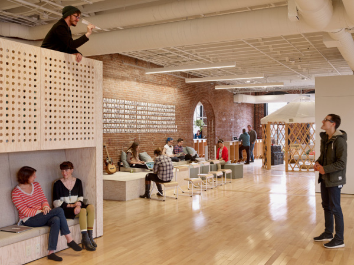

_Reid Hoffman: 7星服务确实挺有趣的，并且不仅仅是网站或者APP－你是讨论整个体验？_

B: **产品就是你顾客购买的。**你一定要找出那爱你的产品爱的死去活来的 100 个人 。5 星也许是他们的期待值，但是你需要做的更多，远超过他们的期待 。**我认为我们是O2O的生意，这也是互联网的下一波。互联网开始把东西放到线上，在把东西连接起来，这样互联网回归到真实世界。当我们讲Airbnb体验，我们会画出全部体验的每一格，不仅仅是产品的线上部分。**

_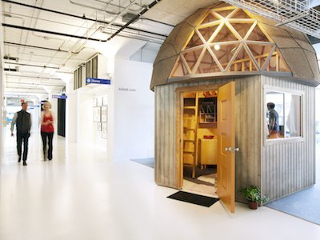_

_(著名的蘑菇会议室）

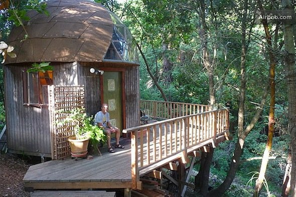

原来的样子）_

## 让设计精神浇灌出旺盛的公司文化

_Reid Hoffman: Airbnb也把design thinking应用到文化甚至办公室中，你怎么解读？_

B: 我把**自己当成设计者的。乔布斯说过“**设计并不仅仅是它看着像什么，或者传递什么感觉， 设计是它怎么运行工作的**”**如果按照这样一条标准来衡量的话，那么世间万物都是经过设计的。你可以设计一个产品、一家公司、一个组织、一栋大楼、任何你想要的东西。一旦你意识到了任何东西都是可以被设计的，你就无需局限在原有的概念中，你会重造万事万物。

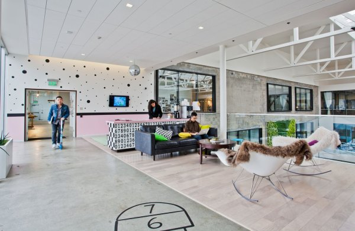

（Airbnb的开放空间，家居设计）

**我们就开始脑洞大开，想的是办公室设计。**Airbnb 是覆盖了全世界的各个住所，所以我们希望我们的办公室是与众不同的。人们喜欢办公室，待在办公室的时间甚至要超过在家中。我们需要传达出让员工感到快乐的东西。办公室也是我们的比较优势。在我们一开始的办公室，当你一走进大厅，你看到的是满墙贴着的房东展示出来的照片。看着这面墙，我觉得应该有更好的方式来展示这些房子，而不仅仅是局限在这几张照片上面。有一天在我回家的时候，经过了一家家具店，展示间在夜里被灯光照的熠熠生辉。我想到当我们在开会的样子，第二天我们就在那个家具店开会，真的挺开心。

我们在开会的时候就讨论，是不是以后我们的会议室可以仿照房东们的家来设计呢？我们给房东打去电话，征求他们的同意，他们都很震惊并喜欢它。我们现在有上万不在Airbnb工作的人，他们会飞到我们这来参观公司。我们办公室就是招聘时的亮点。这是一个设计如何应用的例子。

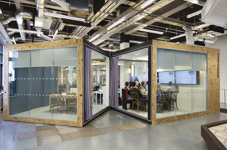

_Reid Hoffman: 在早期，你花了一年时间住在Airbnb家里，真是碉堡了，__为啥这么做？_

B: 这是有些意外，当我启动Airbnb是在公寓里。我不想搬进办公空间，于是我们就把家办成工作室。当我们有15人，我们在3个卧室的公寓里，我们就没有空间了，然后就把卧室变成会议室。我去Craigslist去看新的房子，我就问自己，为啥这么做？我应该用Airbnb。我认为这是测试产品的好玩方式。开始计划是一周后来变成一年。这给团队传达信息是**在 Airbnb 工作并不是项单纯意义的差事，它更是一种使命，一种召唤，你能带来共享文化，让人们相信你正在开创的事业 。这不仅仅是一个网站，一款 App，一个系统，一个屏幕，而是一份使命，打造一个全新的世界。而这只有你和你的产品朝夕相处才能够实现。**

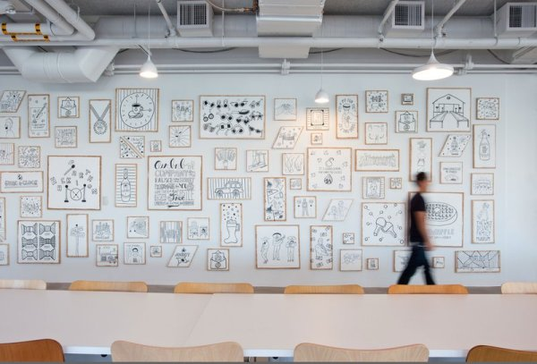

（墙上挂满设计图案）

## 要打造你想要的公司文化，首先要把好第一道关：招聘！

_Reid Hoffman: 除了你设立榜样和设计办公室，还有那些你来设计文化的？_

B: 我认为**文化是一种做事的共同方式。没有好的或者坏的文化，但有弱和强文化之分。我希望有强文化，一个分享的使命，一种分享的做事方式。**文化的很大一部分是招聘，你希望跟谁一起长时间共事，如何去除不符合文化的人。我早期是面试每个人的，直到200人。我的团队跪求我别这样了，因为这没法扩张。**现在在招聘过程中，除了功能技术面试，我们还让每个人面试文化部分。**两轮独立面试者测试6个核心价值。其中一个是「主人翁意识」－热情好客帮助别人。我们可以通过应聘者之前的生活工作背景以及调查问卷中得出答案。

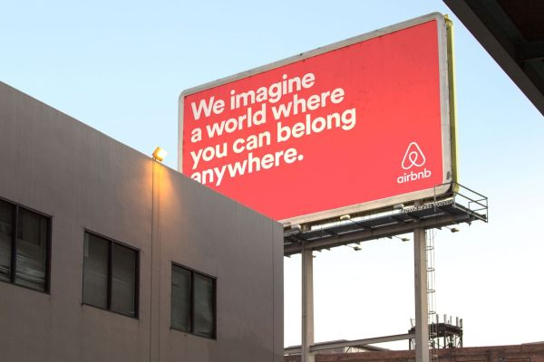

（标语，你可以拥有世界上任何地方）

_Reid Hoffman: 当你到一定规模，仍然去坚持文化的？_

B: 我跟以前一样做很多文化相关活动，我会让一些人代表我去做。我以前做所有的面试，现在我去选面试官，建立内部循环去培养面试官。我以前跟每个新员工one－on－one，现在是周会，也为国际招募录制视频。我也在每晚给整个公司写信。不是什么战术email而是有一些想法驱动。**在规模化时候你需要持续去做重复事情。规模化的文化就是不断重复－重复那些重要相关的东西。**

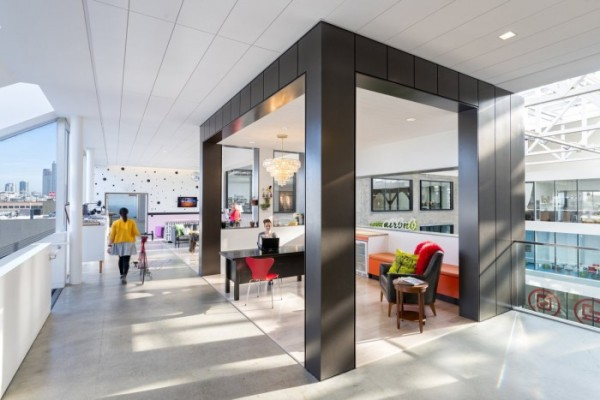

_Reid Hoffman: 对于规模化的挑战，什么东西你需要变，你也需要学习？_

B: **招聘和管理是对规模化更重要。**当你开始时，定义身边每个人不是最重要的，在产品市场定位前，每个人做任何事。在产品定位之后，我做少一些，而集中在招聘，战略和文化。我在Airbnb之前从未管理其他人，也不知道怎么管，特别是比你年长的这是很奇怪。在扩张阶段，你必须学着逐渐摆脱「直觉」而是用「数据」来说话。在市场产品契合点找到之前，数据对我们来说不重要， 更重要的是与客户展开的一对一交流。在市场产品契合点找到之前，你的全部精力都要放在让自己不要死掉这件事上，而到了市场产品契合点之后，你可以考虑一些更加长远的事情。当你的公司刚刚成立，你的计划绝不超出 2 个星期，但是过了市场产品契合点，你需要的是一份计划，一份路线图，一个经过深思熟虑后的战略方案。

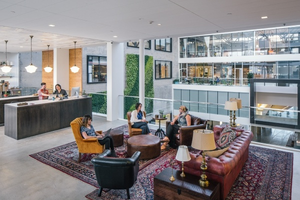

_Reid Hoffman: 我们经常发现这个阶段的做法到下个阶段不管用了，你从非常短期的聚焦，事必躬亲到有一年规划和管理层，决策层的转变。_

Brian Chesky: 在有关 Airbnb 的话题上，几乎每一个人都在问我创业故事到底是什么样。每个人都想当然地以为我们只是碰巧捕捉到了一个绝妙的想法，然后就自然而然顺势起飞。人们往往会忽视初创公司那些艰难的岁月。**当进入到2，3，4，5阶段，其实比1更复杂。第1阶段很容易－解决你的一个问题，找到100热爱你产品的，找到好的合伙人。这些都不是很复杂大家也能从别的书学到**。但之后的事情可能就没记录了。我可以走出去去问其他大公司的CEO，但风险是他们可能说的是错的－或者在我的条件下不成立。

有个CEO告诉我每6个月如果你保持你的工作就是一个升职，但我不这么认为。我认为**作为高速成长公司的CEO，你需要每6个月去完成全新的工作**。这就像你要从专业的橄榄球选手到棍球选手，每个阶段就是完全不同的运动。从你创办公司到增长到1000人的这种例子非常少。你需要在每个阶段变的非常不同。现在演讲和写作时我的主要工具－在早期我们就围着桌子一些人。突然这些技能开始改变你还要适应。我自己看到并知道哪些人能做到和不能的。两个品质在其中很重要。

1\. 聪明机敏

2 求知欲强

**如果你认为你知道一切，你是不能做大的。我知道自己不知道，就厚脸皮去听取反馈。**我记得毕加索说过，“我花了四年画的像Raphael，但花一生的时间画的像婴儿。”

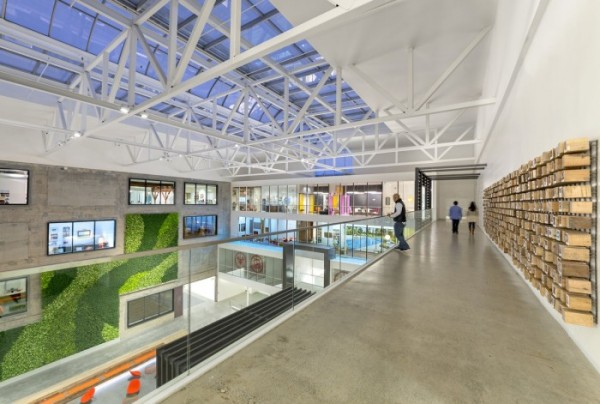

_Reid Hoffman: **我称之为“永远的学习者”。第一次我们见面时候，Brian就问我，我怎么才能做的更好？这是第一次有人见面问这一问题**。对于竞争，Airbnb如何竞争和面对国际化挑战？_

Brian Chesky: **第一阶段时活下去。不死就能够撑到下一个。**

**第二阶段是救火。到处都是问题你需要去马上解决。**

**第三阶段是其他人看到你做的，其他公司想复制和摧毁你。外部的威胁是竞争者和政府。**

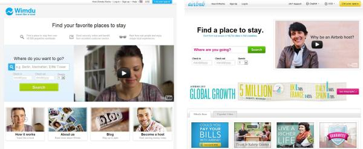

（Wimdu和Airbnb的对比，节操碎了一地）

当我们开始起色就被Samwer brother抄了，整个人都不好了。当时最火的公司是Groupon，增长最快的互联网公司。他们增长那么快也是因为买了欧洲的Airbnb克隆版，Samwer Brothers。这是我们需要去战斗的，我们当时从Greylock Partners融了700w美金，在2011年，Samwer brothers融资9000w，招了400人（Airbnb那时候才40人），开了20个办公室，也是挺拼的。Airbnb不能承担失去欧洲的代价，因为我们作为旅游网站需要覆盖全。这到了“下赌公司命运”的时候了，Samwer Brothers给Airbnb提了收购提案，希望Airbnb买下它，但这是一个非常巨大的财务和文化成本。我去向一些最聪明的人咨询，包括Mark Zuckerberg, Andrew Mason, Paul Graham, Reid. Andrew警告说Samwer brothers是无底线的，会做任何杀掉我们的事情。**Mark说不要买因为最后是最好的产品会赢。Paul说他们唯利是图，我们是理想主义，通常后者赢。我们思考，虽然Samwer brothers 是克隆我们的，但他们不想长期去运行公司，我们承认他们也许一年内能很快行动，但十年还是很难去维持。****Airbnb 要做的是长久的事业，而这种长远眼光也会逼迫 Samwer Brothers 做出同样的事情。**

最终正如大家所见，Airbnb 胜出了，因为它真的拿出来了一个更加优秀的产品，并且围绕着产品培育出来了一个充满热情，热爱 Aribnb 的社群。当然，Samwer Brother 给予 Aribnb 的一份厚礼就是让 Aribnb 明确意识到了市场上随时都有可能出现的致命威胁，也让 Aribnb 的行动更加迅速，快速成长起来。用了一年时间我们就从一家立足于美国本土的公司成长成为了一家国际化的大公司。

## 政府投射过来的明枪暗箭

_Reid Hoffman: 另一个触发器是政府。你们怎么面对唯一的挑战的？_ 

Brian Chesky: 这个问题就像你好好在街上走就被人揍。你都不知道从哪来的。Samwer Brothers是第一个，政府是第二个。

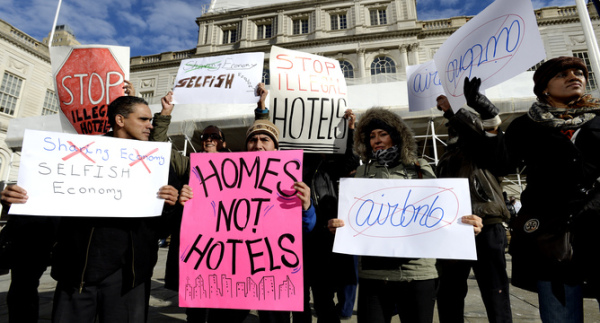

(纽约反对Airbnb的游行）

在2010 纽约通过法律，房东可以把房子转化成旅店。我问了无穷次这个法案对Airbnb的影响，总是说没事。几年后我们收到纽约市的首席检查官传唤，说我们涉及违法，他们要求看所有顾客的数据试图找到破坏纽约市租赁合同，还是挺毁三观的。总检察官可是一群让人不寒而栗的人，特别是纽约市的有权威，能把人送进大牢。我都不知道该怎么跟律师团斗争，但他们就是要去扫描我们用户数据。在他们想知道我们是否违法之前，我们不想让他们得逞，就主动挑战他们并且赢了官司。

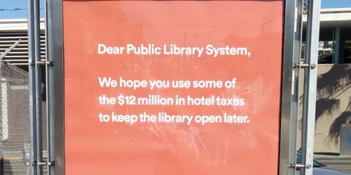

_（Airbnb为公共图书馆做贡献）_

_Reid Hoffman: 创业公司如何做好政府关系？_

Brian Chesky: 我们的第一直觉是抵抗，在2010年，我们进入政治角斗。但是后来我们又仔细斟酌了一番，意识到其实这种方式并不适合于我们。我们是一家能让大家和谐共处的公司，拥有这么激烈的反抗姿态跟我们提供的产品和服务不符。**我们开始通过友好合作而不是斗争。我之前信念是如果人们不喜欢我，我不会跟他们聊。但我学会跟每个憎恨我的人见面，因为如果你有机会了解我就不会那么恨了。**我们开始频繁走访各座城市，让那些恨我们的人都出来聊一聊他们眼中的 Airbnb 是什么样子。几个月之后，恨我们的人明显没那么多了，似乎大家都越来越理解我们的使命愿景是什么了。我们开始跟参议员，政治家定期会晤，我们居然有了旧金山的选举权。因为我们是现实世界的真实生意，我需要学的好多。**这种让百万人居住****在全球各地****陌生人家里是责任很大的，这要保护他们安全**，很少有公司面对这么多麻烦。这些挑战不会停止，最重要的收获就是学会了如何快速地学习和适应新东西。

## 巴黎恐怖袭击事件

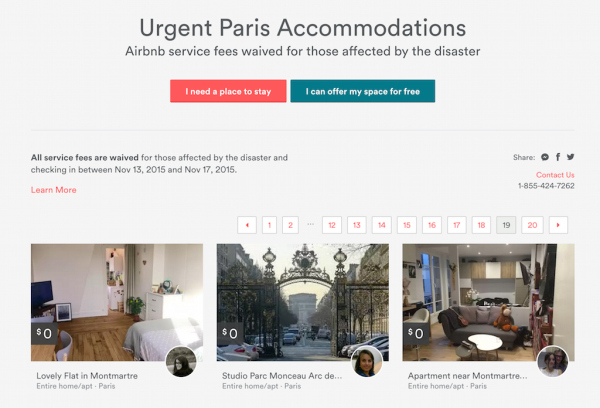

_（这次巴黎袭击中Airbnb团队做成的响应）_

Brian Chesky: 这是件非常悲伤的事情。在11月12-14日，我们刚好在巴黎举行Airbnb Open的第三年庆典活动。这是我们传统的年会，我们邀请世界各地的人的我们员工和房主。今年，我们有640个员工，5000个房主。除此之外，我的父母，女友，姐姐，这些都是我生命中最重要的人都在。我们刚好过了2天，那时我完成了主题演讲，准备休息并庆祝成功。我们主办了晚宴和前40个员工一起庆祝，这时候我的电话开始报警震动。我很快看新闻说在餐馆有袭击，我们继续但手机也继续震动，这次是在巴黎剧院有100人质事件，然后是巴黎体育馆发生炸弹爆炸。当我们举办庆祝活动，这个城市先后1小时发生7次袭击－特别是我们员工和房东正在巴黎访问的晚上。我们感受到害怕，觉得可能有更多袭击并且到处都有可能。其实，我们的一个员工当时就在剧院附近，看到了人质四散逃亡的情景，他们都是眼睁睁看着身边的人倒在血泊中的啊。我们团队中还有一些人当时在体育场，爆炸发生后大家快速离场。

这是我从未处理的情况。我们马上召集安全负责人去搭建远程指挥中心。我在的房子有2个卧室，总有50人，我们利用浴室和其他可能的空间躲藏。我们被告知可能失去网络，所以我们开始迅速清点员工人数和房东人数。我们一个一个的打电话，确认每个人是否安全。下一步我们联系当地政府，联邦政府，和我们在巴黎的房主（300人）去开放我们的家，为了需要安全的人们。我们取消了会议，联系了员工的家人，保证人人有安全的航班回家，并尽我们全力去慷慨支持我们的员工和房主。我从来没对待像这样的紧急情况。

**整个经历提醒了我这种责任感。Airbnb有一千员工，十万房主，一百万的客人，他们的生命依靠我们，这种责任感是真实的。这是我们亲身经历过的也体会到生命的卑微。**

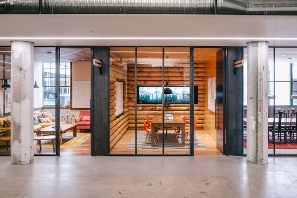

_观众提问: 你是怎么学会学习的？_

Brian Chesky: 我的建议是：

如果我让你在一周内学一个主题，基本的UI设计，你会怎么做？读大量书，问人，做练习？这是一个很耗精力过程，但你可以做成。

那么问题来了，我让你在同样的一周去学UI设计，前段开发，会计，并且企业注册，你怎么做？你没有足够时间去学每一样。所以**你要找到一些捷径。一种方法是从权威出处来找资料。如果**选错了学习资料，那么你就瞎了； 但是如果你找对了资料，那么你就无需再读其他书了。**比如对于管理，我就看High Output Management**。看这一本就够了。 另外你变得成功还有一个好处就是你能跟很多非常成功的人在一起，这样能不断增加你前进的助力。当然在你还没有成功之前，你也同样可以通过书等方式接触到行业内最优秀的人。

最后一点建议是不要怕提出问题请教 。根据我的经验，绝大多数的人都将会帮你的。我们现在就是分享信息和知识。我同样可以厚着脸皮问 Reid Hoffman 问题，也许会很烦人吧，但是我不在乎。我只是想要获得成长。

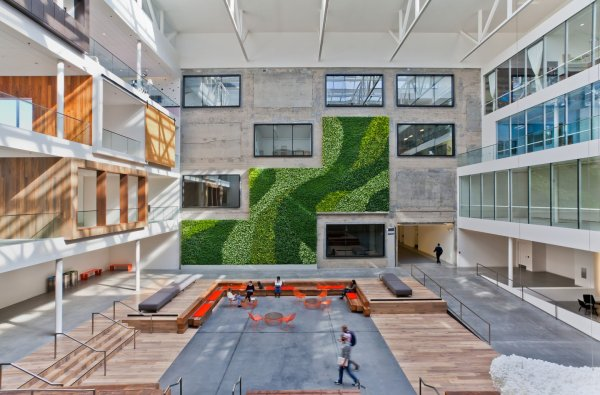

_（Airbnb办公室全景）_

_观众提问: 你现在的最难是什么？_

Brian Chesky: 有个从城市到联邦转化的挑战是，Airbnb现在是不错，我们在Scale，我们有高层管理层。如果我离开公司一段时间，还能正常运行，核心产品还是运转。我想有两个挑战：

1\. 为了我们全新的组织形态而构建新的公司文化。曾经适用于 500 人的公司文化并不适用于 2000 人。我现在依然感觉公司仍然是飞速成长期的初创公司，是由使命在后面推动着的，但是在我们的队伍实现规模化增长的过程中，我们的企业文化也要随着一起变才可以。

2\. 很多牛X公司有不止一条生产线：Apple, LinkedIn, Facebook, Google。我们核心产品在增长，但是在新产品背后又有哪些机会？这个我们得潜下心来研究？

我现在知道怎样创办一家初创公司，但是你该怎么在目前既有的商业模型中开发出新的产品？这和白手起家创办公司又是完全不同的另外一个挑战了。

另外一方面，你手边有所有趁手的资源，顶尖的人才，充足的资金支持，等等。但是内部文化和一些固有思维会坚守自己固有的方式，人们都不希望你把最好的人才从他身边拿走，重新再组建一支队伍，你说对吧？从「单核」公司过渡到「双核」公司是一次非常重大的转变，但是任何想要走得长远的公司就必须经过这一切。如今我们卖的产品有可能在 10 年之后完全不再吃香。

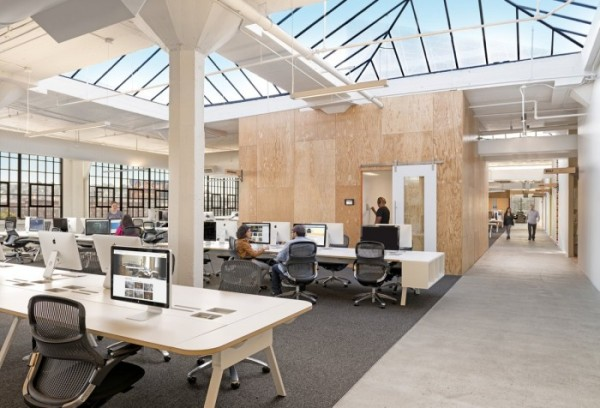

**参考资料：**

1.  [Scaling Airbnb with Brian Chesky](http://link.zhihu.com/?target=https%3A//medium.com/notes-essays-cs183c-technology-enabled-blitzscalin/scaling-airbnb-with-brian-chesky-class-18-notes-of-stanford-university-s-cs183c-3fcf75778358%23.fkitgnuha)

2.  [Inside Airbnb's New San Francisco Headquarters](http://link.zhihu.com/?target=http%3A//officesnapshots.com/2014/04/02/inside-airbnbs-new-san-francisco-headquarters/)

3.  [A Tour of Airbnb’s Gorgeous New San Francisco Headquarters](http://link.zhihu.com/?target=http%3A//www.officelovin.com/2015/07/31/a-tour-of-airbnbs-gorgeous-new-san-francisco-headquarters/)

4.  [The 15 Coolest Offices In Tech: Airbnb Office Tour](http://link.zhihu.com/?target=http%3A//www.businessinsider.com/airbnb-office-tour%3Fop%3D1)

5.  [Airbnb创始人说别搞砸了公司文化，他们的公司的文化是什么？](http://link.zhihu.com/?target=http%3A//www.pingwest.com/what-is-the-culture-at-airbnb/)

6.  [Airbnb创始人：从“麦圈杀手”到高调入华，越成功，越孤单](http://link.zhihu.com/?target=http%3A//www.cyzone.cn/a/20150821/279022.html)

7.  [Airbnb创始人自曝：当年我们是如何被投资人拒绝的](http://link.zhihu.com/?target=http%3A//www.cyzone.cn/a/20150910/280283.html)