# 19: LinkedIn

来源：[https://zhuanlan.zhihu.com/p/20391598](https://zhuanlan.zhihu.com/p/20391598)

> 这一期是CS183C课程的最后一讲，整个系列Technology-enabled Blitzscaling 也陆续整理完毕，这也是倾注了我的很大精力，也是希望在2015年年末给大家一份礼物。由于时间仓促，有些不完美地方，我会继续完善更新。感谢大家的支持。
> 
> 2008年底 Jeff Weiner以总裁的身份加入LinkedIn，之后担任首席执行官。他的到来使LinkedIn的使命、价值观以及战略重点变得更加专注和明晰。

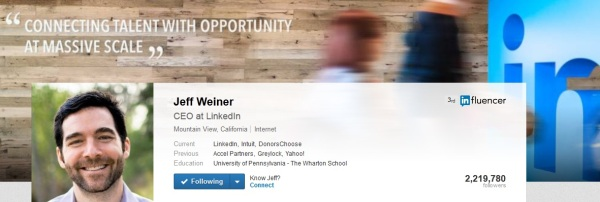

> ```
> 版权声明
> 本文首发自微信公共帐号：donglaoshi-123；
> 作者：董飞
> 无需授权即可转载，但请自觉保留以上版权声明。 
> ```

## _加入时机_

> _雷德·霍夫曼：当时你来LinkedIn时候有400人 -从你的角度来看是什么样子？_

杰夫·韦纳：我记得我2008年12月来到LinkedIn，当时有338人。这是一帮非常有才华的一群人。里德和丹·奈伊（LinkedIn的前任CEO）也都在。

来LinkedIn之前，我在Greylock基金做EIR（进驻企业家），我发现LinkedIn比我看到的能做更多。在面试LinkedIn时候我由衷感叹“原来我不知道LinkedIn做了这么多”，这是为全球劳动力市场创造无限价值和潜力的平台。

LinkedIn做这么多东西的一大原因是因为**里德的第一原则－保留可能性（preserving optionality）** - 这也是他作为成功的投资人秘诀。**另一大成功原因是早期投资的很多方面到达临界点。我们思考如果我们只能做一件事会是什么，去定义你的核心。**

## _所有的东西放在一个页面中_

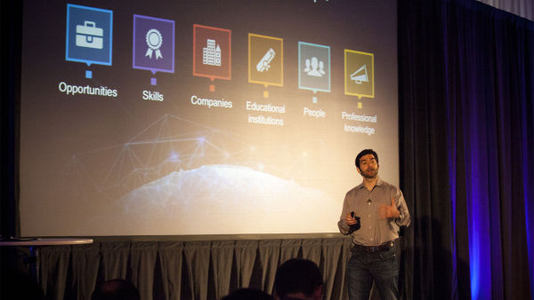

> _雷德·霍夫曼：LinkedIn从村级__成长__到城邦阶段。你加入时候为了去增长规模，做了什么？开始的100天怎么过的？_

杰夫·韦纳：在开始的100天，我听了很多。我会见了每一个团队每一个人 - 包括一对一团队午餐。去深入了解每个产品线。

我努力学习了解LinkedIn前进方向和团队角色。我并没有去做100天计划，我认真听取最了解LinkedIn的人，领导者和团队。

在LinkedIn和Greylock之前，我一直在雅虎做高层，参与了很多不同的业务。**这是一个巨大的优势，但在特定的时间点却成了我们的阿喀琉斯之踵。**雅虎垂直市场有不少竞争对手，我们输给了那些非常集中做产品的企业，比如谷歌做搜索，亚马逊做电子商务。

在雅虎学会了最深的一课是当我申请LinkedIn时候，**要发掘什么是LinkedIn的核心。我所采取行动去书写使命，愿景，战略，重点，文化，可衡量的目标等 - 这些基本上都是公司的要点。**

**所有的这些东西应该都放在一个页面上。这可能需要一个以上的页面，但我认为可以去很好约束，凝聚这些事情，放在一个页面内保持简洁。**

## _规模化前的准备_

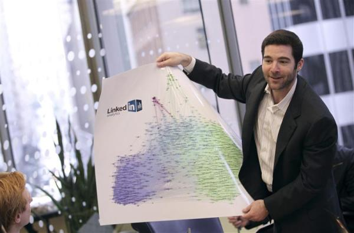

> _雷德·霍夫曼：我从你身上学到的是在规模化前把需要准备的写下来。可以进一步说你做了什么准备？_

杰夫·韦纳：公司经常混淆的是使命与愿景。它们是类似的，但很多地方又不同。

*   **使命 - 使命是首要目标，整个公司参与去实现。一个任务是可测量的，可实现的。我们的使命是连接世界的7.5亿用知识工作的职场人士，并帮助他们更高效，更加成功。** 
*   **愿景 - 愿景是梦想。愿景是公司的指北针旨在激励大家。从历史眼光看，愿景是不可完全实现也没法衡量的，但意义是创造同一个目标。我们的愿景是为世界各地的劳动力创造经济机会 - 包括所有30亿的人。** 

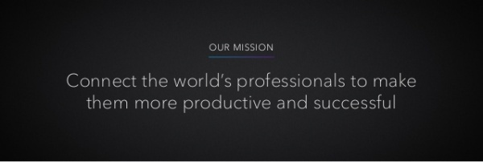

> _观众提问：你怎么知道什么时候制定公司的愿景和使命 ？_

杰夫·韦纳：如果我是从头开始做一个创业，我不会制定愿景或使命。尽管LinkedIn没有把这些东西写下来，里德和创始人对什么是好的愿景和使命是有感觉的。

事实上，如果你看一下LinkedIn给Greylock看的[B轮融资材料](http://link.zhihu.com/?target=http%3A//reidhoffman.org/linkedin-pitch-to-greylock/) - 准确描述Reid和创始人如何阐述愿景，这也是为后来写下来打下伏笔。尽管他们从来没有写声明，但他们知道想去的地方。

_雷德·霍夫曼：杰夫创造了一个共同语言，让大家可以在不同团队使用。当你15人时候这并不重要，但是让10000人达成共识很难。杰夫意识到我们并没有为规模化设立 - 这是他加入时做的事情。_

杰夫·韦纳：当你公司只有15人，如果你想开全体会议，就直接说“让我们在这谈吧。”当你的公司有150人，你得叫大家到食堂留点时间去开。如果是1500人，分布在多个地点，你就不能去食堂了。

**如果使命和愿景并非成文 - 就会有真空，公司的员工将这种真空放大去做他们认为应该做的方式。这就是为什么高速增长的公司出轨的原因。当公司变大很难让人们保持一致。**

## _文化的力量_

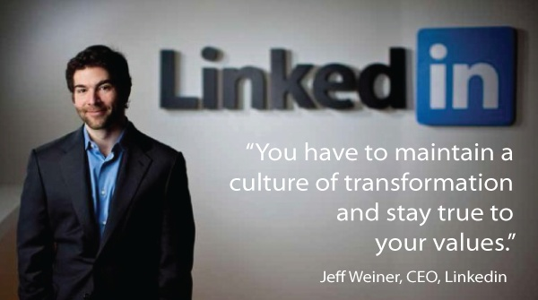

> _雷德·霍夫曼：文化是可以帮助人们_达成共识_的工具之一。在LinkedIn我们之前也有文化，但从来没有定义大规模的方式 - 你为建立这个文化做了什么？_

杰夫·韦纳：**我相信最重要的是对文化有一个共同的理解。文化是企业的集体人格 - 包含公司里面的人。文化不只是你是谁，而且是你想成为谁的抱负。它为公司提供一个要达到比今天更好的理由。**

**文化的一个问题是，如果你不通过走去走，不通过练去练 - 人们会认为这一切都是纸上谈兵。**

当我加入了LinkedIn，我被问的问题是 - 什么才是我们的文化？我最初以为这是个玩笑。我以前在别的公司，但文化对我们不是一个重点 - 我不需要去想它。

这又回到了之前我所谈论的 - 真空的性质。随着招聘增加，从已经是大规模，有强烈文化公司招了很多人。**如果你的公司没有文化，那些员工将携带自己的文化来同化其他人。**

对于不是总部的办公室更重要。**如果你的公司没有一个强大企业文化，在外部区域没有文化大使 - 该办公室的负责人将灌输自己的文化。**

在我加入了LinkedIn，Arvind领导我们的人力资源部门，带动了从底部建立LinkedIn的文化评价。**他采访LinkedIn的核心员工，并纪录他们想要的东西，他们想要的个性，他们想要什么样的办公场所等。我们花了很多时间用正确的短语定义文化。因为短语和故事都有真实的力量。**

**很容易在你的公司墙上画出文化和价值观。如果公司的领导不遵循价值观，没有遵循价值观来招聘，没有通过这些价值观来来评估业绩 - 那它也不值得印在纸上。为了确保人们相信你的价值观和文化 - 你必须让组织中的所有人去强化它，招聘和奖励。**

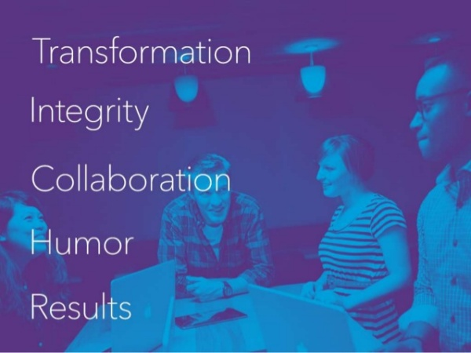

## _领导者的两个指标_

> _雷德·霍夫曼：你如何培养领导者，你怎么知道谁是未来领导人，怎么__内部__培养领袖？_

杰夫·韦纳：对于领导者，最重要的两个特质有：

*   **问题解决&lt;=&gt;教练** 
*   **战术执行&lt;=&gt;前瞻性的战略思考**

教练 - 创始人往往是善于做事的人，所以他们希望解决问题，而不是指导人们解决这些问题。但问题是当你组织里新人，而创始人替他们解决了，他们会继续回来找创始人来解决问题。这不会规模化，**你需要教他们去解决他们自己问题，接着你去教更多教练去解决问题，这是真正的规模化。**

**战术与战略 - 执行力是团队做的不错的。你必须留出时间专门为主动的战略思维 - 我个人一天为战略留出90分钟。如果你正在做的只是战术，这很难带领一个组织 - 那只是整天去救火。**

**当你小的时候可能善于把事情做好。变大后，这需要一个转变，变成善于战略思维和指导，而在同一时间内执行和解决问题。**

## _引入教练_

> _雷德·霍夫曼：对我来说最令人惊讶的事情是，你加入后又雇了教练到LinkedIn。要是创业者会认为是疯了。雇的人不是做一个产品或销售或做与产品的任何东西 - 你为什么要聘请？_

杰夫·韦纳：企业请教练，通常就是过过场。你认为这是不值得的时间 - 如果是一个创业公司，这是最后一件要做的事。

**然而，一旦你规模化 - 你需要一个领导团队让事情发生在手下身上。这时导师来开发，培训，了解他们的恐惧和力量的重要性，帮助他们发展较弱的地方。这需要时间，并且需要有人知道如何教。**

当我在雅虎，他们引进Fred Kofman教练，他在伯克利学经济也是MIT教授。我也不抱多少期望，我甚至第一次会没有去。但我的整个团队表示这家伙非常厉害，希望我也花时间去听。我印象非常深刻，他成为我的导师，也成就了我的雄心和事业。

我后来邀请他和我一起加盟LinkedIn。当时，他一边做工作一边在世界各地旅行，但他看到LinkedIn的平台实质，决定加入并帮助我 - 他对我们是无价的。

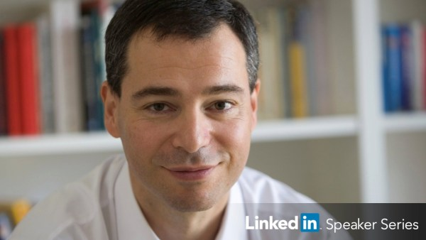

**他就像信奉佛家的自由主义者—保持第一原则，同理心和系统性**。他是我见到的最启发商业智慧的人。每次跟他的对话，我都学到了也改变了我对世界的一些看法。

他不是传统意义的教练，他自己有公司Axialent去帮助其他领袖更加小心和成熟。

**Fred试图给我一些理论工具去解决问题。最后Fred很有启发的话是, “不要过来为我工作，而是来为使命工作”。** 

**他会讲全局最大值和局部最大值－如何让人跳出当前环境去提升自己。给一个足球例子，守门员工作是什么？很多人会说是阻止对方得分。真正的职责是赢取比赛的胜利。同样对球员适用。当你把工作局限在你自己的角度，就是局部最大化。当教练让个体去引入比他们自己更大的东西，这才是力量。Bezos称之为传道士而不是雇佣兵。** 

## _同理心管理理念（Compassion）_


> _雷德·霍夫曼：你开发了一个名为富有同理心的经营管理理念- 是什么呢？为什么它对规模化很重要？_

杰夫·韦纳：在以前的公司，我的老板对某个员工很沮丧 - 破坏他的领导，让每个团队成员感到沮丧的。在我们的一对一对话中，我告诉我的老板对着镜子反思自己 - 你让这个员工陷入这种角色，使他们感到沮丧，这是你的错。

我的老板第二天给我很多想法并感谢我。之后，我才意识到在对我自己的团队需要做同样的事情 - **我需要在管理上更具备同理心。**

**我说的希望因为它真的很难。 第一件事情，人们试图用同理心的管理感受是 -与你喜欢的人很容易做到这一点 -但对于相处不来的人就非常难。面临的挑战就是同情心不是有条件的。**

这有怜悯和同理心之间的差异。有一个很好来自达赖喇嘛的故事来说明两者的区别：

**如果你正在走着一条路径，一起去的人被石头压着，一个怜悯的反应会是你感觉疼痛，但你无法提供帮助。富有同理心的反应是你应该设身处地着想，这个人一定经历可怕的痛苦，你在你的力量下做一起能做的，搬走石头并减轻他们的痛苦。**

> _雷德·霍夫曼：如何用同理心管理并帮助你去规模化公司？_

杰夫·韦纳：这又回到了教练的价值 - 它成功地扩展了组织 - 帮助领导训练他们的团队，即使他们没有在房间里也能够带领他们。

**同理心管理减少了冲突，从而降低客户流失率。最重要的是领导和员工之间的信任。他们有通过纽带彼此交流。同理心帮助人们意识到他们都在同一个团队。**

**规模化很大一部分是信任领导者和员工 - 知道每个人都有对方的扶持。如果让这种矛盾积累 - 随着时间的推移它会损坏整个关系建立的基础。**

**如果你知道你的团队成员在后面支持不仅仅是一种竞争优势。同理心管理有助于这一点 - 它创造一种文化，我们都在同一支团队 - 都朝着同一个使命和愿景共同努力。**

## _真正的同理心需要超人的力量_

> _雷德·霍夫曼：同理心总让人想到过于人情味和感性。但如何让同理心获得结果？_

杰夫·韦纳：**组织长期价值的驱动力来自决定的速度和质量。真正重要让公司有价值的决定用手能数得过来。问题是这是事后的总结。同理心管理帮你更好更快做决定。**

**人们认为同理心是一种软技能。我知道，最强的人是最有同理心的。真正的同理心，需要超人的力量。**

我的一个常见问题是 - 如果您在用同理心管理 - 你如何让公司的人走呢？这似乎是最没有同理心的事情。

**如果有人在自己的角色挣扎 - 最少同理心的事情是让他们继续挣扎。这是一个非常困难的事情 - 当人在挣扎（不能克服挑战），他们失去了他们的自信心，影响他们的团队和家庭（将这种负能量带到家）。**

**如果你不想做一个艰难的决定就用其他的方式 - 你对他是最糟糕的决定。最值得同情的事情是提供指导，帮助他们克服挣扎，如果这不起作用，转换做不同的角色，或者一个不同的公司。**

> _学生问：如何让同理心管理适合多元化？如何让有不同世界观的人一起共处？_

杰夫·韦纳：**这是建设多元化团队的重要性。你需要在不同的维度去更好理解。为了做正确决定，你要正反两方的较量。如果你周围都是附庸你的，你总是在和谐氛围中说同样的东西。你就丧失了竞争力。**

**Mike Gamson 说他不关心搭建多元化团队，因为这只是时尚说法，他感兴趣的是如何赢。**

## _像一个主人去做事_

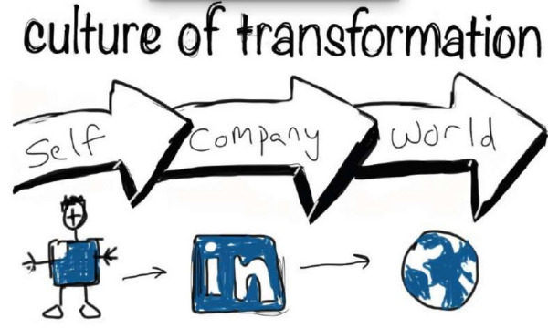

> _雷德·霍夫曼：LinkedIn从338人到，1000，5000，现在10000人，内部沟通变化是什么？_

杰夫·韦纳：沟通是必不可少的。我们的一个工具，是每隔一周的召开全体员工大会。

我开始的时候就挤在食堂。现在，我们在世界各地的30个城市在不同的时区广播我们全体大会（部分用录制观看）。

在全体大会中，我们通过在公司发生什么 - 包括好的和坏的东西。这些会议是无价的，因为我们可以：

*   **每隔一个星期都是重复我们首要任务。** 
*   **我们做的闪光点，突出我们要加强的工作和行为。** 
*   **我们发现哪些环节是不行的 - 对这些领域诚实的讨论。** 
*   **我在不同层次学会了最大的教训，最宝贵的经验教训就是“像一个主人去做事”**

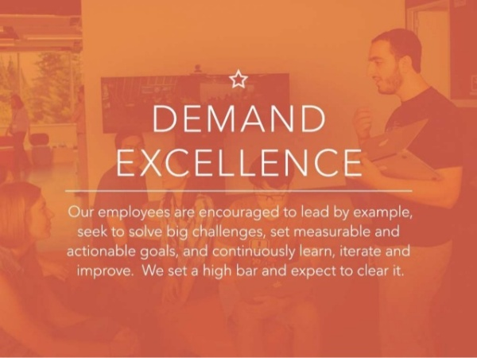

**我认为最成功的公司是那些当员工谈论的挑战，是说“我们”面对的 还是“公司”面对的。如果是一个很大的挑战，很容易将其归咎于其外部的“公司”，但事实是 - 他们是公司一分子。领导是公司里执行的人 - 这不仅是高管，也包括在公司每个人。**

如果我有机会经营一家公司，我希望让人们觉得他们可以有所作为的，无论是多么大或小的公司。我们在每个不同规模和层次去加强它，你能感觉到它。

**一旦人们开始觉得“本公司”是台机器是自己无法控制的 - 最后它成为无法控制的。只要你觉得像一个受害者 vs. 能够影响的结果 - 你也成为受害者。**

**而且这不只是说强化它。当人们觉得可以出面提出问题和解决方案，然后执行这些解决方案 - 这进一步强化了一个事实，我们所有都是公司主人。这是我们的公司，我们影响我们公司的成果。**

## _在消费者产品上构建企业业务的经验_

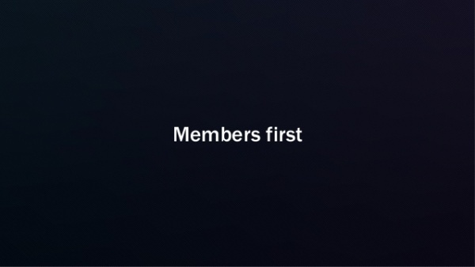

> _雷德·霍夫曼：LinkedIn既是面向消费者又是面向企业公司，这有什么独特的经验教训？_

杰夫·韦纳：你做一个公司尝试更多的事情，创建的难度较高。两件事情比一件更难。**每个你加的增量的事情 - 意味着你需要沟通更多的东西，更多的计划，你需要更多的目标，更多的事情=更大犯错空间。**

但也有反例 - WhatsApp的，Instagram的， 你可以用更少资本来规模化，这是因为技术和全球化。

**如果你尝试做多件事情 - 它可以追溯到你正在试图完成的任务 - 这是你的使命，愿景，和公司故事。**讲故事是传播最古老的形式 - 这是人类本能的一部分 - 我们通过故事来沟通 - 我们本身就是我们所讲的故事。

**对于一个公司 - 愿景，使命，文化，目标等 - 这是你公司的故事。你需要定义你的故事并强化它。**Linkedin故事就是我们试图在消费业务上构建企业业务。这是我们价值的一部分。

我们有6个价值观，我们的第一个是1）**用户第一位的。如果我们有一个面向企业销售的文化，这将不会是我们的首要任务 - 这像是击打球的质量，下一步才是销售。结果对我们非常重要，但我们前提是用户第一。**

**如果没有一个繁荣的用户驱动的生态系统，我们企业业务也无法执行。我们在消费者级别之上建立企业业务的唯一方法是，运营我们企业销售团队的人都得知道，用户是第一位的。** 

我们很幸运，有Mike Gamson管理1000的销售人员，他可以在维护我们宝贵价值观和企业文化。迈克不只是谈论 - 他所做的一切就是为了我们的价值观。其中一件事，**他说不是雇用销售人员 - 而是雇用商务人士。他基于我们的价值去招聘，回报以及提拔员工。**

## _推荐的书_


杰夫·韦纳推荐三本书：

*   意识的企业（[Conscious business](http://link.zhihu.com/?target=http%3A//www.amazon.com/Conscious-Business-Build-through-Values/dp/1622032020)）

*   幸福的艺术 （[Art of Happiness](http://link.zhihu.com/?target=http%3A//www.amazon.com/Happiness-Handbook-Living-Howard-Cutler/dp/0733608582/ref%3Dtmm_pap_swatch_0%3F_encoding%3DUTF8%26qid%3D%26sr%3D) ）- 这从1998年以来一直在我的床头柜上，让我理解同理心的真正含义.

*   山外有山（[Mountains beyond Mountains ](http://link.zhihu.com/?target=http%3A//www.amazon.com/Mountains-Beyond-Farmer-Random-Readers/dp/0812980557)） - 故事是：Paul博士从哈佛往返于海地帮助一个人，最终改变了世界卫生组织，让各国照顾他们的最穷的人。离开雅虎我认为，只有在大规模下才可以有巨大的影响力 - **但我现在知道，有时一次哪怕帮助一个人也同样能规模化。**

## _人才是我们第一优先级_

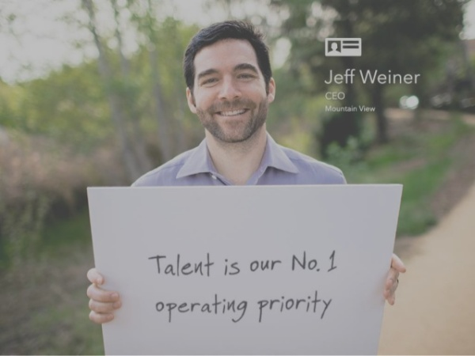

> _Allen Blue：LinkedIn突飞猛进与招聘始终放在第一优先级分不开。LinkedIn的招聘流程改变了吗？_

杰夫韦纳：在一些方面招聘过程是相同的，其他方面也截然不同。

*   当你有15人，你团队一个人就可以负责做招聘。

*   当你试图招150人，则需要专门的招聘人员。

*   当你试图招1500的人，你需要来源方，招聘，调度，管理和人员支持这一整个群体。

招聘背后机制在每个级别上变的更复杂。

**不应该改变的是你的文化和价值观。高增长的公司出轨是当他们需要150至300人增长还要跟上竞争步伐，即使他们已设置很高的招聘标准，他们就开始妥协。**

例如，如果有人进来说在简历上有很大的能力，但面试过程中你发现了，可能文化不适应。有人会认为我们可以让他来工作 - 我们会指导他们，会有渗透的过程中，他们会找出我们如何做事方式。

**如果你在这种情况下招人的话，他们会告诉你这样不行，将导致比他价值更多的麻烦。**

当他们看到某候选人技能不错，但文化不能适应，就应该转移到下一个人，这才是有效地扩张。如果招聘团队在你不在的时候也可以做到这一点，这才是正确扩张之路。

## _产品驱动的CEO_

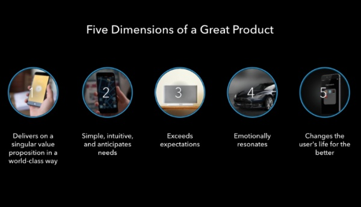

> _雷德·霍夫曼：为什么你认为做注重产品的CEO很重要？_

杰夫·韦纳：因为我就是一个做产品的人。

里德给我分享硅谷最有价值的公司都是做产品的人当领导。你可以是一个产品经理，工程师，产品设计师，或有一个很好的产品感觉。

**硅谷公司通过自己的产品创造价值。从CEO看产品 - 更多的挑战也是该公司随着时间推移创造价值。史蒂夫·乔布斯，扎克伯格，杰夫·贝索斯，伊隆·马斯克，大家都知道的这些人都是把产品放在第一位的。**

**杰夫·贝索斯把亚马逊成为了今天花了很久，我喜欢他说的名言：“亚马逊不是一家书店 - 这是一个客户的存储”。**

## _如何管聪明人_

> _观众提问：当涉及到管人 - 你如何管理最聪明的人？_

**杰夫·韦纳：你不能让很聪明的人做所有事。但你可以做的是鼓励他们采取行动。**

**管理者和领导者之间的区别是：经理告诉人们他想要他们做什么。领导者激励人们去做。**

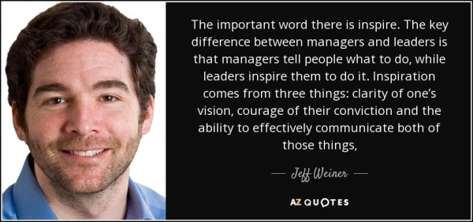

**一旦你确定有才华的人 - 你可以找到他们想要的东西来完成的，告诉他们你想要完成的任务，然后希望找到他们想要的东西，你想要什么之间的一致性。如果你能找到共同点，你可以真实地说，为什么他们的技术可以帮助实现这一目标，希望他们会想加入你做到这一点。**

这与告诉他们该怎么做有很大的不同。**最聪明的人在被告知该怎么做反而做的不好。**

## _第一准则有哪些？_

杰夫·韦纳：**同理心管理是我第一准则。还有就是在我没准备好前不去做决定。有时候你是没有选择，但大多数时候做决定太草莽。世界上没有事情是完美的，通过模式匹配去有效做决定，也可以和桌前的人讨论。如果你哪里觉得不对劲，可以说“我还没有准备好做决定”。** 

**如果你做了错误决定，不要害怕去承认，你可以改变想法再继续。事情走不通的话，我希望越快知道，这样我们可以去做别的。** 

**谈到闪电式扩张，我们需要快速做决定去保持节奏。可能需要重新来，但最差的是不做决定。**离开Yahoo后，我不确定在一些场合和运行上出了问题，但在我进入LinkedIn第一天，我就在分钟或者小时内做决定，而之前是需要几天或者几周。

## _经济图谱设想_

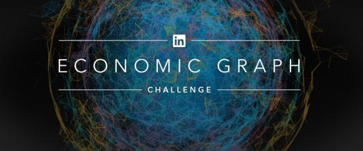

> _观众问：你能否解释一下你正在努力建立LinkedIn的经济图谱是什么？_

杰夫·韦纳：**有一件事我在LinkedIn从未做过 - 就是我们正在努力实施我们的愿景。历史对我来说，我们的愿景是我们的梦想。我们的梦想不是我们试图去做或能衡量的 - 这个是我们真正的北斗星指南针，我们非常渴望去做。**

几年前，我们认识到，我们比我们预期的成员增长速度要快，当我们制定使命时候，我们有3200万成员，我们最近超过4亿的成员，我们正在往7.5亿成员的目标而前进。

**我开始问自己 - 一旦我们连接世界的专业人士，下一个是什么？我们最终是想把愿景带到生活中 - 为每个人创造全球劳动力的经济机会 - 所有30亿的人。这不仅是知识工作者，而是全球劳动力。**

我们决定这样做数字地图，在6个维度下展现全球经济 - 这是经济图谱。

1.  在LinkedIn上的个人主页，可以有全球的每一个劳动力 - 30亿的人。

2.  这个星球上存在的每家公司，包括所有中小型企业 - 6000万-7000万公司。

3.  2000万 +工作 - 这些公司可以被数字访问，每一项都表示一个可用的工作机会。

4.  十万多的技能，对于需要获得这些工作的公司中，你可以通过标准化的数据访问每一个技能。

5.  每个大学和职业培训机构数字化，学到技能，获得这些公司提供的就业机会。

6.  一个发布平台使得每个人能分享他们的专业知识。

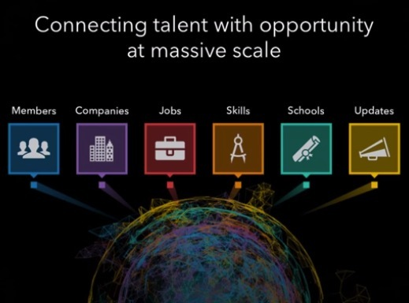

**通过这个图我们将使所有形式的资本（智力，工作，人才）流向哪里，得到最好地利用。在此过程中，我们可以帮助提升和改变全球经济。这是经济图谱。**

当我们第一次开始谈论它 - 这听起来像是科幻小说。这是我们的梦想，但我们努力开始让它成为现实。我们开始构建基础架构，团队，人才，收购等方式，以便我们在大规模下建立和运营经济图谱。

当我刚加入公司，LinkedIn 只有6-8千个工作。现在我们发掘了50万白领职位的有效市场，当我们到了30万的工作 - 我与团队开会，告诉他们思考我们如何在LinkedIn得到所有的工作 - 不仅仅是白领的 - 2000万的总和。

该小组还以为我在开玩笑，我告诉他们我是认真的 - 在那一刻，你可以告诉我现实还没有，但让团队意识到这层含义。团队马上制定了路线图和战略，让LinkedIn在不久将来发现所有的工作。

我们收购了一家名为Bright公司。现在我们可以在LinkedIn 有500万的就业机会。我们已经把2倍的资料编入索引，我们正在找出一个办法来为他们提供所有的东西。我们现在用我们的方式，达到LinkedIn上 2000万工作岗位的目标。

你可以这样做同样的事情，我们LinkedIn用户数量，在LinkedIn上公司，在LinkedIn技能，等等。我们不希望只是在LinkedIn标出技能，比如我们收购[http://Lynda.com](http://link.zhihu.com/?target=http%3A//Lynda.com)去提供课程，帮助人们获得这些技能。这是我们的策略，为我们最后搭建基础模块。

**我们不只是在谈论我们的愿景，它会真实到来，唯一阻止我们是何时去实现我们的愿景。**

> _观众提问：你对Lynda的愿景是什么？它有教育，学习和认证。企业市场跟消费者市场很不同，如何去规模化？_

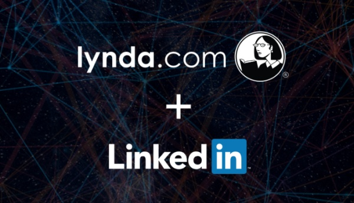

杰夫·韦纳：精短回答是平台战略。任何公司培养的学习材料也都可以通过Lynda来提供，或者他们自己的员工，或者合作伙伴和学生。这个平台也不会限制在企业上。

## _甄别人才_

> _观众提问：如何识别人才？尤其是评价前10％和前5％和最高的1％？_

杰夫·韦纳：我没有针对本身的百分比的公式。

**我要寻找各个职位上的人才。更广义地说我要找聪明人。不过，并不仅仅是资质聪明，而且：**

*   **谁能够快速学习，爱学习，迅速熟练，综合分析，连接点之间，并与他人分享这些结论。** 
*   **谁热爱我们的工作，他们做的工作，希望在这两个之间达到一致性。** 
*   **谁是富有同理心 - 认识价值，通过别人的视角看世界。** 
*   **期待和我一起工作的人。随着时间的推移我已经学会不值得与蠢蛋工作 - 不管他们有多大贡献。**

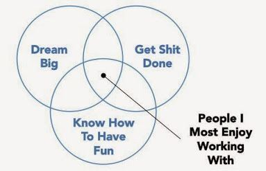

作为一个CEO学到难得教训是，拿棒球打个比喻：**你不能在比赛中让投手停留太久。**

即使你是一个明星投手，过去的5局比赛，你可以看到他们的球也越来越慢，对手越过他们球，经理出来看投手做了什么，明星投手会回应“我做得太完美了。“**经理的工作不是要求投手怎么做，而是通过投手是否能赢得比赛来评估。**

**当你认识一个人可能跟他现在的角色不符，你需要帮助他找到合适的位置，如果还是不行，就试试别的职位或者其他的组织。**

**规模化一个组织的重要的不仅是把正确的人带入组织 - 而且评估你现有的人才，做一些艰难决定。**

**参考资料**

1.  [https://www.linkedin.com/pulse/scaling-linkedin-jeff-weiner-class-19-notes-stanford-cs183c-mccann](http://link.zhihu.com/?target=https%3A//www.linkedin.com/pulse/scaling-linkedin-jeff-weiner-class-19-notes-stanford-cs183c-mccann)

2.  [From Vision to Values: The Importance of Defining Your Core](http://link.zhihu.com/?target=https%3A//www.linkedin.com/pulse/20121029044359-22330283-to-manage-hyper-growth-get-your-launch-trajectory-right)

3.  [My best learning from LinkedIn CEO](http://link.zhihu.com/?target=https%3A//www.linkedin.com/pulse/my-best-learning-from-linkedin-ceo-simon-zhang)

4.  [LinkedIn's Series B Pitch to Greylock: Pitch Advice for Entrepreneurs](http://link.zhihu.com/?target=http%3A//reidhoffman.org/linkedin-pitch-to-greylock/)

5.  [Managing Compassionately](http://link.zhihu.com/?target=https%3A//www.linkedin.com/pulse/20121015034012-22330283-managing-compassionately)

6.  [专访LinkedIn全球副总裁弗雷德•考夫曼：科技创业公司选择“更快”还是死亡？](http://link.zhihu.com/?target=http%3A//chuansong.me/n/1991058)