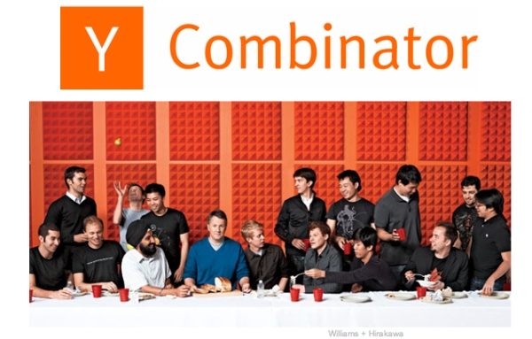
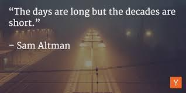

# 2: Sam Altman

来源：[https://zhuanlan.zhihu.com/p/20324431](https://zhuanlan.zhihu.com/p/20324431)

## CS183C 第二节

> **版权声明**
> 
> 本文首发自微信公共帐号：donglaoshi-123；
> 
> 作者：董飞
> 
> 无需授权即可转载，但请自觉保留以上版权声明。

**主讲人Sam Altman**

2015年9月24日，斯坦福第二节CS183C开讲啦，不同的是这次邀请了硅谷顶级YCombinator的掌门人Sam Altman. 第一节参见 [(Blitzscaling Session) 1:Household Stage](http://zhuanlan.zhihu.com/donglaoshi/20317371)

根据维基百科的描述，Sam出生于1985年4月22号，在19岁(2004年)的时候创立了Loopt(一家提供基于地理位置的社交产品公司，2012年以4,300万美金价格被并购)，2005在斯坦福第三年就读CS本科学位的时候辍学，2014年出任YC 掌门人，投资了包括Reddit, Airbnb, Pinterest 等公司。

## 什么是YC

YC是一家提供产品和投资的公司。YC的主要任务是投资初创企业，还有一个新的业务叫[YC Fellowship](http://link.zhihu.com/?target=https%3A//fellowship.ycombinator.com/)，这个项目每年的受益者超过250个。

我们自己一不遗余力做推动全球创新的角色，而创业绝对是实现创新的最佳途径。我们找到了一个合适的方法孵化创业公司，并为初创企业提供实实在在的帮助。

## YC社区

如果你是YC的一员，我们希望你能够在你的领域比别人有100倍的优势。同时我们努力提供指导和人脉，比如有YC社区的访问权。在社区中我们可以为初创企业提供帮助给出真正有用的建议。

**但最大的收获是这个“校友社区”，社区里已有投资过的 2000 多人。人们感到YC有很强的亲和力**，他们与YC投资过的公司合作，帮助他们筹款、招聘。他们互相购买对方的产品等等，我们努力使之成为一个联系紧密的社区。

## 从斯坦福辍学，申请YC孵化

2005年是我在斯坦福的最后一个学年，我当时就读的是CS本科。在校期间，我记得YC当时宣布要做创业孵化的时候，我和朋友们做了Loopt。当时并不是很了解YC，没有仔细去了解。基本上是在YC创业孵化申请截止日期的前一天 4月中旬，申请了YC的创业孵化。对于我来说，当时从硅谷飞到波士顿还是有些疯狂的。但是我们需要钱，YC可以提供钱和建议。

## 2005年的投资界是什么样子的？

2005年的投资界是非常神秘的，似乎人们更想要商人而不是工程师来运行公司。而且投资人似乎更想听到商业计划和财务模型以及类似的这些东西。所以，当我们看到YC的时候，就感觉他们跟我们是同路人。

换句话来说，这些人自己都是工程师，他们关心的是产品，而不是这些商业计划和财务模型。YC的合伙人花了两年时间才能搞清楚他们所做的事情，但是对于当时接受YC投资的8家公司来说，立马就知道了这就是未来的投资行业。因为我们已经看到了另外一种投资方式，

投资这件事真的改变了很多。我在2011年成为YC的兼职合伙人，当时YC的规模仍然相当小。但即使是在当时，大环境已经开始变得对创业者有利了。

## 为什么加入YC？

如果是一个普通风险投资人，**就好比选择上市公司股票代码。我觉得这没有为世界带来任何增值，我只是在分配资本。我想试试更快地找出最好的公司。**让这些公司进行“推销”，让他们拿我的钱。

如今最好的公司，总能吸引大量的千方百计想给他们钱的人。在2009－2012年，我开的支票都是15,000美元的。那些创始人没有别的选择，如果没有我的投资，也许这些公司根本不会存在。我感觉是对整个世界产生了某种影响。我不想跟别人抢着给钱，投给已经获得成功的公司，反正最后我就来了YC。

作为新的CEO，领导者总是会重新founding这个公司。在外界看我们YC做事风格变化了很多，比如大量增加 startup数量 / fellowship 项目 。**但内部我们使命是一致的， 我们始终要做的就是找到最好的founders，即使我们做事方式不同，只要保持这个使命，实施还是可以调整的。**

## YC保持第一投资平台的秘密

**YC校友和其他公司建立的网络，这个带来的网络效应**，让我们一直占据主导地位。很多创始人都会寻求或者接受YC投资的其他创始人的帮助。

创业加速器的未来非常的光明。十年前没有人意识到这一点。世界上还有约2,500个创业加速器，有8个估值超过10亿美元的公司都是在创业加速器中产生的，所有8个公司都是YC孵化的。

孵化器这一投资平台上实际上还是网络效应，风险投资平台则没有。YC是这些公司的第一个投资人，这会让我们觉得YC也是创始人。**你对你的投资者们的忠诚度，随着时间的推移会以指数级的速度下降。所以第一个在你身上押注的人，你会很在乎，因为他们在你身上下了赌注。而且是在你势单力薄，甚至只有一个点子的时候**。你A轮投资人在你还没有取得显著成绩时，仍然会购买你的股权。但是C轮和D轮的投资者，他们大多仅仅是投资，一个财务模型，然后等你上市了，他们好像就再也不关心你了。如果你的季度收入有一点点下滑，他们就会分分钟把你的股票卖掉。

因为我们是第一投资人，创始人会觉得与我们的联系比后来的投资者更紧密，因而也就更愿意回报社区。在项目中，人们愿意帮助其他公司，因为他们觉得自己需要对社区有所回报。YC每年为我们的创始人们组织一次露营，大家一起出去玩，并讨论事情的进展情况。这让你感觉自己有伙伴，有一伙儿志同道合的朋友。创业者都是很孤独的，当你可以找到人跟你一起讨论，“这个真的很难搞”之类的事情时，你会发现这真的很重要。我们也有办公室之类的地方，可供创业者们会面交流。有在线的空间，为创业者们提供私人社交网络。所以我们真的在努力培育这个社区，也因此获得了网络效应。

## 最好的创业者和公司，有哪些共有的品质？

我们评估创业者的不同品质，并找出我们认为重要的地方。有一些品质不分先后，都是非常重要的：

*   **清晰的愿景**。比如创业者能否说明他们正在做什么，以及为什么这么做。

1.  如果他们不能清楚地向我们说明，那也不可能是在招聘、雇用、销售或面对媒体时说明白。

2.  另一种情况，**他们是思维非常清晰的人**，而这一点对企业来说很重要。以Airbnb为例，当他们向YC发出申请时，他们做的这件事在我们所有人看来都有点作。你在陌生人家里睡充气床，而同时主人也在家，我们都不想这样做。但他们清楚地知道如何做到这一点，可以清楚地解释它到底是如何运作的，以及他们为什么这么做，公司的愿景是什么。这正是我们想要的，Brain 好像讲了个故事 "这是我祖父以前旅行时用的方法"，与当地人一起，待在当地人家里。比待在那种四季酒店之类的地方好多了，na z连锁酒店不论在哪个城市、哪个国家，其内部装饰都是几乎一模一样的。所以他们的愿景阐述很清楚。

*   **我们要找非常坚定，对于自己所做的事情充满激情的人。** 

1.  **有的创始人从来不把"不行"作为答案，有的能掰弯整个世界来实现自己的目标，这些都是我们想要投资的对象。**

2.  有的创始人，每当他们克服一个小困难，然后一转身很不走运，每天又会出现一堆障碍。如果你是那种在这些困难面前退却的人，那就不好办了。你也必须坚信，自己正在做的事情非常重要。

3.  **最好的公司，都是在某种程度由愿景驱动前进。哪怕仅仅是因为创始人想要在他自己熟悉的领域，建立一家伟大公司。坚定无比还要满怀激情。**

4.  **开始找的人很重要，迅速完成任务的能力。这跟果断不完全一样，有的人处事果断但行动缓慢，在和工作生活中的很多地方都是如此。决策的速度和质量**，与创业成功与否完全相关。我们的数据发现这些因素的确相互关联，在我们所有成功的创业者身上都有体现。

5.  有些创业者从背景上看，他们真的应该成功，但却以失败告终，因为缺乏坚毅和解决问题特质。**成为一个伟大的创始人的秘诀，至少在早期阶段，就在于直面问题的能力**。这个问题你从未见过，但是你却能迅速解决它。

## 独自创业/两人合伙创业/多人合作创业 有何不同？

我们更青睐两人或三人的创业团队，但我们也不会死板地反对独自创业。我们也为许多单独创业者投资过，而且他们最终也取得了成功。所有这些例子中都在我们投资之后的某个时间找到了合作创业者。比如我相信Dropbox和Instagram，当时给他们投资，也没有合伙人。但开始后不久，他们都找到了合伙人。

我们并不完全反对单独创业，但这个问题有两个。

第一，工作量将会很大而且真的很难做，一个人很可能搞不定。

第二，作为单独创业者，会有一些心理层面的影响。即便是认为他们很厉害的人，也会产生低估他们的想法。

如果列出规模超过十亿美元的科技公司，没几个是在进入我们的项目六个月后还没有联合创始人的。**有联合创始人，没有联合创始人，和有一个糟糕的联合创始人，这三种情况肯定一个比一个差。**

但我们真正讨厌的是，那些因为觉得我们喜欢合伙人而刻意找一个。这种情况下，他们百分之百不会被我们选中。如果一开始你只有一个想法而没有合伙人。那么请不要停止寻找，那些最成功的公司似乎都有两到三个联合创始人，真想不出哪一个是由纯粹的一个创始人缔造的。

**这是一份孤独的旅程，同时也会有人会说你是个白痴。很长一段时间内不断有人这么说你，而你只能假装听不见。因为人们许多事情做起来都很难，但是如果你有个可以倾诉的对象，那么就会容易一点点。**每个人都会希望可以两个创始人一起，经历这些起起伏伏、波峰波谷。你们不可能同时处于低谷，所以一个人可以鼓舞另一个，理论上讲应该是这个样子。

从我们的数据来看，三个人是比较理想的。比如Airbnb，它是我们所有投资过的公司中最成功的。四个人就更难一些，实际中四个人的团队往往以一个人在最开始的几年里退出而告终，然后变成一个三人或两人的团队。

如果创始人之间相处不合会怎样？所有联合创业的团队都会出现严重分歧，有的团队不会告诉我们，家家都有一本难念的经。但很多时候，我们会说“看吧 现在已经无法挽回了”，“你们之中有一个需要放下，继续前进”。每个人都有自己的个性，其实并没有固定的模式。

## 创业团队的多样性

**多样性很有优势。但是绝对不要为了多样性，而招募团队成员。背景和观点的多样性真的很好。唯一有害的多样性就是愿景的多样。**

创始人们的信念大不相同，对于将建立一个怎样的公司观点不同。不是说这个公司将要做什么，而是要建哪种公司。比如，我们的公司文化将是什么样的？我们将如何做决策？我们怎样决定是否出售公司？怎样决定雇佣什么样的员工？怎样处理分歧？如果你的联合创始人，在这些问题上有不同意见的话，那就很棘手，这是致命的。如果大家想要的东西不同，想达成的目标不同，那么在创业时就会有两个冲突点。一个是大家对公司的期望不一样，另一个是当大家都想为自己争取同一样东西时出矛盾。

你可能会遇到这样两个人，一个比较强硬而另一个则比较温和，那么就可能会产生这样的冲突。而如果两个人背景完全相同，比如成长环境完全一样，都想做CEO，都想在杂志封面上露脸，这种冲突实际上是最糟糕的。以上两种组合都不理想。

**真正好的团队是互补的，大家有共同的愿景，关于建立什么样的公司，以及怎样去做意见都一致，而且他们有不同的技能。所以很久以来，经典的联合创始人团队是一个懂经商，一个懂技术，这种组合无往不胜。**

**现在也是两个非常懂技术的人，这种组合通常也能成功，我想这种组合甚至更好。毕竟技能和背景的多样化真的很棒，这样的团队通常都能成功，就像苹果的乔布斯和沃兹尼亚克。但很多时候我看到的是，两人都是懂技术的。一个人主管产品，另一个管技术，而且往往做的很好。双方要知道自己分别喜欢什么，以及分别擅长什么。**

## 怎么才能学会招聘呢？

越来越多的人不仅没有招聘过人，自己也没给别人打过工。我觉得招聘一直很难，而且是有风险的。当前的环境中招聘更难，而且比以往任何时候更有风险。

有的人可以自己搞定一切，不用雇人，而且这样的招人越来越多。**我们早就注意到了这个趋势，我们最好的创业公司，往往招聘人数最少。而最糟糕的创业公司往往会说，“我有十个员工，我是不是很厉害！”。结果他们创业失败，给别人打工去了**。因为如果你有员工，就会有burn rate资金消耗率，在今天的市场上这个消耗率会很高。

你有更多的组织惯性，员工人数很多时，公司掌控难度会加大。如果只是两三个联合创始人，你就可以说“这个真的不行，我们试试另一个方法好了”。人多了就会有内部政治，大家会考虑自己的职业发展轨迹，如果准备扩大公司规模，你要考虑到所有这些问题。在公司准备好扩大之前，会有这些暗流涌动，因为毕竟是一群想成功的聪明人。

而大家都不确定究竟想要做什么，所以就会导致不能人尽其用产生各种问题。就说Airbnb吧，他们用了九个月时间才雇了第一个员工。Stripe差不多也花了10个月，Dropbox花的时间更久。

**企业总想招聘更多人，因为他们觉得会提高效率，会让创始人感觉更有地位。的确能让你感觉更有地位，但绝对会降低效率。所以我们喜欢这样的公司，他们清楚要等多久才招聘到第一个员工。这会很痛苦，因为人手太少而工作又太多，进展很慢很慢。**

**你会说“如果我们能有五六倍的人手那么进度肯定能加快”，但很多时候，真正需要搞清楚的是清晰的愿景。你要在这么多重要问题上保持清晰。如果自己还没搞清楚，就开始招聘员工，那么你会败在沟通效果上。**

## 在湾区创业好吗？

旧金山的湾区是世界上最好的创业地方，如果我来也会从这开始。生活成本高是唯一的不足。**早期创业是需要把花钱速度调低这因为你多一个月存活就意味多一些成功的可能。**

还有就是多样性不足。最明显的是我们没有看到性别方面的多样化，我想下次真的需要招更多女生，我们花很多时间各处走动，投资世界各地的创业者。我们投资的人中超过一半都不在美国出生，大约来自40个国家。世界有其它地区比湾区在创业方面多样性更高，我觉得我们已经倒退了，我不太清楚是什么原因造成的。

## 投资下一个伟大机会的想法

Paul Graham(保罗·格雷尔姆)说要**发现表面很好实际很糟的创意。你是否觉得自己在寻找被低估的资产。很显然你想要的是本质很好，但多数人觉得很糟的。因为一眼就能看出来好的，大家都会去追捧，这样竞争压力就很大。而一眼能看出来不好的，显然你也不想去投资。伟大创意才可能够给投资初创企业带来超额回报。**

**我想我们更多受趋势，以及他人喜好的影响。作为创业者和投资人，要保持对一个冷门创意的信念，真的很难。在投资界现在容易了一些，因为你意识到你就是靠这个赚钱的。而且不管别人怎么说你太蠢，你都不会放到心上，只要你能保持盈利。**

**但它也会诱人犯错，比如说我喜欢把自己想成一个有独立思想的人。只要是大家都很喜欢的，那肯定很难做。你不想做这样的投资人，投资某种很大的东西的衍生品。所以在2006，07，08年大多说投资人都在投下一个Facebook。然后到了09，10年，他们都因为要寻找下一个Facebook而疯了。而09，10年的时候值得风投进入的两个公司是Uber和Airbnb，而它们跟Facebook没有半毛钱关系。同样Facebook在2000年募资的时候，谷歌才刚刚准备上市。当时广告技术公司，还有搜索公司获得大量关注，而那是完全不应该投资的领域，最后那些公司都失败了。你应该在Facebook看起来完全不可能有如此发展的时候就投资它。**

现在有很多投资人，又一窝蜂投资Uber类的产品，这让我想起来现在大家都说"我们将会成为食品行业的Uber”,”我们将会成为遛狗行业的Uber"。然后Uber会成为一个千亿规模的公司。**但下一个千亿规模的公司，绝对不可能是上面说的那些其他行业类似Uber的公司。**而将是某些全新的东西，所以当大家都在说这些的时候你应该把它直接忽略掉。他们会不惜代价把你拼下去，但是他们的盈利状况令人担忧。

**那么你应该做的是，想完全没有联系的下一个千亿美元的公司在哪里。世界正在发生什么变化，那些变化可以催生出一个之前完全不存在的公司?然后就去建立一个这样的公司。这就到了最困难的部分了，因为这个公司看起来会很糟。你会遇到内部冲突，有人会说它其实前景光明。别人会跟你说"为什么不开一家面向大众需求的公司?"，因为别人也会开那样的公司。你需要某种勇气去坚持你的信念，坚持做这件不得人心的事，因为你知道世界前进的方向而其他人却看不到。**

## 关于快速迭代

**先看真心喜欢你产品的用户，然后再看那些不喜欢你的用户，这样会好一些。上线越早，越能快速吸引到一些用户，他们会对你的产品产生依赖，这让你感觉也会更好。**

Uber刚开始起步的时候，很多人把它当笑话，但也有一些人一直在用它，甚至是一些收费很高的黑车也在用。当全世界都在嘲笑他们的时候，他们知道自己的路走对了，因为他们至少每年增长10倍。**所以趁早开始的优势之一是，你将获得更多信心，即便是整个世界都在说你的东西不好。**

**另外一个支撑你的信念是，改变某个二三十年来一直有人在做，但所有人都忽略了的事，而且你可以准确判断到底是什么，那么以Uber为榜样放手去做吧。这个创意的起点是，每个人口袋里都有一部可以连接到互联网的设备，而三年之前从没人想到，所以这是一个巨大的改变。除非你真的关注，否则你不会发现这一点有多重要。如果你很理性，你可以跟自己说明白为什么有这种信念，因为世上有些东西已经改变了，这样会很有帮助。**

YC在投资很多硬件公司时，外界普遍认为我们会一败涂地，因为我们不了解这些公司。它们要花费数年时间，并且与软件公司比它们的周期大不相同。这些公司不同的地方在于，它们看起来不像互联网初创企业。但是它们需要有Airbnb或Reddit的节奏和速度运作，这正是问题所在。我们把它们放进我们的项目中，没有人喜欢失败的感觉。

如果你周围的公司都以每周10%的速度增长，那么过一阵子，你就会觉得“我太失败了！”，"我要做点可以拿的出手的东西"，“我要加快速度”。然后你就做成了，所以**我们需要对硬件公司格外用心，要弄清楚他们的核心指标，以及他们怎样能够每周改进10%。**但是一个公司需要在某方面有所改善早期每周提高10%，如果进行组合，如果有产品周期，不管是哪一部分取得每周10%的改进。你把它找出来，这样过上三四年，最后你就成了一个真正的大公司。

**你可以忽略所有人但是不能忽略用户，如果用户说产品很糟糕，那么你就找不到其他说你产品好好用的人了。这是支持者的声音，必须要听！**

**关于转型 Pivot**

我觉得硅谷搞错了创业转型这件事。我参加一个创业聚会让我很震惊，大家都在吹嘘创业转型，这实际上是在吹嘘失败。我觉得对待失败的态度应该是宽容，但是说“噢 那太糟了，哥不玩儿了”，我真的认为我们有点过度美化失败。

**我们尝试从失败中学习太多，我们说太多失败有多伟大，但是失败的确很糟糕。对失败宽容很重要，不会因失败而针对你。但是这也不是什么值得拿出来庆祝的事儿。**

总有人吹自己转型了多少次。我见过的唯一成功的创业转型是这样的，**第一它是创始人一直以来都想要做的，第二它是创始人在做第一件事走不通时发现的**。所以具体举例来说像Instagram，凯文·斯特罗姆一开始在做一个叫做Burbon的东西，但是做不下去了。他就去度假，然后就做了这个他本来就想做的东西。他喜欢照相，但是当时iPhone的相机不是很好，所以需要用到滤镜工具，让照片看起来是故意照坏的，而不是因为相机传感器太差劲。所以如果你处理成老照片的风格，这样很酷而不一定非得要完美的照相机镜头。所以那才是他真正想做的，才是他热情所在。

其它创业转型成功的例子还有，Airbnb的创始人一开始做的是另外一件事，完全是烧钱的但却没有一点成果。于是没人再给他们钱了，陷入深度金融危机，他们实际上已经刷爆了好多信用卡。但是房租到期了，他们已经没有钱付房租了，他们就想啊想啊想啊。Brain拥有的就只剩下公寓里的一点点额外空间，以及银行里的一点点存款，而房租比他的存款要多，十天后就要交房租了。所以他把多出来的一个房间租了出去，就是为了挣这一点钱。然后这一切疯狂的事情就是Airbnb的开端，并最终成为一家提供经济住房的公司。

但是，最常见的一种是创始人坐下来，他们说“咱的创业公司不行了”，“来块白板”，“咱想点什么新的东西来做吧”。我从没见过这种能成功的，而且我觉的有很多原因，**如果你急于求成，想一个创意。那么这个点子往往不会太好，如果你已经有投资人了，那么你需要一个成熟的创意才能去找他们。点子糟糕没关系，好点子就是开始时看起来糟，难的是转型去做这样的创意。**所以人们会试着找这样一些点子，听起来很适合转型。

但是投资者的确会带来某种奇怪的社会契约，让你觉得不得不去做一个计划并可以执行，或者类似的事。我觉得更深谋远虑的投资者，实际上更喜欢听你说“我真的不知道该怎么办了”。而不是说“给我有个像屎一样的点子，我准备继续做下去”，即便你可以把它包装地能看得过去。

我对好像做不成的创始人建议就是。**请关掉公司，把剩下的钱还给投资者。然后去环游世界，等着知道你有想要去做的全新的想法。**

[Slack](http://link.zhihu.com/?target=https%3A//slack.com/)或许是最近最出名的转型公司，Slack是靠做一个叫做Glitch的游戏起家的。然后他们发现没人喜欢他们的游戏，但是他们内部的开发者真的很喜欢他们做的这个实时聊天系统。于是Slack就诞生了。当你准备去做一个其他人需要用到的东西，这就是一种途径。

专注产品与保持增长

如果你可以一周工作70-80小时，那么就看怎么去分配这些时间。**你应该把100%时间花在用户交流，创建产品和保证用户是热爱它的。**

很多创业者在早期会面临这样的选择，要么我能吸引大量用户，他们喜欢我们但不爱我们，要么我有少量的真正爱我们的人。所有YC参与过的成功的公司，都属于第二种。**所以关注产品意味着关注爱，而非喜欢。**

**请把时间花在写代码和与用户交流上面。你需要把产品做到这种程度，就是如果没有它，有的用户会非常非常难受。**

## 有关离开YC后的衰落

[http://blog.samaltman.com/the-post-yc-slump](http://link.zhihu.com/?target=http%3A//blog.samaltman.com/the-post-yc-slump) 英文原版

[YC主席：为什么初创企业走出孵化器后开始衰落](http://link.zhihu.com/?target=http%3A//www.ibailve.com/show/6-2339-1.html) 中文翻译

离开YC后的衰落是一个更加广泛的现象。

创业阶段，创始人可以一脚把油门踩到底，于是有很多内部的东西打破了，但你保持增长并持续盈利，感觉很好。然后到了最困难的地方，你得去偿还技术债务、组织债务、文化债务等等。

创始人总是想我不再关注增长了，才开始处理这些问题。理论上看起来不错，因为你可以专注于这件或那件事，**但有句有名的话“growth solves all problems.”** **一旦停止增长，就会有更多问题。所以你需要找到一种方法，从关注增长的精力中分出10%，去解决其他问题但不是50%，当然更不是100%。**这也是你雇佣员工时候，往往他可以感知到初创企业势头的变化，比创始人更敏感。

**而初创企业运行的第一要点就是，不要失去前进势头。**说起来容易做起来难。当你开始创业时，你就签了一份合约要全力工作十年。这真的是太难了，就像从来都不度假。你要不停地在考虑你的公司，你可以和朋友出去玩，但心里想的还是公司。每个阶段都有新的危机，而且越来越糟糕。

有些创始人发现，他们非常喜欢融资。因为感觉像你在操纵大家，这样有很大的风险。**没有那个公司因为会融资而成为伟大的公司，某种程度上说，你要么做出用户喜爱的绝佳产品，要么想办法保持增长，要么就关门大吉。**我们遇到的很多创始人，都没能与我们共事到最后，他们除了这一点各方面都很出色。他们在其它方面花费大把时间，请全世界最好的律师，设计出漂亮的商标，但从未做出大家喜爱的东西。**你可以把其他所有事情都做好，唯独没把该做好的东西做好，于是只能面对失败。**

## 学生提问：

_- 什么导致创业者既不能保持增长又不能作出好产品？_

不同的创业者偏好不同的领域，所以没法给出一个普遍适用的答案。作为一个局外人，你可以看到的明显例子是**创始人迷恋他们的公众形象**。在新闻中，人们真的很关注自己的排名，是不是在30 under 30 list，公众形象很重要。

**另外一点，是去参加社交活动。你想象中觉得这会对你有所帮助，但其实不一定**。我就曾深受其害，因为所有投资者都会参加这种CEO大会。通常是这样的，“啊 你也来了 太好了”，“一定很有意思”，“你要见见其他投资组合的CEO们”。这个，那个，然后你跟这些创业者们聊天。"你不在办公室的时间比在办公室的时间要多”，**“总是在社交活动中”，离本应该关注的事情越来越远**，这是很常见的一种情况。

_- 有什么事情，最好的创业者也经常搞砸？_

**伟大的创业者都会犯的错误，就是在开除不良员工之前等太久。实际上这个东西时教不会的，你只要犯一次就学会了，这是最普遍的最大的错误，真正伟大的创业者也无法避免。**

解雇员工是经营企业时最坏的事情。你犯了个错误，然后你就给别人的生活造成了实实在在的负面影响。我自己当CEO时真的很难去开除员工，你会说“好吧，这个人没做好，但也许是我的原因”，”也许是我在招聘时看走了眼“。但是现在我要自己负责，所以如果我多投入一点，如果我多帮他一点，如果我给他创造条件他也许能补救过来。好的创始人，都会认为他们可以把事情补救回来。**我学到的一点就是，这种情况下也许留下这个员工只会给他带来更多伤害。从长期来看，如果你把一个工作两三个月的人开除掉，他们不会在简历上写下这条，就好像它从来没有发生过一样。如果他们工作了一年，但是仍不起色那么你就不得不把他开掉，这实际上会更伤害他。**

_- 你是怎么解雇员工的，而且他还是你的朋友？_

这个问题最重要的一点是，**你要设身处地为对方着想，把对方当做普通人。然后尽最大努力，让这件事看起来像他们赢了一样。我解雇掉的每个人，解雇前我都帮他们找好了工作，然后我跟他们坐下来，说我们准备这么做。并且我在他们离开公司前，就为他们找好了工作。所以当他们走的时候，他们会说自己是辞职的，然后宣布他们的新工作。看起来就是这样，然后在他出去的时候我们会祝贺他。**

我觉得如果我雇了这个人，如果我搞砸了甚至是他们没做好，你就会跟他们坐下来说，“说实话，这是我工作中最糟糕的地方”，“你在这儿再待下去也没啥意思了”，“个人来讲我真的很感谢你”。

当然如果他们做了些不道德的事，那就另当别论了。但是大多数情况下，都是这样。“个人来讲我真的很感谢你”，"我真的很珍惜我们的友谊"，“我知道这对我们来说都很艰难”，“但是我确信数年之后我们会笑谈此事”，“并且继续做好朋友”，“但现在不行”。大多数情况下他们也会考虑到现在是不行了，然后会说“好吧，我想做这个”，“我知道这糟糕透了”，"我也知道这颠覆了你的生活，我想用最好的方式为你这么做”。“所以第一我要超级慷慨地付遣散费，第二我会帮你找另外一份工作，第三要么你继续在这儿工作一段时间，同时自己找工作”。或者如果真不行的话，“你可以在家工作一段时间，但你要表现的像你还在这里工作一样，直到知道你准备好宣布离开及你的新工作”。

**如果你尊重他人，并表明你的立场坚定，那么结果往往会不错。但是你要尽力，让他们容易接受并尊重他们，他们会很配合的。他们会说“好吧 那我们看看该怎么做”，人们会很感激的。**

如果是按管理书上或者律师的建议，准备最后一张paycheck，法律效力的辞退信让他在上面签字，这是一种不好的方式。让对方觉得有对抗性并且都是你的错。**你应该换一个方式让对方有台阶下，决定是无法改变了，听听他对公司，对下一份工作的想法，一切为了他好，这样把事情漂漂亮亮的办了，最后才去弄那些文件签字，会让大家和平交接。**

_－ 上节课说道专才和通才，你觉得在不同的组织下如何转变和侧重？_

**优秀创业者都是要通才，只要你离开了一线的开发，从开发产品到创办公司，你就注定要从专才变成通才，这是一条不归路。**

_－ 你是建议自己创业，还是加入一个成功的创业公司？_

**不要为了创业而创业，我不鼓励，只有你真正有个好的idea，并且你相信它能改变世界，并认为创办公司是实现这个创意的最佳方式，你就去做，否则肯定是打水漂要失败的。还有一种是加入一个早期你也认可的公司，而且你也有贡献，其实预期回报是要比创业大的，因为成功的创业公司毕竟是少数。**

_－ 如果在学校待的太久去创业，有没有什么不同或者劣势？_

在YC孵化器种，有人退学，或者读了博士，除非你太极端，在学校待了14年，或者一天学都没上，这些就不好。正常范围内，都没大区别。还是要看你想成为什么样的人，这个创业本身没啥相关性。

## 你觉得机器有没有可能管理公司？

短期内，有很多由机器垂直管理的公司。机器做的很多优化性的工作，远远比人好。特别是在工业上，我想你已经看到越来越多的机器人、电脑安保、电商等。**十年之内我们会在机器学习领域，看到振奋人心的发展。特别是在尖端人工智能方面的发现，总有一天会有人发现人脑智力和创造力的数学原理。**

## 你如何看待比特币？

我不知道大家从哪儿听来的，说我是个比特币怀疑论者。每当有人在公共场合问大家该不该买比特币时，我都说不该，这已被证明是正确的了。每次我说过不该之后它都会贬值，我想也许有一天它真的会变得有用。那时我想如果有人再问是否应该投资比特币时，我会改变我的建议的。

但是如果回来用这样的指标，**即要有用户喜爱某个东西。在座各位有没有用比特币买过什么东西？有谁用过五次以上的？有哪位把这当做日常习惯的?这就是比特币的问题根源，因为没有令人信服的理由，人们不爱它，它没有成为人们日常生活的一部分。**但是我相信它有那种发展的潜质，大家保持现状就可以了。我只能说我目前不会买任何比特币，**因为它还没有成为适应市场的产品。我也不会投资那些与之相关的产品市场的初创公司。我只是觉得需要有用户真的喜爱它**，目前真正爱比特币的人，是那些希望能靠它发财的人，因为他们买的比较早。

当然也有很多计算机科学家认为它是件令人惊奇的底细，区块链是一种奇妙的技术，分布式记账的方法太棒了。关于这点 我100%同意。但是比特币作为一种商品，目前看来还有点吓人。

## 为什么成为Helion，UPower 两家公司的董事长？

（这俩都是核能公司，[Helion](http://link.zhihu.com/?target=http%3A//www.helionenergy.com/) 打破现有能量转换效率的聚变反应堆，[UPower](http://link.zhihu.com/?target=http%3A//www.upowertech.com/) 设计的反应堆为即插即用的核能电池。都是YC的投资项目，其中UPower 作为2014年DEMO day的明星项目）

我讨厌进董事会，所以我能不去就不去。**我想如果你明天可以做某件事，帮助世界上最贫困的一半人，那么第一种是去做友好型的超人式的机器智能。第二个选择是，做真正的廉价、安全、清洁能源。**

回顾历史你能发现，生活质量和能源价格，总是息息相关。每当能源价格大幅下降，人们的生活质量，尤其是最贫穷的人们，就会改善很多。所以我想解决能源问题，很重要。并且这会解决所有诸如气候变化、战争之类的问题。

**我只每次列一张表格，写上有我关心的一些问题，然后透过现象找到根源问题。**你可以做像是健康，经济，战争之类的事。战争本质上是为了争夺能源，我们会说他们因为其他原因而打仗，但其实是为了能源。**所以如果你深入思考，人们需要或者说我需要这种对未来的乐观态度。**就是在未来，能源便宜到一分钱一度电，而不是八毛钱一度，这样一来许多我关注的问题都会得到解决。

一个是聚变公司，一个是裂变公司。在太阳能领域已经有很多不错的进展，在我看来未来世界将有80%的能源来自地球，20%的来自太阳能，或者相反。**但是已经有足够多的人在太阳能上努力了，却几乎没有人关注核能。**所以我觉得对我而言这个更重要。

## Days are long but the decades are short

**长日慢慢，岁月如梭**

_－ 如何看待你的时间和事情紧迫性？_

我觉得我19岁那年从大学退学的时候，感觉自己有无限精力。我23岁的时候有人跟我说过，那种在创业时的高强度工作你不可能一直保持那样。也许你一辈子中有20年可以保持高强度工作，成为一个伟大的创业公司的CEO。你可以在22岁到42岁之间做，也可以从28岁到48岁之间做。但是如果你相信自己只实现了少数几个目标，**那个时候要考虑的最大问题，就是一种机会成本**。

如果我要开始创业，那么如果失败的话会花费两年时间，或者三年时间，或者花了十年时间成功。那么我作为一个伟大的创业公司CEO的时间，其实就非常短了。我想我在第一次创业时工作地太拼了，以至于有些激情燃尽了，所以再创业一次的想法让我感到很害怕。但是我错在将人生想成一百年那么长。**你在思考准备做什么的时候，脑子里想的是“我有二三十年的时间，可以集中精力在职业生涯中大放异彩”。但实际上这段时间并不长，创业的时间很短。**

**我坚信的是什么？我考虑的是我对世界有所贡献的最重要的途径，可以给我带来最大的满足感，以及如何把我的时间用在这上面。**

## 是否建议过创业公司，让他们不要接受那些钱，因为它太热了？

我们一直在这么做，并一直跟初创公司说不要追逐最高成交额。有时我们会说完全不要募资，你需要考虑一个初创公司是否估值过高的唯一时机，就是当你购入这个公司股权的时候。

这又分两种情况，第一你是为了投资，第二你决定到这个公司上班并得到股票期权。所以这种时候我会认真考虑这个初创公司到底值多少钱，而不是说我觉得估值的数字。**我完全不在乎估值，而中间估值毫无意义。我关注的是一旦可以交易，股票能值多少钱但愿不会等很多年。**

令人抓狂的是媒体，每次记者问我“YC现在值多少钱？”，我会说“呃 我不知道”，这取决于他们退出时值多少钱。中间数毫无意义，但是记者还会是问“好吧，我需要一个数字”。所以大家都会非常关注它，但是我想你应该把它忽略掉。并且忽略它的关键时间是你准备去这个公司上班的时候，如果你认为它值十亿美元还要多，那么不要相信它真值十亿美元。因为，有人用优先清算权进行投资，这就使估值标签毫无意义。所以我看这些数字就是虚的，什么都代表不了。

作为投资人，我可能不会投资。**作为员工你也不应该让创始人，或者是雇你来这个公司的任何人说服你，你的股票值公司估值的百分之几。因为它真的值不了那么多，这是应该认真考虑的问题。然后你需要确定，你加入一家初创公司时，关键不在这家公司现在值多少钱，而在于我相信它在五年后值多少钱。那时我将占有其价值的百分之几？完全不用考虑中间估价。**

## 一条职业建议

**我有一条职业建议，如果你想加入某个公司，请去那些你能找到的增长最快的公司。因为你也将快速成长，从一个真正成功的公司那里学习好几年，我想这种训练是最好的创业训练，这种经验很宝贵。**

(Facebook COO Sheryl 也说过同样的话：遇到火箭的机会抓住就上，不要管哪个座位号）

**参考资料** 

1.  Sam Y Combinator照片: [Y Combinator’s Sam Altman Insists “Sexism in Tech Is Real”](http://link.zhihu.com/?target=http%3A//tech.co/y-combinator-sam-altman-sexism-2014-07)

2.  wikipedia: [Sam Altman](http://link.zhihu.com/?target=https%3A//en.wikipedia.org/wiki/Sam_Altman)

3.  Sam 30岁感言：[http://blog.samaltman.com/the-days-are-long-but-the-decades-are-short](http://link.zhihu.com/?target=http%3A//blog.samaltman.com/the-days-are-long-but-the-decades-are-short)

4.  在36kr上关于Sam的文章：[http://36kr.com/p/532396.html](http://link.zhihu.com/?target=http%3A//36kr.com/p/532396.html)，[http://36kr.com/p/531202.html](http://link.zhihu.com/?target=http%3A//36kr.com/p/531202.html)，[http://36kr.com/p/216700.html](http://link.zhihu.com/?target=http%3A//36kr.com/p/216700.html)

5.  [YC-Backed UPower Is Building Nuclear Batteries](http://link.zhihu.com/?target=http%3A//techcrunch.com/2014/08/18/yc-backed-upower-is-building-nuclear-batteries/)

6.  [http://www.huxiu.com/article/40586](http://link.zhihu.com/?target=https%3A//en.wikipedia.org/wiki/Sam_Altman)

志愿者整理: [陈格雷](http://www.zhihu.com/people/chen-ge-lei-79)