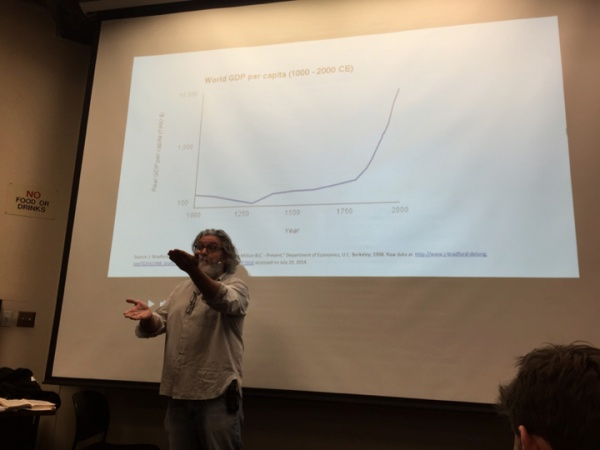
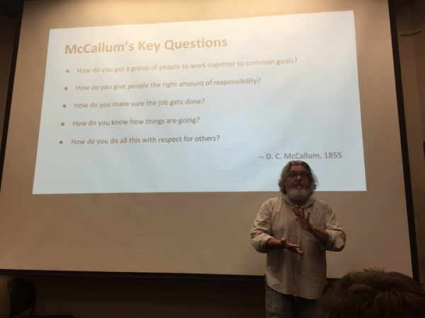

# 3: Michael Dearing

来源：[https://zhuanlan.zhihu.com/p/20349639](https://zhuanlan.zhihu.com/p/20349639)

第三节课邀请到了Michael Dearing, 一个讲历史的白胡子老爷爷，当然他现在是Harrison Metal的创始人也是eBay的早期员工和高级副总裁。Harrison Metal专注于投资早期创业项目，小编简单扫了一眼它在crunchbase上的投资，听说过的有Polyvore Heroku, ModCloth。

扯远了，回到cs183c第三节课的课堂，一上来老爷爷先通过世界GDP的增长肯定了“创业精神”(entrepreneurship)的重要性。接着花了很长时间讲了美国铁路发展的故事，引出与主题相关的思考：如何从家庭小作坊式的铁路建设管理到横跨美国的大企业式的铁路管理。然后就开始接受Reid Hoffman的采访。整个采访如果只能选一点记录下来， 我会推荐以下这段对话：

Reid Hoffman : 你觉得什么时候一个人应该考虑创业呢？

Michael Dearing : 在我这8年专注于早期项目的投资历程中，我发现了两点：

1\. **创业者已经不能忍受一天不想这个创业想法的日子了。**创业者开始在这个想法上非理性地付诸大量的时间和资源。当他们在为这个想法做事的时候，时间似乎都消失了－甚至不知道自己已经错过了两顿饭！因为他们太沉浸在他们所做的事里了－这就是一个明显的标志：也许你应该离开现有的系统（工作／环境／。。。）了。

2\. 另外一个特征是**创始人不小心将自己的朋友的热情也点燃了－你的朋友不小心听说了你的想法后，也开始无法停下思考这个想法，并且愿意和你一起做这件事**。当然我不是在神秘主义但是这说明市场呼应了你的想法。

如果在你身上出现了以上两个信号，也许你真应该考虑为这个想法做点事了。

当然，为了让大家能够完整地了解这节课的信息，小编决定翻译Chris McCann的[上课笔记](http://link.zhihu.com/?target=https%3A//medium.com/notes-essays-cs183c-technology-enabled-blitzscalin/class-3-notes-essay-reid-hoffman-john-lilly-chris-yeh-and-allen-blue-s-cs183c-technology-35e5514ec814)。 鉴于之前的读历史部分太长，这里就不一一翻译了，但是有两幅图等会会提到：

图1\. 世界上下一千年的GDP发展曲线

图2\. McCallum发展铁路建设时提出的5个经典管理问题：

**Q&A部分**

_Reid Hoffman (后称R) : 回到我们的一千年GDP曲线上，非常明确的是一条主线是资本主义，另一条是技术发明，但是他们之前的关系不是很明确。你认为这个系统互相之间的关系是怎样的？_

Michael Dearing (后称M): 我认为这两个系统互相强化了彼此。我们曾试过只发展其中一个，结果两个都崩溃了。这个问题的另一种回答角度是－有一群人，既有钱，又有伟大的想法，又有出色的管理才能，这样的人太少了！当人们意识到一个投资家并不一定也是个发明家也不需要一定是个管理者的时候，社会延伸出了前所未有的各种多角度关系。

R: 当你在做研究的时候你有研究过风险投资(Venture Capital)的起源吗？我记得那是在这条GDP曲线非常后面的位置，二次世界大战以后。

M: 你需要看的是风险投资替代的一件事物－富裕的家庭。Slater Mill就是一个很好的例子。这是一个由Moses Brown先生开创的企业（Brown先生也是布朗大学的创始人). 他拥有纺织工序，但是他完全不知道如何机械纺纱（spinning operation），Slater先生则有技术和发明能力，所以他们合作的非常愉快。

R: 很多精英风险投资机构就诞生于富裕家庭中，在之后的发展过程中才机构化。

_我们换个话题，你的讲话中呼吁capitalism（小编觉得此处不应翻译为‘资本主义’，大概可以翻译成‘私人致富主义’），创造力和创造性的破坏力。你觉得什么时候一个人应该考虑创业呢？_

M : 在我这8年专注于早期项目的投资历程中，我发现了两点，（同上）

_R: 你认为创业者还应该做那些事来确认他们将要做的事是值得追求的事？_

M : 我建议创业者做以下两件事：

1\. 在你的时间表中给‘故意唱反调的人’(devil’s advocacy) 大量时间。这一点我是从迪斯尼的前任CEO Michael Eisner先生那学来的。每一个好的想法总是在某一个时刻会被‘唱唱反调’。 我建议你去寻找你能找到的最聪明的人，请他们无情的毁灭你的想法，找出你想法中所有不对的地方，请他们做一个巨大的混蛋(be a huge asshole), 并且这一切都是你允许的。

2\. 第二个我喜欢用的策略叫做预设失败(Pre-Mortem)－在你开始围绕这个想法做事之前假设你已经失败了，想想你为什么会失败，这样你可以在一开始就明确很多致命的风险。接下来我们会选择改变方向或继续执行，即使是继续执行的时候因为我们已知了一些风险，我们不会太惊讶。

_R: 顺着你的话题说，我和一些聪明人聊天的时候我会问他们你的想法在哪有问题。通常人们需要的是肯定（你的想法棒极了！）而这个问题则是负面的。人们需要你的准许他们才能吐槽你的想法(be negative)。_

_最后一个关于创业的问题，市场竞争这件事在判断你是否拥有一个好的创业想法的时候扮演了什么角色？_

M : 在市场竞争的大前提下，创始人总是因为错误的原因暂停他们的工作。大公司X将要上线一款和你具有一模一样功能的产品这件事其实和你毫无关系。在创业的早期阶段竞争主要来自于用户不在乎你的产品或是他们绕过你找到了解决方案。你应该更多的为“是什么占据了用户的注意力”这件事感到担忧。

R: 少考虑一些大公司的动向（除非你在做搜索功能，那你真得仔细观察谷歌），初创企业主要应该关注其他初创企业都在做什么。

_基于你今天的演讲，你对现在的eBay有什么建议吗？_

M: 首先申明一下，我已经离开eBay很长时间了，在eBay与Paypal分家以前。当然我觉得eBay与Paypal分家是一件正确的事，创造了一个争抢创意方面更充满了竞争的市场(create a more competitive market for ideas)。

一个企业拥有一堆互补性资产的好处是CEO可以通过他的决策来集中控制资本的流向，通过企业内部的经济运作来调控很多东西。

_R : 硅谷的一些领袖认为应基于市场来设计企业的结构，而不是基于管理和控制。你也有类似的观点吗？_

M : 是的，尤其是围绕产品研发的资源方面。我会把软件开发和硬件开发资源在内部放得非常紧张，这样内部就会有竞争。往往到最后资源总是被两类事务平分：某一个创意的经济价值和高级经理的一时之念(economic value of an idea vs. the whim of a senior manager)。

_R : 你觉得创业者也应该这么做吗？_

M ：是的,不过应该用另一套价值体系。创业者不应该用那些大企业用的那一套，而是应该自己编辑和执行产品路线。

_R： 换个话题，现在主流观点是特立独行（being contrarian)很重要。你认为一个初创企业的想法一定要特立独行吗？_

M : 这是一个很好但不必须的特征。从我作为投资人的角度来看，对自己的想法的疯狂的热情才是带动企业估值增高的关键。个人来说我欣赏创业者拥有特立独行的思考能力，这样我能很容易了解创业者的想法。如果一个产品路线从技术到产品都非常特立独行，会显得非常有趣，也会让我很快进入他们的思考模式。

R : 我认为一个想法必须要特立独行才能获得惊人的效果(massive discontinuous result)

特立独行一个极端的例子是人们关于某一个决策反对意见特别大但是对于其他的决策都觉得是正常的。打个比方，在Workday（美国一家做HR和财务软件的公司），人们对于软件要开发云端这件事不以为然，觉得并不重要，这是他们主要反对的一个想法。不过剩下的部分就是很好的执行了，没人反对UI方面的设计等等。。

_还是换回我们的“怎样创业”系列问题，人们应该怎样来评估他们作为创始人的可行性呢？_

M： 在创立企业的各个阶段，我总是思考以下三个方面：

1\. 我是否有技术洞察力(technical insight), 这是创意的基本

2\. 我是否有能力将我的技术理解转化为为用户服务的产品。

3\. 将这个产品变成一个公司

这三件事互相之间没有什么关系。作为一个创始人，如果你对以上三点中的每一点都充满了激情，那创业的过程对你来说将是非常愉快和自我满足的。

_R : 你应该怎样选择你的共同创始人(co-founders)?_

M : 作为一个创始人，你应该从你自己的脑海里找人选。我们曾经发布过一个视频－‘创始人的认知失真’(Cognitive Distortion of Founders), 换句话说，创始人会用古怪的方式看世界。

打个比方，假设你是个非黑即白的人，喜欢评判那些较强的观点，你应该找一个灰色的思考者(grey thinker，大意就是一个相对辩证的人)来做你的合伙人. 关键就是说你得找一个人来弥补你的某些可能会给公司带来致命问题的缺点。这个人就是公司的减震器(shock absorbers) . [吐槽一句Michael爷爷好喜欢用shock absorber这个词。。。]

_R : 作为一个投资人你一般会在创业者身上寻找什么特质？_

M : 想到几点：

1.  追求不凡(Personal exceptionalism) – 这类人相信自己不是为了普通的结果而生的，这点在创立公司的时候非常关键。

2.  非黑即白的思考方式－就是刚刚我提到的那一点，虽然说这样你的错误率可能也会高一点，但是你做决策的速度会非常快。速度有的时候决定了一个初创企业的一切。

3.  Schumpeter的思考方式（Schumpeter是‘创造性的破坏力’一词的发明者）－无论过程有多痛苦，创造性的破坏都值得去追求。

_R ： 我观察到的另一点是创始人一开始都是“杂家”（generalist），一开始会有一长串的问题需要解决，慢慢随着企业发展，企业会需要雇佣各种各样的专家（specialist）。你应该怎样雇佣到早期的员工呢？尤其是前3-5个雇员。你有哪些建议？_

M ： 有些创始人会拿一个类似购物清单一样的列表来找我们，“给我来32盎司的前端工程师，1磅的iOS工程师”。这是非常不妙的情况。企业不是这样发展的。

企业初期的几位员工应该是那些和你拥有同样的梦想，会为了企业的发展去学任何必须的东西而且能很快学会的人。

这批人一般都会在创始人核心圈一二度以内，不会离得太远。梦想应该是有机传播的，猎头公司和招聘广告很有用，但是不应被用来招早期员工上。

_R : 作为一个早期初创企业，你关注的重心应该在哪里？_

M : 我走访这些初创企业的时候会拿着一个McCallum写的那张清单（见图2）－谁在做什么？他们有权力决定推进一项进程吗？你知道事情的进展怎样了吗？

你会非常惊讶说即使是10个人的组织，即使大家都坐在一个办公室里，项目会超过截止日期，日程需要重新安排。

_R： 你认为一个走向市场(go-to market)和渠道销售战略是必须的吗？_

M ： 我认为一个初创企业不需要一份详细的市场战略但是应该至少有一个大致的概念。

一个创业者是否想过市场战略？这能向我展示他们是怎样思考的。如果他们连这个都没有想过，我会觉得他们在思考上是偷懒了。

_R : 你认为哪些东西是初创企业可以忽略的呢？_

M : 一个很可观的方面就是PR(企业的公共)。现在有一种趋势是说创始人就是企业的品牌，所以必须要非常高调高档高级。错错错！这应该是那些为卖广告编造出来的谎言。你可以为你个人做一些PR, 但这些都不太会改变任何结果。

打个比方，假设你因为招聘决定做一些PR, 那你招来的不一定是你想招的人。初创企业不会经常被新闻报道，所有的初创企业都会经历很多低点，你需要找的是那些即使在企业发展的艰难时刻依然对你不离不弃的人。

_R ： 在财务方面你给初创企业有什么建议吗？_

M： 现在大家公认说尽量不要用债权的形式吸引投资人。没人来美国是为了拥有一些债券的。投资人需要企业的拥有权！

我建议你吸引的是真正的股东，那些投资没有下行保护(downside protection)的人。创始人一定要找和你在一条船上的股东。反着这样说的人就是在误导人。如果你卖的是债权或是其他类似的金融品，你不会得到同样程度的投入。

关于公司的估值的讨论会很艰难，但是很重要，其中的数学还是比较简单的：

你想要多大的支票／所占股份＝公司的估值。

**下面是观众提问时间****,****如果有兴趣了解，欢迎阅读**[原文](http://link.zhihu.com/?target=https%3A//medium.com/notes-essays-cs183c-technology-enabled-blitzscalin/class-3-notes-essay-reid-hoffman-john-lilly-chris-yeh-and-allen-blue-s-cs183c-technology-35e5514ec814)**。**

**译者**：Angela Guo, Associate Product Manager @ [http://vip.com](http://link.zhihu.com/?target=http%3A//vip.com)