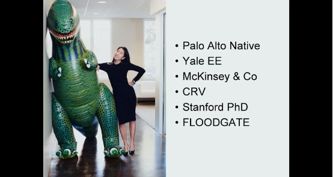
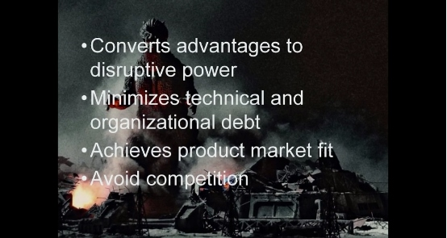
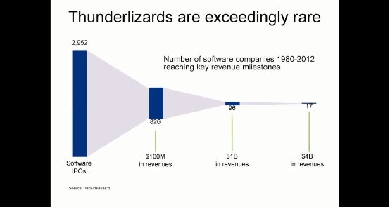
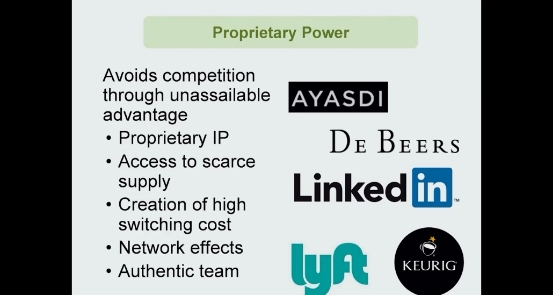
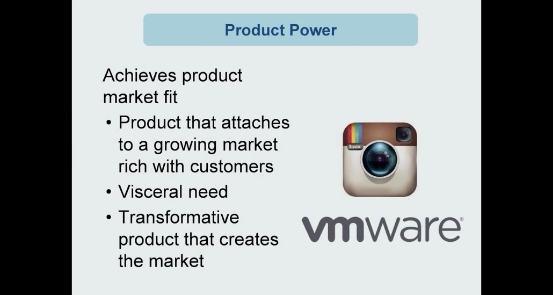
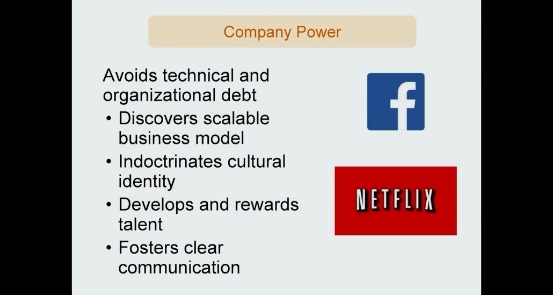
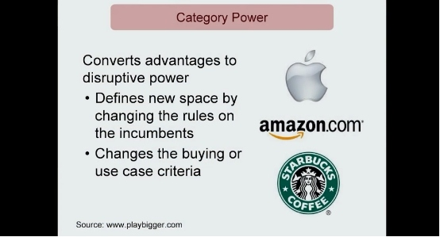

# 4: The hunt of ThunderLizards 寻找闪电蜥蜴

来源：[https://zhuanlan.zhihu.com/p/20349671](https://zhuanlan.zhihu.com/p/20349671)

> 版权声明
> 
> 本文首发自微信公共帐号：donglaoshi-123；
> 
> 作者：董飞
> 
> 无需授权即可转载，但请自觉保留以上版权声明。

主讲人：Ann

我们传统上对创业者的看法是他们如同哥斯拉一般，认为他们是具有超人的技能企业家。他们来自于我们称之为“radioactive atomic age”，从他们创业的第一天起，他们就带着异乎寻常的基因变异，之后他们穿越了太平洋，经历了九九八十一难，终于做出了惊天动地的伟业。

但事实中的创业者，应具有以下的四个品质

将自己的优势转化为破环性的力量，这是一个创业者首先要具有的素养。当你的公司在高速扩张时，你会在公司中累积上一些隐形的账务，例如技术上和组织架构上的不成熟，好的企业家能够尽可能的降低这些，你会生产出市场上需要的产品，所有好的创业企业都对什么是市场需要的产品有一种直觉上的捕捉。最后一点，如同《从零到一》的作者经常谈到的，创业者应该避免竞争。这些素养，我认为是由于你是ThunderLizards（优秀的创业公司的形象化的比喻），才由内而外辐射出来的。

好的创业公司是很稀少的。这张图来自麦卡锡，在1980至2012的接近3000家软件企业的IPO中，只有17加的收入超过了40亿美元。

为了在天使投资轮就去判断一家企业未来的前景，我们可以去查看他们价值的存货。

从下往上看，最底层的科技上的闪光点，你有哪些独特的想法，这个灵感能让你避免竞争；

下一层是你如何从你的技术中创造出一个市场认可的产品，接下来，你要确保你的公司是可持续的，拥有稳健的成长路径，最后，你希望的你的公司能在相应的市场占据主导地位，这就是我们说的categorical key。如果你能将你最初始的power一层层的转化到上述的这些层次上，我们就认为你有资格成为一个类似谷歌微软一样的ThunderLizards。

关于专有优势，由于这是初创公司最易识别的一个特征，也是许多企业创业的根基，所以Ann在这方面谈论的最多。例如，一个资产管理公司Ayasdi 是由斯坦福数学系教授

Gunnar Carlsson基于他25年的研究创立。

专有优势的来源不止是技术上的创新。例如， De Beers拥有钻石这种稀有资源的开采权；Keurig控制了易耗品市场，一旦你购买了他们的咖啡机，就必须购买相应的咖啡豆。LinkedIn通过社交网络即锁定了（信息）消费者（潜在的雇主），也锁定了信息的来源。Lyft的一位创始人曾说过，每一个时代的创新都与交通系统的革命相关，例如火车，运河，高速公路等等，把握住这波浪潮，也拥有了专有优势。

_问题： 在当前行业门槛的降低怎样影响了我们对科技创新的思考？_

回答：生产产品在当今是很容易的，但产生一个能成为支点的好主意却是比以往任何时代都难。Veeva System的创始人说，每一个创业者都相信自己的基础假设哪怕只有不到50%的概率是正确的，但却能够带来20倍的优势。Veeva System认为他们能够基于这一优势创立一个十亿美元的生意，当时没有人相信他们，但是他们做到了。

Product power is the ability to achieve product market fit. Many startups are never able to turn their technical innovation into a real product. Many startups are a technology in search of a problem.

产品优势是找到市场需要的产品的能力。许多的创业公司从来都没有把自己的技术创新转化为一个实际的产品，他们始终在为了他们的技术寻找其可以作为答案的问题。一个市场需要的产品是一个常常被人谈起又经常被人误解的概念。有的人认为，只有世界上有人喜欢这款产品，这样的产品就是需要的，这是不正确的。市场需要的产品意味着一个足够大且正在增长的需要你的产品，你面临的需求最好是不在你控制范围内的。例如Instagram，当他们创立他们的服务时，他们花了一天内基于亚马逊云服务的几台服务器搭建。仅仅12小时之内，使用量超过了他们最疯狂的假想。从第一天起，他们就有强烈的预感，这会是一个爆款的产品。通常，当你问自己我是否有了一个市场需要的产品时，这就暗示了你还没有找到。

_问：如果我有一款革命性的产品，我能否建立一个市场？_

答，你可以，但这更难，例如VMware开创了虚拟机的市场。有一类公司会较难找到一款合适的产品，即平台型公司。一个平台需要很长的时间来发展，需要持续对各方面需求和供给做出细微的调节，在初始阶段，这很容易出错。

_问：我们能否在生产产品前就去测试这款产品的市场前景？_

答：Ann Miura-Ko 帮Steve Blank教的几门关于消费者开发的课就涉及了这个议题。我们可以在生产产品前检查我们各种关于消费者的假想，对潜在的消费者做各式的实验。但这更像是一门艺术而非科学，我们很难区分是实验错了还是我们呈现实验的方式错了，需要改进。关于消费者的洞见，也往往不会来自于我们预期的地方，而是那些我们注意到却不曾料想的事上。例如，在消费者的调查访谈中，你不应该去证实你已经想到的，而应该去询问你的消费者他们的生活是怎么样的，他们现在使用的产品是怎么样的，然后你基于这样的信息去构建你的产品。

Company power is broadly broken up into a few pieces:

*   The scalable business model which sustains your company

*   The cultural values of your company

*   The narrative of why your company exists

*   The compensation model which develops and rewards talent

*   Career paths for your employees

组织能力可以分为以下几个方面

可持续性的商业模式，公司的文化氛围，公司存在的背景故事，公司的薪酬结构，公司雇员的职业路线。

公司内部的沟通与文化

许多“unicorn”公司还在苦苦追寻可扩展的商业模型，在这个过程中，其会在组织架构上欠下一些债务，例如为什么我们有8个CEO？为何我公司的薪酬规范没有对绩效最好的员工足够的激励？为何公司员工对自我的职业规划前景不明？

当我们考察许多初创阶段的创业者时，我们会考察创始人是否想到了这些问题。他们试图先理解什么？如果创始人将会成为公司一段时间内的CEO，他们需要深入的思考这些问题，从组织架构上去理解他们的商业模型。

_问：如何在初始阶段意识到文化和组织方面的议题？_

答：在初始阶段，一个重要的观察点是你初始的雇佣决定是怎么样的，你愿意为你给最好的人提供怎样的资源。我们投资的一家公司即使在一个激烈竞争的市场上，也成功雇佣到了硅谷最优秀的人才。他们的创始人花了很多时间思考该雇佣谁？如何做面试？如何提供结构化薪酬？他们花在思考这些问题上的时间和花在思考产品上的时间一样多。

最后一部分是关于聚合能力，即将前几层整合起来最终真正撼动市场的能力。我们意识到，最好的公司的特征之一即是他们花时间去为他们创造一种全新的市场，他们不想在别人定义的市场里竞争。他们希望做自己领域唯一的Thunder Lizard。例如，Netflix不是试图做的比Blockbuster更好，而是创立自己独特的类型，从而完全打败Blockbuster。星巴克通过在大家都不认为会有人花5美元买成本只有50美分的时代，创立了一个新的消费类型。

聚合能力是创始人站在市场的角度考虑问题的能力，是他们如何定义自己公司的能力。如果他们让当前的市场来决定他们是什么样的，这是值得担心的。

_问：我们能否在还没有创立产品优势前就具有整合能力？_

答：理论上是可以的，因为这是俩个独立的概念。聚合能力更多的是关于你如何从内部看自己，产品优势则是外界如何去认识你。

**VIII. Question and Answers with John Lilly**

_问：但初创企业在0-15个人时，上述提到的那几点是可以忽略的？_

答：更好的问法是当我们是小企业时，我们应该重视什么。最重要的是你特有的优势与洞见，这些是你创造一款爆款产品的根基。重要性仅此于此的是产品。当你的公司规模在15人以下时，你不必思考员工的职业规划，工种配置，组织架构。所有这些都可以等。另外，小公司可以容忍技术上的不成熟与不确定，重要的是快速跟进快速迭代，而不是追求事事完美。

_问：你是否认为每一位创始人都需要一个强有力的原创性故事？你如何确认他们是否是真实的？_

答：我希望我能理解是什么将你和你的主义联系了起来，为什么是你有了这个主意？我每一次都会问的问题就是，为什么是你？真实性的来源很多，下面是一些例子。

产品从个人情感上打动过你，你自己自己产品的客户，你曾经在某个领域工作过而有第一手的感觉。

这些是很重要的，因为对每一初创企业，都有那么一阵濒临死亡的时候，如果这只是你创业主义中的一个，你多半会在这段时间退缩。个人上，我更愿意支持那些真正关心他们试图解决问题并认为他们做的就真的是他们决心要做的人

_问：你的观点很有意思，很多企业是产品优先的。你如何评价产品优先与科技优先的企业了？_

答：我更关心的要有关键的洞见，而不止是技术，比如，供应链优势，网络效应，降低固定成本的能力。

_问：当你看待纯粹的技术优势时，我见过许多聪明人在那些正在有意思的项目上工作，但关键的问题是，这会带来什么？_

答：这是一个微妙的问题，我们公司也在做一些高风险的高技术投资。我们主要的风险是许多企业有好的技术，但却在寻找适合技术的问题

例如我之前举的例子 Ayasdi，他们吸引我的地方在于当我是个博士生时，我有复杂的难以理解的数据库，所以我对他们试图解决的问题有直接的感觉。

另一个我投资的是Inscopix，他们生产能够看到小鼠大脑内部的显微镜，来观测他们大脑在决定时的样子。该公司的创始人正在寻找把这项技术变成一种生意的方法。后来他找到了将其变现的方法，他筹集了150万，卖出了180万的设备，持续的迭代。

_问：你有不少交易平台类型的投资。你如何判断一个交易平台的状况良好？你可以查看交易量于市场的流动性，你如何在早期看出一个交易平台的未来？_ 

答：在初期，为你的平台找到供给方更重要，你能否有效的吸引供给方停留在你的平台，并在你的平台停留一段。通常，充足的供给会带来需求，而如果供给不足，需求方则不会来，例如，如果你打开Lyft这个APP却没有足够的二手车出售，那么你多半不会再使用这个app，对于TaskRabbit，如果没有足够的人用这个应用发布任务，你也不会有一个活跃的用户群。我们会优先考察供给方，把一个强劲的供给方当作市场流动性的标志。

_问：你希望看到什么样的创始人团队，对于单独的创始者又是怎么样的？_

答：我们投资过单独创始人的公司，但更健康的是一个2刀3人的创始人团队，单独的创始人会是孤独的，是自己企业的囚徒，有俩到三人的团队，同伴会让你更愿意持续下去，合作解决一个问题，这是更健康的。另一个问题是没有超人型的创始人，每个人都有自己的弱点，重要的是摸清个人的弱点。即使在我自己的公司FloodGate，俩位创始人也有一些大的分歧。一个是男性，一个是女性，一个白人一个亚裔。如果我对他很不满，他不会认为这是件大事，创始人拥有各自的角色各自的性格很重要。

_问：在创建初期保持团队的多样性更重要，还是一只一致化程度高但执行迅速的团队更重要？_

答：初创团队应该有共同的愿景，如果他们在一开始就什么都吵，这是不行的。团队应该向一个共同的方向努力。同时团队的多样性也在初始阶段很有价值。一个一开始就一致的团队之后想变得多样化很难。

_问：我个人不同意你的观点，我认为可以在公司扩展后在使团队多样。你投资一家公司时，是否会指导他们的雇佣决定?_

答：这取决于公司，有些会要求我们的帮助。然而，如果一家企业需要我们来推荐适合的人，这是有问题的。初始阶段，最好的人都是通过内部介绍找到的。最好的是利用自己的员工去说服那些本来不打算跳槽的人去加入他们公司。如果一家企业需要通过广告找人，这说明这个企业做的不好，本公司的员工不想宣传自己的企业。

整理人：郭瑞东