# 5: Tribe

来源：[https://zhuanlan.zhihu.com/p/20335518](https://zhuanlan.zhihu.com/p/20335518)

> 版权声明
> 
> 本文首发自微信公共帐号：donglaoshi-123；
> 
> 作者：董飞
> 
> 无需授权即可转载，但请自觉保留以上版权声明。

这节课讲第二部分的扩张 — Operational Scale (OS2) —在10-100人的部落阶段。Allen Blue会讲他的LinkedIn 经历， John Lilly谈 Mozilla早期成长。

这时候产品市场定位和运营计划又要改变了。变成村落的手段－拥有更多资源，更多功能，更深用户互动。这个阶段增长是扩张的竞赛，是创造新的功能去获得市场份额。

**前几节课回顾**

Sam Altman, Michael Dearing, and Ann Miura-Ko的都说到的共同点？

*   创业公司就是要 move fast
*   快速做决定
*   高度集中在用户身上，做用户真正关心的
*   除非你内心非常渴望，否则不要创业
*   不要一个人独自做，多人可以分忧
*   真诚的去拼，创业历程是你在创造出来的
*   关注产品的市场适合点
*   早期时你可以忽略很多细节

他们的不同观点呢？

*   多样性及其重要性
*   保持领先技术优势 (Ann) vs.先做用户需要的就行 (Sam)
*   最优的早期资本结构 — SAFE (Sam) vs. equity. (Michael)
*   如何做决定— autocratic (Sam/Ann) vs. 基于市场. (Michael)

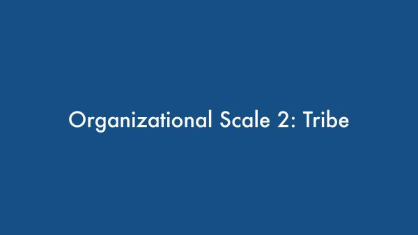

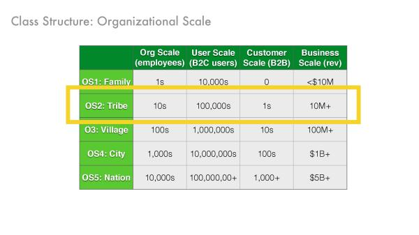

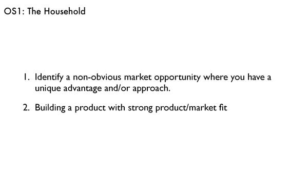

在早期，所有公司都想建立结构化优势，LinkedIn想建立强大的基于职业的社交网络，然后在这样市场上进行搜索。产品的定制特性放在那些想搜索的人身上。如果大家读 《The Lean Startup》里面说两个概念，一个是价值假设，为市场里的人提供价值吗？二是增长假设是：产品可以定制也存在价值，如何才能到达下一个规模？

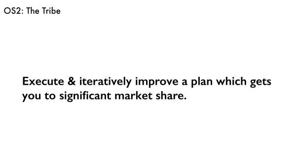

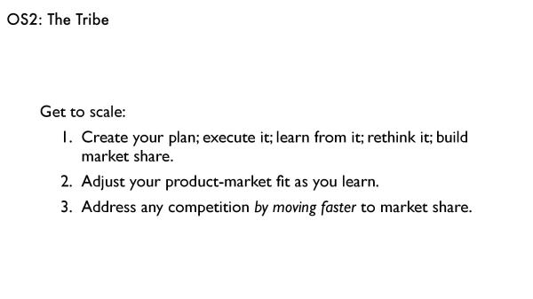

当谈到OS2规模的公司时，如何有好的产品市场定位。但在有限的空间，如何广泛的增长把那种价值提供给每个人。有三个可以做，第一是，你需要建立一个增长计划，然后执行从中吸取教训，重新思考，并建立市场份额。第二是在发展过程中，你需要调整你的产品市场定位，有效地了解状况并对此迅速反应。第三个你必须担心竞争，因为你现在所处的位置，很可能有其他新公司，它们知道你是谁，知道你正在做什么，并找到你实际上感兴趣的空间。你如何确保在他们能够获得市场份额之前，你获得市场份额？这个关键是能够非常快速的动作。

**LinkedIn早期竞争者**

当LinkedIn开始做2，3个月时，市面上也有三个其他的竞品，基本相同的空间和时间进入市场。他们都是出于第一级很小的公司，都尝试着建立产品市场定位，但没有一个足够快地扩大规模。

他们很快地开发高级功能，考虑如何盈利，尝试在高端建立优势，在他们还没有有效的价值去出售产品，也没有锁定市场份额。其中一个认为在企业内存在社交圈子。那个整体理念是，挖掘人们的电子邮件以发现那些联系方式，自动生成你的群组社交图。但想要做到，就得到每个公司和邮件服务内部，这样太慢了。

你实际上正在选择竞争对手，从根本上说，在你选择的方法时确定竞争空间。

LinkedIn在早期产品市场定位很弱，这是我们没有发展的原因。其实刚刚看到任何信息平台，它们都是通过价值发展。有7亿人使用WhatsApp也是因为人们为获得他们的价值，把他们的朋友吸引到系统中。

而LinkedIn从一个空的搜索空间开始，开发搜索平台以获得产品市场定位。我们相信未来某一天会获得那种价值。当时非常认真努力发展，想着怎么才对用户产生价值，后来才拉开了差距，最后退出OS2，进入到下一个阶段。

**LinkedIn OS2总结**

LinkedIn: Market = every professional; Opportunity = social network; Product/market fit = ended up being recruiters

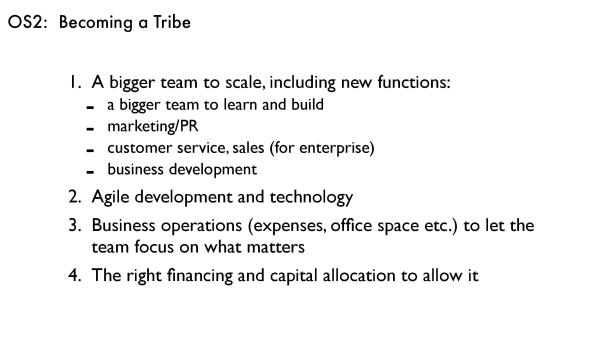

**成为部落**

关注增长比关注产品市场定位更有意义？

在你获得正确的产品之前侧重于增长，如果继续往里投资，大家又不用，而新公司竞争对手大量出现时，问题会变得越来越紧急。

我们必须在到达产品价值前获得增长。需要建立三个东西，团队一是工程，产品，设计，增长。

二是防御团队并支持一的。 office space, legal, PR, customer service, sales, operations, HR, recruiting，团队二是要确保创始人和工程师等不为必须处理订餐这样的事情而分心。

三是正确的融资和资本配置。因为你要保证给所有人发工资。在OS2领域融资需求不同于以前OS1领域。

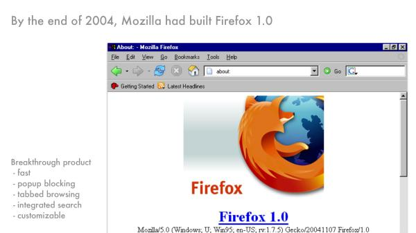

**Mozilla成立**

在2004年，Windows的IE占了95%的市场份额。他们不仅有市场份额，还100%的主宰分发。IE在你的机器上绑定，你买了电脑就有了浏览器。那时没有应用商店，你要选别的东西，必须要先知道它，才能从别的地方下载。

这个故事开始时，微软干掉了Nescape，干掉AOL，他们开创了IE，又解散了IE6团队去开发Silverlight。在六年之后才启动IE7。Mozilla其实在1998年作为Netscape的一部分开始运营，它是内部的开源项目。开创Mozilla的Bob Lisbon运作Netscape项目，他正在思考如何与微软竞争。当时有200个人开发产品，在微软大约2500个人之后他才放弃。从对称的角度看，我们根本无法竞争。我们必须弄清楚如何去一些不同的东西。

我从Bob学到的东西是就是，你必须在现存的市场里进行不对称的竞争。你不能在相同的领域上竞争。

后来开发了开源项目叫做Mozilla套装，是一个浏览器，一个html编辑器，一个电子邮件客户端。Mozilla项目中出现了分裂，他们内部认为人们想要的不是一个邮件编辑器，而是一个速度快的浏览器。

在2004年底，Firefox 1.0诞生。它速度快，弹出阻止，标签浏览，创新的搜索。大多数人想要的就是阻止弹窗，在2004年浏览网络，你要浏览几个小时，就会有200个广告窗口。

还有个让用户尖叫部分是标签浏览，Mozilla的确是让标签浏览流行起来的浏览器。

第三是安全，触发因素是IE易被非法侵入。因为微软不投资他们的团队导致有安全漏洞，连美国安全部都建议大众在用IE时装上某安全插件。

Mozilla启动时候没有任何资金，但我们有很多社区。有很多人和我们一起做这件事。这是一个开源项目，我们在每个国家都有本地化人员，所以我们只是做资金筹集。

下面说个关于广告的搞笑故事，本质上这是一个Kickstarter（众筹）活动。Mozilla所做的是我们准备30天，如果你支付我们10美元，我们会把你的名字公布在《纽约时报》上。结果募集到了比我们需要的多两倍的资金，然后就有了报纸第二页，你读到的其实是一个广告。

名字在里面的每个人都拿着《纽约时报》给他们爸妈看，我的名字上了《纽约时报》。后来就引爆传播，一个过程故事不是关于火狐本身，而是这个疯狂的公司做了什么来获得关注。而这造成在第一个月10,000,000的下载。

这个故事告诉我们，在任何时间当你有一个有用的古怪的想法时，在几个月内，它就变得一点都不古怪了，它就变成了现状。

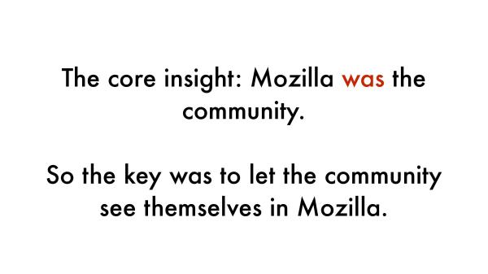

社区是王道。Mozilla社区利用的方法，是让人们在Mozilla中看到自己，并帮助他们，为他们提供工具，就可以传道，人们得到了主人翁的感觉，他们觉得我的10美元，就让我的名字就在报纸里，现在想把火狐放在我的图书馆和学校计算机上，这是确确实实它传播的途径，并且搞得像个运动一样。

而且早期Mozilla使用的很多语言和技巧，都是派生于很多政治竞选活动所做的事情。2008年奥巴马美国竞选活动，募集资金零售，以10，50，100美元逐渐增加募集资金，也从Facebook和Mozilla的发展中照搬了很多东西。

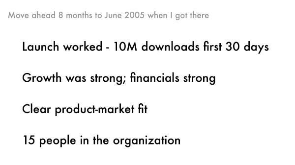

Mozilla很早就关注搜索，之前你键入长长的URL，但更多人只输入单词来搜索，并在搜索框中搜索。Mozilla是第一个在右上角有一个搜索框的浏览器。当时和谷歌签约，以能够从支付广告和点击获取费用。这是非常清楚的产品市场定位。

当时组织中只有15个人。而组织外有更多人，因为建立时间长，有成百上千人贡献源代码，有几十个本地化人员，本地化成法语，意大利语，德语，波兰语。

**如何说服别人Firefox是安全的？** 

媒体界也帮我宣传。Wahl Mossburg做了一个评论，说Firefox 1.0不错，它不像IE那样易被非法入侵。

自己宣传往往不如让别的人谈论这个简单得多。我们想让社区来推广。如果你想要传播火狐胜出的话，告诉你的朋友，同学，IT人士，火狐更加安全。

**为何加入火狐？**

John Lilly 2005年加入 Mozilla。当时是刚上线3个月，他初期观察时整个团队看起来很疲惫。第一次大家告诉他所有面临问题，John写了个PPT但没有任何反馈。后来就又交流一次，这次是一封长信还是没有回音。当时他失业，开始怀疑人生，觉得也许是不喜欢他，不在乎他的建议。最后想想还是去展示自我，帮助他们解决问题吧，第一次正式会议就是跟雅虎创始人Jerry Yang。当时Jerry很生气因为没有把Yahoo作为默认搜索。其实火狐也帮助了Google去赢得了搜索战役。John觉得既然这时候能让Jerry Yang大动肝火，还是挺拽的，然后就去当BD的VP了。

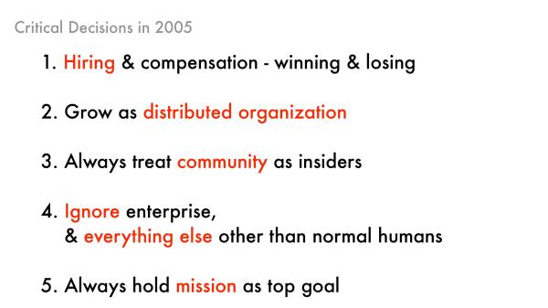

**OS2阶段重要决定**

**1\. 招聘**

聘请和获得更出色的人才是关键。我们必须弄清楚支付高工资的是不是我们想要的，我们从来不想在工资上胜出，因为很容易失去想要更高工资的人，2005年，Facebook，谷歌在发展，如果有人过来说我真的想为你工作，但谷歌一年给我多1万美元的工资，我们就说那你就去那吧。

以使命为导向，吸引了正确的人也让他们发现自己往前发展。如果你把招聘和资源分成这两个组，寻找可以直接驱动规模扩大的人，然后挑选能够扩大社区的人。

你的North Star是什么，并聘请认真对待的人。给的工资一定高于平均水平，例如，有一个我加入过的搜索公司，工资是最高的因为只有这样才能聘请到优秀的搜索人才。我认为选择对的人做对的事，或者各有所好，因人而异，而问题是哪个是你的North Star。

**2\. 分散的组织**

我们不会全部在当地。这是自我防御的，也是我们的DNA。在一个开源项目中，你拥有世界各地最优秀的人。我们想法是与其与在硅谷竞争，跟谷歌和雅虎抢人，还不如找价值观相投，并让已经聘请的人去推荐他们的朋友。我们在新西兰奥克兰有了办公室，员工是我们最优秀的开发者之一，他们大多是计算机科学专业的博士。目标就是找到最优秀的人，他们的积极性不是被金钱激发，而是被社区和使命激发。

**3\. 把社区当自己人**

我们很多次让不在Mozilla工作的人代表我们向媒体发言。因为我们尝试让尽可能多的人拥有该产品，尽可能拥有成功。当微软是这样一个大的软件公司时，看到我们古怪社区，没有关注这个如何发展，后来看懂也为时已晚。我们希望以他们不能做的方式来得到财产。Mozilla作为非盈利，因为想对社区说我们绝不会利用你。

**社区是非常多样的，你如何才能防止它变得混乱呢？** 

确实很乱，对于在正常公司工作过的人来说，走进Mozilla，他们会觉得究竟在发生什么事？因为那么多人在走着许多不同的方向。你弄清楚这个地方的DNA是什么，什么是我们的超能量。

我们有了一个旅行政策，就是任何时间任何人想要让一个团队在一起，他们就可以，无论他们想要在哪个城市做这件事都可以。你可以在多伦多或澳大利亚或悉尼或东京，无论哪里，都可以做这件事。我的承诺是不管大家花多少。其实他们从来不会花太多钱，因为责任很大。

**4.忽略大公司**

世界500强公司经常说我们想用firefox的话，你们必须做到X个功能，但我们考虑的是普通人需要的，不是企业级，这样就完全忽略他们的需求。我们期望时在公司里的人愿意来使用，但不要指望所有其他的功能。

**5\. 使命是最高目标**

Mozilla不是为了拿到市场份额， It was making the web more participatory.

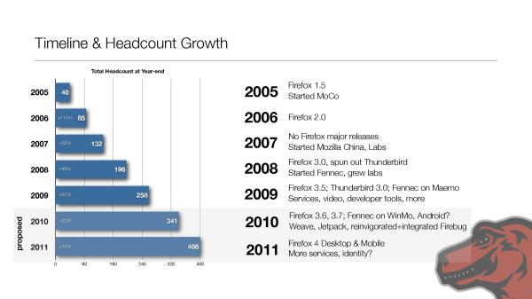

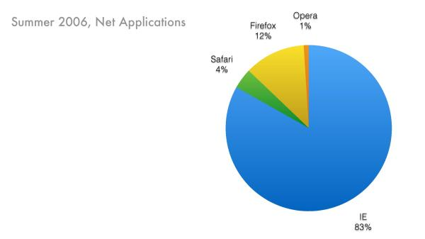

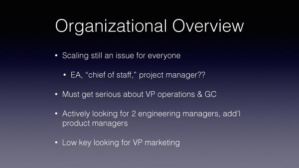

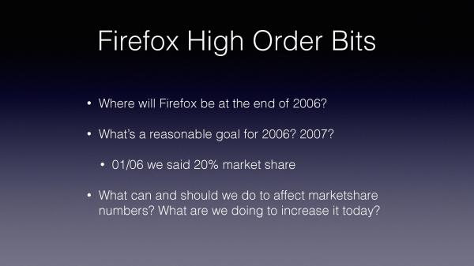

**什么是个好的目标？**

The purpose of goals is to set organizational goals in which you can hit over time to help the team know you are making progress and start to deliver consistent results over time.

一般你设定第一组目标是不靠谱的。所以这是迭代式的，你尝试在组织中如何设定限制条件，并随着时间的推移，遵守这些限制条件，这样更擅长设定目标。Firefox现在处于12，13%，20%好不好？20%可以实现吗？

开始必须对目标是什么非常清楚，对目标作了什么改动，你是否实现了目标。未实现目标时，如何帮助他们调整情绪。随着时间的推移，你更擅长做这件事。

**当你不知道目标怎么向团队解释呢？**

目标设定总会越来越科学。每周有全体员工大会并且每季度总结 —那些达到那些没有。我们总是开放透明的，比如分享董事会的ppt，做事背后的原因。

如果我们击中71%的目标，那就是相当好的季度。如果我们击中66%的目标，那就是差劲的季度。你想要足够的竭尽全力的目标，你尝试更多目标。

我其实不喜欢IT小组他们每次都击中100%他们的目标，这意味着目标定的高度不够，没有竭尽全力。

还有不要被市场份额所迷惑，就算你底子不好，也可能市场份额增长，要避免盲区。

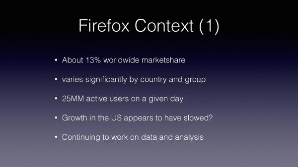

发现美国用户增长不给力，就招了第一个数据分析人员。用户增长到下一个规模总是非常难的，从0到1百万比起从1百万到1千万要难多，你之前的经验往往也不管用。

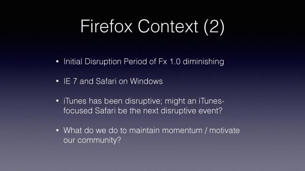

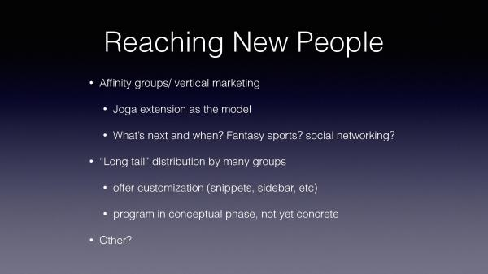

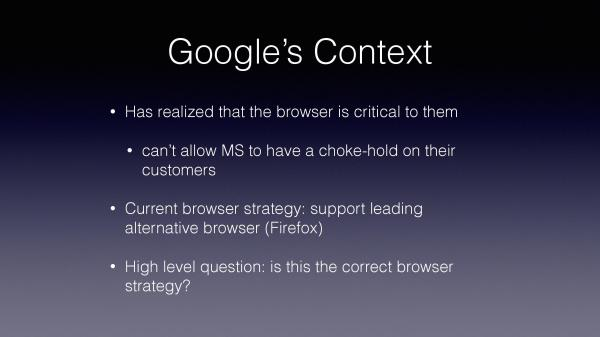

Google曾经是Firefox盟友，并提供了经济支持，但同时也意识到浏览器的重要性。认为谁能直接接触到用户谁就赢。这就是后来开发的Chrome，以前是你的朋友的成为树敌。

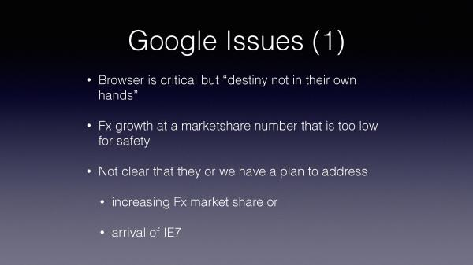

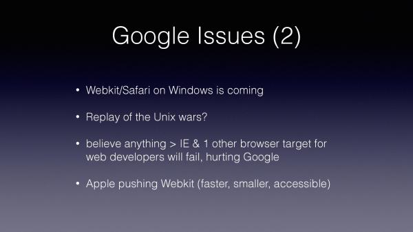

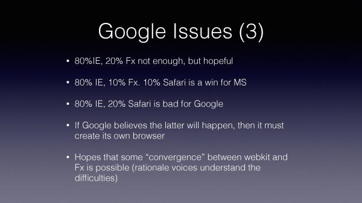

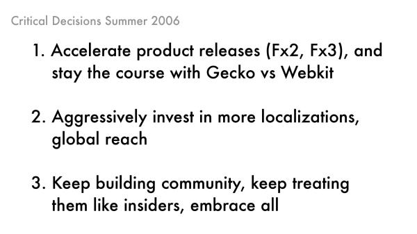

坚持自己的平台，在国际化中保持增长，社区核心优势

**成长的烦恼** 

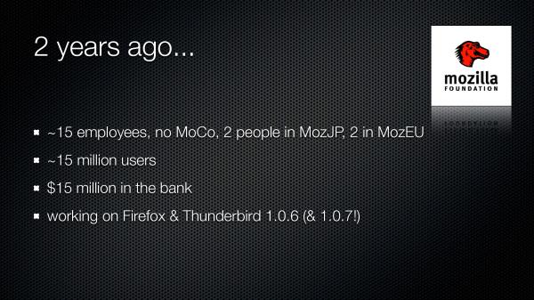

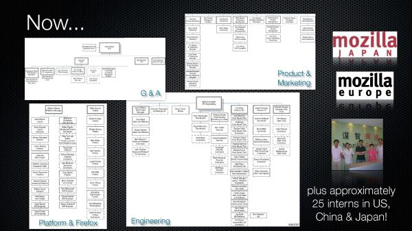

团队变大，产品变复杂，大家觉得在这个规模上与使命失去联系。Either invest in people who can directly impact the scaling goal, or keep the scaling team focused by removing distractions.

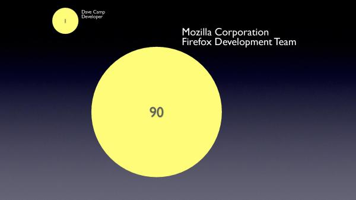

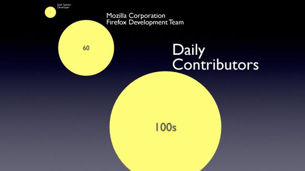

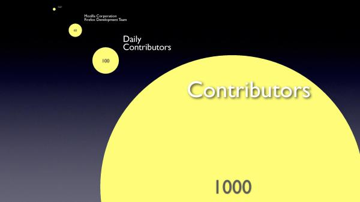

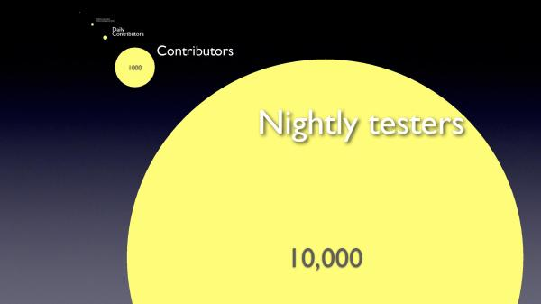

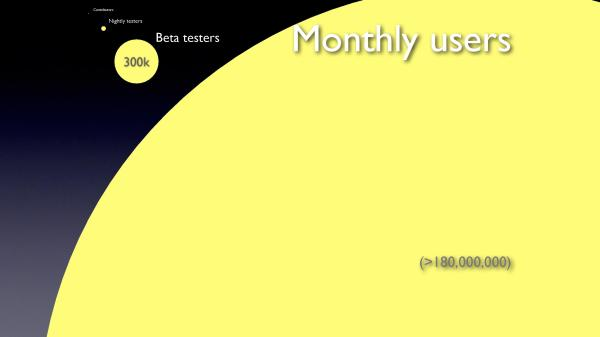

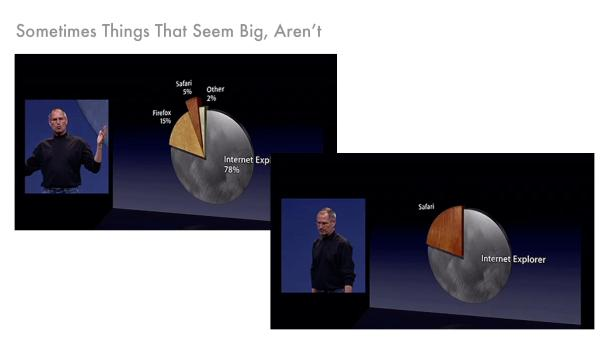

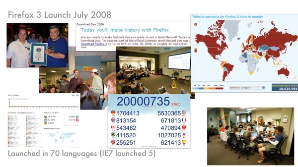

2008年，Firefox发布版本3，在24小时的时间内为下载做一个Guinness纪录。1天2000w下载，70种语言。宣传用语是成为运动的一部分：进来，成为它的一部分。

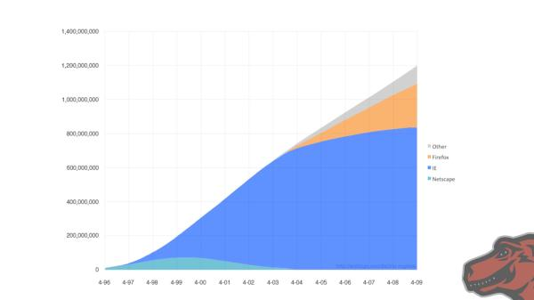

**当时挑战**

Chrome — Google 决定另立炉灶

Farmville—火狐在技术上犯了一个错误，有一个扩展机制，如果你要运行扩展，可以在火狐中的代码下做任何事情，这让很多人写扩展，但会引起火狐吃掉很多内存导致泄漏内存。在我们的测试中，火狐运行很好，没有泄漏内存，但很多用户环境中，它运行得很糟糕。Farmville在一年之内用户从零到7000万，而火狐不能很好支持Flash，的确是个打击。

Mobile增长 — Firefox现在还在挣扎。

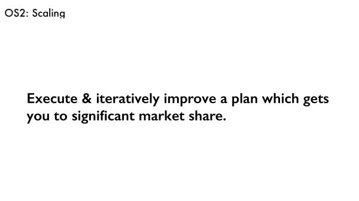

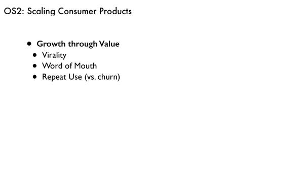

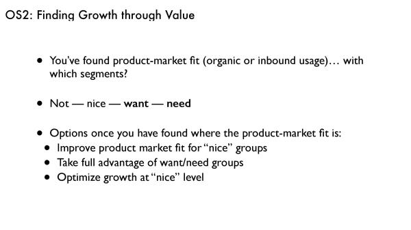

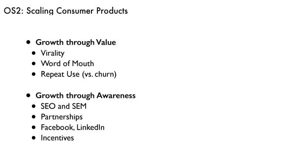

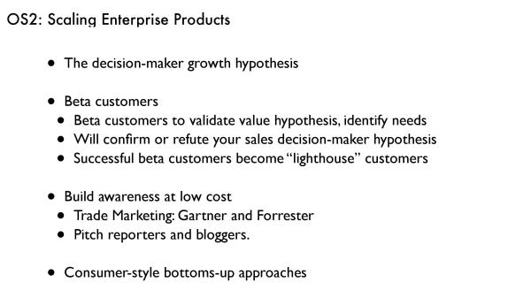

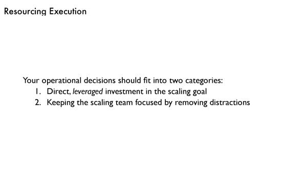

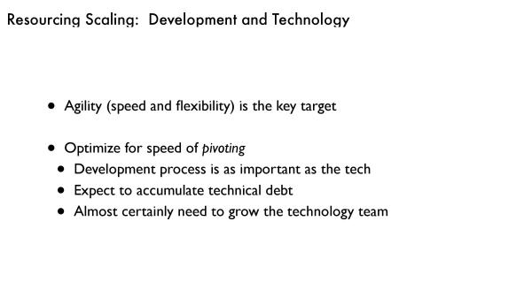

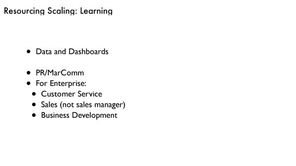

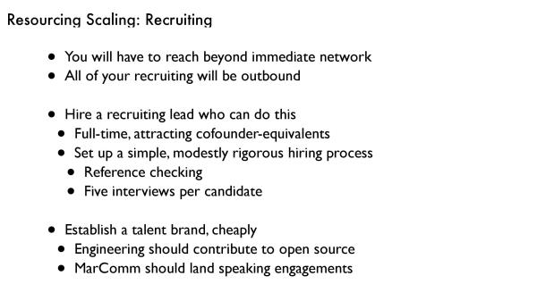

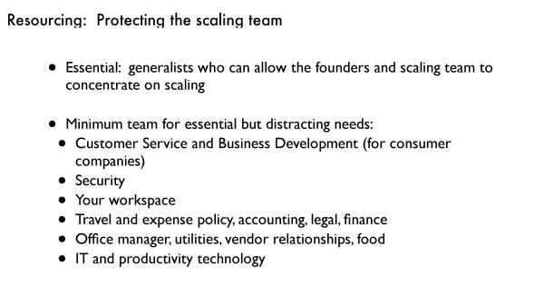

下节课嘉宾，Code for America的创始人Jennifer。由于课程时间紧张，下面的ppt还没来得及讲，给大家先睹为快。

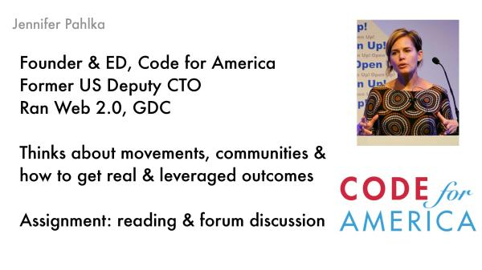

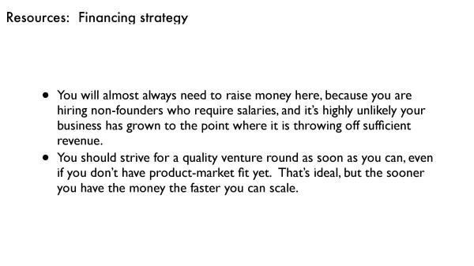

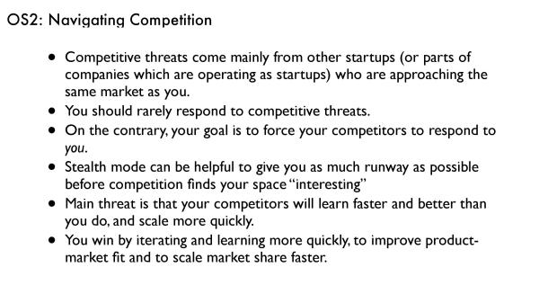

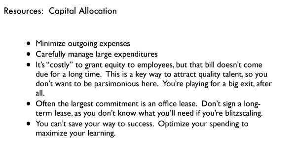

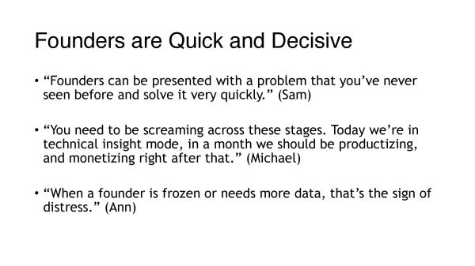

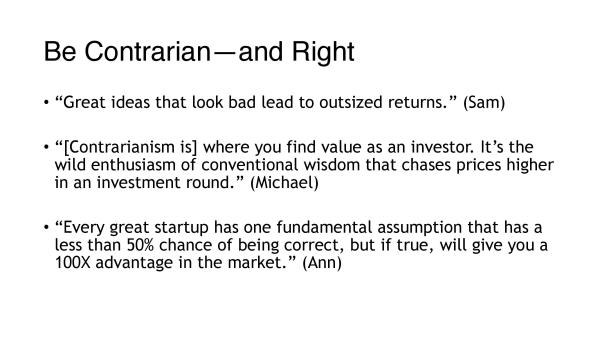

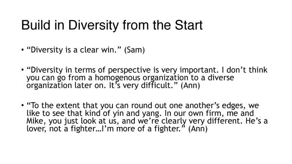

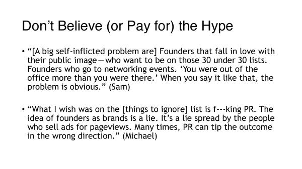

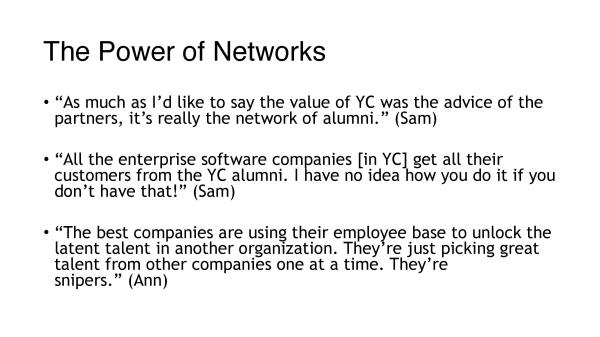

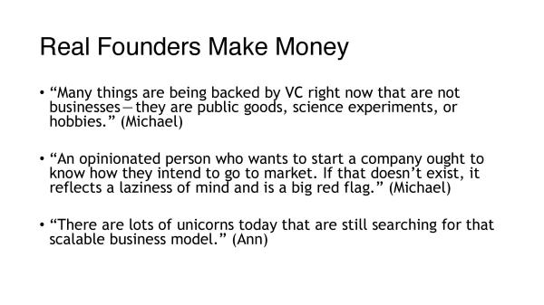

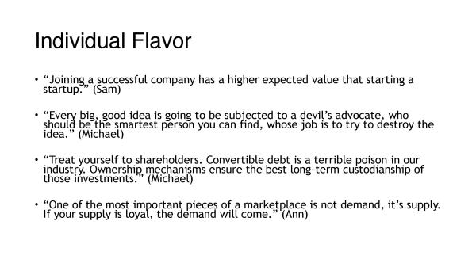

**最后问题**

**－ Mozilla和LinkedIn增长假设是什么？**

对 Mozilla说，是早期压宝在社区上。他们是期望做个社区喜爱和传播的东西，这样可以去增长。很多忠实用户帮他们亲朋好友下载，让他们父母去用Firefox而不是IE。

但企业用户是一个不同的价值，你不是试图进行大范围的用户增长，而是找到决策制定者。LinkedIn有一个招聘人员产品，代表了收入的很大一部分。那么从根本上说，公司内部的某个人为他们整个群体购买。明白此，你就要以某种方式联系上第一群客户。增长假设从根本上是运行beta，然后把那些Beta用作指引，我们称为灯塔客户，说明那个东西多有价值。然后找到背后这些决策者。

**－ 早期LinkedIn如何继续发展用户？** 

从一开始我们计划是来自早期群组的病毒传播，每个进来的想寻找其价值的人，最终把其他人带进来。最初阶段，我们以冷启动的方式邀请他们的网络。在早期，我想要一个网络，可以使用它来招聘或者找工作。后来在Google上找到，在媒体中听说，然后就成为注册用户。

**－ 回头看，哪些事很神奇的？**

在很长时间内，他们不认为Firefox能赢。

我们动作很快以至于认为快摔倒了，但最后还是修补了所有问题。

很多人在乎Firefox，在全世界很多人都对open web很有热情，有这样强大的社区心存感激。

**－ 非盈利对Firefox成功影响多大?**

对4.5亿人用的产品来说，这个问题挺难，很多人为它做了贡献但从没有从中得利。如果作为盈利公司可能更容易些，但当我加入时候已经是这样了。

**Allen总结OS2经验:**

找到真正热爱产品的用户, 让他们帮助你去推广。真正喜欢LinkedIn的用户，他们热爱社交，添加新的联结。这是用户增长的主要动力。 那些觉得产品好看但无用的用户来说，是不会对产品增长有帮助的。你需找到那些核心的需要你产品的用户。

**参考资料**

[Class 5 Notes Essay](http://link.zhihu.com/?target=https%3A//medium.com/notes-essays-cs183c-technology-enabled-blitzscalin/class-5-notes-essay-reid-hoffman-john-lilly-chris-yeh-and-allen-blue-s-cs183c-technology-468d351b6617)