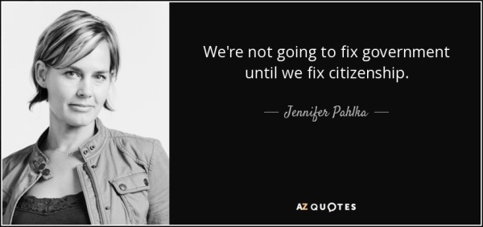

# 6: Code for America

来源：[https://zhuanlan.zhihu.com/p/20359982](https://zhuanlan.zhihu.com/p/20359982)

主持人：John Lilly

做客嘉宾：Jennifer Pahlka

整理者：Liangyu - November 26, 2015

**内容提要**

本节课 John Lilly 采访Code for America（CFA)的创始人Jennifer Pahlka。 John同时也是Jennifer的董事会的成员之一。访谈内容围绕以下几个要点展开：

*   CFA的创立背景
*   寻找最初的客户
*   第一笔投资
*   非营利性和营利性之争
*   最初的定价原则
*   产品介绍
*   当前的发展计划

特别之处在于，Jennifer作为公司的创始人，短暂的离开了公司，去白宫任职一年。所以Jennifer也谈论一下她的这段特别的经历。

下面这篇文章总结自本节课的采访视频，课程笔记和2012年Jennifer Pahlka在TED的演讲视频。

**梦想这次没有出生在车库里**

说起创业公司，大家耳熟能详的IT公司—Apple，HP，Google都有一个相似的诞生地—一间普通的车库。但是CFA却没有诞生在车库里。2009年年底的时候，Jennifer 辞去了她的全职工作。那时，她正在和Tim O’Reilly一起负责主持网络2.0系列会议（Web 2.0 Events）。辞去了工作，就意味着没有收入，而且还有一个12岁的女儿需要照顾，Jennifer那个时候的压力大的无法想象。但是她从内心里觉得她已经找到了她的后半生应该做的事情—让编程使得政府变得更好（Coding for a Better Goverment）。事情要回到网络2.0会议之后的姊妹论坛— 政府2.0会议（Gov 2.0 Events）上。这个会议起源于2007年到2008年之间，一系列推动政府到社交媒体上的计划。那个时代也是iphone诞生的时代，各种各样的入雨后春笋般出现的智能手机也使得政府在社交媒体上做一些有趣的事情成为可能。

在此期间，Jennifer经常去华盛顿特区，和很多同政府打过交道的人聊天。所看到的一切，所听到的一切，却让她大失所望。政府在很多项目上花了很多时间、很多资金，但是出的成果却不让纳税人不满意。不过对于她来说，这段经历也是一个开阔眼界的旅程。CFA的点子就起源于这段旅程中。她的一个在政府内部工作的朋友，无意中谈起了，可以找一些在懂计算机的极客一样的人来尝试解决政府碰到的一些问题。但是Jennifer一开始没有想自己来做，因为她自己本身并不是一个程序员，只写过一些HTML语言。当她意识到的她的关系网里面的所有人都没不太可能对这个项目刚兴趣的时候，她决定亲自出马了。但是，除了这个美好的主意之外，其他的一切，资金，人员，客户，律师，都没有。但是机会是不会错过坚持梦想的人。

**来自她的意外生日礼物**

创业最重要的就是启动资金。而且有几个土豪朋友确实是可望不可得的。Jennifer就在她生日时候收到了一个管理某个基金会的土豪朋友的礼物。是一个钱包，而且不是一个普通的钱包，因为里面放着一个张价值1万美元的支票。另外，Steve&Jean Case基金会和Sunlight基金会也分别资助了1万美元。这三万美元的启动资金足够她去聘请律师和给政府快递去各种公司的宣传材料。之后，来自Omidyar Network的Stacy Donohue雪中送炭般的又送来了一张支票，使得她长舒一口气。终于可以发得起工资了。

**招兵买马，变劣势为优势**

在美国科学研究界，有一个叫做年假（service year program）的福利。就是高级工程师、设计师或者教授在工作几年之后，可以有一整年的休假时间来做一些自己喜欢的事情。Jennifer就打算网罗 了一些在年假期间的高级技术人员来她的创业公司上班。

不同于大部分创业公司，CFA的定位是非盈利性公司(non-profit)而不是盈利性公司（for-profits）。这是因为CFA的启动资金不太充裕，所以招聘的对象是在年假期间的高级工程师。因此付给他们的工资往往会比市场的价格要低不少。Jennifer是完全指望有人靠激情和信仰来参与进这个项目。除此之外，正因为公司是非盈利性的，那些工程师也就不会担心他们的年假被人利用，赚的收入进了他人的腰包。

但是，招聘资金的条件限制并不意味着CFA缺乏人手。直到2015年，CFA有了45个全职的职工，24个会员（fellow），但是还有34，000位经常参加CFA Breigade会议(Code for America Brigade Meeting)的编外技术人员。Brigades是一群志愿者群体。每周他们都会定期在当地市政府的会议厅讨论当前城市面临的技术问题。这帮人或多或少认为他们自己也是CFA的一员。

同为依靠社区力量的Mozilla也采取了相似的策略。他们知道没法在浏览器领域和微软的IE竞争，所以他们开拓了一个新的领域，新的战场。这就是开源和引入社区的力量。而代价就是，Mozilla的小组成员不会变成非常富有。

所以作为创业公司，明白自己的优势在哪里很重要。通过引入社区的力量，CFA把没法招聘更多人员的劣势变成了优势。CFA采取一种兼容并包的态度，欢迎所有有同样理想的人加入进来。在Jennifer的自述中说，这一点还带来了一些意想不到的结果。比如，离开的一个会员去和CFA之前合作过的一个当地政府一起创立了一个新的公司。还有一个会员，离职去了市政府工作，现在成为了CFA和政府之间的一个桥梁。还有从政府部门跳槽过来的人员。所以CFA和政府之间的联系更紧密，更复杂了。内部有人好办事，这一点，CFA是彻底体会到了。

**另辟蹊径获得第一批用户**

第一笔生意总是困难，但是树是死的，人是活的。CFA就采取了一种新的策略。他们不试图向潜在的市政府客户出售任何产品。而是引入一个竞争的局面，让有兴趣的市政府都在竞争和CFA合作的机会。这样，CFA就能从容地选择出一个最好的合作伙伴。

人靠衣服，马靠鞍。光有一个美好的点子，恐怕吸引力还是不太够。CFA的策略，也是很多Web 2.0 时代的公司的惯用手法，就是弄一个很漂亮网站。这个在很短时间上线的网站让大家都觉得CFA还是很有竞争力的。或者说让大家相信CFA背后还是有一个实际公司的。虽然只有三五条枪，这个秘密也不能让客户知道。

第一批客户很快就确定了，他们是波士顿、费城和西雅图的市政府。美国政府结构分三层，最高的是联邦政府，接着就是各个州的政府，接下来就是底层的当地郡县政府。CFA选择和当地政府合作的原因，是因为这一级的政府才是真正和市民接触最紧密的地方。而CFA的产品就是改进政府机构service delivery这一步的效率。

波士顿市政府里有一个叫做新城市-市长办公室的机构。在这个机构里的职员和大家印象中的死板的政府职员的映象很不一样。他们乐于尝试新事物，敢于承担风险，而且他们得到了波士顿市长的授权。他们告诉Jennifer，如果项目成功了，功劳就归于你的CFA和参与的相关部门。但是项目如果失败了，责任就由我们就承担。这让Jennifer非常开心，而且在TED和斯坦福的课程里面也多拿波士顿举例子。因此，像波士顿这样的政府，就很自然的成为了CFA的第一批客户。

创业初期，失败在所难免。一开始，CFA有四个用户。除了之前的提到的三个，华盛顿特区政府也有兴趣来合作。但是在合同签订之后，原来支持这个项目的市长Adrian Fenty在新的一轮竞选中失利，新的市长Gray取而代之。俗话说，新官上任三把火。Gray市长的第一把火，就是在项目开始的第一天中午把全体CFA华盛顿小组成员都炒了鱿鱼。

所以，起步的时候，绝大多数创业公司都能找到一类特别的用户。但是，最好不要找那些主流的客户。因为在一开始的时候，是必然会犯很多很多错误的。

接着，给自己的产品订一个价格就是CFA接下来需要考虑的问题。CFA的方法是在需要付给自己会员（fellow）工资的基础上，在加上一点点。然后告诉客户，我们要这么多。费城和波士顿的政府接受了这个提价。但是西雅图没有接受，而且打了点折扣。CFA也接受。第一批用户的每一个都是宝贵的。其实，John Lilly也说道，其他创业公司有时也会任性的选择一个价格。这个方式听起来很疯狂，但是不为一个好方法。但是有一点，如果你的客户想都没想就答应了这个价格。你就知道这个价格出的太低了。下一次出高一点就好了。

**走对了路的产品**

故事再次回到波士顿。那个时候，CFA在波士顿的成员在支持一个叫Discovery BPS的项目。CFA小组一般是三个人，包括一个设计师，两个工程师。理想状况下，这三个人就应该具备了开发一个简单的网络程序的所有技能。波士顿CFA小组就开发了这么一个网络程序，让波士顿的家长可以输入自己的家庭地址和小孩的年龄，然后网页上显示出哪些公立学校他们的小孩能够上。故事的背景是波士顿政府修改了一个规则，这个规则决定了你的孩子将会被分配到什么学校。他们的出发点是好的，因为他们希望更多的小孩能够走路去上学。但是市政府一些人觉得通过一个邮寄一个28页的小册子来介绍所有的变化但却不直接了当地告诉家长你的小孩能够上哪个学校是个好主意。因此，家长们都很纠结。Jennifer 记得在[http://BostonGlobe.com](http://link.zhihu.com/?target=http%3A//BostonGlobe.com)上有一段视频家长哭诉，说选学校的时候就要到了，但是他们还是搞不清楚自己的孩子应该去哪个学校上学。投诉和求救的信件如同雪片般的把市长办公室给埋掉了。

所以，应市长的要求，CFA的一个会员Joe Mahoney出手，自己全职再带上一个兼职的程序员开始着手开发一个app来解决这个问题。从接受市长布置的这个任务，到开发出一个可以使用的原型产品仅仅只用了10个星期的时间。之后，在一次在CFA的董事会上，波士顿的合作伙伴Nigel Jacobwho 告诉Jennifer ，“如果CFA走传统的政府渠道—这个app可能会花费2年，耗资2百万来完成。” 正是这番话触动了Jennifer。让她觉得她的CFA做的事情还是很有价值的。虽然一开始的时候，Jennifer并没有想到这点。这个产品不仅仅是政府和家长可以用来解决当前急迫的问题的一个东西，而是，这个产品向周围的人们发出了一个疑问，为什么这个普通的东西如果用正常的政府渠道去做，会需要2百万美元加上2年的时间？

Jennifer讲述的另外一个故事发生在底特律。CFA创立第二年的时候。一个女士介绍CFA去底特律。总所周知的原因，底特律的制造产业正在快速没落下去，那里的工作环境不是很好，政府几乎破产。但是那位女士在项目结束后告诉Jennifer，“我在公共服务方面工作了25年，我已经放弃为公众服务的打算了。但是CFA开发的工具让我觉得我又能服务大众了”。这一点再次触动了Jennifer，让她觉得CFA的产品是符合市场的需求的（produt-market fit）。什么是好的产品？什么是对的产品？如果这个产品的出现能够让周围的人思考为什么世界因此变得不用，让用户思考之前的旧方法还有很大的改善的余地。那么这个产品就是有意义的东西。

**来自白宫的邀请，被挖角的CEO**

CFA发展壮大后，来挖角的信是一封接一封。其中就有一封来自白宫。对于这个邀请，Jennifer一开始是拒绝的，她有一个成功的创业公司，更重要的是她是一个注重家庭的女人。12岁的女儿在她的心中是最重要的。所以她认为搬家去华盛顿是无论如何不会发生的。但是另外一句话，没有什么事情不是不可改变的。她和白宫的CTO Todd Park和 Deput CTO Nick Sinai都是老熟人。Park在白宫发起了一个总统创新项目（Presidential Innovation Fellows Program），Jennifer对于这个项目非常感兴趣，而且Park也有意来邀请Jennifer加盟。而且她和Sinai一起还在伦敦访问英国的政府数字服务机构。这她觉得她也可以在美国做相似的事情。

这个是一个让Jennifer十分纠结的机会。一边是家庭，一边是事业。使她最后下决心的是她的会员和客户。他们告诉Jennifer，她必须有自己和政府有过打交道的经历，才能从根本上理解一些问题，在能和客户说，你的情况我自己亲身体验过。况且，Todd还使了一个小计谋，让她没法再次拒绝。这样，Jennifer 登上了去华盛顿的航班。

**远程遥控，进修归来，执行力（operation strength）**

虽然身在白宫，Jennifer还是远程参加董事会的例会。她没有让其他的人来全面掌握公司，因为她向所有人保证，她只离开一年，就会来回的。在白宫的这一年，Jennifer经历了[http://healthcare.gov](http://link.zhihu.com/?target=http%3A//healthcare.gov)的失败和重生，以及USDS的创立。在回到CFA后，她变得更有决断力。因为不像在白宫里面为事，她就是CFA的CEO，她对于公司有全部的控制力，不需要说服其他人来做任何事情。这就包括回来之后立马砍掉了一些僵尸项目。僵尸项目，就是那些不知道为什么还要继续，但是又没有很充分的理由暂停的项目。这必然会在公司的职员里面产生很大的反响。所以Jennifer和每一个员工都做了一对一的面谈。她希望每一个人都能够在同一个面上，理解公司的大方针。但是很多时候，同一个词，在不同人的字典里面却代表了不同意思。比如，“最近需要做的项目”。可能领导指的是最近半年的工作要点，但是员工却认为是明天要做的活。所以，要确保你说的话在其他人听到后是同一种感觉，就需要确认，确认，再确认，一次又一次重复同一个信息。如果迫不得已，需要对原有的消息做一些改变，那么必须是非常大的改变，而且要确保这些改变是明显的。这个一点，对于在公司快速增长期的时候是非常重要的。

**什么时候算赢了呢**

CFA的产品较其他创业公司的产品比起来有一些特别的地方。像Facebook，Twitter，Snapchat等公司，用户数量和收入可以作为一把很好的尺子来衡量产品是否成功。但是这把尺子对于CFA来说却不合适。CFA没有采取比较用户数量的方法。因为有一些项目就只有三个政府客户，但是他们的影响力很大。CFA考虑的是另外的尺度—这个项目被重复部署的次数。他们纵向比较各个不同的app的被重新部署的次数。因为，一旦一个项目被重新部署到其他城市，就从一定程度上说这个项目是成功的。

2011年，波士顿CFA的成员就开发了一个“领养消防栓”的网络app。2011年的冬天，波士顿下了很大的雪，很多消防栓被埋在雪堆里面，政府也没有能力及时把它们都清理出来。所以这个app就可以让市民在地图上标出自己志愿负责的清理积雪的消防栓。清理之后，就可以在地图上面标上自己的名字。还可以展示给自己的朋友看。自然的引入了成熟的竞争（game）的网络游戏理念。这个项目按照CFA的标准来说是很成功的。

因为，之后它被推广到夏威夷，不过消防栓换成了海啸预警广播站。当地政府老是抱怨广播站的电池经常会被偷窃，而政府又没有足够的人手去定期检查。那么这个app，使得政府可以让志愿者来“领养”一个广播站。原来的app没做多大改变，就在夏威夷发挥了巨大作用。芝加哥也采用了这个app来清理消防栓，还有西雅图等其他几个城市也要采用。一个针对波士顿的市政府遇到的问题而开发的产品，最后，出乎意外的推广到多个城市。这不得不说是一个成功的例子。

另外一个特殊的评价标准是影响政府决策的程度。如果能够影响政府，从而使得它们能够在技术方面做出更明智的的决定，那么这个项目也是成功的。比如，加州打算推出一个RFP系统，打算花费1百万和5年时间去完成。但是，根据经验，一个花费1百万和5年时间，尤其是政府的项目，可能只有2%不到的成功率。然而，CFA说服当地政府放弃旧的官僚拖沓的流程，采取CFA经典的小步快跑方式，以一个比较低的起步资金，快速循环的方式来开发产品。这个时候，Jennifer就确认他们赢了。

**一个被忽略的市场**

CFA的主要客户是各个政府机关。一开始的时候,很多创业公司都远离政府机构。所以这CFA看起来有一些另类。和政府打交道确实很难。除了一堆需要层层审批的红头文件和繁文缛节的条例，最大的困难是采购过程。采购（precurement）就是政府购买各种他们所需要的东西的方式。这有一点像我们普通人购买软件、铅笔和汽车。当然，政府设定一个复杂的采购过程的出发点是好的。它可以减少假账、浪费和贪污。你当然不想政府人员滥用纳税人的钱，把合同交给他们的亲戚去做。但是，这也意味着，如果你是一个创业公司，你可能需要9个月的采购时间来中标。还需要提供各种文件。比如，其中有一个要求是你需要证明你的办公室的厕所里面的各种标识都要正确。更不用说其他的各种认证。大家都明白，信息科技时代，技术瞬息万变。9个月的时间，很可能技术都改变了，环境也改变了，人员也可能离职。这就增加了很多可能会导致失败的不确定因数。然而，9个月是时间仅仅是敲定了这个合同。之后还可能需要5年的时间来完成它。

除此之外，美国巨大的南北政治差异也给CFA造成了一些小困难。美国南部的地区，由于信仰的问题，政府和人民并不是那么开放和兼容并包的，不太容易接受新事物。所以，CFA在去Altanta，Louisville，Kentucky以及其他的一些南部小的地方展开工作之前，先请那些政府的领导看了和他们城市具有相同规模，人口，政治观念的城市的例子。介绍了那些城市采用CFA的方式后的效果。一旦那些保守的政府领导明白了这也没什么，觉得这也不过是很普通的一些事情后，他们就容易接受CFA，工作就容易展开了。

其实，政府市场这块蛋糕还是很大的。一个比较有争议的数字是2亿美元。而且这个仅仅是在技术应用这个方面。如果在考虑到服务方面省下的开支，这个蛋糕就更大了。据Jennifer介绍，CFA和政府部门的第一笔生意大概价值25万美元。当然过程很艰难。CFA用的就是之前提到过的策略—制造一个竞争的局面。如果一个城市赢了，他们就能有资格搞一个发布会，让很多媒体人过来给城市做做宣传，政府领导脸上也倍有面子。另一个来自CFA的经验就是和政府合作的过程中必须要设立一个截止日期。让政府的领导感觉到一种—可能会失去的恐惧—如果他们在一个期限前不签合同，其他的城市就会得到。有压力才有动力，不仅仅是对于政府还是非营利性机构本身。目前的侧重点和未来

在第一年结束的时候，当Jennifer看到他们制作的某些产品可能会成为一个可维持的小公司后，CFA启动了一个叫加速器的项目（accelerator program）。在CFA之外，还有一些公司，他们做了很多类似的产品，但是不懂得政府这个市场作的价值。所以CFA目前在做两件事情。第一，开始孵化那些产品能够孵化成公司的项目，目前有6个公司。包括一开始提到的那个离职的CFA会员创立的公司。第二，支持来自外部的专注政府市场这款蛋糕的项目。第一年，有194个公司来申请这个CFA的加速器。

用Jennifer的话来说，“事情总是朝着好的方向变化。这可能不会很迅速，但是在慢慢变化中。”

— The End

**参考资料**

class note source : [Class 6 Notes Essay](http://link.zhihu.com/?target=https%3A//medium.com/notes-essays-cs183c-technology-enabled-blitzscalin/class-6-notes-essay-reid-hoffman-john-lilly-chris-yeh-and-allen-blue-s-cs183c-technology-51dff00975f0%23.17pny6oba)

youtube：[https://www.youtube.com/watch?v=Zx12-qFXFGk](http://link.zhihu.com/?target=https%3A//www.youtube.com/watch%3Fv%3DZx12-qFXFGk)

TED: [http://www.ted.com/talks/jennifer_pahlka_coding_a_better_government](http://link.zhihu.com/?target=http%3A//www.ted.com/talks/jennifer_pahlka_coding_a_better_government)