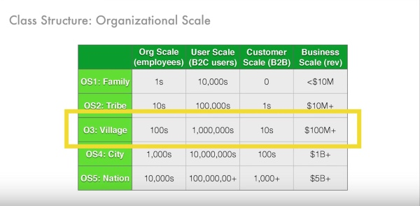

# 9: Village

来源：[https://zhuanlan.zhihu.com/p/20359971](https://zhuanlan.zhihu.com/p/20359971)

> _版权声明_
> 
> _本文首发自微信公共帐号：donglaoshi-123；_
> 
> _作者：董飞_
> 
> _无需授权即可转载，但请自觉保留以上版权声明。_

第九节是Allen 与Reid的讲公司发展到Village阶段，以LinkedIn作为例子，谈到规模化战略，如何扩张团队和得失。

## 一，从OS1到OS2，OS3的变化

1.  在OS1（家庭） - 试图弄清楚，你能创造一些为客户所想，独一无二的东西。

2.  在OS2（部落） - 试图找出产品的市场契合，以及何时启动占据整个市场

3.  在OS3（村） - 当你扩大到150人，决定规模化的时候需要重大转变。

## 二，为什么扩大规模？

*   150人是可保持稳定的社会关系的数量。

*   一旦你的公司超越150人，你不可能认识公司所有人，协调变得有挑战性。

*   OS3公司需要牵引力，要么有收入或能看到收入流的来源。

*   在协调方面的挑战使得公司需要扩展，并支持更大的组织。

*   如果组织每年增长50-100％，是一个不稳定的组织。通常公司会在此期间多次改变组织结构。

## 三，规模化的主要因素

*   市场规模是一个重要的考虑因素。要考虑你的公司扩展，市场是不是足够大？

*   你需要获得很大资本 - 这可以是收入或筹款。

*   公司规模加速通常是因为竞争加剧。但也有反例- 例如在Minted Mariam Naficy决定不扩大规模，因为她的竞争是老的文具领域。没有人试图“带她出去。”LinkedIn在这方面是非常相似的。

*   在第一阶段（OS1和OS2），竞争不那么重要，因为市场机会并不明显。一旦你到OS3 - 其他公司和你都可以看到更多机会，竞争时代来临。

*   什么时候规模化 - 取决于竞争形势，市场机会，进入市场先机，资本获取等。

## 四，2008年LinkedIn规模化原因和操作

*   LinkedIn 2003年成立，准备花5年来做产品。在开始阶段，他们做了一个决定，让事情变得精简 - 他们在招人和融资上非常挑剔。

*   在2008年前，很难让人知道做的什么，Friendster当时起来，LinkedIn就被称为商务方面的Friendster。

*   之后的Friendster和MySpace到来的时候，普通用户开始了解什么是网络，以及如何使用。LinkedIn用户了解更新简历，知晓价值，使用网络找工作的能力。

*   LinkedIn从作为消费者的公司到走向企业，因为他们发现，企业要LinkedIn付费招聘人员 - 招聘客户经理，销售，客户等 - 开始看到产品市场契合的早期迹象。

*   在2008年，他们决定现在是快速进入市场的机会 - 同时赢得消费者和企业市场。

## 五，LinkedIn规模化的计划

*   当杰夫加入了时候，是城镇规模的中期，他想建立规模化的基础。在OS1和OS2你并不需要清楚计划的，因为每个人都直接一起工作。在OS3阶段，你要管理大型组织，需要更清晰，更简洁的商业计划。

*   杰夫为LinkedIn设立使命“为世界上每个职场人士提供经济机会。”在过去的6年都是同样的使命。

*   使命是很重要的，因为它是指导决策的试金石。当你到了400，1000，10000人，要建立一个共同的语言，确保每个人都在同一页上。

*   一旦超过100的 - 你可能不能参与到其中一部分对话 - 你怎么能解决不能参与到的？你需要一种方式去表达。

*   招募一些LinkedIn之前不曾有的管理层，他们带来新的技能。

## 六，LinkedIn规模化战略

*   LinkedIn的战略是在大规模下让机会和人才连接。

*   用户增长与LinkedIn付费招聘人员找到市场合适点。

*   他们决定主要通过创造和规模化营销来寻找客户。

*   策略还包括“LinkedIn更大程度地参与”和“发展第二个盈利战略。”

**竞争优势**

*   竞争优势是“护城河”，这是别人难以复制。

*   在LinkedIn的情况下，护城河是：注重个人与商家，持续增长到临界质量，网络密度，数据渗透率（资料完整性），并使用数据来驱动他们的招聘业务。

*   战略靶心是他们的招聘解决方案，此后开发的产品有为了市场营销专员，销售专员等。

## 七， LinkedIn的工作优先级

*   打造一个世界级的团队

*   集中在产品

*   盈利

*   全球扩张

Jeff做的卓越工作

*   清楚阐明计划

*   提出计划坚如磐石，并不断完善。

*   内外使用相同计划。一次又一次重复这个计划。

*   有一个非常注重和驾驭文化的机制。用这些来规模化公司并保持文化。

**阐明计划**

雷德·霍夫曼：以下LinkedIn之前：

*   我们正在建立一个网络平台

*   在这个平台上，每个人都是真实的

*   我们可以利用这个平台，做许多不同的应用 - 帮助人们找到并彼此匹配，帮助人们建立联系。

杰夫想到这些与极客们工作得很好，但建立一家拥有1000的人，你需要阐明计划更具体简洁。我们仍然在做同样的核心，但需要理顺这一切，让所有人了解我们做什么。

450人的公司拿一个小组织的经验是不适用。目前的高科技巨头（FB，苹果，谷歌等），不是因为他们有正确的app，合适的市场机会就行了。

如何建立一个组织是有艺术的。你如何明确计划，理解彼此做好协调？如何构建很多人的文化？

> 提问：哪些事情是不合适的OS2的？

雷德·霍夫曼：“世界一流团队”在OS3不同与OS2或OS1。在LinkedIn我们聘请了非常聪明的人 - 但现在我们不得不操作好，并处理到位。例如，在招聘中，我们需要建立入职培训，帮助传授文化，面试实践，引进高管来管理经理等。

“世界一流团队”是指可以适应与创建实践的人。我们并不是说我们不是一个“世界一流团队” - 而是需要让那些人理解并实现规模化。

我们注意到，曾经由通才占据 - 要么不得不变得更加专业化，否则就挪到不同的角色。多面手往往是灵活的，喜欢尝试，这足以证明自己，不怕承担风险，攻克新的问题。

在OS3的时候，为了增长300％，开发报表和标准来管理这部分的组织，所有的工作提高运营效率 - 这样的工作往往由在这一特定领域（专家）更好的专业知识才能做好。

## 八，扩展工程团队

Allen：在OS1和OS2我们的技术平台进行了敏捷的优化，能够快速实验，放弃失败等。在OS3，我们需要转向能够提高我们的能力和负载10倍到100倍，建立系统支持。在此期间，建立软件的态度与以前很大不同。

> 观众提问：回过头来看看这个多面手/专业划分，你怎么能确定哪种类型的人？你怎么知道一个多面手可以成为专家？

在OS1家庭阶段，每个人都是通才。多面手可以：解决新的问题，知道如何梳理，哪怕做不同的事情也得心应手。通才工程师可以在服务器端工作，又可以构建iOS应用程序。

招聘专家时候，你要问：

*   他们过去的工作有什么具体的项目？

*   他们从这些项目中学到了什么？

*   他们如何在不同的组织应用这些同样的结果？

例如，在招聘销售多面手，你会问，如果我在这种情况下你会怎样？雇用销售专家，你会问：你怎么定义边界？如何管理你的销售渠道？如何衡量你的渠道？谁做过这些事情。

> 观众提问：你有没有做不好的雇用决定？

雷德·霍夫曼：是的，我们做过很多错误的决定。一般企业当他们要规模有两个选择：

*   招人很快，监督表现，也要快速开人。

*   谨慎招人，小心开人。

我见过的多数组织用第二个策略，而不是第一个。他们这样做是因为他们需要在团队中建立一个社区，如果开人很多就很难做到这一点。

第一模式也有组织做，这类目标是，如果是家庭规模，你招人是希望过度到部落 - 早期思考这类问题的是很重要的。如果你真的想留人，早点对话让他们适应以后的工作。

你可以采取先发制人 - 辅导，指导，向别人学习，直接对话等，让人们理解你需要聘请在他们之上的人，最好能尽早了解这些谈话 -

> 观众问题：对于LinkedIn，2008年好像有6000w用户，为什么LinkedIn在那时候决定扩展？

雷德·霍夫曼：我们把收入再次投入到事业中- 主要是发展壮大用户群。 2008年到了该如何扩大资本。在闪电战之前，所有的战争通过后方补给已完成。但有一个最大速度的瓶颈。

而闪电战的创新是，它破坏了后方，你为了快速前进就带了很少粮草，因为其他的会拖后腿。一旦你开始战斗，要么赢大或输大了。如果你输了，你就崩溃了（因为没有备份，没有弹药，没有食物）。这是一场赌博。

同样的，当你启动规模化 - 你真要拼烧钱速率 - 雇佣更多的人去赌一把。如果你错了，这是非常痛苦的，公司有可能死亡。在扩张时候，你需要知道投资来自何处（无论收入或VC）。

> 观众提问：如果带来外部的领导者（杰夫·韦纳，桑德伯格，埃里克·施密特），之前的人适应吗？

雷德·霍夫曼：应该是内部和外部相结合。

如果都是内部的人，除非你有很多的规模化体验。很少人有这种后期经验。

如果都是外部的人，你会失去那些关心问题的忠诚的人，他们一周工作100小时。

两者之间的平衡。创始人承认他们的强项和弱点。外部人（投资/董事会）可以帮助和批判他们。当你创办公司，问投资人的不是“我在做一个好工作？”这是 - “有什么可以做的更好，我需要怎么做，我不能这样做”你需要有一个准确的判断这个和你自己。

其中令人印象深刻是看着Facebook 马克成长。在不同阶段扩张，他能发现什么技能他能做到最好的。最后他发现Sheryl在许多马克没有专业的领域做的出色。

## 九，执行计划

雷德·霍夫曼：在OS1和OS2，我们专注于大量的实验。其中在OS3的关键是只能挑几件事。

艾伦蓝：重点之一是国际化。而在OS1或OS2不发挥作用。

对于LinkedIn的关键部件是：

*   产品

*   市场验证

*   工程

**产品计划**

产品计划LinkedIn在之前很多项目是有效的，但在500人规模下如何一起工作。该计划包括：

*   会员增长

*   专业身份（个人资料）

*   搜索（对于招聘产品）

*   知识共享（Q＆A，群组等）

*   招聘解决方案（LinkedIn的付费产品）

*   营销解决方案（LinkedIn的第二大付费产品）

*   货币化（付款，票据等）

**进入市场的计划**

主要销售被现场销售团队打破

新的组件是使用报表，分析管理公司并做预测。在OS1或OS2阶段不需要。

**工程计划**

*   工程计划是10倍扩张产品线。

*   通过专注于提升开发人员生产力，建立我们自己的内部工具。

*   在此之前，我们只是搭建产品市场契合 - 现在我们需要工程师和运营来搭建系统 - 正常运行时间，分布式计算，灾难恢复，安全等。

*   我们必须改变我们的整个堆栈和基础设施，继续建设我们的产品，并扩大我们的销售团队 - 这是非常困难的。

> 观众的问题：有多少工程师？

艾伦蓝：我们大约200名工程师。更重要要确保我们在整个产品，技术和销售中没有失去一致性。

## 十，CEO问题

雷德·霍夫曼：一旦你确定了规模的挑战，最难是：“我们是否有合适的CEO？我是合适的CEO吗？“

当公司是1000人，2000会发生的问题。经典的问题是等到事情被打破，然后尝试修复它 -这比组织问题更难。因为这要更好地预测本组织的走向，做出调整。

这位CEO如何引导整个组织规模化的工作。两个选项是要么进入陡峭的学习曲线，或带来一个曾这样做过的CEO / COO。其他行政职能也是如此。我们稳住那些绝对重要的人 - 用一些早期的创始人/员工（通才），填补一些其他角色。

我擅长的产品和战略，但在成长的组织做的不够。我们最初聘请丹·奈担任CEO时，LinkedIn为65人。丹是一个卓越职业经理人，但进一步的交谈后，LinkedIn是其核心消费者为中心的公司，需要一个CEO解决这个问题。里德回到CEO的职责，然后杰夫·韦纳带来了帮助。很快里德意识到杰夫将是一个好的CEO，并转变他的角色。

Allen：杰夫知道我们需要快速成长 - 他的工作，以确保我们用正确的方式传达文化。我们面临的挑战是分布式 - 确保招的每个人都有同样的品质，配合，面试等。杰夫帮助制定愿景，使命，计划，而且他还把价值观用到招聘过程。不仅是讨论这些，还要必须落实到日常管理中。

招聘是最重要的。如果是一个小公司，可以通过部落，流程的定义来招聘工程师。当你正在扩大，该节点已经不存在了。

雷德·霍夫曼：规模化另一部分是确保我们有足够的资本 - 足够的钱存在银行里。要筹集足够的资金来克服规模化挑战。很多人可能熟悉LinkedIn的B轮资料。一旦你向规模化，变得更加简洁。

在LinkedIn D轮是：

*   收入增长总结

*   用户增长总结

*   收入模式（LinkedIn是每个成员的平均收入）

*   核心高管和背景

在后期阶段要比早期更简洁和更有模型推动的。

对于LinkedIn我们很感兴趣的是：

*   获取用户不需要花费（用户不不是招聘人员）

*   高利润率的招聘产品

*   高度可扩展的模型（可以复制到很多用户和招聘）

*   网络效应

*   巨大的市场（招聘，营销，销售，商业媒体）

> 观众问题：有多少家公司在这个阶段会失败？

雷德·霍夫曼：许多企业失败在这个阶段 - 有时它的产品没找到市场契合，有时它的技术（Friendster的失败）。不知道确切的百分比，因为往往有一个成功的偏见，就是大家仅看成功的。至少在社会网络Friendster，Orkut，MySpace失败了。

> 观众问题：融资如何不陷入这种困境：融资就是为了跟竞争对手比花销？

雷德·霍夫曼：通常企业筹集更多的资金能给你带来更多的可选性。融资太多问题是：退出选择少，纪律少，给新投资人设置过高的期望，更复杂的事。

而另一方面，更大的战略纵深比小的更好。最明显权衡是稀释。在今天的市场上，它更容易获得资金，创始人认为赶紧去融资。即使你的价值高于应有的，你可以利用资本成长估值。这一战略在冬天来临的时候融资枯竭是有效的。你可以得到一个盈亏平衡的状态 - 因为当你很急切融资，就很难筹集资金。

> 观众问：当你在家族或部落阶段，招人能适用以后的阶段？如果没有，一开始如何与他们进行讨论？

雷德·霍夫曼：极少数人你有100％的信心，在多阶段做到这一点。回首LinkedIn - 有些人打破了早于预期，有比预期的持续更长的时间。 “即使我也不会永远成为CEO” - 我们是通过使命，形成团队去实现这一使命。作为管理者是给你反馈，讨论，帮助了解你的好和不好，找到你最好的角色。

**参考资料**

[Class 9 Notes Essay](http://link.zhihu.com/?target=https%3A//medium.com/notes-essays-cs183c-technology-enabled-blitzscalin/class-9-notes-essay-reid-hoffman-john-lilly-chris-yeh-and-allen-blue-s-cs183c-technology-7fc903b0e170%23.4nj381qqc)

[http://www.slideshare.net/greylockpartners/blitzscaling-session-9-village-stage](http://link.zhihu.com/?target=http%3A//www.slideshare.net/greylockpartners/blitzscaling-session-9-village-stage)